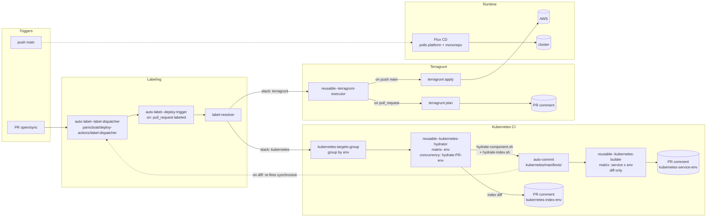

# Platform

[🇺🇸 English](README.md) | **日本語**

## 📖 Overview

ラベル駆動の単一 CI パイプラインから 3 つのデプロイ面を管理する monorepo:

- **AWS infrastructure** — Terragrunt + OpenTofu (`aws/`)
- **GitHub configuration** — Repo / branch / ruleset 設定を Terragrunt で管理 (`github/`)
- **Kubernetes platform** — Helmfile でレンダリングしたマニフェストを Flux CD で適用 (`kubernetes/`)

`panicboat/deploy-actions` が PR に付与したラベルを `workflow-config.yaml` に基づき具体的なデプロイ対象に展開し、対応する reusable workflow が実行される。

## 📂 Structure

```
.
├── .github/workflows/   # reusable executor, deploy trigger, hydrator/builder など
├── aws/                 # service ごとの Terragrunt stack (envs/{environment})。_modules/ は共有 OpenTofu module
├── github/              # GitHub repo / branch 設定の Terragrunt stack
├── kubernetes/
│   ├── clusters/        # cluster ごとの Flux bootstrap
│   ├── components/      # environment ごとの Helmfile source
│   └── manifests/       # Flux が適用するレンダリング済みマニフェスト
├── docs/                # runbook と設計ノート
├── scripts/             # EKS lifecycle / hydration / post-flight 用 helper
├── Makefile             # EKS teardown entry point
└── workflow-config.yaml # environment と stack convention の source of truth
```

## 🚢 Deployment

### Trigger

- `auto-label--deploy-trigger.yaml` が PR ラベル / `main` への push で起動する。
- `panicboat/deploy-actions/label-resolver` が `workflow-config.yaml` を参照して各ラベルを 1 つ以上の `{service}/{environment}` ターゲットに展開する。

### Stacks

| Stack | Path convention | Tooling |
|-------|-----------------|---------|
| AWS infrastructure | `aws/{service}/envs/{environment}` | Terragrunt + OpenTofu (`reusable--terragrunt-executor.yaml`) |
| GitHub configuration | `github/{service}/envs/{environment}` | Terragrunt + OpenTofu (`reusable--terragrunt-executor.yaml`) |
| Kubernetes platform | `kubernetes/components/{service}/{environment}` | Helmfile → Kustomize hydration (`reusable--kubernetes-hydrator.yaml` / `reusable--kubernetes-builder.yaml`) → Flux CD |

### Environments and Authentication

- Environment、AWS region、IAM role は `workflow-config.yaml` で定義する。環境の追加・削除は同ファイルの編集で行う。
- 認証は GitHub OIDC。`aws/github-oidc-auth/` が environment ごとの plan / apply role を発行し、executor がそれを引き受ける。
- Terragrunt の remote state は S3 + DynamoDB に保存される。bucket / lock table 名は各 `aws/{service}/root.hcl`（および `github/` 配下の同等ファイル）で定義される。

### Pipeline Flow



### GitOps Sync (Flux CD)

- Flux bootstrap は `kubernetes/clusters/{cluster}/flux-system/` に置く。cluster の root Kustomization が `kubernetes/manifests/{cluster}/` 配下のレンダリング済みマニフェストと外部 `GitRepository`（現状はアプリケーション monorepo）を集約する。
- Platform と application の repository は別々に pull され、疎結合に保たれる。同期間隔や source URL は `kubernetes/clusters/{cluster}/` 配下のマニフェストが source of truth。
- `kubernetes/components/` を変更する PR では CI が `scripts/kubernetes-hydrate/` を実行し、レンダリング結果を `kubernetes/manifests/` にコミット、差分を PR コメントに投稿する。マージ後に Flux が適用する。

### EKS Lifecycle

EKS の teardown / recreate は deploy pipeline の外側、operator が手動で実行する。

- `make eks-teardown ENV=<environment>` で Kubernetes cleanup → Terragrunt destroy → orphan verify (`scripts/eks-lifecycle/`) が走る。`DRY_RUN=1` を付けるとコマンドを実行せずエコーのみ。
- Recreate 手順は `docs/runbooks/eks-production-recreate.md` を参照。

### Claude Code Integration

`@claude` コメントで `.github/workflows/claude-code-action.yaml` が起動し、`ai-assistant` IAM role を引き受けて AWS Bedrock の Claude を呼び出す。role 定義は `aws/ai-assistant/` 配下。
