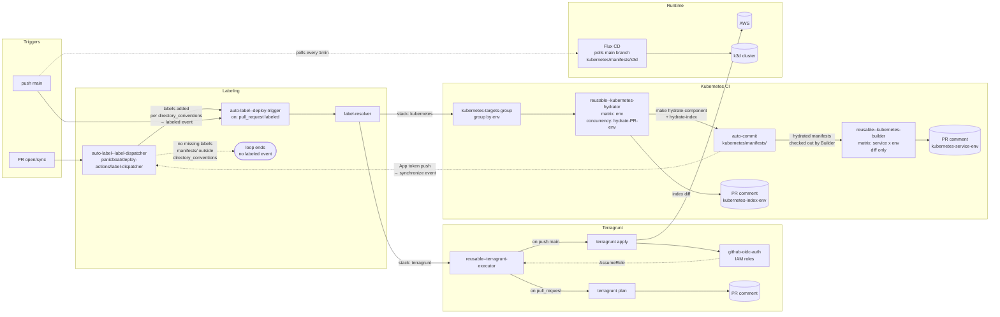

# Platform

[🇺🇸 English](README.md) | **日本語**

## 📖 Overview

## 📂 Structure

```
.
├── .github/workflows/         # GitHub Actions (Terragrunt executor, deploy trigger, etc.)
├── aws/                       # Terragrunt stacks (module + envs/{environment})
│   ├── claude-code/
│   ├── claude-code-action/
│   ├── github-oidc-auth/
│   └── vpc/
├── kubernetes/
│   ├── clusters/k3d/          # Flux bootstrap (flux-system, repositories)
│   ├── components/            # Cilium, Prometheus, Loki, Tempo, OTel, Beyla, etc.
│   └── manifests/k3d/         # Rendered manifests (per-component subdirectories)
├── github/repository/         # Terraform for GitHub repo settings
├── docs/
└── workflow-config.yaml       # Environments and deployment targets
```

## 🚢 Deployment

### Trigger

- `.github/workflows/auto-label--deploy-trigger.yaml` が PR ラベル / `main` への push で起動する。
- `panicboat/deploy-actions/label-resolver` が `workflow-config.yaml` を参照してデプロイ対象 (`aws/{service}/envs/{environment}`) を解決する。

### Stacks

| Stack | Path Convention | Tooling |
|-------|-----------------|---------|
| AWS Infrastructure | `aws/{service}/envs/{environment}` | Terragrunt 0.83.2 + OpenTofu 1.6.0 (`gruntwork-io/terragrunt-action@v3.2.0`) |
| Kubernetes Platform | `kubernetes/components/{service}/{environment}` | Helmfile + Kustomize hydration (`reusable--kubernetes-builder.yaml`) / Flux CD |
| GitHub Repo Settings | `github/repository` | Terraform |

### Environments

`workflow-config.yaml` で定義。現状 `develop` と `production` が有効、`staging` は予約済み（コメントアウト）。

| Environment | AWS Region | AWS Account | Status |
|-------------|------------|-------------|--------|
| develop | us-east-1 | 559744160976 | Active |
| staging | - | - | Reserved |
| production | ap-northeast-1 | 559744160976 | Active |

Terragrunt の remote state は S3 bucket `terragrunt-state-559744160976` + DynamoDB lock table `terragrunt-state-locks` に集約される。

### Pipeline Flow



AWS 認証は GitHub OIDC 経由。`aws/github-oidc-auth/envs/{environment}` が各環境の IAM Role (plan / apply) を発行し、他の stack はそのロールを引いてデプロイする。

### GitOps Sync (Flux CD)

- `kubernetes/clusters/k3d/flux-system/gotk-sync.yaml` が Flux の bootstrap 構成。
- 2 本の `GitRepository` を持つ（poll interval 1 分）:
  - **platform repo**: `./kubernetes/clusters/k3d` を同期 → プラットフォーム共通コンポーネント（Cilium, CoreDNS, Prometheus-Operator, Grafana, Loki, Tempo, OpenTelemetry, Beyla など）を展開。
  - **monorepo**: `./clusters/develop` を同期 → アプリケーションワークロードを展開（10 分間隔で reconcile）。
- Platform と Monorepo は Flux を介して疎結合に接続される。
- `kubernetes/components/` を変更する PR では CI が自動で `make hydrate` を実行し、レンダリング済みマニフェストをコミットする。`main` との差分は PR コメントとして投稿されレビューに供される。

### Claude Code Integration

- `.github/workflows/claude-code-action.yaml` が `@claude` コメントで起動し、`claude-code-action` IAM ロール経由で AWS Bedrock の Claude を呼び出す。
- `aws/claude-code-action/` と `aws/claude-code/` がそれぞれ Bedrock 呼び出し用 / 実行用 IAM を定義する。

## 🔗 Related Repositories

- [panicboat/monorepo](https://github.com/panicboat/monorepo) — アプリケーションソースと `clusters/{env}` マニフェスト（Flux 同期先）。
- [panicboat/deploy-actions](https://github.com/panicboat/deploy-actions) — 再利用可能な GitHub Actions（`label-resolver`, `terragrunt`, `container-builder`, `auto-approve` など）。
- [panicboat/ansible](https://github.com/panicboat/ansible) — 開発者ローカル環境のプロビジョニング（デプロイ系とは独立）。
