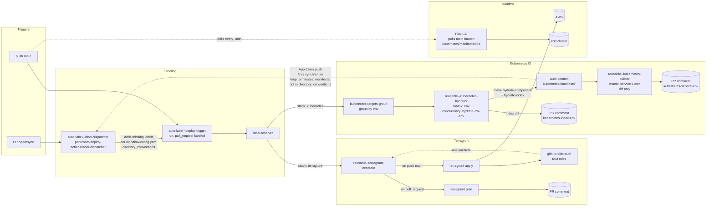

# Platform

**English** | [🇯🇵 日本語](README-ja.md)

## 📖 Overview

## 📂 Structure

```
.
├── .github/workflows/         # GitHub Actions (Terragrunt executor, deploy trigger, etc.)
├── aws/                       # Terragrunt stacks (module + envs/{environment})
│   ├── claude-code/
│   ├── claude-code-action/
│   ├── github-oidc-auth/
│   └── vpc/
├── kubernetes/
│   ├── clusters/k3d/          # Flux bootstrap (flux-system, repositories)
│   ├── components/            # Cilium, Prometheus, Loki, Tempo, OTel, Beyla, etc.
│   └── manifests/k3d/         # Rendered manifests (per-component subdirectories)
├── github/repository/         # Terraform for GitHub repo settings
├── docs/
└── workflow-config.yaml       # Environments and deployment targets
```

## 🚢 Deployment

### Trigger

- `.github/workflows/auto-label--deploy-trigger.yaml` runs on PR labels or push to `main`.
- `panicboat/deploy-actions/label-resolver` reads `workflow-config.yaml` to resolve deployment targets (`aws/{service}/envs/{environment}`).

### Stacks

| Stack | Path Convention | Tooling |
|-------|-----------------|---------|
| AWS Infrastructure | `aws/{service}/envs/{environment}` | Terragrunt 0.83.2 + OpenTofu 1.6.0 (`gruntwork-io/terragrunt-action@v3.2.0`) |
| Kubernetes Platform | `kubernetes/components/{service}/{environment}` | Helmfile + Kustomize hydration (`reusable--kubernetes-builder.yaml`) / Flux CD |
| GitHub Repo Settings | `github/repository` | Terraform |

### Environments

Defined in `workflow-config.yaml`. Currently `develop` and `production` are active; `staging` is reserved (commented out).

| Environment | AWS Region | AWS Account | Status |
|-------------|------------|-------------|--------|
| develop | us-east-1 | 559744160976 | Active |
| staging | - | - | Reserved |
| production | ap-northeast-1 | 559744160976 | Active |

Terragrunt remote state is consolidated in S3 bucket `terragrunt-state-559744160976` with DynamoDB lock table `terragrunt-state-locks`.

### Pipeline Flow



AWS authentication uses GitHub OIDC. `aws/github-oidc-auth/envs/{environment}` issues per-environment IAM roles (plan / apply), which other stacks assume to deploy.

### GitOps Sync (Flux CD)

- `kubernetes/clusters/k3d/flux-system/gotk-sync.yaml` defines the Flux bootstrap.
- Two `GitRepository` sources (poll interval: 1 minute):
  - **platform repo**: syncs `./kubernetes/clusters/k3d` — deploys shared platform components (Cilium, CoreDNS, Prometheus-Operator, Grafana, Loki, Tempo, OpenTelemetry, Beyla, etc.).
  - **monorepo**: syncs `./clusters/develop` — deploys application workloads (reconciled every 10 minutes).
- Platform and Monorepo are loosely coupled via Flux.
- When `kubernetes/components/` changes in a PR, the CI pipeline automatically runs `make hydrate` and commits the rendered manifests. The diff against `main` is posted as a PR comment for review.

### Claude Code Integration

- `.github/workflows/claude-code-action.yaml` is triggered by `@claude` comments and invokes AWS Bedrock Claude via the `claude-code-action` IAM role.
- `aws/claude-code-action/` and `aws/claude-code/` define the IAM roles for Bedrock invocation and execution respectively.

## 🔗 Related Repositories

- [panicboat/monorepo](https://github.com/panicboat/monorepo) — application source and `clusters/{env}` manifests (Flux sync target).
- [panicboat/deploy-actions](https://github.com/panicboat/deploy-actions) — reusable GitHub Actions (`label-resolver`, `terragrunt`, `container-builder`, `auto-approve`, etc.).
- [panicboat/ansible](https://github.com/panicboat/ansible) — developer local environment provisioning (independent from the deploy pipeline).
