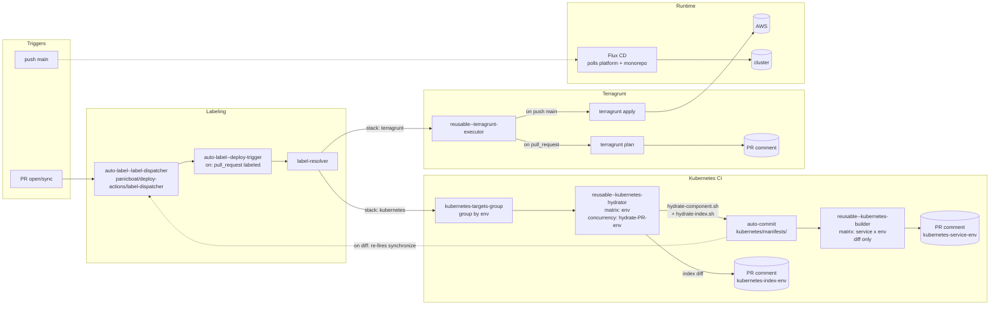

# Platform

**English** | [🇯🇵 日本語](README-ja.md)

## 📖 Overview

A monorepo that manages three deployment surfaces from a single label-driven CI pipeline:

- **AWS infrastructure** — Terragrunt + OpenTofu (`aws/`)
- **GitHub configuration** — Terragrunt for repo / branch / ruleset settings (`github/`)
- **Kubernetes platform** — Helmfile-rendered manifests applied by Flux CD (`kubernetes/`)

A PR labeled by `panicboat/deploy-actions` is resolved against `workflow-config.yaml` to expand into concrete deploy targets, and the matching reusable workflow runs.

## 📂 Structure

```
.
├── .github/workflows/   # Reusable executors, deploy trigger, hydrator/builder, etc.
├── aws/                 # Terragrunt stacks per service (envs/{environment}); _modules/ holds shared OpenTofu modules
├── github/              # Terragrunt stacks for GitHub repo / branch settings
├── kubernetes/
│   ├── clusters/        # Flux bootstrap (per cluster)
│   ├── components/      # Helmfile sources (per environment)
│   └── manifests/       # Rendered output that Flux applies
├── docs/                # Runbooks and design notes
├── scripts/             # EKS lifecycle / hydration / post-flight helpers
├── Makefile             # EKS teardown entry points
└── workflow-config.yaml # Environments and stack conventions (source of truth)
```

## 🚢 Deployment

### Trigger

- `auto-label--deploy-trigger.yaml` runs on PR labels and on push to `main`.
- `panicboat/deploy-actions/label-resolver` reads `workflow-config.yaml` to expand each label into one or more `{service}/{environment}` targets.

### Stacks

| Stack | Path convention | Tooling |
|-------|-----------------|---------|
| AWS infrastructure | `aws/{service}/envs/{environment}` | Terragrunt + OpenTofu (`reusable--terragrunt-executor.yaml`) |
| GitHub configuration | `github/{service}/envs/{environment}` | Terragrunt + OpenTofu (`reusable--terragrunt-executor.yaml`) |
| Kubernetes platform | `kubernetes/components/{service}/{environment}` | Helmfile → Kustomize hydration (`reusable--kubernetes-hydrator.yaml` / `reusable--kubernetes-builder.yaml`) → Flux CD |

### Environments and authentication

- Environments, AWS regions, and IAM roles are defined in `workflow-config.yaml`. Adding or removing an environment means editing that file.
- Authentication uses GitHub OIDC. `aws/github-oidc-auth/` issues per-environment plan / apply roles that the executors assume.
- Terragrunt remote state lives in S3 + DynamoDB; bucket and lock-table names are defined in each `aws/{service}/root.hcl` (and the equivalent under `github/`).

### Pipeline Flow



### GitOps Sync (Flux CD)

- Flux bootstrap lives in `kubernetes/clusters/{cluster}/flux-system/`. The cluster's root Kustomization aggregates the rendered manifests under `kubernetes/manifests/{cluster}/` and any external `GitRepository` (currently the application monorepo).
- Platform and application repositories are pulled independently and stay loosely coupled. Sync intervals and source URLs are configured in `kubernetes/clusters/{cluster}/` — treat those manifests as the source of truth.
- When `kubernetes/components/` changes, CI runs `scripts/kubernetes-hydrate/`, commits the rendered output to `kubernetes/manifests/`, and posts the diff as a PR comment. Flux applies the change once merged.

### EKS Lifecycle

EKS teardown / recreate is operator-driven and runs outside the deploy pipeline.

- `make eks-teardown ENV=<environment>` runs Kubernetes cleanup → Terragrunt destroy → orphan verify (`scripts/eks-lifecycle/`). `DRY_RUN=1` echoes commands without executing them.
- Recreate is a manual procedure — see `docs/runbooks/eks-production-recreate.md`.

### Claude Code Integration

`@claude` comments trigger `.github/workflows/claude-code-action.yaml`, which assumes the `ai-assistant` IAM role to invoke Bedrock Claude. The role is defined under `aws/ai-assistant/`.
