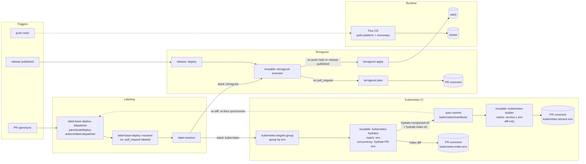

# Platform

**English** | [🇯🇵 日本語](README-ja.md)

## 📖 Overview

A monorepo that manages three deployment surfaces from a single label-driven CI pipeline:

- **AWS infrastructure** — Terragrunt + OpenTofu ([aws/](aws/))
- **GitHub configuration** — Terragrunt for repo / branch / ruleset settings ([github/](github/))
- **Kubernetes platform** — Helmfile-rendered manifests applied by Flux CD ([kubernetes/](kubernetes/))

A PR labeled by `panicboat/deploy-actions` is resolved against [workflow-config.yaml](workflow-config.yaml) to expand into concrete deploy targets, and the matching reusable workflow runs.

## 📂 Structure

```
.
├── .github/
│   ├── scripts/         # Scripts run by workflows (hydration, terragrunt release)
│   └── workflows/       # Reusable executors, deploy trigger, hydrator/builder, etc.
├── aws/                 # Terragrunt stacks per service ({environment})
├── github/              # Terragrunt stacks for GitHub repo / branch settings
├── kubernetes/
│   ├── clusters/        # Flux bootstrap (per cluster)
│   ├── components/      # Helmfile sources (per environment)
│   └── manifests/       # Rendered output that Flux applies
├── docs/                # Runbooks and design notes
├── scripts/             # EKS lifecycle helpers
├── Makefile             # EKS teardown entry points
└── workflow-config.yaml # Environments and stack conventions (source of truth)
```

## 🚢 Deployment

### Trigger

| Event | Workflow | Terragrunt |
|-------|----------|------------|
| `deploy:{service}` label added to a PR | [label-base-deploy--resolver.yaml](.github/workflows/label-base-deploy--resolver.yaml) | plan every target |
| Push to `main` | [label-base-deploy--resolver.yaml](.github/workflows/label-base-deploy--resolver.yaml) | apply targets with `apply_trigger: merge` |
| Release PR opened / updated | [release--plan.yaml](.github/workflows/release--plan.yaml) | plan the service's `apply_trigger: release` environments |
| Release published | [release--deploy.yaml](.github/workflows/release--deploy.yaml) | apply the service's `apply_trigger: release` environments |

#### Targets

- [label-base-deploy--dispatcher.yaml](.github/workflows/label-base-deploy--dispatcher.yaml) adds `deploy:{service}` to a PR when it is opened or updated; release-please branches get no label.
  - Any change under `aws/{service}/`, including modules and `root.hcl`, adds the label.
- `label-resolver` expands the label into every environment of that service using [workflow-config.yaml](workflow-config.yaml).
- A `{service}/{environment}` pair matched by `exclude` of the `terragrunt` stack is never planned or applied, including by releases.
  - A rule with only `environment` covers every service.

#### Releases

- Each `aws/{service}` with an `apply_trigger: release` environment has its own release-please config (`release-please-config.json` / `release-please-manifest.json`).
  - [check-release-configs.sh](.github/scripts/terragrunt-release/check-release-configs.sh) fails CI when a config is missing.
- Commits that touch only `apply_trigger: merge` environment directories do not create a release (`exclude-paths`).
- While every `apply_trigger: release` environment is excluded, the release PR is still created, but nothing is planned or applied.
- To re-plan, use "Re-run all jobs" on the `Release - Plan` run.
- To re-apply, run `gh workflow run release--deploy.yaml --ref {service}-vX.Y.Z -f tag={service}-vX.Y.Z`.

### Stacks

| Stack | Path convention | Tooling |
|-------|-----------------|---------|
| AWS infrastructure | `aws/{service}/{environment}` | Terragrunt + OpenTofu ([reusable--terragrunt-executor.yaml](.github/workflows/reusable--terragrunt-executor.yaml)) |
| GitHub configuration | `github/{service}/{environment}` | Terragrunt + OpenTofu ([reusable--terragrunt-executor.yaml](.github/workflows/reusable--terragrunt-executor.yaml)) |
| Kubernetes platform | `kubernetes/components/{service}/{environment}` | Helmfile → Kustomize hydration ([reusable--kubernetes-hydrator.yaml](.github/workflows/reusable--kubernetes-hydrator.yaml) / [reusable--kubernetes-builder.yaml](.github/workflows/reusable--kubernetes-builder.yaml)) → Flux CD |

### Environments and authentication

- Environments, AWS regions, and IAM roles are defined in [workflow-config.yaml](workflow-config.yaml). Adding or removing an environment means editing that file.
- `apply_trigger` in [workflow-config.yaml](workflow-config.yaml) decides when an environment is applied: `merge` applies on push to `main`, `release` applies when the service release is published.
- Authentication uses GitHub OIDC. [aws/github-oidc-auth/](aws/github-oidc-auth/) issues per-environment plan / apply roles that the executors assume.
- The GitHub environment `production` of `platform` accepts deployments only from refs that match the tag pattern `*-v*`, and that of `monorepo` accepts deployments from no ref. The settings are managed in [github/repository/](github/repository/).
- Terragrunt remote state lives in S3 + DynamoDB; bucket and lock-table names are defined in each `aws/{service}/root.hcl` (and the equivalent under [github/](github/)).

### Pipeline Flow


```mermaid
flowchart LR
  subgraph Triggers
    PRevent[PR open/sync]
    Mainpush[push main]
    Release[release published]
  end

  subgraph Labeling
    Dispatcher[label-base-deploy--dispatcher<br/>panicboat/deploy-actions/label-dispatcher]
    Trigger[label-base-deploy--resolver<br/>on: pull_request labeled]
    Resolver[label-resolver]
  end

  subgraph KubernetesCI [Kubernetes CI]
    Group[kubernetes-targets-group<br/>group by env]
    Hydrator[reusable--kubernetes-hydrator<br/>matrix: env<br/>concurrency: hydrate-PR-env]
    Commit[auto-commit<br/>kubernetes/manifests/]
    Builder[reusable--kubernetes-builder<br/>matrix: service x env<br/>diff only]
    IndexComment[(PR comment<br/>kubernetes-index-env)]
    CompComment[(PR comment<br/>kubernetes-service-env)]
  end

  subgraph Terragrunt
    ReleaseTrigger[release--deploy]
    TG[reusable--terragrunt-executor]
    Plan[terragrunt plan]
    Apply[terragrunt apply]
    PRComment[(PR comment)]
  end

  subgraph Runtime
    AWS[(AWS)]
    FluxCD[Flux CD<br/>polls platform + monorepo]
    Cluster[(cluster)]
  end

  PRevent --> Dispatcher
  Dispatcher --> Trigger
  Trigger --> Resolver
  Resolver -->|stack: terragrunt| TG
  Release --> ReleaseTrigger
  ReleaseTrigger --> TG
  TG -->|on pull_request| Plan
  TG -->|on push main or release published| Apply
  Plan --> PRComment
  Apply --> AWS
  Resolver -->|stack: kubernetes| Group
  Group --> Hydrator
  Hydrator -->|hydrate-component.sh<br/>+ hydrate-index.sh| Commit
  Hydrator -->|index diff| IndexComment
  Commit --> Builder
  Builder --> CompComment
  Mainpush -.-> FluxCD
  FluxCD --> Cluster
  Commit -.->|on diff: re-fires synchronize| Dispatcher
```

### GitOps Sync (Flux CD)

- Flux bootstrap lives in `kubernetes/clusters/{cluster}/flux-system/`. The cluster's root Kustomization aggregates the rendered manifests under `kubernetes/manifests/{cluster}/` and any external `GitRepository` (currently the application monorepo).
- Platform and application repositories are pulled independently and stay loosely coupled. Sync intervals and source URLs are configured in `kubernetes/clusters/{cluster}/` — treat those manifests as the source of truth.
- When [kubernetes/components/](kubernetes/components/) changes, CI runs [.github/scripts/kubernetes-hydrate/](.github/scripts/kubernetes-hydrate/), commits the rendered output to [kubernetes/manifests/](kubernetes/manifests/), and posts the diff as a PR comment. Flux applies the change once merged.
