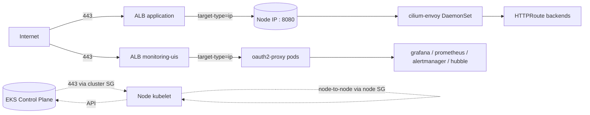

# AWS Resource Provenance

> Where every AWS resource in this account comes from, and how to identify it from tags alone.

## 1. Tag schema

| Tag key | Role | Scope | Value examples |
|---|---|---|---|
| `ManagedBy` | actor identifier (= who creates / maintains the resource) | **all AWS resources** | `terraform` / `aws-load-balancer-controller` / `karpenter` / `aws-ebs-csi-driver` |
| `Component` | iac stack identifier (= which `aws/<stack>/` directory provisions it) | iac-managed resources only | stack-name aligned (= `vpc` / `eks` / `alb` / `karpenter` / `eks-logs` / `eks-metrics` / `eks-traces` / `eks-secrets` / `cost-management` / `github-oidc-auth` / `ai-assistant`) |
| `Purpose` | per-resource role discriminator (= only when a stack has multiple resource roles to distinguish) | specific resources only | `github-actions-oidc-plan` / `github-actions-oidc-apply` / `bedrock-claude-access` / `ai-assistant-cli` |
| `Environment` / `Owner` / `Project` / `Repository` | inherited meta tags | all | unchanged from prior schema |

**設定箇所**

- iac `ManagedBy` / `Component`: `aws/<stack>/envs/<env>/{env.hcl, terragrunt.hcl}` の `common_tags` merge 経由
- iac `Purpose`: 必要な module 内 resource block で `tags = merge(var.common_tags, { Purpose = "<resource-specific>" })` で個別 override
- k8s LB Controller `ManagedBy`: `kubernetes/components/aws-load-balancer-controller/production/values.yaml.gotmpl` の `defaultTags`
- k8s Karpenter `ManagedBy`: `kubernetes/components/karpenter/production/kustomization/ec2nodeclass.yaml` の `spec.tags`
- k8s EBS CSI `ManagedBy`: `aws/eks/modules/addons.tf` の `aws-ebs-csi-driver` addon block の `configuration_values.controller.extraVolumeTags`

## 2. Provenance map

| Resource type | Created by | `ManagedBy` | `Component` | Reference |
|---|---|---|---|---|
| VPC / Subnet / Route Table / NAT Gateway / VPC Endpoint | terraform | `terraform` | `vpc` | `aws/vpc/modules/main.tf` |
| VPC default SG (locked down) | terraform | `terraform` | `vpc` | `aws/vpc/modules/main.tf` (= `manage_default_security_group = true`) |
| EKS cluster / cluster SG / node SG / control plane log group | terraform | `terraform` | `eks` | `aws/eks/modules/main.tf` |
| EKS managed addons (= aws-ebs-csi-driver / coredns / pod-identity-agent) | terraform | `terraform` | `eks` | `aws/eks/modules/addons.tf` |
| IAM IRSA roles (= ebs-csi / alb-controller / external-dns / cilium-operator / pod-identity bootstrap) | terraform | `terraform` | `eks` | `aws/eks/modules/addons.tf` |
| ACM wildcard certificate (= `*.panicboat.net`) | terraform | `terraform` | `alb` | `aws/alb/modules/main.tf` |
| Route53 hosted zone (= `panicboat.net`) | **out of iac** (= AWS console / external) | n/a | n/a | `aws/route53/lookup/main.tf` (= data source 経由参照のみ) |
| Karpenter SQS interruption queue / EventBridge rules / controller IAM / Pod Identity Association / Node IAM / EC2 Instance Profile | terraform | `terraform` | `karpenter` | `aws/karpenter/modules/main.tf` |
| `system_critical` managed node group (= EC2 + EBS + Launch Template) | terraform | `terraform` | `karpenter` | `aws/karpenter/modules/main.tf` (= `module "system_critical"`) |
| Karpenter Node IAM role (= shared with launched instances) | terraform | `terraform` | `karpenter` | `aws/karpenter/modules/main.tf` (= `node_iam_role_*`) |
| EKS log streams (= eks-logs stack) | terraform | `terraform` | `eks-logs` | `aws/eks-logs/modules/` |
| Managed Prometheus / CloudWatch metric resources | terraform | `terraform` | `eks-metrics` | `aws/eks-metrics/modules/` |
| Managed Grafana / X-Ray / OTLP resources | terraform | `terraform` | `eks-traces` | `aws/eks-traces/modules/` |
| External Secrets Operator IAM / Secrets Manager bootstrap | terraform | `terraform` | `eks-secrets` | `aws/eks-secrets/modules/` |
| Cost Optimization Hub / Compute Optimizer IAM (us-east-1 only) | terraform | `terraform` | `cost-management` | `aws/cost-management/modules/` |
| GitHub OIDC provider + IAM plan / apply roles | terraform | `terraform` | `github-oidc-auth` (= + `Purpose=github-actions-oidc-{plan,apply}` on the roles) | `aws/github-oidc-auth/modules/main.tf` |
| Bedrock CLI / GitHub Actions IAM roles for Claude | terraform | `terraform` | `ai-assistant` (= + `Purpose=ai-assistant-{cli,github-actions}` on the roles) | `aws/ai-assistant/modules/` |
| ALB / NLB / Target Group / auto-create SG | k8s | `aws-load-balancer-controller` | (not set) | `kubernetes/components/aws-load-balancer-controller/production/values.yaml.gotmpl` |
| Karpenter-launched EC2 instances / EBS root / Launch Template / ENI | k8s | `karpenter` | (not set) | `kubernetes/components/karpenter/production/kustomization/ec2nodeclass.yaml` |
| PVC-provisioned EBS volumes (= dynamic) | k8s | `aws-ebs-csi-driver` | (not set) | `aws/eks/modules/addons.tf` (= `aws-ebs-csi-driver` addon `configuration_values`) |
| Route53 records (= external-dns) | k8s | **n/a** (= AWS API doesn't tag DNS records) | n/a | hosted zone 自体は外部管理 (= 上記参照) |

## 3. Security Group inventory

5 SGs exist in the production VPC after the lockdown:

| # | Name pattern | Owner | Use | Reference |
|---|---|---|---|---|
| 1 | `default-vpc-production-locked` | terraform / vpc | locked-down VPC default (= zero rules) | `aws/vpc/modules/main.tf` |
| 2 | `eks-cluster-sg-eks-production-*` | terraform / eks | control plane ↔ node communication | `aws/eks/modules/main.tf` (= via `terraform-aws-modules/eks` v21.20.0 defaults) |
| 3 | `eks-production-node` | terraform / eks | node-to-node pod traffic (= Cilium native CNI mode、 pod IPs = node IP) | `aws/eks/modules/main.tf` (= module-internal) |
| 4 | `k8s-application-...` (= `application` IngressGroup ALB SG) | aws-load-balancer-controller | ingress 443 → application ALB | controller-managed, see `application-ingress.yaml` |
| 5 | `k8s-monitoringuis-...` (= `monitoring-uis` IngressGroup ALB SG) | aws-load-balancer-controller | ingress 443 → monitoring ALB (= grafana / hubble / alertmanager / prometheus oauth2-proxy) | controller-managed, see `ingress-monitoring-uis.yaml` |

**`terraform-aws-modules/eks` v21 default SG rules** (= summary; source of truth is the module's `node_groups.tf`):

- cluster SG ingress: 443 from node SG (= control plane API access)
- cluster SG egress: all to 0.0.0.0/0 (= module default)
- node SG ingress: all from cluster SG (= API → kubelet) + all from node SG self-ref (= node-to-node pod traffic) + 4443 from cluster SG (= webhook ports)
- node SG egress: all to 0.0.0.0/0 (= NAT-gated egress)
- additional rules can be added via `cluster_security_group_additional_rules` / `node_security_group_additional_rules` module variables (= currently empty in `aws/eks/modules/main.tf`)

**Traffic flow (Mermaid)**

## 4. Operational notes

### 新規 iac stack を追加する時

1. `aws/<stack>/root.hcl` を既存 stack template (例: `aws/vpc/root.hcl`) からコピーし、`project_name` を新 stack 名に変更
2. `aws/<stack>/envs/<env>/env.hcl` で `environment_tags = { Environment = local.environment, Component = "<stack>", Owner = "panicboat" }` を設定
3. `aws/<stack>/envs/<env>/terragrunt.hcl` で `inputs.common_tags = merge(include.env.locals.environment_tags, { Project = "<stack>", ManagedBy = "terraform", Repository = "panicboat/platform" })` を設定
4. `aws/<stack>/modules/terraform.tf` で `provider "aws" { default_tags { tags = var.common_tags } }` を設定 (= 他 stack と同じ)

### 新規 k8s controller が AWS resource を作る時

1. controller の Helm chart / CRD で resource にタグ付けする機能を確認
2. `ManagedBy: <controller-name>` を default tag として設定 (= `<controller-name>` は Helm release 名または CRD 識別子)
3. 本ドキュメントの provenance map に行を追加

### AWS console から resource provenance を辿る手順

1. AWS console で resource を開き、Tags タブを見る
2. `ManagedBy` の値を確認
3. value が `terraform` の場合 → `Component` を併読し、 `aws/<Component>/` ディレクトリ内のコードを参照
4. value が controller 名 (= `aws-load-balancer-controller` / `karpenter` / `aws-ebs-csi-driver`) の場合 → `kubernetes/components/<controller>/` 配下の Helm values または manifest を参照
