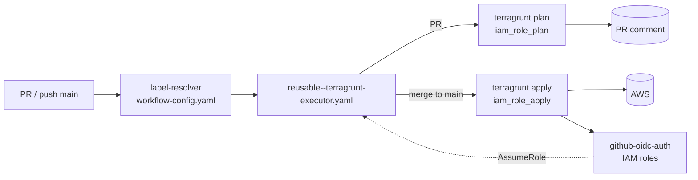
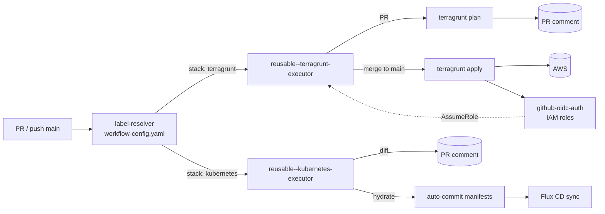

# Kubernetes Hydrate & Diff CI Pipeline Implementation Plan

> **For agentic workers:** REQUIRED SUB-SKILL: Use superpowers:subagent-driven-development (recommended) or superpowers:executing-plans to implement this plan task-by-task. Steps use checkbox (`- [ ]`) syntax for tracking.

**Goal:** PR で `kubernetes/components/` が変更された際に hydrate を自動コミットし、manifests diff を PR コメントに投稿する CI パイプラインを構築する。

**Architecture:** 既存の label-dispatcher → deploy-trigger チェーンに kubernetes-executor を追加する。hydrate と diff を 1 つの reusable workflow で実行し、deploy-trigger から呼び出す。hydrate の commit & push による再トリガーは冪等性で安全に処理する。

**Tech Stack:** GitHub Actions, aqua (tool version management), helmfile, helm, kustomize

---

### File Structure

| 区分 | ファイル | 責務 |
|------|---------|------|
| 新規 | `aqua.yaml` | helmfile / helm / kustomize / act のバージョン定義 |
| 新規 | `.github/workflows/reusable--kubernetes-executor.yaml` | hydrate + diff の reusable workflow |
| 変更 | `.github/workflows/auto-label--deploy-trigger.yaml` | `deploy-kubernetes` job 追加 |
| 変更 | `README.md` | Deployment セクションに kubernetes パイプライン追加 |

---

### Task 1: aqua.yaml の作成

**Files:**
- Create: `aqua.yaml`

- [ ] **Step 1: aqua.yaml を作成する**

```yaml
---
# aqua - Declarative CLI Version Manager
# https://aquaproj.github.io/
registries:
  - type: standard
    ref: v4.311.0 # renovate: github_release aquaproj/aqua-registry

packages:
  - name: helmfile/helmfile@v0.169.2
  - name: helm/helm@v3.17.3
  - name: kubernetes-sigs/kustomize@kustomize/v5.6.0
  - name: nektos/act@v0.2.87
```

> Note: バージョンは作成時点の最新を指定。Renovate が自動更新する。

- [ ] **Step 2: aqua install を実行して動作確認する**

Run: `aqua install`
Expected: 4 つのツールがインストールされる

Run: `helmfile --version && helm version --short && kustomize version && act --version`
Expected: 各ツールのバージョンが表示される

- [ ] **Step 3: コミットする**

```bash
git add aqua.yaml
git commit -s -m "feat: add aqua.yaml for tool version management"
```

---

### Task 2: reusable--kubernetes-executor.yaml の作成

**Files:**
- Create: `.github/workflows/reusable--kubernetes-executor.yaml`

- [ ] **Step 1: reusable workflow のスケルトンを作成する**

```yaml
name: 'Reusable - Kubernetes Executor'

on:
  workflow_call:
    inputs:
      environment:
        required: true
        type: string
        description: 'Target environment for hydration (e.g., k3d)'
      app-id:
        required: true
        type: string
        description: 'GitHub App ID for authentication'
    secrets:
      private-key:
        required: true
        description: 'GitHub App private key for authentication'

jobs:
  execute-kubernetes:
    name: 'Execute Kubernetes'
    if: github.event_name == 'pull_request'
    runs-on: ubuntu-latest
    permissions:
      contents: write
      pull-requests: write
    steps:
      - name: Generate GitHub App token
        id: app-token
        uses: actions/create-github-app-token@v3.1.1
        with:
          app-id: ${{ inputs.app-id }}
          private-key: ${{ secrets.private-key }}
          owner: ${{ github.repository_owner }}

      - name: Get PR information
        id: pr-info
        uses: jwalton/gh-find-current-pr@v1
        with:
          github-token: ${{ steps.app-token.outputs.token }}
          state: all
        continue-on-error: true

      - name: Checkout
        uses: actions/checkout@v4
        with:
          token: ${{ steps.app-token.outputs.token }}
          ref: ${{ github.head_ref }}
          fetch-depth: 0

      - name: Setup aqua
        uses: aquaproj/aqua-installer@v4.0.0
        with:
          aqua_version: v2.48.2

      - name: Hydrate manifests
        run: make -C kubernetes hydrate ENV=${{ inputs.environment }}

      - name: Commit and push hydrated manifests
        run: |
          git config user.name "github-actions[bot]"
          git config user.email "github-actions[bot]@users.noreply.github.com"
          if git diff --quiet kubernetes/manifests/${{ inputs.environment }}/; then
            echo "No changes to commit"
            echo "has_changes=false" >> "$GITHUB_OUTPUT"
          else
            git add kubernetes/manifests/${{ inputs.environment }}/
            git commit -s -m "chore(kubernetes/manifests/${{ inputs.environment }}): hydrate manifests

          Signed-off-by: github-actions[bot] <github-actions[bot]@users.noreply.github.com>"
            git push
            echo "has_changes=true" >> "$GITHUB_OUTPUT"
          fi
        id: commit

      - name: Generate diff
        id: diff
        run: |
          DIFF=$(git diff origin/main...HEAD -- kubernetes/manifests/${{ inputs.environment }}/)
          if [ -z "$DIFF" ]; then
            echo "body=**No manifest changes** for \`${{ inputs.environment }}\`." >> "$GITHUB_OUTPUT"
          else
            # Build per-file summary with collapsible sections
            BODY="## Kubernetes Manifests Diff (\`${{ inputs.environment }}\`)"
            BODY="${BODY}

          "
            for file in $(git diff --name-only origin/main...HEAD -- kubernetes/manifests/${{ inputs.environment }}/); do
              BASENAME=$(basename "$file")
              STAT=$(git diff --stat origin/main...HEAD -- "$file" | tail -1 | sed 's/^ *//')
              FILE_DIFF=$(git diff origin/main...HEAD -- "$file")
              BODY="${BODY}<details>
          <summary><code>${BASENAME}</code> (${STAT})</summary>

          \`\`\`diff
          ${FILE_DIFF}
          \`\`\`

          </details>

          "
            done

            # Write to file to avoid argument length issues
            echo "$BODY" > /tmp/pr-comment-body.md
            echo "body_file=/tmp/pr-comment-body.md" >> "$GITHUB_OUTPUT"
            echo "has_diff=true" >> "$GITHUB_OUTPUT"
          fi

      - name: Post PR comment
        if: steps.pr-info.outputs.number != ''
        uses: marocchino/sticky-pull-request-comment@v2
        with:
          number: ${{ steps.pr-info.outputs.number }}
          header: kubernetes-diff-${{ inputs.environment }}
          path: ${{ steps.diff.outputs.body_file || '' }}
          message: ${{ steps.diff.outputs.body || '' }}
          GITHUB_TOKEN: ${{ steps.app-token.outputs.token }}
```

- [ ] **Step 2: YAML の構文を検証する**

Run: `python3 -c "import yaml; yaml.safe_load(open('.github/workflows/reusable--kubernetes-executor.yaml'))"`
Expected: エラーなし

- [ ] **Step 3: コミットする**

```bash
git add .github/workflows/reusable--kubernetes-executor.yaml
git commit -s -m "feat: add reusable kubernetes executor workflow"
```

---

### Task 3: deploy-trigger に kubernetes job を追加

**Files:**
- Modify: `.github/workflows/auto-label--deploy-trigger.yaml:54-91`

- [ ] **Step 1: deploy-kubernetes job を追加する**

`deploy-terragrunt` job の後（L75 の後）、`deployment-summary` job の前に以下を追加:

```yaml
  deploy-kubernetes:
    name: 'Deploy Kubernetes (${{ matrix.target.service }}:${{ matrix.target.environment }})'
    needs: deploy-trigger
    if: |
      needs.deploy-trigger.outputs.has-targets == 'true' &&
      contains(needs.deploy-trigger.outputs.targets, '"stack":"kubernetes"')
    strategy:
      matrix:
        target: ${{ fromJson(needs.deploy-trigger.outputs.targets) }}
        exclude:
          - target:
              stack: terragrunt
      fail-fast: false
    uses: ./.github/workflows/reusable--kubernetes-executor.yaml
    with:
      environment: ${{ matrix.target.environment }}
      app-id: ${{ vars.APP_ID }}
    secrets:
      private-key: ${{ secrets.APP_PRIVATE_KEY }}
```

- [ ] **Step 2: deployment-summary の needs に deploy-kubernetes を追加する**

変更前:
```yaml
    needs: [deploy-trigger, deploy-terragrunt]
```

変更後:
```yaml
    needs: [deploy-trigger, deploy-terragrunt, deploy-kubernetes]
```

- [ ] **Step 3: deployment-summary に Kubernetes Job Status を追加する**

`echo "Terragrunt Job Status: ..."` の後に追加:

```yaml
          echo "Kubernetes Job Status: ${{ needs.deploy-kubernetes.result }}"
```

- [ ] **Step 4: YAML の構文を検証する**

Run: `python3 -c "import yaml; yaml.safe_load(open('.github/workflows/auto-label--deploy-trigger.yaml'))"`
Expected: エラーなし

- [ ] **Step 5: コミットする**

```bash
git add .github/workflows/auto-label--deploy-trigger.yaml
git commit -s -m "feat: add kubernetes executor job to deploy trigger"
```

---

### Task 4: README.md の Deployment セクションを更新

**Files:**
- Modify: `README.md:35-65`

- [ ] **Step 1: Stacks テーブルの Kubernetes 行を更新する**

変更前:
```markdown
| Kubernetes Platform | `kubernetes/clusters/{cluster}`, `kubernetes/components/*` | Kustomize / Flux CD |
```

変更後:
```markdown
| Kubernetes Platform | `kubernetes/components/{service}/{environment}` | Helmfile + Kustomize hydration (`reusable--kubernetes-executor.yaml`) / Flux CD |
```

- [ ] **Step 2: Pipeline Flow の mermaid に kubernetes 分岐を追加する**

変更前:


変更後:


- [ ] **Step 3: GitOps Sync セクションに hydrate CI の説明を追加する**

`- Platform and Monorepo are loosely coupled via Flux.` の後に以下を追加:

```markdown
- When `kubernetes/components/` changes in a PR, the CI pipeline automatically runs `make hydrate` and commits the rendered manifests. The diff against `main` is posted as a PR comment for review.
```

- [ ] **Step 4: コミットする**

```bash
git add README.md
git commit -s -m "docs: add kubernetes hydrate/diff pipeline to deployment section"
```

---

### Task 5: act でローカル検証

**Files:**
- 変更なし（既存ファイルのテスト）

- [ ] **Step 1: reusable workflow の YAML lint を実行する**

Run: `actionlint .github/workflows/reusable--kubernetes-executor.yaml .github/workflows/auto-label--deploy-trigger.yaml`

> `actionlint` が未インストールの場合は `aqua.yaml` に追加:
> ```yaml
>   - name: rhysd/actionlint@v1.7.7
> ```

Expected: エラーなし（warning は許容）

- [ ] **Step 2: act で kubernetes-executor を dry-run する**

```bash
act workflow_call \
  -W .github/workflows/reusable--kubernetes-executor.yaml \
  --input environment=k3d \
  --input app-id=dummy \
  -s private-key=dummy \
  --dryrun
```

Expected: ジョブとステップの一覧が表示され、構文エラーがないことを確認

- [ ] **Step 3: actionlint を aqua.yaml に追加した場合、コミットする**

```bash
git add aqua.yaml
git commit -s -m "chore: add actionlint to aqua.yaml"
```
