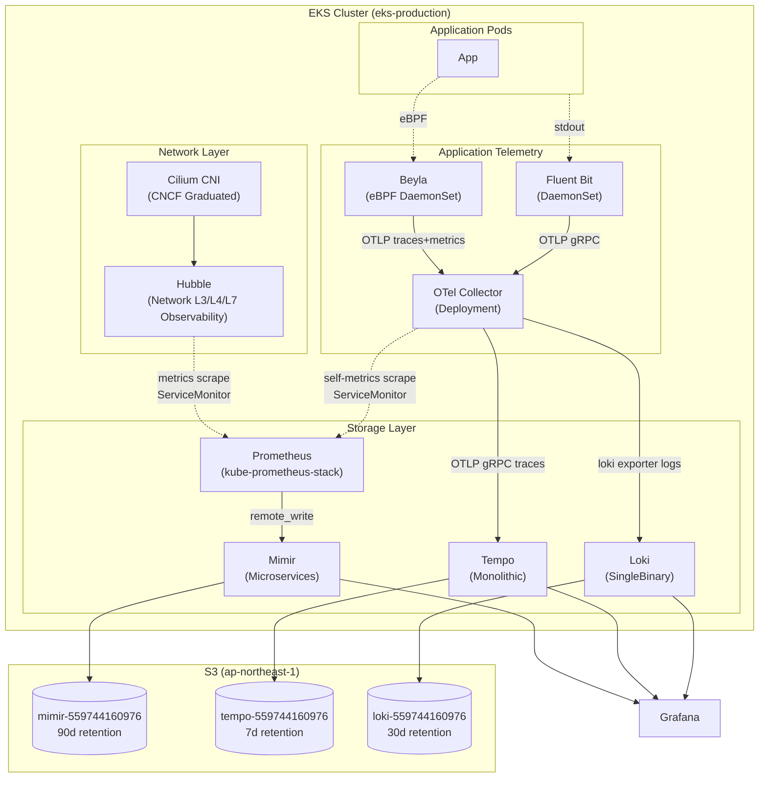
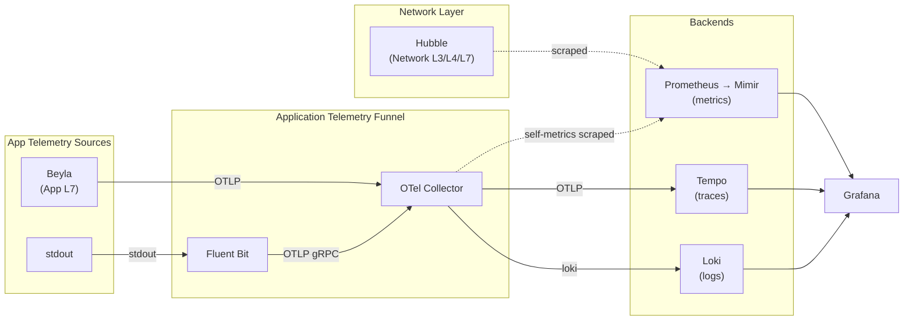

# EKS Production: Observability Logs Path Completion + Hubble Metrics (Phase 3 Sub-project 4b) Implementation Plan

> **For agentic workers:** REQUIRED SUB-SKILL: Use superpowers:subagent-driven-development (recommended) or superpowers:executing-plans to implement this plan task-by-task. Steps use checkbox (`- [ ]`) syntax for tracking.

**Goal:** EKS production cluster (`eks-production`) で Phase 3 の logs path を完成させ、Hubble metrics の Prometheus scrape を有効化する。Sub-project 4a で deploy 済の OTel Collector の logs pipeline に loki exporter を追加し、Fluent Bit OUTPUT を Loki direct から OTel Collector OTLP gRPC 経由に switching、Cilium values で Hubble + cilium-agent + cilium-operator の Prometheus 連携を同時 enable、`kubernetes/README.md` の architecture 図を Network Layer / Application Telemetry 役割分離 mermaid に rewrite する。本 sub-project 完了時に Phase 3 の 3 stack (metrics / logs / traces) wire が完成し、`kubernetes/README.md` に描かれた最終 architecture が reality と一致する。

**Architecture:** Fluent Bit DaemonSet → OTLP gRPC (`:4317`) → OTel Collector → loki exporter → Loki gateway → S3 (= 4b で完成)。Hubble metrics → ServiceMonitor → kube-prometheus-stack Prometheus → remote_write → Mimir (= 4b で完成)。Tempo path は 4a で完成済 (= 本 sub-project では touched しない)。空 `opentelemetry-system` namespace を撤去 (= Sub-project 4a Issue A 同時解消)。

**Tech Stack:** Helm + helmfile / Cilium 1.18.6 (chaining mode、values flip のみ) / `fluent/fluent-bit` v0.57.3 (OUTPUT block 全置換) / `opentelemetry/opentelemetry-collector` v0.153.0 (logs pipeline + loki exporter 追加) / kube-prometheus-stack v84.5.0 (= 既 deploy、ServiceMonitor scrape 対象が増えるのみ)

**Spec:** `docs/superpowers/specs/2026-05-07-eks-production-observability-logs-completion-and-hubble-metrics-design.md`

---

## File Structure

変更ファイル (= 既存 file 修正のみ、新規 component 不在):

**Kubernetes 値変更 (production):**
```
kubernetes/components/cilium/production/values.yaml.gotmpl                # Hubble metrics ServiceMonitor + cilium-agent / operator self-metrics
kubernetes/components/fluent-bit/production/values.yaml.gotmpl            # OUTPUT block 全置換 (loki → opentelemetry)
kubernetes/components/opentelemetry-collector/production/values.yaml.gotmpl  # logs pipeline 拡張 (loki exporter 追加 + debug 撤去)
```

**Kubernetes namespace 整理:**
```
kubernetes/components/opentelemetry-collector/namespace.yaml              # 削除 (local subdir に移動)
kubernetes/components/opentelemetry-collector/local/namespace.yaml        # 新規 (= 既存 namespace.yaml の copy、local 専用化)
```

**Documentation 変更:**
```
kubernetes/README.md                                                      # mermaid (Architecture + Dataflow) rewrite + 役割分離 paragraph 追加
```

**Kubernetes 自動生成 (hydrate output):**
```
kubernetes/manifests/production/cilium/manifest.yaml                      # 再 hydrate (Hubble + agent + operator ServiceMonitor 反映)
kubernetes/manifests/production/fluent-bit/manifest.yaml                  # 再 hydrate (OUTPUT block 反映)
kubernetes/manifests/production/opentelemetry-collector/manifest.yaml     # 再 hydrate (loki exporter 反映)
kubernetes/manifests/production/00-namespaces/namespaces.yaml             # 再生成 (opentelemetry-system block 消失)
kubernetes/manifests/local/00-namespaces/namespaces.yaml                  # 再生成 (opentelemetry-system block 維持、local/namespace.yaml から)
kubernetes/manifests/local/opentelemetry-collector/manifest.yaml          # 再 hydrate (= local 影響なしを confirm)
```

**変更しないファイル**: aws/* / kubernetes/components/{tempo,loki,mimir,prometheus-operator}/* / kubernetes/components/cilium/local/* / kubernetes/components/fluent-bit/local/* / kubernetes/components/opentelemetry-collector/{local/values.yaml, local/helmfile.yaml, production/helmfile.yaml}

---

## Task 0: Pre-flight + branch state verify

**Files:** (確認のみ、変更なし)

**Context:** 4b は 4a で deploy 済の OTel Collector / Tempo / Loki / Mimir / Cilium / Fluent Bit が稼働している前提。pre-flight でこれらが healthy であることを確認、Sub-project 4a Issue A の対象 (= 空 `opentelemetry-system` namespace) が想定通り空であることを確認、Flux 健康状態を確認する。

- [ ] **Step 1: Branch state 確認**

```bash
cd /Users/takanokenichi/GitHub/panicboat/platform/.claude/worktrees/docs/eks-production-observability-logs-completion-and-hubble-metrics
git fetch origin main
git log --oneline origin/main..HEAD
```

Expected: spec commit 1 つのみ ahead
```
937da4e docs(eks): Phase 3 Sub-project 4b (logs path completion + Hubble metrics) design
```

- [ ] **Step 2: 既 deploy 済 4a stack の健康確認 (kubectl context)**

```bash
zsh -ic 'eks-login production >/dev/null 2>&1
echo "--- monitoring namespace pods ---"
kubectl get pods -n monitoring | grep -E "tempo|opentelemetry-collector|loki|fluent-bit|prometheus|mimir|grafana|alertmanager"'
```

Expected: 全 pod `Running`、`tempo-0` (StatefulSet) / `opentelemetry-collector-*` (Deployment) / `loki-*` / `fluent-bit-*` (DaemonSet、各 node) / `kube-prometheus-stack-*` / `mimir-*` がすべて Ready

- [ ] **Step 3: 空 `opentelemetry-system` namespace の確認 (= Issue A の対象)**

```bash
zsh -ic 'eks-login production >/dev/null 2>&1
kubectl get all,cm,secret -n opentelemetry-system 2>&1 | head -10'
```

Expected: `No resources found in opentelemetry-system namespace.` または default service `kubernetes` のみ (= 空であること、resource 残存なし)

- [ ] **Step 4: 4a で deploy 済の OTel Collector logs pipeline が chart default (debug exporter) であることを確認**

```bash
zsh -ic 'eks-login production >/dev/null 2>&1
kubectl get configmap -n monitoring opentelemetry-collector -o jsonpath="{.data}" | grep -A2 "logs:" | head -10'
```

Expected: `exporters: [debug]` が含まれる (= chart default のまま、4b で `[loki]` に置換予定)

- [ ] **Step 5: Loki gateway endpoint の reachability (= 4b で OTel Collector が push する先)**

```bash
zsh -ic 'eks-login production >/dev/null 2>&1
kubectl get svc -n monitoring loki-gateway -o jsonpath="{range .spec.ports[*]}{.name}: {.port}/{.protocol}{\"\\n\"}{end}"'
```

Expected: `http: 80/TCP` (= OTel Collector の loki exporter endpoint `loki-gateway.monitoring.svc.cluster.local:80` が reachable)

- [ ] **Step 6: Cilium prometheus / hubble.metrics.serviceMonitor が現状 false であることを確認**

```bash
zsh -ic 'eks-login production >/dev/null 2>&1
kubectl get configmap -n kube-system cilium-config -o jsonpath="{.data.prometheus-serve-addr}" || echo "(empty)"
echo ""
echo "--- ServiceMonitor for cilium / hubble (現状 false 想定) ---"
kubectl get servicemonitor -n kube-system 2>&1 | grep -E "cilium|hubble" || echo "no cilium/hubble ServiceMonitor (= 想定通り)"'
```

Expected: 現状 cilium / hubble の ServiceMonitor 不在、4b の Task 1 で 3 つ作成される

- [ ] **Step 7: Flux state 確認 (suspended でないこと)**

```bash
zsh -ic 'eks-login production >/dev/null 2>&1
flux get kustomizations 2>&1'
```

Expected: `flux-system` `SUSPENDED=False`、`READY=True`、`Applied revision: main@sha1:711bf05` (= 直近 main = Sub-project 4a learnings PR #295 merge 済) もしくはそれ以降の commit

---

## Task 1: Cilium values flip — Hubble metrics + agent / operator self-metrics の Prometheus 連携 enable

**Files:**
- Modify: `kubernetes/components/cilium/production/values.yaml.gotmpl` (3 箇所 flip)

**Context:** Sub-project 4b Decision 6 適用 = 同 PR で `prometheus.enabled: true` + `operator.prometheus.enabled: true` + `hubble.metrics.serviceMonitor.enabled: true` を一括 flip、ServiceMonitor labels に `release: kube-prometheus-stack` を付与。Cilium chart v1.18.6 は既 deploy、values 変更のみで rolling restart 発生。eBPF datapath は kernel 側で動作するため network downtime なし、Hubble Relay は ~3min flow stream 取得不可になるが historical flows は relay buffer で保持。

### Step 1: values.yaml.gotmpl を修正

`kubernetes/components/cilium/production/values.yaml.gotmpl` の以下 2 箇所を flip + 1 箇所新規追加:

```yaml
# =============================================================================
# Hubble（UI は port-forward only、Phase 4 で Ingress 公開）
# =============================================================================
hubble:
  enabled: true
  # TLS certs を Helm 自動生成（chart values に焼き込み）ではなく cluster 内
  # CronJob で生成・rotate する。public Git repo に Hubble の秘密鍵を出さない。
  tls:
    auto:
      method: cronJob
  relay:
    enabled: true
  ui:
    enabled: true
  metrics:
    enabled:
      - dns
      - drop
      - tcp
      - flow
      - icmp
      - http
    serviceMonitor:
      enabled: true                   # ← Sub-project 4b で flip (was false)
      labels:
        release: kube-prometheus-stack    # kube-prometheus-stack の serviceMonitorSelector match

# =============================================================================
# DNS Proxy（hostNetwork Pod の DNS resolution に必要）
# =============================================================================
dnsProxy:
  enabled: true

# =============================================================================
# Prometheus Metrics (Sub-project 4b: cilium-agent / operator self-metrics enable)
# =============================================================================
prometheus:
  enabled: true                       # ← Sub-project 4b で flip (was false)
  serviceMonitor:
    enabled: true
    labels:
      release: kube-prometheus-stack

operator:
  replicas: 2
  rollOutPods: true
  prometheus:                         # ← Sub-project 4b で新規 block 追加
    enabled: true
    serviceMonitor:
      enabled: true
      labels:
        release: kube-prometheus-stack
```

具体的な edit 操作:

1. `serviceMonitor: enabled: false` の行を `serviceMonitor: enabled: true` + `labels: release: kube-prometheus-stack` に変更 (Hubble metrics block 内)
2. `prometheus: enabled: false` の行を `prometheus: enabled: true` + `serviceMonitor: enabled: true` + `labels: release: kube-prometheus-stack` に変更
3. `operator: replicas: 2 / rollOutPods: true` block の末尾に `prometheus: enabled: true / serviceMonitor: ...` を追加

(古い `# Phase 3 完了後に true` コメントは flip 後不要なので削除)

### Step 2: helmfile template で render verify

```bash
helmfile -f kubernetes/components/cilium/production/helmfile.yaml -e production template --include-crds --skip-tests 2>&1 | \
  grep -E "kind: ServiceMonitor|name: cilium|name: hubble|release: kube-prometheus-stack" | head -20
```

Expected: 3 つの ServiceMonitor (`cilium-agent` / `cilium-operator` / `hubble`) と `release: kube-prometheus-stack` label が含まれる

### Step 3: Diff 確認

```bash
git diff kubernetes/components/cilium/production/values.yaml.gotmpl
```

Expected:
- `serviceMonitor.enabled: false` → `true` (Hubble block)
- `prometheus.enabled: false` → `true` + `serviceMonitor` block 追加
- `operator` block に `prometheus` 子 block 追加
- 全 ServiceMonitor block に `labels: release: kube-prometheus-stack`

### Step 4: Commit

```bash
git add kubernetes/components/cilium/production/values.yaml.gotmpl
git commit -s -m "feat(eks): Cilium Hubble + agent + operator metrics ServiceMonitor"
```

Expected: 1 file changed、commit subject ≤ 72 chars (= 60 chars 程度)

---

## Task 2: Fluent Bit OUTPUT 切替 — Loki direct → OTel Collector OTLP gRPC

**Files:**
- Modify: `kubernetes/components/fluent-bit/production/values.yaml.gotmpl` (OUTPUT block 全置換)

**Context:** Sub-project 4b Decision 4 適用 = OTLP gRPC (port 4317) を採用、OTLP HTTP より production 性能優位 (Protobuf binary encoding + HTTP/2 multiplexing、low CPU + low memory)。endpoint は production reality (= OTel Collector が住む `monitoring` namespace) に合わせる。Fluent Bit が Loki direct push していた path を OTel Collector 経由 (= OTel Collector の logs pipeline で loki exporter 経由で同じ Loki に push) に切替。

### Step 1: values.yaml.gotmpl の outputs block を全置換

`kubernetes/components/fluent-bit/production/values.yaml.gotmpl` の `outputs:` block を以下に置換:

```yaml
  # -------------------------------------------------------------------------
  # OUTPUTS (= OTel Collector OTLP gRPC、Sub-project 4b で Loki direct から切替)
  # -------------------------------------------------------------------------
  outputs: |
    [OUTPUT]
        Name              opentelemetry
        Match             kube.*
        Host              opentelemetry-collector.monitoring.svc.cluster.local
        Port              4317
        # OTLP gRPC over HTTP/2 (Decision 4)
        grpc              on
        # gzip 圧縮で帯域削減
        compress          gzip
        # retry settings
        net.connect_timeout 10
        Retry_Limit       no_limits
        # storage = filesystem buffer (= retry の永続化、Decision 11 軽減策)
        storage.total_limit_size  5G
```

具体的な edit 操作:
- 既存の `[OUTPUT] Name loki ... storage.total_limit_size 5G` block 全体 (= `outputs: |` の indent 配下) を上記に置換
- comment の Decision 番号は spec の Decision 4 を参照

(注意: `kubernetes` filter は INPUTS の `[FILTER]` block で既設定済、OUTPUT block 切替後も k8s metadata は OTLP attributes として伝搬される)

### Step 2: helmfile template で render verify

```bash
helmfile -f kubernetes/components/fluent-bit/production/helmfile.yaml -e production template --include-crds --skip-tests 2>&1 | \
  grep -A20 "outputs.conf:" | head -25
```

Expected: `Name opentelemetry`、`Host opentelemetry-collector.monitoring.svc.cluster.local`、`Port 4317`、`grpc on` が含まれる、`Name loki` は含まれない

### Step 3: Diff 確認

```bash
git diff kubernetes/components/fluent-bit/production/values.yaml.gotmpl
```

Expected:
- `Name loki` → `Name opentelemetry`
- `Host loki-gateway.monitoring.svc.cluster.local` → `Host opentelemetry-collector.monitoring.svc.cluster.local`
- `Port 80` → `Port 4317`
- `Uri /loki/api/v1/push` 削除
- `tenant_id anonymous` 削除
- `labels job=fluentbit, ...` 削除
- `structured_metadata node=..., stream=...` 削除
- `remove_keys kubernetes` 削除
- `grpc on` 追加

### Step 4: Commit

```bash
git add kubernetes/components/fluent-bit/production/values.yaml.gotmpl
git commit -s -m "feat(eks): Fluent Bit OUTPUT to OTel Collector (OTLP gRPC)"
```

Expected: 1 file changed、commit subject ≤ 72 chars (= 56 chars 程度)

---

## Task 3: OTel Collector logs pipeline 拡張 + namespace 整理

**Files:**
- Move: `kubernetes/components/opentelemetry-collector/namespace.yaml` → `kubernetes/components/opentelemetry-collector/local/namespace.yaml`
- Modify: `kubernetes/components/opentelemetry-collector/production/values.yaml.gotmpl` (loki exporter 追加 + logs pipeline 上書き)

**Context:** Sub-project 4b Decision 8 適用 = logs pipeline の `exporters` を chart default `[debug]` から `[loki]` に置換 (= 実 sink 接続)、metrics pipeline の chart default は維持 (= Phase 4 で Beyla 接続時に再 design)。Decision 5 適用 = production OTel Collector は `monitoring` namespace 維持、空 `opentelemetry-system` namespace を撤去 (Sub-project 4a Issue A 同時解消)。namespace 撤去は Makefile `hydrate-index` の fall-back ロジックを活用 (= top-level `namespace.yaml` を `local/namespace.yaml` に移動することで production hydrate からは消える)。

### Step 1: namespace.yaml を local subdirectory に移動

```bash
git mv kubernetes/components/opentelemetry-collector/namespace.yaml kubernetes/components/opentelemetry-collector/local/namespace.yaml
```

確認:
```bash
ls kubernetes/components/opentelemetry-collector/
ls kubernetes/components/opentelemetry-collector/local/
```

Expected:
- top-level に `namespace.yaml` 不在
- `local/` に `helmfile.yaml`, `kustomization/`, `namespace.yaml`, `values.yaml` (4 entries)

### Step 2: production values.yaml.gotmpl に loki exporter 追加 + logs pipeline 上書き

`kubernetes/components/opentelemetry-collector/production/values.yaml.gotmpl` の `config:` block を以下に拡張:

```yaml
# =============================================================================
# Collector Config (Sub-project 4b: logs pipeline 拡張)
# =============================================================================
# NOTE: chart default で logs / metrics pipelines も pre-configure される。
# 本 4b で:
#   1. exporters に loki を追加 (= Loki gateway に http push)
#   2. service.pipelines.logs: chart default の exporters [debug] を [loki] に上書き
#   3. metrics pipeline は chart default のまま (= Phase 4 で Beyla 接続時に再 design)
config:
  exporters:
    # 4a で追加: Tempo exporter
    otlp/tempo:
      endpoint: tempo.monitoring.svc.cluster.local:4317
      tls:
        insecure: true
    # Sub-project 4b で追加: Loki exporter (= Fluent Bit からの logs を Loki に push)
    loki:
      endpoint: http://loki-gateway.monitoring.svc.cluster.local:80/loki/api/v1/push
      default_labels_enabled:
        # OTel Collector が "exporter" label を付与しない (= cardinality 抑制)
        exporter: false
        # "job=fluentbit" 等を維持
        job: true
  service:
    pipelines:
      traces:
        # 4a で override: chart default の exporters: [debug] を otlp/tempo に
        exporters:
          - otlp/tempo
        processors:
          - memory_limiter
          - batch
        receivers:
          - otlp
      logs:
        # Sub-project 4b で override: chart default の exporters: [debug] を loki に
        exporters:
          - loki
        processors:
          - memory_limiter
          - batch
        receivers:
          - otlp
```

具体的な edit 操作:
- `config.exporters` 内に `loki: endpoint: ... default_labels_enabled: ...` block を追加 (`otlp/tempo` block の後)
- `config.service.pipelines` 内に `logs:` block を追加 (`traces:` block の後)
- (metrics pipeline は明示記述しない = chart default の `[debug]` のまま)

### Step 3: helmfile template で render verify

```bash
helmfile -f kubernetes/components/opentelemetry-collector/production/helmfile.yaml -e production template --include-crds --skip-tests 2>&1 | \
  grep -A2 "exporters:" | head -30
```

Expected: ConfigMap の collector config (relay) に以下が含まれる:
- `loki:` exporter (= endpoint, default_labels_enabled)
- `logs.exporters: [loki]` (= chart default `[debug]` から override 済)
- `traces.exporters: [otlp/tempo]` (= 4a の override 維持)
- `metrics.exporters: [debug]` (= chart default のまま、Phase 4 まで)

### Step 4: Diff 確認

```bash
git diff --stat
git status
```

Expected:
```
 kubernetes/components/opentelemetry-collector/local/namespace.yaml      | 9 +++++++++ (renamed from kubernetes/components/opentelemetry-collector/namespace.yaml)
 kubernetes/components/opentelemetry-collector/production/values.yaml.gotmpl | ~15 +++++++++++++++ -- 
```

### Step 5: Commit

```bash
git add kubernetes/components/opentelemetry-collector/
git commit -s -m "feat(eks): OTel Collector logs pipeline + namespace cleanup"
```

Expected: 2 files changed (1 renamed + 1 modified)、commit subject ≤ 72 chars (= 58 chars 程度)

---

## Task 4: kubernetes/README.md mermaid rewrite + 役割分離説明追加

**Files:**
- Modify: `kubernetes/README.md` (Architecture mermaid + Dataflow mermaid + 役割分離 paragraph 追加)

**Context:** Sub-project 4b Decision 9 適用 = `kubernetes/README.md` の Architecture / Dataflow 図を Network Layer (Cilium + Hubble) と Application Telemetry (OTel Collector + Beyla + Fluent Bit) の 2 subgraph 分離に rewrite、説明 paragraph 追加。これは reality と図を一致させる + 役割分離を明示する変更で、純粋なドキュメント変更 (cluster 影響 0)。mermaid 図中の `OTLP HTTP` を Decision 4 反映で `OTLP gRPC` に修正。

### Step 1: Architecture mermaid を rewrite

`kubernetes/README.md` の line 9-69 (= 既存 Architecture mermaid block) を以下に置換:

````markdown

````

### Step 2: 「役割分離」 paragraph を Architecture mermaid 直後に挿入

`kubernetes/README.md` の Architecture mermaid 直後 (= "### Dataflow" の直前) に以下を挿入:

```markdown
### 役割分離

Signal は role 別に 2 funnel で流す。

**Network Layer** (Cilium + Hubble): cluster の network behavior を観測する。Hubble は native Prometheus exporter として動作し、Prometheus が ServiceMonitor 経由で直接 scrape。Cilium NetworkPolicy enforcement の visibility と統合され、CNI と密結合。

**Application Telemetry Funnel** (Beyla + Fluent Bit + OTel Collector): application code の trace / log / metric を集約する。OTel Collector を hub として全 signal が統一 metadata processor を通り、Tempo / Loki / Mimir へ route。

両者を混ぜない理由:

1. Hubble は Cilium native の Prometheus exporter で、追加 OTel hop は overhead 増の trade-off に見合わない
2. network 視点と application 視点は cardinality / sampling 戦略が異なり、別 funnel の方が運用しやすい
```

### Step 3: Dataflow mermaid を rewrite

`kubernetes/README.md` の line 73-107 (= 既存 Dataflow mermaid block) を以下に置換:

````markdown

````

### Step 4: Diff 確認

```bash
git diff kubernetes/README.md | head -100
```

Expected:
- Architecture mermaid: `Collection Layer` subgraph が `Network Layer` + `Application Telemetry` の 2 subgraph に分割
- `OTLP HTTP` → `OTLP gRPC` (Fluent Bit → OTel Collector)
- 「役割分離」 paragraph 追加 (= 7 行程度)
- Dataflow mermaid: `Unified Collection` → `Application Telemetry Funnel` 名称変更、`Network Layer` subgraph 分離

### Step 5: Commit

```bash
git add kubernetes/README.md
git commit -s -m "docs(kubernetes): README mermaid rewrite (role-separated stacks)"
```

Expected: 1 file changed、commit subject ≤ 72 chars (= 64 chars 程度)

---

## Task 5: Hydrate manifests + verify

**Files:**
- Modify (auto-generated): `kubernetes/manifests/production/cilium/manifest.yaml`
- Modify (auto-generated): `kubernetes/manifests/production/fluent-bit/manifest.yaml`
- Modify (auto-generated): `kubernetes/manifests/production/opentelemetry-collector/manifest.yaml`
- Modify (auto-generated): `kubernetes/manifests/production/00-namespaces/namespaces.yaml` (= `opentelemetry-system` block 削除)
- Modify (auto-generated): `kubernetes/manifests/local/00-namespaces/namespaces.yaml` (= `opentelemetry-system` block は `local/namespace.yaml` から維持)
- Modify (auto-generated, possibly no change): `kubernetes/manifests/local/opentelemetry-collector/manifest.yaml`

**Context:** Task 1-4 で values + namespace.yaml + README を変更済。Task 5 で hydrated manifests を再生成し、Flux が apply する actual YAML を更新する。`make hydrate-component` で各 component の manifest.yaml を chart render、`make hydrate-index` で 00-namespaces/namespaces.yaml を再生成 + orphan 削除。

### Step 1: production の各 component manifest を再生成

```bash
cd kubernetes
make hydrate-component COMPONENT=cilium ENV=production
make hydrate-component COMPONENT=fluent-bit ENV=production
make hydrate-component COMPONENT=opentelemetry-collector ENV=production
cd ..
```

Expected:
- `kubernetes/manifests/production/cilium/manifest.yaml` 更新 (= 3 ServiceMonitor + Hubble metrics enable 反映)
- `kubernetes/manifests/production/fluent-bit/manifest.yaml` 更新 (= OUTPUT opentelemetry block 反映)
- `kubernetes/manifests/production/opentelemetry-collector/manifest.yaml` 更新 (= loki exporter + logs pipeline 反映)

### Step 2: production の 00-namespaces を再生成 (= `opentelemetry-system` block 削除)

```bash
cd kubernetes
make hydrate-index ENV=production
cd ..
```

Expected:
- `kubernetes/manifests/production/00-namespaces/namespaces.yaml` 更新 = `opentelemetry-system` Namespace block が消える (= top-level `namespace.yaml` 不在 + `production/namespace.yaml` 不在のため hydrate-index が pickup しない)

### Step 3: local の opentelemetry-collector manifest + 00-namespaces を再生成 (= local 影響なしを確認)

```bash
cd kubernetes
make hydrate-component COMPONENT=opentelemetry-collector ENV=local
make hydrate-index ENV=local
cd ..
```

Expected:
- `kubernetes/manifests/local/opentelemetry-collector/manifest.yaml` は変更なし (= local values.yaml は touched なし) もしくは TLS cert 等の non-functional な diff のみ
- `kubernetes/manifests/local/00-namespaces/namespaces.yaml` 更新 = `opentelemetry-system` block は維持される (= `local/namespace.yaml` から hydrate-index が pickup)

### Step 4: production manifests が `opentelemetry-system` を含まないことを確認

```bash
grep -l "opentelemetry-system" kubernetes/manifests/production/ -r 2>&1 | head -5
```

Expected: 結果なし (= production manifests から `opentelemetry-system` 完全削除)

### Step 5: kustomize build で全 production manifest が valid render することを確認

```bash
kustomize build kubernetes/manifests/production 2>&1 | tail -20
```

Expected: error なし、最後に何らかの YAML resource が出力される (= kustomization build success)

### Step 6: ServiceMonitor が render されているか確認

```bash
grep -A3 "kind: ServiceMonitor" kubernetes/manifests/production/cilium/manifest.yaml | grep -E "name:|kind:" | head -10
```

Expected: 3 ServiceMonitor (`cilium-agent`, `cilium-operator`, `hubble`) が見つかる

### Step 7: Loki exporter が render されているか確認

```bash
grep -A2 "loki:" kubernetes/manifests/production/opentelemetry-collector/manifest.yaml | head -10
```

Expected:
```
        loki:
          endpoint: http://loki-gateway.monitoring.svc.cluster.local:80/loki/api/v1/push
```

### Step 8: Fluent Bit OUTPUT block が opentelemetry に切替済か確認

```bash
grep -B1 -A8 "Name              opentelemetry" kubernetes/manifests/production/fluent-bit/manifest.yaml | head -15
```

Expected: `[OUTPUT]` block に `Name opentelemetry` + `Host opentelemetry-collector.monitoring.svc.cluster.local` + `Port 4317` + `grpc on` が含まれる

### Step 9: Diff 確認

```bash
git status
git diff --stat
```

Expected:
- production/cilium/manifest.yaml 更新
- production/fluent-bit/manifest.yaml 更新
- production/opentelemetry-collector/manifest.yaml 更新
- production/00-namespaces/namespaces.yaml 更新
- local/00-namespaces/namespaces.yaml 更新 (= block content は同等、ordering のみ差異の可能性)
- local/opentelemetry-collector/manifest.yaml は変更なしか TLS cert non-functional diff のみ

### Step 10: Commit

```bash
git add kubernetes/manifests/
git commit -s -m "feat(eks): hydrate cilium + fluent-bit + opentelemetry-collector"
```

Expected: ~5-6 files changed、commit subject ≤ 72 chars (= 65 chars 程度)

---

## Task 6: PR push + Pre-flight check + Ready for review

**Files:** (= no file changes、PR 操作のみ)

**Context:** Task 1-5 完了後の commit 累計 6 件 (= spec + 4 implementation + hydrate)。Sub-project 3 / 4a で確立した standard runbook (= Pre-flight check 全件 ✅ を PR description に記録、Draft で push、USER GATE で Ready for review + merge)。

### Step 1: branch 状態を確認

```bash
cd /Users/takanokenichi/GitHub/panicboat/platform/.claude/worktrees/docs/eks-production-observability-logs-completion-and-hubble-metrics
git log --oneline origin/main..HEAD
```

Expected: 6 commits ahead (Task 1 から Task 5 まで + spec commit)
```
<sha> feat(eks): hydrate cilium + fluent-bit + opentelemetry-collector
<sha> docs(kubernetes): README mermaid rewrite (role-separated stacks)
<sha> feat(eks): OTel Collector logs pipeline + namespace cleanup
<sha> feat(eks): Fluent Bit OUTPUT to OTel Collector (OTLP gRPC)
<sha> feat(eks): Cilium Hubble + agent + operator metrics ServiceMonitor
937da4e docs(eks): Phase 3 Sub-project 4b (logs path completion + Hubble metrics) design
```

### Step 2: branch を origin に push

```bash
git push 2>&1 | tail -3
```

Expected: branch が track 設定済 (= 既 spec push 時に `git push -u origin HEAD` 済)、push success message

### Step 3: PR title 文字数チェック (≤ 72 chars)

```bash
echo -n "feat(eks): Phase 3 Sub-project 4b — Logs path + Hubble metrics" | wc -m
```

Expected: 62 chars (em dash 含む、visible ≈ 60 chars、Sub-project 2 / 3 / 4a の PR title 命名 pattern と整合)

### Step 4: Draft PR を作成 (Pre-flight check 結果を含む)

PR body は以下:

```markdown
## Summary

Phase 3 Sub-project 4b (logs path completion + Hubble metrics enable) の implementation。Sub-project 4a で deploy 済の OTel Collector の logs pipeline に loki exporter を追加し、Fluent Bit OUTPUT を Loki direct から OTel Collector OTLP gRPC 経由に switching、Cilium values で Hubble + cilium-agent + cilium-operator の Prometheus 連携を同時 enable。空 `opentelemetry-system` namespace を撤去 (= Sub-project 4a Issue A 同時解消)。`kubernetes/README.md` の architecture 図を Network Layer / Application Telemetry 役割分離 mermaid に rewrite。本 sub-project 完了時に Phase 3 の 3 stack (metrics / logs / traces) wire が完成。

**Architecture (4b 完了時):** Fluent Bit DaemonSet → OTLP gRPC `:4317` → OTel Collector → loki exporter → Loki gateway → S3。Hubble metrics → ServiceMonitor → Prometheus → remote_write → Mimir。Tempo path は 4a で完成済 (= 本 PR で touched しない)。

## Spec / Plan

- Spec: `docs/superpowers/specs/2026-05-07-eks-production-observability-logs-completion-and-hubble-metrics-design.md` (10 Decisions、Sub-project 1-4a learnings ~25 件のうち applicable 全項目適用)
- Plan: `docs/superpowers/plans/2026-05-07-eks-production-observability-logs-completion-and-hubble-metrics.md` (7 tasks)

## Notable Decisions

- **D1**: Hubble は OTel Collector を経由せず Prometheus が直接 scrape (= `cilium/hubble-otel` archived June 2024、`opentelemetry-collector-contrib` hubble receiver issue closed as not planned、2026 公式 community recommended pattern と整合)
- **D2**: Beyla deploy + OTel Collector metrics pipeline 拡張 を Phase 4 へ postpone (= production cluster は infra-only state、application code 投入時に同時 deploy)
- **D3**: Hubble flow logs → Loki path も Phase 4 へ postpone (= scope creep のリスク高、需要発生時に評価)
- **D4**: Fluent Bit OTLP protocol = gRPC (port 4317) (= OpenTelemetry OTLP spec 1.10.0 の "instrumented application + local daemon" use case に合致、2026 community best practice)
- **D5**: OTel Collector namespace = `monitoring` 維持、空 `opentelemetry-system` namespace 撤去 (= Phase 3 monitoring 共有 pattern と整合、Sub-project 4a Issue A 同時解消)
- **D6**: Cilium values で Hubble + agent + operator の Prometheus 連携を同時 enable (= 2026 production deployment guide 公式推奨、partial state を経由しない)
- **D7**: OTel Collector logs pipeline の processor は chart default のまま、k8sattributes processor は不採用 (= Fluent Bit が既に k8s metadata 付与済、二重付与は YAGNI)
- **D9**: kubernetes/README.md mermaid rewrite + 役割分離説明追加 を 4b scope に含める (= reality と図を一致 + 役割分離明示)
- **D10**: 1 sub-project 構成 (= 4 task atomic merge、Sub-project 3 と同 pattern)

## Pre-flight check

- [ ] Branch state 1 commit (spec) ahead (Task 0 Step 1)
- [ ] 既 deploy 済 4a stack 全 pod Running (Task 0 Step 2)
- [ ] 空 `opentelemetry-system` namespace の resource なし (Task 0 Step 3)
- [ ] 4a OTel Collector logs pipeline は chart default `[debug]` (Task 0 Step 4)
- [ ] Loki gateway endpoint reachable (Task 0 Step 5)
- [ ] Cilium prometheus / hubble.metrics.serviceMonitor 現状 false (Task 0 Step 6)
- [ ] Flux not suspended (Task 0 Step 7)

## Test plan (post-flight, after merge)

### 10 分以内
- [ ] Cilium DaemonSet / cilium-operator Deployment / hubble-relay Deployment all Rolling restart 完了
- [ ] 3 ServiceMonitor (`cilium-agent` / `cilium-operator` / `hubble`) cluster に存在
- [ ] Prometheus targets で `cilium-agent` / `cilium-operator` / `hubble` endpoints が UP
- [ ] Fluent Bit DaemonSet 全 pod Ready、restartCount 0
- [ ] OTel Collector Deployment 1/1 Running、loki exporter / otlp receiver startup success
- [ ] 空 `opentelemetry-system` namespace 削除確認 (`kubectl get namespace opentelemetry-system` → NotFound)

### 30 分以内
- [ ] Hubble metrics が Mimir で query 可能 (`hubble_flows_processed_total` 等)
- [ ] Fluent Bit logs に OUTPUT=opentelemetry 接続成功 log
- [ ] OTel Collector logs に loki exporter 接続成功 log
- [ ] Grafana Loki Explore で `{job="fluentbit"}` query で過去 5 分以内の log entry > 0
- [ ] Loki ingester ingestion rate が 4b 切替後に持続 (= Fluent Bit 経由でも log volume ロスなし)
- [ ] Mimir に `hubble_*` / `cilium_*` metrics が remote_write 保存済 (count > 10)
- [ ] 既存 4a path の regression なし — Tempo に traces 流入が継続
- [ ] kubernetes/README.md mermaid 図が GitHub で正しく rendering される

## Sub-project 1-4a learnings 適用

| Learning ID | 4b での適用 |
|---|---|
| **3-L1 (chart 内部固定 path 問題)** | Cilium chart の `serviceMonitor.labels` 構造、Fluent Bit chart の `opentelemetry` plugin parameter、OTel Collector chart の `loki` exporter config 構造を pre-validate (Task 1-3) |
| **3-L3 (chart probe / serviceMonitor key 確認)** | Cilium chart の ServiceMonitor labels が kube-prometheus-stack `serviceMonitorSelector.release: kube-prometheus-stack` と match するか pre-validate (Task 1) |
| **3-L5 (Flux suspend pattern)** | Risks / Rollback section で standard runbook として明示 |
| **3-L6 (Loki `auth_enabled: false` 時 default tenant `fake`)** | OTel Collector `loki` exporter は default で tenant ID 推論なし (= Loki 側の default tenant `fake` がそのまま適用)、Sub-project 3 と整合 |
| **3-L7 (sibling stack symmetric)** | 4 task は全て monitoring namespace 内で完結、Phase 3 共有 namespace pattern を維持 |
| **3-L8 (post-flight check)** | 14 項目を Test plan で明示 |
| **3-L9 (公式 docs 引用)** | D1 (Hubble OTLP non-recommended)、D4 (gRPC 採用) で公式 docs を direct citation |
| **3-L10 (Phase 3 全体 9 件 runtime issue)** | 4a で 0 件達成、4b でも L1-L8 + 4a L1-L8 適用で 0 件目標、Phase 3 累計 9 件のまま据置 |
| **4a-L1 (累積効果で initial deploy 0 issue)** | 4b でも 0 runtime issue 目標 |
| **4a-L2 (startup transient を persistent と決めつけない)** | post-flight verification で起動 ~60 秒以内の transient error は L3 checklist で除外 |
| **4a-L3 (persistent vs transient 5-step checklist)** | post-flight check section の最後に明示組み込み |
| **4a-L5 (kubectl 出力 truncate に注意)** | post-flight check で `head -N` 避け、`-o jsonpath` / `-o yaml` で完全 field 取得 |
| **4a-L6 (不要な runtime fix の早期 abort)** | runtime issue 発見時、L3 checklist + L5 完全表示で evidence を集めてから fix 着手 |
| **4a-L7 (4a/4b 分割 Decision 1 の long-term ROI)** | D2-D3 で同 pattern 適用 = Beyla / metrics pipeline / Hubble flow logs を Phase 4 へ postpone |
| **4a-L8 (Phase 4 引き継ぎ事項)** | 4b 完了で `opentelemetry-system` namespace 整理を解消、残り 5 件 + 新規 3 件 = 8 件を Phase 4 へ |

## Rollback 手順 (想定外障害時)

```bash
# 1. Flux 一時停止
flux suspend kustomization flux-system -n flux-system

# 2. revert PR を作成 + main に merge
gh pr create --title "revert: Sub-project 4b — logs path completion" \
  --body "Reverting #N due to <issue>" --base main
gh pr merge <revert-pr-num> --squash

# 3. Flux 再開
flux resume kustomization flux-system -n flux-system

# 4. 確認
kubectl get pods -n monitoring -l app.kubernetes.io/name=opentelemetry-collector
kubectl logs -n monitoring deployment/opentelemetry-collector --tail=20
```

aws/* は 4b では touched しないため AWS-side rollback 不要。Logs ロストは Fluent Bit `storage.total_limit_size 5G` の disk buffer で吸収可。
```

```bash
gh pr create --draft \
  --title "feat(eks): Phase 3 Sub-project 4b — Logs path + Hubble metrics" \
  --body "$(<above body>)"
```

Expected: PR URL 出力 (例: `https://github.com/panicboat/platform/pull/<N>`)

### Step 5: PR URL を確認

```bash
gh pr view --json title,url,isDraft --jq '.'
```

Expected:
```json
{
    "isDraft": true,
    "title": "feat(eks): Phase 3 Sub-project 4b — Logs path + Hubble metrics",
    "url": "https://github.com/panicboat/platform/pull/<N>"
}
```

(ここで USER GATE: PR review + Ready for review + merge は user 操作)

---

## Self-review

### Spec coverage

| Spec section | 実装 task | カバレッジ |
|---|---|---|
| Architecture (mermaid 4b 完了時) | Task 4 | ✅ Architecture + Dataflow mermaid + 役割分離 paragraph すべて |
| 役割分離 paragraph | Task 4 Step 2 | ✅ |
| Scope (4 task) | Task 1 / 2 / 3 / 4 | ✅ Cilium / Fluent Bit / OTel Collector / README すべて |
| Out of scope (Phase 4) | (= deploy しないため task 不在) | ✅ |
| Decision 1 (Hubble Prometheus 直 scrape) | Task 1 (= Hubble metrics ServiceMonitor enable) | ✅ |
| Decision 2 (Beyla / metrics pipeline postpone) | (= deploy しないため task 不在、metrics pipeline は chart default 維持) | ✅ |
| Decision 3 (Hubble flow logs postpone) | (= touch しないため task 不在) | ✅ |
| Decision 4 (Fluent Bit OTLP gRPC) | Task 2 (= `Port 4317` + `grpc on`) | ✅ |
| Decision 5 (monitoring namespace + opentelemetry-system 撤去) | Task 3 Step 1 (namespace.yaml move) + Task 5 Step 2 (hydrate-index 再生成) | ✅ |
| Decision 6 (3 toggle 同時 flip) | Task 1 Step 1 (3 箇所 flip + 1 新規 block) | ✅ |
| Decision 7 (k8sattributes 不採用) | Task 3 Step 2 (= chart default processor のまま、追加なし) | ✅ |
| Decision 8 (debug exporter logs から撤去 / metrics 維持) | Task 3 Step 2 (= logs.exporters: [loki] / metrics は明示記述しない = chart default) | ✅ |
| Decision 9 (README mermaid rewrite) | Task 4 | ✅ |
| Decision 10 (1 sub-project atomic merge) | Task 6 (= 6 commits 1 PR) | ✅ |
| Risks / Rollback (Pattern A/B) | Task 6 Step 4 (PR body の Rollback 手順) | ✅ |
| Post-flight check (14 items) | Task 6 Step 4 (PR body の Test plan) | ✅ |

### Placeholder scan

- [x] `TBD` / `TODO` / `FIXME` / `XXX` 等の placeholder なし
- [x] `<sha>` placeholder は git commit hash placeholder として意図的 (= Task 6 Step 1)
- [x] `<N>` placeholder は PR 番号として意図的 (= Task 6 Step 4 / Step 5)
- [x] `<above body>` は heredoc-style PR body insertion を意図 (= Task 6 Step 4)、code block 内に PR body 全文記述済

### Type / Property name consistency

- [x] `serviceMonitor.enabled` (Cilium chart): Hubble metrics block / Cilium prometheus block / operator block すべて同 key 使用
- [x] `serviceMonitor.labels` (Cilium chart): 3 箇所すべて `release: kube-prometheus-stack` で統一
- [x] `Name opentelemetry` (Fluent Bit OUTPUT): plugin name 一致
- [x] `Port 4317` (Fluent Bit) ↔ OTel Collector OTLP receiver `:4317` (= 4a で expose 済): port 一致
- [x] `monitoring` namespace (OTel Collector / Fluent Bit / Loki / Tempo / Mimir): 全 component で同一
- [x] `loki:` exporter (OTel Collector): endpoint URL `http://loki-gateway.monitoring.svc.cluster.local:80/loki/api/v1/push` (= Sub-project 3 で deploy 済 service と整合)
- [x] mermaid label `OTLP gRPC` (Architecture + Dataflow 両方): 統一
- [x] commit subject prefix: `feat(eks):` (= 4 implementation commits) / `docs(kubernetes):` (= README) / `feat(eks):` (= hydrate)、Sub-project 4a と整合
