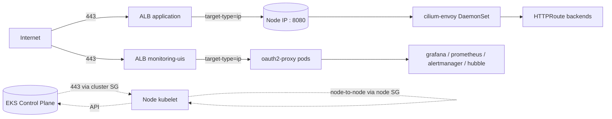

# AWS Resource Provenance Implementation Plan

> **For agentic workers:** REQUIRED SUB-SKILL: Use superpowers:subagent-driven-development (recommended) or superpowers:executing-plans to implement this plan task-by-task. Steps use checkbox (`- [ ]`) syntax for tracking.

**Goal:** establish a unified `ManagedBy` + `Component` tag schema across all 11 IaC stacks and k8s controller-created AWS resources (AWS LB Controller / Karpenter / EBS CSI), lock down the VPC default SG, and publish a provenance inventory doc.

**Architecture:** edit Terragrunt env files + provider helm/manifest values + EKS addon config + new doc, then `terragrunt apply` per stack + flux reconcile, with `terragrunt plan` diff + `aws ec2 describe-*` / `kubectl get` verifications between steps. All 5 functional changes are independent and merge in a single PR.

**Tech Stack:** OpenTofu 1.11.x via Terragrunt + AWS provider 6.44.0 + terraform-aws-modules/vpc + terraform-aws-modules/eks v21.20.0 + EKS managed addon (aws-ebs-csi-driver) + Helm chart `aws-load-balancer-controller` 3.3.0 via helmfile + Karpenter v1 EC2NodeClass CRD + Flux GitOps.

**Spec:** `docs/superpowers/specs/2026-05-17-aws-resource-provenance-design.md`

**Worktree branch:** `feat/aws-resource-provenance` (= `.claude/worktrees/feat-aws-resource-provenance/`)

---

### Task 1: Rename `Purpose` → `Component` in 10 standard env.hcl files

**Files (Modify):**
- `aws/ai-assistant/envs/develop/env.hcl`
- `aws/alb/envs/production/env.hcl`
- `aws/cost-management/envs/develop/env.hcl`
- `aws/eks/envs/production/env.hcl`
- `aws/eks-logs/envs/production/env.hcl`
- `aws/eks-metrics/envs/production/env.hcl`
- `aws/eks-secrets/envs/production/env.hcl`
- `aws/eks-traces/envs/production/env.hcl`
- `aws/karpenter/envs/production/env.hcl`
- `aws/vpc/envs/production/env.hcl`

**Excluded:** `aws/github-oidc-auth/envs/{develop,production}/env.hcl` (= structural anomaly, handled in Task 2).

- [ ] **Step 1: Verify current `Purpose` value matches stack name across all 10 standard files**

Run:
```bash
for f in aws/{ai-assistant/envs/develop,alb/envs/production,cost-management/envs/develop,eks/envs/production,eks-logs/envs/production,eks-metrics/envs/production,eks-secrets/envs/production,eks-traces/envs/production,karpenter/envs/production,vpc/envs/production}/env.hcl; do
  echo -n "$f: "
  grep -oE 'Purpose\s*=\s*"[^"]+"' "$f"
done
```
Expected output: each line shows `Purpose = "<stack-name>"` where `<stack-name>` matches the stack dir (e.g., `aws/vpc/envs/production/env.hcl: Purpose = "vpc"`).

- [ ] **Step 2: Apply rename in each file**

For each file in the list above, replace the `Purpose` key with `Component` (= keep the value as-is). Example for `aws/vpc/envs/production/env.hcl` (line ~13):

Before:
```hcl
  environment_tags = {
    Environment = local.environment
    Purpose     = "vpc"
    Owner       = "panicboat"
  }
```

After:
```hcl
  environment_tags = {
    Environment = local.environment
    Component   = "vpc"
    Owner       = "panicboat"
  }
```

Repeat for all 10 files. Note that `Component` is 9 chars vs `Purpose` 7 chars; trim 2 spaces between the key and `=` to preserve the existing visual column alignment with neighboring keys (`Environment`, `Owner`). If unsure, run `terragrunt hclfmt aws/<stack>/envs/<env>/env.hcl` afterwards to auto-align.

- [ ] **Step 3: Verify all 10 files now use `Component`, no `Purpose` remains**

Run:
```bash
for f in aws/{ai-assistant/envs/develop,alb/envs/production,cost-management/envs/develop,eks/envs/production,eks-logs/envs/production,eks-metrics/envs/production,eks-secrets/envs/production,eks-traces/envs/production,karpenter/envs/production,vpc/envs/production}/env.hcl; do
  grep -H 'Purpose\s*=\s*"' "$f" && echo "$f STILL HAS Purpose"
done
echo "Component count:"
grep -l 'Component\s*=\s*"' aws/{ai-assistant/envs/develop,alb/envs/production,cost-management/envs/develop,eks/envs/production,eks-logs/envs/production,eks-metrics/envs/production,eks-secrets/envs/production,eks-traces/envs/production,karpenter/envs/production,vpc/envs/production}/env.hcl | wc -l
```
Expected: no "STILL HAS Purpose" line, and "Component count: 10".

- [ ] **Step 4: Commit**

```bash
git add aws/{ai-assistant/envs/develop,alb/envs/production,cost-management/envs/develop,eks/envs/production,eks-logs/envs/production,eks-metrics/envs/production,eks-secrets/envs/production,eks-traces/envs/production,karpenter/envs/production,vpc/envs/production}/env.hcl
git commit -s -m "$(cat <<'EOF'
refactor(aws/envs): rename Purpose tag to Component across 10 stacks

unifies tag schema: Component identifies the iac stack (= stable, stack-name
aligned); Purpose is reserved for per-resource discriminators (= remains
on iam roles via module-internal overrides). per spec
docs/superpowers/specs/2026-05-17-aws-resource-provenance-design.md
section 4-1-a.
EOF
)"
```

---

### Task 2: Realign `aws/github-oidc-auth/` tag schema with other 10 stacks

**Files (Modify):**
- `aws/github-oidc-auth/envs/develop/env.hcl`
- `aws/github-oidc-auth/envs/production/env.hcl`
- `aws/github-oidc-auth/envs/develop/terragrunt.hcl`
- `aws/github-oidc-auth/envs/production/terragrunt.hcl`

**Why this is separate from Task 1:** github-oidc-auth uses `additional_tags` (not `environment_tags`) in env.hcl, and its `envs/<env>/terragrunt.hcl` merges only `{ Environment }` with `additional_tags` — `Project` / `ManagedBy` / `Repository` are not included, so its deployed AWS resources currently lack those tags. Task 2 both renames `Purpose` → `Component` (with value normalization) AND adds the missing top-level tags so the stack matches the unified schema.

- [ ] **Step 1: Edit `aws/github-oidc-auth/envs/develop/env.hcl` (= rename Purpose to Component, value normalize)**

Before (lines 29-33):
```hcl
  # Develop-specific resource tags
  additional_tags = {
    Purpose      = "github-actions"
    Owner        = "panicboat"
  }
```

After:
```hcl
  # Develop-specific resource tags
  additional_tags = {
    Component    = "github-oidc-auth"
    Owner        = "panicboat"
  }
```

- [ ] **Step 2: Edit `aws/github-oidc-auth/envs/production/env.hcl` (= same as Step 1)**

Before (lines 29-33):
```hcl
  # Production-specific resource tags
  additional_tags = {
    Purpose    = "github-actions"
    Owner      = "panicboat"
  }
```

After:
```hcl
  # Production-specific resource tags
  additional_tags = {
    Component  = "github-oidc-auth"
    Owner      = "panicboat"
  }
```

- [ ] **Step 3: Edit `aws/github-oidc-auth/envs/develop/terragrunt.hcl` (= add ManagedBy + Project + Repository to common_tags merge)**

Before (lines 31-37):
```hcl
  # Merge environment-specific tags with common tags
  common_tags = merge(
    {
      Environment = include.env.locals.environment
    },
    include.env.locals.additional_tags
  )
```

After:
```hcl
  # Merge environment-specific tags with common tags
  common_tags = merge(
    {
      Environment = include.env.locals.environment
      ManagedBy   = "terraform"
      Project     = "github-oidc-auth"
      Repository  = "panicboat/platform"
    },
    include.env.locals.additional_tags
  )
```

- [ ] **Step 4: Edit `aws/github-oidc-auth/envs/production/terragrunt.hcl` (= same as Step 3)**

Before (lines 31-37):
```hcl
  # Merge environment-specific tags with common tags
  common_tags = merge(
    {
      Environment = include.env.locals.environment
    },
    include.env.locals.additional_tags
  )
```

After:
```hcl
  # Merge environment-specific tags with common tags
  common_tags = merge(
    {
      Environment = include.env.locals.environment
      ManagedBy   = "terraform"
      Project     = "github-oidc-auth"
      Repository  = "panicboat/platform"
    },
    include.env.locals.additional_tags
  )
```

- [ ] **Step 5: Verify schema 揃え**

Run:
```bash
grep -H 'Purpose' aws/github-oidc-auth/envs/{develop,production}/{env,terragrunt}.hcl 2>/dev/null
grep -H 'Component\|ManagedBy\|Project\|Repository' aws/github-oidc-auth/envs/{develop,production}/{env,terragrunt}.hcl 2>/dev/null
```
Expected: no `Purpose` lines remain (= rename complete). Each of develop+production should have `Component`, `ManagedBy`, `Project`, `Repository` referenced (= in env.hcl and terragrunt.hcl combined).

- [ ] **Step 6: Commit**

```bash
git add aws/github-oidc-auth/envs/develop/env.hcl aws/github-oidc-auth/envs/production/env.hcl aws/github-oidc-auth/envs/develop/terragrunt.hcl aws/github-oidc-auth/envs/production/terragrunt.hcl
git commit -s -m "$(cat <<'EOF'
refactor(aws/github-oidc-auth): align tag schema with other 10 stacks

env.hcl additional_tags: rename Purpose=github-actions to Component=github-oidc-auth
(= stack-name normalization). envs/terragrunt.hcl: add ManagedBy=terraform,
Project=github-oidc-auth, Repository=panicboat/platform to the common_tags
merge so deployed iam roles / cloudwatch log group / oidc provider gain the
schema tags previously missing on this stack only. per spec section 4-1-b.
EOF
)"
```

---

### Task 3: Rename `ManagedBy = "terragrunt"` → `"terraform"` in 10 standard envs/terragrunt.hcl files

**Files (Modify):**
- `aws/ai-assistant/envs/develop/terragrunt.hcl`
- `aws/alb/envs/production/terragrunt.hcl`
- `aws/cost-management/envs/develop/terragrunt.hcl`
- `aws/eks/envs/production/terragrunt.hcl`
- `aws/eks-logs/envs/production/terragrunt.hcl`
- `aws/eks-metrics/envs/production/terragrunt.hcl`
- `aws/eks-secrets/envs/production/terragrunt.hcl`
- `aws/eks-traces/envs/production/terragrunt.hcl`
- `aws/karpenter/envs/production/terragrunt.hcl`
- `aws/vpc/envs/production/terragrunt.hcl`

**Excluded:** github-oidc-auth was handled in Task 2.

- [ ] **Step 1: Verify current `ManagedBy = "terragrunt"` value in all 10 files**

Run:
```bash
for f in aws/{ai-assistant/envs/develop,alb/envs/production,cost-management/envs/develop,eks/envs/production,eks-logs/envs/production,eks-metrics/envs/production,eks-secrets/envs/production,eks-traces/envs/production,karpenter/envs/production,vpc/envs/production}/terragrunt.hcl; do
  echo -n "$f: "
  grep -oE 'ManagedBy\s*=\s*"[^"]+"' "$f"
done
```
Expected: each line shows `ManagedBy = "terragrunt"`.

- [ ] **Step 2: Apply value rename in each file**

For each of the 10 files, change the single `ManagedBy = "terragrunt"` to `ManagedBy = "terraform"`. Indentation preserved (= same character count for `terragrunt` and `terraform`, no realignment needed). Example for `aws/vpc/envs/production/terragrunt.hcl`:

Before (line ~25):
```hcl
      ManagedBy  = "terragrunt"
```

After:
```hcl
      ManagedBy  = "terraform"
```

- [ ] **Step 3: Verify all 10 files now use `ManagedBy = "terraform"`**

Run:
```bash
grep -l 'ManagedBy\s*=\s*"terragrunt"' aws/{ai-assistant/envs/develop,alb/envs/production,cost-management/envs/develop,eks/envs/production,eks-logs/envs/production,eks-metrics/envs/production,eks-secrets/envs/production,eks-traces/envs/production,karpenter/envs/production,vpc/envs/production}/terragrunt.hcl 2>/dev/null
echo "(empty = all good)"
grep -l 'ManagedBy\s*=\s*"terraform"' aws/{ai-assistant/envs/develop,alb/envs/production,cost-management/envs/develop,eks/envs/production,eks-logs/envs/production,eks-metrics/envs/production,eks-secrets/envs/production,eks-traces/envs/production,karpenter/envs/production,vpc/envs/production}/terragrunt.hcl | wc -l
```
Expected: empty list for `"terragrunt"` grep, count `10` for `"terraform"` grep.

- [ ] **Step 4: Commit**

```bash
git add aws/{ai-assistant/envs/develop,alb/envs/production,cost-management/envs/develop,eks/envs/production,eks-logs/envs/production,eks-metrics/envs/production,eks-secrets/envs/production,eks-traces/envs/production,karpenter/envs/production,vpc/envs/production}/terragrunt.hcl
git commit -s -m "$(cat <<'EOF'
refactor(aws/envs): set ManagedBy=terraform across 10 stacks

ManagedBy was set to "terragrunt" which conflates the orchestrator with the
underlying iac tool. switch to "terraform" so ManagedBy uniquely identifies
the actor (= terraform vs aws-load-balancer-controller vs karpenter vs
aws-ebs-csi-driver in subsequent tasks). per spec section 4-1-b.
EOF
)"
```

---

### Task 4: VPC default SG lockdown

**Files:**
- Modify: `aws/vpc/modules/main.tf`

- [ ] **Step 1: Pre-flight: confirm VPC default SG has zero ENI attachments (= safe to lock down)**

First, get the default SG id:
```bash
cd aws/vpc/envs/production
TG_TF_PATH=tofu terragrunt show -json 2>/dev/null | jq -r '.values.root_module.child_modules[]?.resources[]? | select(.address=="module.vpc.aws_default_security_group.this") | .values.id // empty'
# If empty (= not yet adopted), look up via data:
aws ec2 describe-security-groups --filters "Name=group-name,Values=default" "Name=vpc-id,Values=$(TG_TF_PATH=tofu terragrunt output -raw vpc_id)" --query 'SecurityGroups[0].GroupId' --output text
```
Save the id as `DEFAULT_SG`.

Then check ENI count:
```bash
aws ec2 describe-network-interfaces --filters "Name=group-id,Values=$DEFAULT_SG" --query 'length(NetworkInterfaces)'
```
Expected: `0`. If non-zero, STOP — investigate which resource is attached to default SG and migrate it to another SG before proceeding.

Return to repo root:
```bash
cd ../../../..
```

- [ ] **Step 2: Edit `aws/vpc/modules/main.tf` (= adopt + lockdown default SG)**

Locate the `module "vpc"` block (starts at line ~3). Add the following four lines immediately before the closing `tags = var.common_tags` line (= before the existing tag assignment so the new tags are grouped near the existing one):

Insert after line 37 (= after `database_subnet_tags = { Tier = "database" }` and before the existing `tags = var.common_tags` line):
```hcl
  # Adopt the VPC default SG into Terraform state and lock it down (= ingress
  # / egress fully cleared) so that no resource accidentally inherits AWS's
  # default permissive rules. CIS Benchmark / AWS Well-Architected recommendation.
  manage_default_security_group  = true
  default_security_group_ingress = []
  default_security_group_egress  = []
  default_security_group_tags    = merge(var.common_tags, { Name = "default-vpc-${var.environment}-locked" })
```

- [ ] **Step 3: `terragrunt plan` — expect adopt + rule deletion + tag addition only**

Run:
```bash
cd aws/vpc/envs/production
TG_TF_PATH=tofu terragrunt plan 2>&1 | tee /tmp/vpc-plan.txt
```
Expected diff:
- `module.vpc.aws_default_security_group.this`: "will be created" (= module wraps an internal `aws_default_security_group` resource, which Terraform treats as resource adopt rather than create; in plan output it appears under create + the existing default SG group id is reflected)
- Other resources: only tag updates (= existing VPC resources gain the renamed `Component` tag from Task 1 and `ManagedBy=terraform` from Task 3)
- No subnet / route table / NAT recreation

If you see anything being **destroyed** (e.g., the VPC itself, subnets, NAT gateway), STOP — re-read the diff before applying.

Return to repo root:
```bash
cd ../../../..
```

- [ ] **Step 4: Commit**

```bash
git add aws/vpc/modules/main.tf
git commit -s -m "$(cat <<'EOF'
feat(aws/vpc): lock down vpc default security group

adopts the auto-created vpc default sg into terraform state, clears all
ingress / egress rules, and tags it as managed by the vpc stack. closes
the "permissive default sg exists but not managed" gap (= cis benchmark
recommendation) and removes the only auto-create aws resource that was not
covered by the unified provenance tag schema. per spec section 4-3-a.
EOF
)"
```

---

### Task 5: EBS CSI driver `extraVolumeTags`

**Files:**
- Modify: `aws/eks/modules/addons.tf`

- [ ] **Step 1: Confirm the EKS managed addon schema accepts `controller.extraVolumeTags`**

The aws-ebs-csi-driver EKS managed addon exposes the upstream Helm chart values under `configurationValues`. Verify the active addon version exposes `controller.extraVolumeTags`:

```bash
ADDON_VERSION=$(aws eks describe-addon --cluster-name eks-production --addon-name aws-ebs-csi-driver --query 'addon.addonVersion' --output text)
echo "Addon version: $ADDON_VERSION"
aws eks describe-addon-configuration --addon-name aws-ebs-csi-driver --addon-version "$ADDON_VERSION" --query 'configurationSchema' --output text | jq -r '.. | select(type=="object") | select(.properties.extraVolumeTags?) | .properties.extraVolumeTags' 2>/dev/null | head -20
```
Expected: a JSON Schema fragment describing `extraVolumeTags` is printed (= confirms the key path under `controller.extraVolumeTags` is valid). If empty, search for the correct path via `aws eks describe-addon-configuration --addon-name aws-ebs-csi-driver --addon-version "$ADDON_VERSION" --query 'configurationSchema' --output text | jq` and adjust Step 2 accordingly.

- [ ] **Step 2: Edit `aws/eks/modules/addons.tf` (= add configuration_values to aws-ebs-csi-driver addon block)**

Locate the `aws-ebs-csi-driver = {` block (= line ~195). Add `configuration_values` after the existing `service_account_role_arn` line:

Before:
```hcl
    aws-ebs-csi-driver = {
      most_recent                 = true
      resolve_conflicts_on_create = "OVERWRITE"
      resolve_conflicts_on_update = "OVERWRITE"
      service_account_role_arn    = module.ebs_csi_irsa.arn
    }
```

After:
```hcl
    aws-ebs-csi-driver = {
      most_recent                 = true
      resolve_conflicts_on_create = "OVERWRITE"
      resolve_conflicts_on_update = "OVERWRITE"
      service_account_role_arn    = module.ebs_csi_irsa.arn

      # Tag dynamically provisioned EBS volumes (= PVC-driven) with the
      # controller's provenance label so they match the unified ManagedBy
      # schema. Per spec section 4-2-c.
      configuration_values = jsonencode({
        controller = {
          extraVolumeTags = {
            ManagedBy = "aws-ebs-csi-driver"
          }
        }
      })
    }
```

- [ ] **Step 3: `terragrunt plan` — expect addon configuration_values update only**

Run:
```bash
cd aws/eks/envs/production
TG_TF_PATH=tofu terragrunt plan 2>&1 | tee /tmp/eks-plan.txt
```
Expected diff:
- `module.eks.module.eks.aws_eks_addon.this["aws-ebs-csi-driver"]`: in-place update with `configuration_values` going from `null` (or absent) to the new JSON
- Other tag updates from Tasks 1/3 propagating to EKS cluster / node SG / IAM roles
- No addon / IRSA / cluster / node group recreation

Return to repo root:
```bash
cd ../../../..
```

- [ ] **Step 4: Commit**

```bash
git add aws/eks/modules/addons.tf
git commit -s -m "$(cat <<'EOF'
feat(aws/eks): tag pvc-provisioned ebs volumes with ManagedBy

passes controller.extraVolumeTags to the aws-ebs-csi-driver eks managed
addon so newly provisioned ebs volumes (= dynamic pv creation path) inherit
ManagedBy=aws-ebs-csi-driver. existing pv-backed volumes are not retagged
by the controller (= out of scope per spec section 6). per spec section
4-2-c.
EOF
)"
```

---

### Task 6: AWS Load Balancer Controller `defaultTags`

**Files:**
- Modify: `kubernetes/components/aws-load-balancer-controller/production/values.yaml.gotmpl`

- [ ] **Step 1: Edit values to add defaultTags**

Append the following to `kubernetes/components/aws-load-balancer-controller/production/values.yaml.gotmpl` (= after the last existing block, which is the `Replicas / Resources` comment ending around line 22):

```yaml

# =============================================================================
# Default tags applied to all AWS resources created by the controller
# =============================================================================
# Why: LB Controller が auto-create する SG / ALB / Target Group に対し IaC 管理
# ではないことを `ManagedBy` で明示。inventory doc から AWS console に飛んだ
# 際に provenance 即判別。
defaultTags:
  ManagedBy: aws-load-balancer-controller
```

- [ ] **Step 2: Verify Helm chart key name (= chart v3.3.0 schema check)**

The chart `aws-load-balancer-controller` v3.3.0 exposes `defaultTags` as a top-level Helm value mapped to the controller flag `--default-tags`. Confirm:

```bash
helm template aws-load-balancer-controller eks/aws-load-balancer-controller --version 3.3.0 --set defaultTags.ManagedBy=test 2>/dev/null | grep -A 2 'default-tags'
```
Expected: a line `- --default-tags=ManagedBy=test` (or similar) appears in the controller Deployment args. If absent, the chart may have renamed the key; re-search via `helm show values eks/aws-load-balancer-controller --version 3.3.0 | grep -i tag` and adjust Step 1.

If `helm` is not installed locally, skip this step and rely on post-apply verification in Step 4.

- [ ] **Step 3: Commit**

```bash
git add kubernetes/components/aws-load-balancer-controller/production/values.yaml.gotmpl
git commit -s -m "$(cat <<'EOF'
feat(k8s/alb-controller): set defaultTags ManagedBy

tags every aws resource the controller creates (= alb / nlb / target group /
auto-create sg) with ManagedBy=aws-load-balancer-controller. existing
resources are patched on the next reconcile (= controller is idempotent).
per spec section 4-2-a.
EOF
)"
```

- [ ] **Step 4 (= deferred post-flux-reconcile): verify controller arg + existing ALB SG patched**

After PR merge + flux reconcile (= happens outside this implementation session), run:
```bash
kubectl -n kube-system get deploy aws-load-balancer-controller -o yaml | grep -A 1 'default-tags'
```
Expected: `--default-tags=ManagedBy=aws-load-balancer-controller` appears in container args.

```bash
aws ec2 describe-security-groups \
  --filters "Name=tag:elbv2.k8s.aws/cluster,Values=eks-production" "Name=tag:ManagedBy,Values=aws-load-balancer-controller" \
  --query 'SecurityGroups[].{Id:GroupId,Name:GroupName}'
```
Expected: 2 SGs returned (= application IngressGroup SG + monitoring-uis IngressGroup SG).

---

### Task 7: Karpenter `EC2NodeClass.spec.tags`

**Files:**
- Modify: `kubernetes/components/karpenter/production/kustomization/ec2nodeclass.yaml`

- [ ] **Step 1: Edit EC2NodeClass to add spec.tags**

Locate the existing `spec:` block in `kubernetes/components/karpenter/production/kustomization/ec2nodeclass.yaml` (= line ~14, under `metadata.name: system-components`). Add a `tags` field after the existing `metadataOptions` block (= the last spec field, around line 38):

Before (end of spec):
```yaml
  metadataOptions:
    httpEndpoint: enabled
    httpProtocolIPv6: disabled
    httpPutResponseHopLimit: 2
    httpTokens: required
```

After:
```yaml
  metadataOptions:
    httpEndpoint: enabled
    httpProtocolIPv6: disabled
    httpPutResponseHopLimit: 2
    httpTokens: required
  # Tag every aws resource Karpenter launches (= ec2 instance + ebs root volume
  # + launch template + eni) with the controller's provenance label.
  # Per spec section 4-2-b.
  tags:
    ManagedBy: karpenter
```

- [ ] **Step 2: Verify the CRD `apiVersion: karpenter.k8s.aws/v1` exposes `spec.tags`**

Run:
```bash
kubectl explain ec2nodeclass.spec.tags --api-version=karpenter.k8s.aws/v1 2>&1 | head -10
```
Expected: a description of `spec.tags` as a string-to-string map propagated to AWS resources. If the command errors with "field not supported", check the cluster's installed Karpenter CRD version; the existing `ec2nodeclass.yaml` already uses `karpenter.k8s.aws/v1` (= line 14) so this should succeed.

If `kubectl` is not configured for this cluster, skip and rely on flux reconcile verification.

- [ ] **Step 3: Commit**

```bash
git add kubernetes/components/karpenter/production/kustomization/ec2nodeclass.yaml
git commit -s -m "$(cat <<'EOF'
feat(k8s/karpenter): set EC2NodeClass.spec.tags ManagedBy

tags every aws resource karpenter launches (= ec2 instance + ebs root + eni
+ launch template) with ManagedBy=karpenter. existing instances are not
drift-corrected by karpenter (= retag happens on natural node replace, out
of scope per spec section 6). per spec section 4-2-b.
EOF
)"
```

- [ ] **Step 4 (= deferred post-flux-reconcile): verify spec.tags applied + new instance tagged**

After flux reconcile:
```bash
kubectl get ec2nodeclass system-components -o jsonpath='{.spec.tags}'
```
Expected: `{"ManagedBy":"karpenter"}`.

```bash
# After at least one node has been replaced by Karpenter:
aws ec2 describe-instances --filters "Name=tag:ManagedBy,Values=karpenter" --query 'length(Reservations[].Instances[])'
```
Expected: count `>= 1` once Karpenter has replaced any node post-merge.

---

### Task 8: Apply IaC tag rename across 11 stacks (= sequence terragrunt plan + apply)

**Why a single task:** Tasks 1-5 collectively produce a tag-only diff on 11 stacks. Applying them as one rollout (= same code state) keeps verification simple and lets `terragrunt run-all plan` show the global picture before any apply.

- [ ] **Step 1: Discover unified plan across all 11 stacks**

Run from repo root:
```bash
TG_TF_PATH=tofu terragrunt run-all plan 2>&1 | tee /tmp/all-plan.txt | tail -100
```
Expected:
- VPC stack: in-place updates on existing tagged resources + 1 `aws_default_security_group.this` create
- EKS stack: in-place tag updates + 1 addon `configuration_values` update
- Other 9 stacks: in-place tag updates only (= `Purpose` removed, `Component` added, `ManagedBy` value changed)
- No resource recreation in any stack

Scan `/tmp/all-plan.txt` for `# .* will be destroyed` — none should exist. If any do, STOP and investigate.

- [ ] **Step 2: Apply stack-by-stack with verification (= safer than `run-all apply` for first rollout)**

For each stack in this order (= matches spec section 4-4 dependency-free ordering, vpc first to lock down default SG before downstream consumers verify):

```bash
STACKS=(
  "aws/vpc/envs/production"
  "aws/eks/envs/production"
  "aws/karpenter/envs/production"
  "aws/alb/envs/production"
  "aws/eks-logs/envs/production"
  "aws/eks-metrics/envs/production"
  "aws/eks-traces/envs/production"
  "aws/eks-secrets/envs/production"
  "aws/ai-assistant/envs/develop"
  "aws/cost-management/envs/develop"
  "aws/github-oidc-auth/envs/develop"
  "aws/github-oidc-auth/envs/production"
)

for s in "${STACKS[@]}"; do
  echo "=== apply $s ==="
  (cd "$s" && TG_TF_PATH=tofu terragrunt apply -auto-approve) || { echo "FAIL on $s"; break; }
done
```

If any stack fails, fix the cause before continuing (= do not `--auto-approve` past errors).

- [ ] **Step 3: Verify all stacks landed (= sample 3 stacks)**

```bash
# VPC default SG locked down + tagged
aws ec2 describe-security-groups --filters "Name=group-name,Values=default" "Name=vpc-id,Values=$(cd aws/vpc/envs/production && TG_TF_PATH=tofu terragrunt output -raw vpc_id)" \
  --query 'SecurityGroups[0].{Ingress:length(IpPermissions),Egress:length(IpPermissionsEgress),Tags:Tags[?Key==`ManagedBy`||Key==`Component`||Key==`Name`]}'
```
Expected: `Ingress: 0`, `Egress: 0`, and tags include `ManagedBy=terraform`, `Component=vpc`, `Name=default-vpc-production-locked`.

```bash
# EKS node SG has new schema
aws ec2 describe-security-groups --filters "Name=tag:Name,Values=eks-production-node" \
  --query 'SecurityGroups[0].Tags[?Key==`ManagedBy`||Key==`Component`]'
```
Expected: includes `ManagedBy=terraform` and `Component=eks` (= renamed from `Purpose=eks`).

```bash
# github-oidc-auth iam role has new schema
aws iam list-role-tags --role-name $(cd aws/github-oidc-auth/envs/production && TG_TF_PATH=tofu terragrunt output -raw plan_role_name 2>/dev/null || echo "github-oidc-auth-production-github-actions-plan-role") \
  --query 'Tags[?Key==`ManagedBy`||Key==`Component`||Key==`Project`||Key==`Repository`]'
```
Expected: contains all 4 keys (= `ManagedBy=terraform`, `Component=github-oidc-auth`, `Project=github-oidc-auth`, `Repository=panicboat/platform`). Per-resource `Purpose=github-actions-oidc-plan` should also still be present from the module-internal override.

- [ ] **Step 4: No commit** (= apply does not produce repo changes; the commits were made in Tasks 1-5)

---

### Task 9: Write `docs/aws-resource-provenance.md` inventory doc

**Files:**
- Create: `docs/aws-resource-provenance.md`

- [ ] **Step 1: Create doc file with the structure from spec section 5**

Write the file with the following content:

````markdown
# AWS Resource Provenance

> Where every AWS resource in this account comes from, and how to identify it from tags alone.

## 1. Tag schema

| Tag key | Role | Scope | Value examples |
|---|---|---|---|
| `ManagedBy` | actor identifier (= who creates / maintains the resource) | **all AWS resources** | `terraform` / `aws-load-balancer-controller` / `karpenter` / `aws-ebs-csi-driver` |
| `Component` | iac stack identifier (= which `aws/<stack>/` directory provisions it) | iac-managed resources only | stack-name aligned (= `vpc` / `eks` / `alb` / `karpenter` / `eks-logs` / `eks-metrics` / `eks-traces` / `eks-secrets` / `cost-management` / `github-oidc-auth` / `ai-assistant`) |
| `Purpose` | per-resource role discriminator (= only when a stack has multiple resource roles to distinguish) | specific resources only | `github-actions-oidc-plan` / `github-actions-oidc-apply` / `bedrock-claude-access` / `ai-assistant-cli` |
| `Environment` / `Owner` / `Project` / `Repository` | inherited meta tags | all | unchanged from prior schema |

**設定箇所**

- iac `ManagedBy` / `Component`: `aws/<stack>/envs/<env>/{env.hcl, terragrunt.hcl}` の `common_tags` merge 経由
- iac `Purpose`: 必要な module 内 resource block で `tags = merge(var.common_tags, { Purpose = "<resource-specific>" })` で個別 override
- k8s LB Controller `ManagedBy`: `kubernetes/components/aws-load-balancer-controller/production/values.yaml.gotmpl` の `defaultTags`
- k8s Karpenter `ManagedBy`: `kubernetes/components/karpenter/production/kustomization/ec2nodeclass.yaml` の `spec.tags`
- k8s EBS CSI `ManagedBy`: `aws/eks/modules/addons.tf` の `aws-ebs-csi-driver` addon block の `configuration_values.controller.extraVolumeTags`

## 2. Provenance map

| Resource type | Created by | `ManagedBy` | `Component` | Reference |
|---|---|---|---|---|
| VPC / Subnet / Route Table / NAT Gateway / VPC Endpoint | terraform | `terraform` | `vpc` | `aws/vpc/modules/main.tf` |
| VPC default SG (locked down) | terraform | `terraform` | `vpc` | `aws/vpc/modules/main.tf` (= `manage_default_security_group = true`) |
| EKS cluster / cluster SG / node SG / control plane log group | terraform | `terraform` | `eks` | `aws/eks/modules/main.tf` |
| EKS managed addons (= aws-ebs-csi-driver / coredns / pod-identity-agent) | terraform | `terraform` | `eks` | `aws/eks/modules/addons.tf` |
| IAM IRSA roles (= ebs-csi / alb-controller / external-dns / cilium-operator / pod-identity bootstrap) | terraform | `terraform` | `eks` | `aws/eks/modules/addons.tf` |
| ACM wildcard certificate (= `*.panicboat.net`) | terraform | `terraform` | `alb` | `aws/alb/modules/main.tf` |
| Route53 hosted zone (= `panicboat.net`) | **out of iac** (= AWS console / external) | n/a | n/a | `aws/route53/lookup/main.tf` (= data source 経由参照のみ) |
| Karpenter SQS interruption queue / EventBridge rules / controller IAM / Pod Identity Association / Node IAM / EC2 Instance Profile | terraform | `terraform` | `karpenter` | `aws/karpenter/modules/main.tf` |
| `system_critical` managed node group (= EC2 + EBS + Launch Template) | terraform | `terraform` | `karpenter` | `aws/karpenter/modules/main.tf` (= `module "system_critical"`) |
| Karpenter Node IAM role (= shared with launched instances) | terraform | `terraform` | `karpenter` | `aws/karpenter/modules/main.tf` (= `node_iam_role_*`) |
| EKS log streams (= eks-logs stack) | terraform | `terraform` | `eks-logs` | `aws/eks-logs/modules/` |
| Managed Prometheus / CloudWatch metric resources | terraform | `terraform` | `eks-metrics` | `aws/eks-metrics/modules/` |
| Managed Grafana / X-Ray / OTLP resources | terraform | `terraform` | `eks-traces` | `aws/eks-traces/modules/` |
| External Secrets Operator IAM / Secrets Manager bootstrap | terraform | `terraform` | `eks-secrets` | `aws/eks-secrets/modules/` |
| Cost Optimization Hub / Compute Optimizer IAM (us-east-1 only) | terraform | `terraform` | `cost-management` | `aws/cost-management/modules/` |
| GitHub OIDC provider + IAM plan / apply roles | terraform | `terraform` | `github-oidc-auth` (= + `Purpose=github-actions-oidc-{plan,apply}` on the roles) | `aws/github-oidc-auth/modules/main.tf` |
| Bedrock CLI / GitHub Actions IAM roles for Claude | terraform | `terraform` | `ai-assistant` (= + `Purpose=ai-assistant-{cli,github-actions}` on the roles) | `aws/ai-assistant/modules/` |
| ALB / NLB / Target Group / auto-create SG | k8s | `aws-load-balancer-controller` | (not set) | `kubernetes/components/aws-load-balancer-controller/production/values.yaml.gotmpl` |
| Karpenter-launched EC2 instances / EBS root / Launch Template / ENI | k8s | `karpenter` | (not set) | `kubernetes/components/karpenter/production/kustomization/ec2nodeclass.yaml` |
| PVC-provisioned EBS volumes (= dynamic) | k8s | `aws-ebs-csi-driver` | (not set) | `aws/eks/modules/addons.tf` (= `aws-ebs-csi-driver` addon `configuration_values`) |
| Route53 records (= external-dns) | k8s | **n/a** (= AWS API doesn't tag DNS records) | n/a | hosted zone 自体は外部管理 (= 上記参照) |

## 3. Security Group inventory

5 SGs exist in the production VPC after the lockdown:

| # | Name pattern | Owner | Use | Reference |
|---|---|---|---|---|
| 1 | `default-vpc-production-locked` | terraform / vpc | locked-down VPC default (= zero rules) | `aws/vpc/modules/main.tf` |
| 2 | `eks-cluster-sg-eks-production-*` | terraform / eks | control plane ↔ node communication | `aws/eks/modules/main.tf` (= via `terraform-aws-modules/eks` v21.20.0 defaults) |
| 3 | `eks-production-node` | terraform / eks | node-to-node pod traffic (= Cilium native CNI mode、 pod IPs = node IP) | `aws/eks/modules/main.tf` (= module-internal) |
| 4 | `k8s-application-...` (= `application` IngressGroup ALB SG) | aws-load-balancer-controller | ingress 443 → application ALB | controller-managed, see `application-ingress.yaml` |
| 5 | `k8s-monitoringuis-...` (= `monitoring-uis` IngressGroup ALB SG) | aws-load-balancer-controller | ingress 443 → monitoring ALB (= grafana / hubble / alertmanager / prometheus oauth2-proxy) | controller-managed, see `ingress-monitoring-uis.yaml` |

**`terraform-aws-modules/eks` v21 default SG rules** (= summary; source of truth is the module's `node_groups.tf`):

- cluster SG ingress: 443 from node SG (= control plane API access)
- cluster SG egress: all to 0.0.0.0/0 (= module default)
- node SG ingress: all from cluster SG (= API → kubelet) + all from node SG self-ref (= node-to-node pod traffic) + 4443 from cluster SG (= webhook ports)
- node SG egress: all to 0.0.0.0/0 (= NAT-gated egress)
- additional rules can be added via `cluster_security_group_additional_rules` / `node_security_group_additional_rules` module variables (= currently empty in `aws/eks/modules/main.tf`)

**Traffic flow (Mermaid)**



## 4. Operational notes

### 新規 iac stack を追加する時

1. `aws/<stack>/root.hcl` を既存 stack template (例: `aws/vpc/root.hcl`) からコピーし、`project_name` を新 stack 名に変更
2. `aws/<stack>/envs/<env>/env.hcl` で `environment_tags = { Environment = local.environment, Component = "<stack>", Owner = "panicboat" }` を設定
3. `aws/<stack>/envs/<env>/terragrunt.hcl` で `inputs.common_tags = merge(include.env.locals.environment_tags, { Project = "<stack>", ManagedBy = "terraform", Repository = "panicboat/platform" })` を設定
4. `aws/<stack>/modules/terraform.tf` で `provider "aws" { default_tags { tags = var.common_tags } }` を設定 (= 他 stack と同じ)

### 新規 k8s controller が AWS resource を作る時

1. controller の Helm chart / CRD で resource にタグ付けする機能を確認
2. `ManagedBy: <controller-name>` を default tag として設定 (= `<controller-name>` は Helm release 名または CRD 識別子)
3. 本ドキュメントの provenance map に行を追加

### AWS console から resource provenance を辿る手順

1. AWS console で resource を開き、Tags タブを見る
2. `ManagedBy` の値を確認
3. value が `terraform` の場合 → `Component` を併読し、 `aws/<Component>/` ディレクトリ内のコードを参照
4. value が controller 名 (= `aws-load-balancer-controller` / `karpenter` / `aws-ebs-csi-driver`) の場合 → `kubernetes/components/<controller>/` 配下の Helm values または manifest を参照
````

- [ ] **Step 2: Verify doc renders + has all 4 sections**

Run:
```bash
grep -c '^## ' docs/aws-resource-provenance.md
```
Expected: `4` (= sections 1-4).

- [ ] **Step 3: Commit**

```bash
git add docs/aws-resource-provenance.md
git commit -s -m "$(cat <<'EOF'
docs: add aws resource provenance inventory

establishes docs/aws-resource-provenance.md as the source-of-truth for the
unified tag schema, the per-resource provenance map (iac stacks + k8s
controllers), the production security group inventory (= 5 sgs), and
operational notes for adding new stacks / controllers. per spec section 5.
EOF
)"
```

---

### Task 10: Push branch + open Draft PR

- [ ] **Step 1: Confirm branch is up-to-date with origin/main**

```bash
git fetch origin main
git log --oneline origin/main..HEAD
```
Expected: 10 commits (= 2 spec commits already on branch + 8 implementation commits from Tasks 1-7 and 9; Task 8 produces no commit). If origin/main has advanced, rebase:
```bash
git rebase origin/main
```

- [ ] **Step 2: Push branch + set upstream**

```bash
git push -u origin HEAD
```
Expected: branch `feat/aws-resource-provenance` pushed to remote with tracking set.

- [ ] **Step 3: Open Draft PR**

```bash
gh pr create --draft --title "feat: unify aws resource provenance tag schema across iac + k8s controllers" --body "$(cat <<'EOF'
## Summary
- introduces a single `ManagedBy` + `Component` tag schema across all 11 iac stacks and k8s controller-created aws resources (= aws-load-balancer-controller / karpenter / aws-ebs-csi-driver)
- locks down the vpc default security group (= cis benchmark recommendation)
- realigns `aws/github-oidc-auth/` envs/terragrunt.hcl to match the other 10 stacks (= adds missing Project / ManagedBy / Repository tags)
- adds `docs/aws-resource-provenance.md` as the source-of-truth provenance inventory + 5-sg inventory + operational notes

design: `docs/superpowers/specs/2026-05-17-aws-resource-provenance-design.md`

## Test plan
- [ ] `terragrunt plan` per stack shows tag-only diff (= no resource recreation)
- [ ] `terragrunt apply` succeeds on all 11 stacks
- [ ] `aws ec2 describe-security-groups` shows VPC default SG with zero rules + ManagedBy=terraform + Name=default-vpc-production-locked
- [ ] `aws ec2 describe-security-groups` shows EKS node SG with ManagedBy=terraform + Component=eks (= renamed from Purpose=eks)
- [ ] `aws iam list-role-tags` shows github-oidc-auth roles with ManagedBy + Component + Project + Repository (= previously missing on this stack only)
- [ ] flux reconciles aws-load-balancer-controller helm release → controller pod args contain `--default-tags=ManagedBy=aws-load-balancer-controller`
- [ ] flux reconciles karpenter ec2nodeclass → `kubectl get ec2nodeclass system-components -o jsonpath='{.spec.tags}'` returns `{"ManagedBy":"karpenter"}`
- [ ] existing ALB SGs are patched by lb controller next reconcile (= `aws ec2 describe-security-groups --filters Name=tag:ManagedBy,Values=aws-load-balancer-controller` returns 2 sgs)
- [ ] after the next karpenter-driven node replace, the new ec2 instance has ManagedBy=karpenter tag
- [ ] after a test pvc create, the dynamically provisioned ebs has ManagedBy=aws-ebs-csi-driver tag

EOF
)"
```

- [ ] **Step 4: Print PR URL for user**

The command above prints the PR URL to stdout. Share it with the user so they can open the Draft PR in their browser for review.
