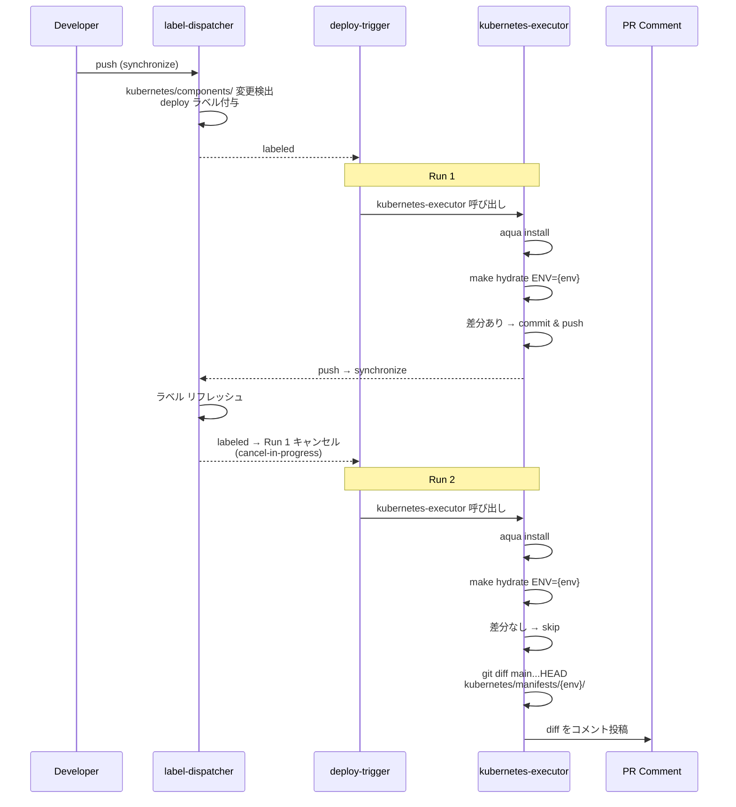
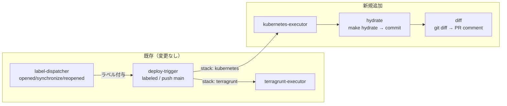

# Kubernetes Hydrate & Diff CI Pipeline

## Purpose

PR で `kubernetes/components/` が変更された際に、Helm テンプレートと Kustomize ビルドの結果（hydrate）を自動コミットし、`main` ブランチとのマニフェスト diff を PR コメントに投稿するパイプラインを構築する。

## Scope

- `reusable--kubernetes-executor.yaml` を新規作成し、hydrate + diff を実行する。
- 既存の `auto-label--deploy-trigger.yaml` に `deploy-kubernetes` job を追加する。
- `aqua.yaml` を新規作成し、helmfile / helm / kustomize のバージョンを管理する。
- ENV は matrix で回し、将来の環境追加（production, staging 等）に対応する。

## Out of Scope

- クラスタへの apply（FluxCD が担当）。
- `label-dispatcher` / `label-resolver` の変更（既に `workflow-config.yaml` に kubernetes stack が定義済み）。
- helmfile / kustomize 自体の変更。

## Architecture

### Event Flow



### Workflow Topology



### Re-trigger Safety

hydrate が commit & push すると `label-dispatcher` がラベルをリフレッシュし、`deploy-trigger` が再トリガーされる。以下の理由で無限ループにはならない:

1. `make hydrate` は冪等 — 2回目の実行では `manifests/` に差分が生じない
2. 差分がなければ commit & push しない — 再トリガーの原因がなくなる
3. `deploy-trigger` の `cancel-in-progress: true` により、Run 1 はキャンセルされ Run 2 で正しく完了する

## Documentation

ルートの `README.md` の Deployment セクションを更新する。

- **Stacks テーブル**: Kubernetes Platform の Tooling 列に hydrate + diff パイプラインの記述を追加
- **Pipeline Flow (mermaid)**: 現在 terragrunt のみの flowchart に kubernetes-executor の分岐を追加
- **GitOps Sync セクション**: hydrate が CI で自動実行され、diff が PR コメントに投稿される旨を追記

## File Changes

| 区分 | ファイル | 内容 |
|------|---------|------|
| 新規 | `aqua.yaml` | helmfile, helm, kustomize のバージョン定義 |
| 新規 | `.github/workflows/reusable--kubernetes-executor.yaml` | hydrate + diff の実行 |
| 変更 | `.github/workflows/auto-label--deploy-trigger.yaml` | `deploy-kubernetes` job 追加 |
| 変更 | `README.md` | Deployment セクションに kubernetes パイプラインを追加 |
| 変更なし | `workflow-config.yaml` | kubernetes convention 定義済み |
| 変更なし | `kubernetes/Makefile` | hydrate target そのまま利用 |

## New Files

### aqua.yaml

プロジェクトルートに配置。Renovate が aqua をサポートしているため、バージョン更新も自動化される。

```yaml
registries:
  - type: standard
    ref: v4.311.0 # renovate: github_release aquaproj/aqua-registry

packages:
  - name: helmfile/helmfile@v0.169.2
  - name: helm/helm@v3.17.3
  - name: kubernetes-sigs/kustomize@kustomize/v5.6.0
```

### reusable--kubernetes-executor.yaml

`deploy-trigger` から `workflow_call` で呼び出される reusable workflow。

**Inputs**:
- `environment` (string) — hydrate 対象の ENV（例: `k3d`）
- `app-id` (string) — GitHub App ID

**Secrets**:
- `private-key` — GitHub App private key

**Steps**:

1. **Generate GitHub App token** — `actions/create-github-app-token` で token 生成
2. **Checkout** — App token で checkout（push 権限のため）
3. **Setup aqua** — `aquaproj/aqua-installer` action でツールインストール
4. **Hydrate** — `make -C kubernetes hydrate ENV=${{ inputs.environment }}`
5. **Commit & push** — `kubernetes/manifests/{env}/` に差分があれば commit & push。差分がなければ skip
6. **Generate diff** — `git diff origin/main...HEAD -- kubernetes/manifests/${{ inputs.environment }}/` を実行
7. **Post PR comment** — diff 結果をファイル単位で折りたたみ可能な形式で PR コメントに投稿。既存コメントがあれば上書き

**Commit message format**: `chore(kubernetes/manifests/{env}): hydrate manifests`

**PR comment format**:

```markdown
## Kubernetes Manifests Diff ({environment})

<details>
<summary>cilium.yaml (+12, -3)</summary>

(diff)

</details>

<details>
<summary>prometheus-operator.yaml (+45, -12)</summary>

(diff)

</details>
```

- diff が空の場合は「変更なし」を表示
- 既存のコメントがあれば更新（`comment-id` で特定）

## Modified Files

### auto-label--deploy-trigger.yaml

追加する job:

```yaml
deploy-kubernetes:
  name: 'Deploy Kubernetes (${{ matrix.target.service }}:${{ matrix.target.environment }})'
  needs: deploy-trigger
  if: |
    needs.deploy-trigger.outputs.has-targets == 'true' &&
    contains(needs.deploy-trigger.outputs.targets, '"stack":"kubernetes"')
  strategy:
    matrix:
      target: ${{ fromJson(needs.deploy-trigger.outputs.targets) }}
      exclude:
        - target:
            stack: terragrunt
    fail-fast: false
  uses: ./.github/workflows/reusable--kubernetes-executor.yaml
  with:
    environment: ${{ matrix.target.environment }}
    app-id: ${{ vars.APP_ID }}
  secrets:
    private-key: ${{ secrets.APP_PRIVATE_KEY }}
```

`deployment-summary` job の `needs` に `deploy-kubernetes` を追加:

```yaml
deployment-summary:
  needs: [deploy-trigger, deploy-terragrunt, deploy-kubernetes]
```

## Testing

[nektos/act](https://github.com/nektos/act) を使ってローカルで GitHub Actions ワークフローを検証する。

### act によるローカルテスト

```bash
# reusable workflow の単体テスト
act workflow_call -W .github/workflows/reusable--kubernetes-executor.yaml \
  --input environment=k3d

# deploy-trigger の kubernetes job テスト
act pull_request -W .github/workflows/auto-label--deploy-trigger.yaml \
  -e test-event.json
```

- `act` を `aqua.yaml` に追加し、バージョンを管理する
- GitHub App token は act の `--secret-file` で注入する

### CI での検証（act で検証後）

- `kubernetes/components/` 内のファイル（例: `values.yaml`）を変更して PR を作成
- label-dispatcher がラベルを付与し、deploy-trigger が kubernetes-executor を呼び出すことを確認
- hydrate 結果が auto-commit されることを確認
- PR コメントに diff が投稿されることを確認
- 2回目の実行で hydrate が冪等（差分なし → commit なし → diff のみ実行）であることを確認
