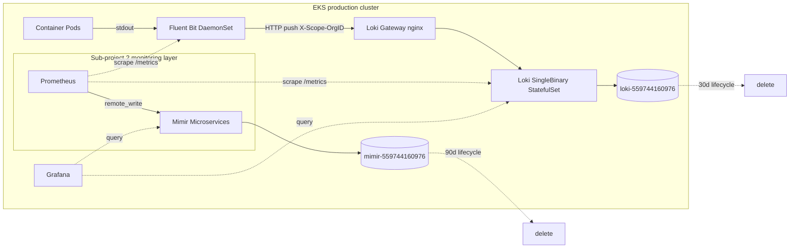

# EKS Production: Observability Logs Stack (Phase 3 Sub-project 3) Design Spec

**Status:** Draft (brainstorming 完了、user review 待ち)

**Goal:** panicboat EKS production cluster (`eks-production` / ap-northeast-1 / account 559744160976) に **logs collection + long-term S3 storage + Grafana 連携** の logs stack を deploy する。Sub-project 1 で provision 済の AWS infra (`loki-559744160976` bucket / `eks-production-loki` IAM role / `loki` Pod Identity SA) を活用し、Sub-project 2 で確立した monitoring namespace + ServiceMonitor pattern + Grafana datasource 統合 path に従う。

**Architecture summary:** `grafana-community/loki` v13.6.0 (SingleBinary mode、Loki 3.7.1) + `fluent/fluent-bit` v0.57.3 を `monitoring` namespace に deploy。Fluent Bit DaemonSet が container logs を tail → Loki Gateway 経由で SingleBinary に直接 push (= 中間状態、Sub-project 4 で OTel Collector 経由に switching)、Pod Identity 経由で S3 long-term storage。

**Tech Stack:** Helm + helmfile / `grafana-community/loki` v13.6.0 (Loki 3.7.1) / `fluent/fluent-bit` v0.57.3 (Fluent Bit 5.0.3) / EBS gp3 PVC / EKS Pod Identity / S3 backend (Sub-project 1 outputs)

---

## Architecture

### Sub-project 3 完了時 (中間状態)



- 実線 (`-->`): main data flow (stdout → Fluent Bit → Loki → S3)
- 点線 (`-.->`): sidecar/monitoring path (scrape, query, lifecycle)

### Sub-project 4 完了時 (最終形)

Sub-project 4 で OTel Collector が deploy された後、Fluent Bit → OTel Collector → Loki に switching (= `kubernetes/README.md` の architecture diagram と一致)。本 spec では中間状態のみ実装、switching は Sub-project 4 spec で扱う。

---

## Components

| Component | k8s kind | replicas | image / appVersion | resources (request) | PVC | SA / Pod Identity |
|---|---|---|---|---|---|---|
| **Fluent Bit** | DaemonSet | per node | `fluent/fluent-bit` v0.57.3 (Fluent Bit 5.0.3) | 100m CPU / 128Mi mem | — (stateless) | default (= K8s API + Loki HTTP のみ、AWS access 不要) |
| **Loki Gateway** | Deployment | 1 (PVC なし、Recreate 不要) | nginx (chart-managed) | 50m / 64Mi | — | default (= chart 内 routing のみ) |
| **Loki SingleBinary** | StatefulSet | 1 | `grafana-community/loki` v13.6.0 (Loki 3.7.1) | 500m / 1Gi (limit: 1 CPU / 2Gi) | **10Gi gp3** (WAL + boltdb-shipper local cache) | **`loki`** (Pod Identity → IAM role `eks-production-loki` → S3 `loki-559744160976`) |
| **ServiceMonitor (Loki)** | (subchart resource) | — | — | — | — | Prometheus が auto-scrape (Sub-project 2 確立 pattern) |
| **ServiceMonitor (Fluent Bit)** | (subchart resource) | — | — | — | — | 同上 |
| **Grafana datasource (Loki)** | ConfigMap entry | — | (existing Grafana) | — | — | `prometheus-operator/production/values.yaml.gotmpl` の `grafana.datasources.datasources.yaml` に追加 |

### Fluent Bit DaemonSet

- input: `tail /var/log/containers/*.log` (= 各 node の container logs)
- filter: `kubernetes` filter で k8s metadata を付与 + Decision 4 で確定した最小 labels (`namespace`, `pod`, `container`) のみ exposing、他は structured metadata
- output: `loki` HTTP output plugin で `http://loki-gateway.monitoring.svc.cluster.local/loki/api/v1/push` に push、header `X-Scope-OrgID: anonymous`
- AWS access 不要 (= Loki gateway 経由のみ、SA は default)
- retry buffer: filesystem-backed (= node disk 利用、長時間 outage 耐性確保、Decision 11 軽減策)

### Loki Gateway

- chart の subchart で nginx を deploy する設計 (`grafana-community/loki` v13.6.0 の標準)
- HTTP entry point、SingleBinary StatefulSet headless service に upstream
- chart 内蔵で values の `gateway.enabled: true` (default) のみ確認

### Loki SingleBinary

- chart values で `deploymentMode: SingleBinary` (= chart 内蔵の SingleBinary section enable)
- Storage: `loki.storage.type: s3` + `loki.storage.s3.{bucketnames, region, s3forcepathstyle}` = `loki-559744160976` / `ap-northeast-1`
- Schema config: TSDB schema (= Loki 3.x recommended、boltdb-shipper の後継)
- PVC: `singleBinary.persistence.enabled: true` + `storageClass: gp3` + `size: 10Gi`
- Pod Identity: `serviceAccount.name: loki` (= aws/eks-logs/ で provision 済 Association)
- StatefulSet: `singleBinary.replicas: 1` (= small production)
- WAL flush 間隔: 1-2 min (= Decision 11 軽減策、AZ 障害時のロスト window 縮小)

---

## Data flow

### Main flow (logs ingestion path)

```
[Step 1]  container stdout/stderr
              ↓ (containerd writes)
[Step 2]  /var/log/containers/<pod>_<ns>_<container>-<id>.log  (node disk)
              ↓ (Fluent Bit tail input + position file)
[Step 3]  Fluent Bit DaemonSet (per node)
              ↓ kubernetes filter: k8s metadata 付与 + 最小 labels exposing
              ↓ HTTP POST (X-Scope-OrgID: anonymous)
[Step 4]  loki-gateway.monitoring.svc.cluster.local/loki/api/v1/push
              ↓ HTTP forward (nginx reverse proxy)
[Step 5]  Loki SingleBinary (StatefulSet)
              ↓ distributor → ingester (in-process)
              ↓ ingester: WAL に write (PVC, gp3 10Gi) + memory chunk 構築
              ↓ flush 間隔 (1-2 min) で
[Step 6]  S3 (loki-559744160976/production/<chunks>)
```

### Side flows

**Prometheus self-monitoring** (Sub-project 2 既存 ServiceMonitor pattern):
```
Prometheus -.scrape.→ Loki:3100/metrics      (= loki_ingester_memory_streams 等)
Prometheus -.scrape.→ Fluent Bit:2020/metrics (= fluentbit_input_records_total 等)
Prometheus → remote_write → Mimir → S3 (mimir-559744160976)
```

**Grafana query** (visualization):
```
Grafana --query→ Loki Gateway → SingleBinary (in-memory + S3 chunks)
Grafana --query→ Mimir (existing)
```

### Failure modes

| 失敗箇所 | 保護機構 | 結果 |
|---|---|---|
| **Step 1-2**: containerd log rotation | Fluent Bit tail position file (`/var/log/flb_storage/`) | 再起動後 resume、ロストなし |
| **Step 3**: Fluent Bit Pod crash | DaemonSet が同 node で auto-restart (= position file 同 hostPath) | 再起動後 resume、ロストなし |
| **Step 4**: Loki Gateway crash | Gateway は stateless (replicas=1)、自動再起動 | 数秒の outage、Fluent Bit retry buffer に保持 |
| **Step 5a**: SingleBinary crash + PVC 健在 | StatefulSet 自動再起動、WAL replay | 未 flush data も保持、ロストなし |
| **Step 5b**: SingleBinary 長時間 outage (~数十分) | Fluent Bit retry buffer (filesystem-backed) | retry 容量超過で **drop** ⚠️ |
| **Step 5c**: PVC 損失 (AZ 障害) | (なし) | 未 flush data ロスト ⚠️ (= 数分分) |
| **Step 6**: S3 一時 outage | Loki ingester が retry、WAL に保持し続ける | S3 復旧後 flush、ロストなし |

通常運用では Step 5a / Step 1-4 で auto-recovery、ロストなし。例外シナリオ (5b / 5c) は許容判断 (Decision 11 で reversibility 確保)。

### Cardinality 制御 (Decision 4)

Fluent Bit Kubernetes filter で k8s metadata を 2 種類に分類:

| 種類 | 例 | Loki 側の取扱い |
|---|---|---|
| **Labels (low cardinality)** | `namespace`, `pod`, `container` | Loki index に登録、query で `{namespace="..."}` 高速 filter |
| **Structured metadata (no cardinality cost)** | 全 k8s labels (`app.kubernetes.io/*`), annotations, node, log_level | Loki が chunks の per-entry metadata として保存、query 時 `\| label_format` 等で filter |

---

## AWS infra

### Sub-project 3 では AWS-side 変更なし

aws/eks-logs/ stack は **Sub-project 1 (PR #283) で provision 完了済**。Sub-project 2 (Mimir) と異なり rename は不要 (= 元々 `loki-` 命名で確定済)。

### 利用する既存リソース

| Resource | Identifier | 用途 |
|---|---|---|
| S3 bucket | `loki-559744160976` (ap-northeast-1) | Loki chunks long-term storage |
| S3 lifecycle | 30d retention | Loki log chunks auto-delete |
| S3 SSE | AES256 (SSE-S3) | bucket-level rest encryption |
| S3 versioning | Disabled | logs immutable + 30d auto-delete |
| IAM role | `eks-production-loki` (ARN: `arn:aws:iam::559744160976:role/eks-production-loki`) | Pod Identity 用 |
| IAM policy (3 statement) | BucketLevelListing (s3:prefix=production) / BucketLocation / ObjectLevelOperations | Sub-project 1 L1 で正規化された 3-statement structure |
| Pod Identity Association | `monitoring/loki` SA → `eks-production-loki` IAM role | EKS Pod Identity (cluster-side managed) |

### Cross-stack reference flow

```
aws/eks-logs/envs/production (terragrunt)
  ↓ outputs: bucket_name / bucket_path_prefix / pod_identity_role_name
kubernetes/helmfile.yaml.gotmpl (production env values block)
  ↓ Plan 1c-β L4 pattern (placeholder 不採用、直接実値書き)
kubernetes/components/loki/production/{helmfile.yaml, values.yaml.gotmpl}
  ↓ helmfile v1.x cross-helmfile values 制約で 2 箇所 transcribe
helm template / Loki values:
  - serviceAccount.name: loki
  - loki.storage.s3.bucketnames: loki-559744160976
  - loki.storage.s3.region: ap-northeast-1
  - loki.storage.s3.s3forcepathstyle: false
  - common: storage_prefix: "production"  (= Sub-project 2 L8 適用、slash 不要)
```

---

## Decisions

### Decision 1: Logs flow path = 中間状態で start、最終形は Sub-project 4 で

- **採用**: Fluent Bit → Loki 直接 push (= Sub-project 3 完了時の中間状態)
- **理由**: Sub-project 3 単独完結 + early observability + Sub-project 4 待たずに deploy 可能
- **将来 path**: Sub-project 4 で OTel Collector deploy 後に Fluent Bit → OTel Collector → Loki に switching、`kubernetes/README.md` の architecture diagram の最終形と一致
- **不採用**: 「local 踏襲で OTel Collector 経由」(= Sub-project 4 完了まで logs 流れない)

### Decision 2: Loki deployment mode = SingleBinary

- **採用**: SingleBinary (= Loki 公式 docs `Monolithic`)
- **理由**: panicboat は small production = Loki 公式の SingleBinary 推奨範囲、9 Pod Microservices は over-engineering、リソース効率最良
- **HA upgrade path**: 必要になったら SimpleScalable (= 3 deploy + replication_factor=3 + multi-AZ) に migration、chart の同 values で mode 切替可能
- **不採用**: SimpleScalable / Distributed (= 現時点で over-engineering)

### Decision 3: tenancy + retention + auth = anonymous + 30d + disabled (Mimir 対称)

- **採用**: tenant=`anonymous` (1 tenant) / retention=30d / auth_enabled=false / header `X-Scope-OrgID: anonymous`
- **理由**: panicboat 1 tenant 運用、aws/eks-logs/ S3 lifecycle 30d と整合、Mimir (Sub-project 2) と対称
- **trade-off**: 30d 以前のログは S3 lifecycle で auto-delete = recovery 不可、application audit log 用途には別途長期保存が必要 (= 本 sub-project 範囲外)

### Decision 4: log labels = 最小 (Q4) + reversibility 明示

- **採用**: labels = `namespace`, `pod`, `container` (3 labels) + structured metadata で他の k8s 情報を保持
- **理由**: Loki 公式 "Fewer labels is better"、cardinality 安全、検索性は structured metadata + LogQL filter で確保
- **reversibility**:
  - A → C (label 拡張) 移行は **forward / low cost** (Fluent Bit values の minor edit、既存 LogQL は後方互換)
  - C → A (label 削減) 移行は **backward / high cost** (LogQL クエリ書き換え + Grafana dashboard 再設計)
  - **A から start するのが conservative**
- **移行 trigger**: 実装段階で Loki self-metrics (`loki_ingester_memory_streams`, `loki_request_duration_seconds`) を ServiceMonitor で expose、移行判断データを蓄積

### Decision 5: chart = grafana-community/loki v13.6.0 (organizational migration)

- **採用**: `grafana-community/loki` v13.6.0 (Loki 3.7.1)
- **理由**: 2026/3/16 に grafana/loki chart が GEL only に分離、OSS continuation は grafana-community が maintenance、最新 active version
- **不採用**:
  - `grafana/loki` v7.0.0+ (= GEL only、OSS panicboat は使用すべきでない、license 観点)
  - `grafana/loki` v6.55.0 (= deprecated path、新 features 停止)
  - bitnami/grafana-mimir 系 (= Sub-project 2 brainstorming で有償化懸念により除外済)

### Decision 6: local migration = Sub-project 3 のスコープに含める

- **採用**: production と並行で local の `grafana/loki` v7.0.0 → `grafana-community/loki` v13.6.0 へ migration
- **理由**: license 問題解消 (= GEL only chart の OSS 利用回避)、local / production 構成統一
- **不採用**: 「local 放置 + production のみ移行」(= 構成乖離が永続化)
- **scope**: Loki chart 切替のみ、Fluent Bit は **touched しない** (local は既存設計 = Fluent Bit → OTel Collector → Loki = README.md 最終形を維持)

### Decision 7: Fluent Bit chart = fluent/fluent-bit v0.57.3

- **採用**: `fluent/fluent-bit` v0.57.3 (Fluent Bit 5.0.3) = local 揃い、最新と一致
- **理由**: Fluent project は CNCF graduated、active maintenance、organizational change 無し

### Decision 8: Fluent Bit Pod Identity 不要

- **採用**: Fluent Bit は default SA (= Pod Identity 設定なし)
- **理由**: Loki Gateway への HTTP push のみ、AWS 直接アクセス無し
- **trade-off**: 将来 Fluent Bit が S3 直接 output (= aws_s3 plugin) を使う設計に変えた場合は Pod Identity が必要、その時点で aws/eks-logs/ で `fluent-bit` SA 用 Association を追加 + chart values 修正

### Decision 9: ServiceMonitor + Grafana datasource = Sub-project 2 と同形

- **採用**:
  - Loki: `monitoring.serviceMonitor.enabled: true` (chart 内蔵設定)
  - Fluent Bit: `serviceMonitor.enabled: true` (chart 内蔵設定)
  - Grafana datasource: `kubernetes/components/prometheus-operator/production/values.yaml.gotmpl` の `grafana.datasources.datasources.yaml.datasources` に Loki entry 追加
- **理由**: Sub-project 2 で確立した kube-prometheus-stack auto-scrape pattern を踏襲、新 chart や別 mechanism 不要

### Decision 10: Grafana datasource default = Mimir 維持

- **採用**: Mimir = `isDefault: true` (Sub-project 2 既存)、Loki = `isDefault: false` (= 追加)
- **理由**: Grafana の Explore / Dashboard で datasource 指定なしの場合は Mimir (metrics) が default、Loki は明示指定 (= Logs query は Explore で datasource 切替が直感的)
- **不採用**: Loki を default 化 (= metrics query が壊れる)

### Decision 11: HA upgrade path 明示

- **採用**: 1 replica SingleBinary で start、必要なら SimpleScalable + multi-AZ + replication_factor=3 に upgrade
- **trigger**:
  - Loki Pod 長時間 outage で Fluent Bit retry buffer 容量超過の事象を観測
  - AZ 障害で未 flush data ロスト発生
  - log volume が SingleBinary 1 replica の処理能力 (~20 GB/day) を超える
- **mitigation 軽減策** (Sub-project 3 内で実施):
  - WAL flush 間隔を 1-2 min に設定 (AZ 障害時のロスト window 縮小)
  - Fluent Bit retry buffer を filesystem-backed に設定 (= node disk 利用、長時間 outage 耐性 up)

### Decision 12: Mimir Microservices との非対称性 = 意図的

- **採用**: Sub-project 2 (Mimir) は Microservices 9 Pod、Sub-project 3 (Loki) は SingleBinary 1-2 Pod
- **理由**: 両 chart の official position に従った結果
  - Loki 公式: SingleBinary が small/medium production OK
  - Mimir 公式: production には Microservices 推奨 (chart 事情も含む = `grafana/mimir-distributed` chart は Microservices 専用)
- **note**: Mimir Microservices の over-engineering retrospective は **Sub-project 2.5 として別途保留** (今回の Sub-project 3 brainstorming 中に発見、ただし scope creep 回避のため別 sub-project)、Mimir docs の正確な position は memory file `mimir-mode-knowledge.md` を参照

---

## Test plan (= Sub-project 2 L4 learnings 適用、pre-flight / post-flight 分割)

### Pre-flight check (= PR draft 中に完了 → Ready for review への gate)

| # | check | コマンド / 確認方法 | expected |
|---|---|---|---|
| 1 | aws/eks-logs/ resource 存在 | `cd aws/eks-logs/envs/production && terragrunt state list` | 8 resources (S3 bucket + 5 sub-resources + IAM role + Pod Identity Association) |
| 2 | S3 bucket 存在 (base role) | `aws s3api head-bucket --bucket loki-559744160976` | 200 OK |
| 3 | Pod Identity Association | `aws eks list-pod-identity-associations --cluster-name eks-production --query 'associations[?serviceAccount==\`loki\`]'` | 1 association |
| 4 | gp3 StorageClass | `kubectl get storageclass gp3` | provisioner=`ebs.csi.aws.com` (Sub-project 2 で provision 済再利用) |
| 5 | monitoring namespace + Sub-project 2 stack 稼働 | `kubectl get pods -n monitoring \| grep -E "prometheus\|alertmanager\|grafana\|mimir"` | 全 Running |
| 6 | local cluster (k3d) で migration 成功 | `make phase3` → `kubectl get pods -n monitoring \| grep -E "loki\|fluent-bit"` | local で `grafana-community/loki` v13.6.0 + `fluent/fluent-bit` v0.57.3 deploy 成功 + logs が Loki に流れる |

PR description にチェック必須:
```
## Pre-flight check
- [x] aws/eks-logs/ terragrunt state 8 resources confirmed
- [x] S3 bucket loki-559744160976 head-bucket 200 OK
- [x] Pod Identity Association monitoring/loki exists
- [x] gp3 StorageClass exists
- [x] Sub-project 2 stack all Running
- [x] local migration verified on k3d
```

### Post-flight check (= merge 後の Flux 反映後 verify)

| # | check | コマンド | expected |
|---|---|---|---|
| 1 | Pod 全件 Ready | `kubectl get pods -n monitoring -l app.kubernetes.io/instance=loki` | Loki SingleBinary `1/1`、Loki Gateway `1/1` Running |
| 2 | Fluent Bit DaemonSet | `kubectl get pods -n monitoring -l app.kubernetes.io/name=fluent-bit -o wide` | 全 node で 1/1 Running |
| 3 | PVC bound | `kubectl get pvc -n monitoring storage-loki-0` | Bound, gp3 10Gi |
| 4 | Pod Identity injection | `kubectl get pod -n monitoring loki-0 -o jsonpath='{.spec.containers[0].env[*].name}'` | `AWS_CONTAINER_CREDENTIALS_FULL_URI` 含む |
| 5 | Loki API ready | `kubectl exec -n monitoring deploy/loki-gateway -- wget -qO- http://localhost/ready` | `ready` |
| 6 | ServiceMonitor scrape (Prometheus) | Prometheus UI: `Status → Targets` | `loki` / `fluent-bit` targets が UP |
| 7 | Self-metrics → Mimir | Grafana で `loki_ingester_memory_streams` query | 数値が返る (= Mimir に remote_write 成功) |
| 8 | Fluent Bit → Loki data flow | `kubectl logs -n monitoring -l app.kubernetes.io/name=fluent-bit \| grep loki` | output success log |
| 9 | Loki labels API | `kubectl exec -n monitoring deploy/loki-gateway -- curl -s -H 'X-Scope-OrgID: anonymous' http://localhost/loki/api/v1/labels` | `["namespace","pod","container",...]` |
| 10 | S3 chunks flush (~10 min 後) | base role で `aws s3 ls s3://loki-559744160976/production/` | chunks 出現 |
| 11 | Grafana Loki datasource | Grafana UI: `Connections → Data sources → Loki` | `Save & test` で 緑 |
| 12 | Grafana Explore で logs query | `{namespace="monitoring"}` | logs 表示 |
| 13 | Sub-project 2 regression なし | `kubectl get pods -n monitoring \| grep -v loki \| grep -v fluent-bit` | Mimir / Prometheus / Alertmanager / Grafana 全 Running、Mimir gateway `/ready` OK |

### Concrete success criteria (= Sub-project 2 L8 learnings 適用)

> **merge 後 10 分以内** に以下を達成:
> - Loki SingleBinary `1/1 Running`
> - Loki Gateway `1/1 Running`
> - Fluent Bit DaemonSet が全 node で `1/1 Running`
> - PVC `storage-loki-0` Bound
> - Prometheus targets で `loki` / `fluent-bit` が `UP`
>
> **merge 後 30 分以内** に:
> - S3 (`loki-559744160976/production/`) に chunks 出現
> - Grafana Explore で `{namespace="monitoring"}` query が logs を返す

### Deploy 方針 (= 通常 deploy)

Sub-project 3 は initial deploy のみ + cross-stack 影響が小さいため、**通常 deploy (= merge → Flux 自動反映)** で進める。L5 (Flux suspend pattern) は **問題発見時のみ reactive 発動**。

理由:
- Sub-project 2 で 5 root causes のリスクは Sub-project 3 では大半が catch 可能 (gp3 既存、Multi-Attach は SingleBinary StatefulSet なので発生しない、chart 互換性は local pre-flight で確認)
- L4 pre-flight check + post-flight check で safety を担保

### Rollback 手順 (想定外障害時、= Sub-project 2 L5 Flux suspend pattern)

```bash
# 1. Flux suspend
flux suspend kustomization flux-system

# 2. K8s-side rollback (manifest delete or revert PR)
kubectl delete -k kubernetes/manifests/production/loki/
kubectl delete -k kubernetes/manifests/production/fluent-bit/

# 3. Sub-project 2 stack への影響なきこと確認
kubectl get pods -n monitoring | grep -v loki | grep -v fluent-bit

# 4. PR revert (= main revert commit)
gh pr create --title "revert: Phase 3 Sub-project 3 (Logs stack)" ...

# 5. revert merge 後に Flux resume
flux reconcile source git flux-system
flux resume kustomization flux-system
```

aws/eks-logs/ は Sub-project 1 で provision 済 = **AWS-side rollback 不要**。

---

## File structure

### 新規作成 (production env)

```
kubernetes/components/loki/production/
├── helmfile.yaml              # chart: grafana-community/loki v13.6.0 (Loki 3.7.1)
└── values.yaml.gotmpl         # SingleBinary mode + S3 backend + Pod Identity (loki SA)

kubernetes/components/fluent-bit/production/
├── helmfile.yaml              # chart: fluent/fluent-bit v0.57.3 (Fluent Bit 5.0.3)
└── values.yaml.gotmpl         # tail input + Kubernetes filter + Loki HTTP output (直接 push)
```

### 新規生成 (hydrate 結果、auto-generated)

```
kubernetes/manifests/production/loki/
├── kustomization.yaml         # resources: manifest.yaml
└── manifest.yaml              # helmfile template 結果

kubernetes/manifests/production/fluent-bit/
├── kustomization.yaml         # resources: manifest.yaml
└── manifest.yaml              # helmfile template 結果
```

### 変更 (production env)

```
kubernetes/helmfile.yaml.gotmpl
└── production env values block に追加:
    loki:
      bucketName: loki-559744160976
      bucketPathPrefix: production
      podIdentityRoleName: eks-production-loki

kubernetes/components/prometheus-operator/production/values.yaml.gotmpl
└── grafana.datasources.datasources.yaml.datasources に Loki entry 追加 (Mimir / Prometheus と並列)

kubernetes/manifests/production/kustomization.yaml
└── resources に追加:
    - ./fluent-bit
    - ./loki
```

### 変更 (local env、Decision 6: local migration)

```
kubernetes/components/loki/local/helmfile.yaml
└── chart: grafana/loki → grafana-community/loki, version: 7.0.0 → 13.6.0

kubernetes/components/loki/local/values.yaml
└── chart schema 変更分の修正 (deploymentMode: SingleBinary は維持、storage 設定等の compat 確認)

kubernetes/manifests/local/loki/manifest.yaml
└── auto-generated re-hydrate
```

local の **Fluent Bit は touched しない**: local は既存設計 (= Fluent Bit → OTel Collector → Loki = README.md 最終形と一致) を維持、Decision 1 で確定した production の中間状態 (= Fluent Bit → Loki 直接) は production env のみ適用。Sub-project 4 で OTel Collector が production に deploy された後、production も最終形に switching。

### 変更しないファイル

- **AWS-side**: aws/eks-logs/* は touched なし (Sub-project 1 で provision 完了済)
- **kubernetes/README.md**: Sub-project 3 では update しない (= architecture diagram は最終形を維持、Sub-project 4 で OTel deploy 完了時に Logs path も最終形に揃ったことを確認)
- **kubernetes/components/prometheus-operator/local/**: Sub-project 2 で touched 済、Sub-project 3 では追加変更なし

---

## Sub-project 2 learnings の適用サマリ

| Sub-project 2 learnings | 本 sub-project での適用 |
|---|---|
| **L1 (chart upgrade での upstream changelog 確認)** | Decision 5 で `grafana/loki` v7.0.0 → `grafana-community/loki` への organizational migration を発見、適切な OSS chart に切替 |
| **L2 (chart auto-generated ConfigMap と values override の衝突)** | Decision 9 で kube-prometheus-stack の Grafana datasource 設定 (Sub-project 2 で `defaultDatasourceEnabled: false` 設定済) を継続、新たな衝突は発生しない |
| **L3 (EBS RWO + RollingUpdate → Recreate)** | Loki SingleBinary は StatefulSet (OrderedReady で問題回避)、Loki Gateway は Deployment + PVC なし、新規 Recreate 設定不要 |
| **L4 (Spec verification を pre-flight / post-flight 分割)** | Test plan section で明示分離、PR description チェックリスト形式 |
| **L5 (Flux suspend pattern)** | Rollback 手順に明示、通常 deploy では reactive 発動 |
| **L6 (gp3 StorageClass)** | Sub-project 2 で provision 済 → 再利用、本 sub-project では作らない |
| **L7 (Pod Identity webhook injection は Pod 作成時のみ)** | 新規 deploy のため初回起動時に正しく injection、Mimir のような rename force-delete シナリオは発生しない |
| **L8 (storage_prefix 英数字制約)** | Loki でも `production` (slash なし) を採用、Mimir 同様の挙動を予防 |

---

## Sub-project 1 / 2 の knowledge の継承

- **Sub-project 1 L1 (IAM policy 3 statement)**: aws/eks-logs/ は Sub-project 1 で正規化済、本 sub-project では IAM 触らない
- **Plan 1c-β L4 (REPLACE_FROM_TERRAGRUNT_OUTPUT 不要)**: kubernetes/helmfile.yaml.gotmpl に直接実値書き、placeholder pattern 不採用
- **Plan tuning L1 (IAM name_prefix 38 chars limit)**: 本 sub-project は IAM 触らないため non-applicable
