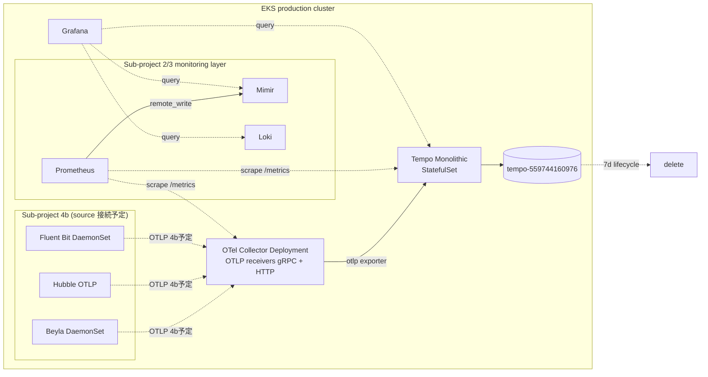

# EKS Production: Observability Traces Stack Foundation (Phase 3 Sub-project 4a) Design Spec

**Status:** Draft (brainstorming 完了、user review 待ち)

**Goal:** panicboat EKS production cluster (`eks-production` / ap-northeast-1 / account 559744160976) に **traces collection 基盤** を deploy する。Sub-project 1 で provision 済の AWS infra (`tempo-559744160976` bucket / `eks-production-tempo` IAM role / `tempo` Pod Identity SA) + Sub-project 3 fix で適用済の bucket-wide IAM を活用、Sub-project 2 / 3 で確立した monitoring namespace + ServiceMonitor pattern + Grafana datasource 統合 path に従う。本 sub-project (= 4a) 完了時は **traces pipeline 基盤** が ready、Sub-project 4b で sources (Beyla / Hubble / Fluent Bit) を接続して data flow を成立させる。

**Architecture summary:** `grafana/tempo` v1.24.4 (Monolithic mode、Tempo 2.9.0) を deploy + `opentelemetry/opentelemetry-collector` v0.153.0 を Deployment mode で deploy。OTel Collector は OTLP receivers (gRPC + HTTP) + Tempo exporter のみの **traces pipeline** を 4a で完成、metrics / logs pipelines は 4b で追加。Pod Identity 経由で S3 long-term storage、Grafana datasource に Tempo を追加。

**Tech Stack:** Helm + helmfile / `grafana/tempo` v1.24.4 (Tempo 2.9.0) / `opentelemetry/opentelemetry-collector` v0.153.0 (otel-collector-contrib 0.151.0) / EBS gp3 PVC / EKS Pod Identity / S3 backend (Sub-project 1 outputs)

---

## Architecture

### Sub-project 4a 完了時 (= traces pipeline 基盤 ready、source 未接続)



- 実線 (`-->`): 4a で deploy + active な path (Tempo へ traces 書き込み path、4b 後に実 traces が流れる)
- 点線 (`-.->`): 4b で接続予定 / monitoring scrape (= HTTP request 方向、actual data flow は逆) / Grafana query / lifecycle

### Sub-project 4b 完了時 (= 最終形、kubernetes/README.md と一致)

OTel Collector に metrics / logs pipelines を追加 + source 3 系 (Beyla / Hubble / Fluent Bit) を接続して data flow 成立。これは Sub-project 4b で別途 brainstorming する。本 spec では touched しない。

### Sub-project 2 / 3 との pattern 整合 + 3 stack 一貫 pattern 確立

| 観点 | Mimir | Loki | Tempo |
|---|---|---|---|
| chart | grafana/mimir-distributed | grafana-community/loki | grafana/tempo |
| deployment mode | Microservices | SingleBinary (Monolithic) | Monolithic |
| application retention | OFF (chart default) | `retention_enabled: false` (明示) | OFF (chart default) |
| S3 lifecycle | 90d | 30d | 7d |
| IAM Resource | bucket-wide | bucket-wide | bucket-wide |
| application-level env scope | `storage_prefix: production` | `schemaConfig.index.prefix: production_index_` | `s3.prefix: production` |
| tenancy | 1 tenant | 1 tenant | 1 tenant (`multitenancy_enabled: false`) |
| ServiceMonitor | enabled | enabled | enabled |
| Grafana datasource | default | non-default | non-default |

**Sub-project 4a 完了時点で 3 stack 一貫 pattern が完全に揃う** (= panicboat の observability backend 設計が確立)。

---

## Components

### Component table

| Component | k8s kind | replicas | image / chart version | resources (request → limit) | PVC | SA / Pod Identity |
|---|---|---|---|---|---|---|
| **Tempo Monolithic** | StatefulSet | 1 | `grafana/tempo` v1.24.4 (Tempo 2.9.0) | 200m CPU / 512Mi → 1 CPU / 2Gi | **10Gi gp3** (WAL + 短期 compactor cache) | **`tempo`** (Pod Identity → IAM role `eks-production-tempo` → S3 `tempo-559744160976`) |
| **OTel Collector** | Deployment | 1 (PVC なし、Recreate 不要) | `opentelemetry/opentelemetry-collector` v0.153.0 (= contrib 0.151.0) | 100m / 256Mi → 500m / 1Gi | — (stateless) | default (= AWS access 不要、4a では Tempo に gRPC export のみ) |
| **ServiceMonitor (Tempo)** | (subchart) | — | — | — | — | Prometheus が auto-scrape (Sub-project 2 確立 pattern) |
| **ServiceMonitor (OTel Collector)** | (subchart) | — | — | — | — | 同上 (= self-metrics scrape) |
| **Grafana datasource (Tempo)** | ConfigMap entry | — | (existing Grafana) | — | — | `prometheus-operator/production/values.yaml.gotmpl` の `grafana.datasources.datasources.yaml` に追加 |

### Tempo Monolithic

- chart values で `tempo.storage.trace.backend: s3` + `s3.{bucket: tempo-559744160976, region: ap-northeast-1, prefix: production}`
- `multitenancy_enabled: false` (= 1 tenant 運用)
- Pod Identity: `serviceAccount.name: tempo`
- StatefulSet `replicas: 1` (= small production)
- PVC: WAL + 短期 compactor cache (Pod 起動時のロスト window 縮小、Sub-project 3 L11 と同思想)
- application-level retention: **設定しない** (= chart default に任せる、3 stack 一貫 pattern、Decision 5)

### OTel Collector (4a 範囲)

- chart values で `mode: deployment` + `replicas: 1`
- image: `otel/opentelemetry-collector-contrib:0.151.0` (= local 踏襲、k8sattributes processor 等の拡張機能を 4b で利用)
- config:
  - **receivers**: OTLP gRPC (`:4317`) + HTTP (`:4318`) を expose (= 4b で source 接続用)
  - **processors**: `batch` + `memory_limiter` (= 標準 hygiene)
  - **exporters**: **otlp/tempo** のみ (= traces を Tempo に export)
  - **service.pipelines.traces**: 上記 receivers / processors / exporters を wire
  - metrics / logs pipeline は **4b で追加** (Decision 11)

### Sub-project 3 learnings 適用

| Sub-project 3 learnings | 本 sub-project での適用 |
|---|---|
| L1 (chart 内部固定 path 問題) | Tempo は `s3.prefix` で全 path 制御可能、Loki のような問題なし |
| L2 (IAM 公式準拠) | Sub-project 3 fix で 3 stack 同型済 → そのまま利用、Tempo は `s3.prefix: production` で application-level env scope |
| **L3 (chart probe 確認)** | **実装段階** で Tempo / OTel Collector の chart default readinessProbe / livenessProbe を精査、`Retry_Limit` 等の application policy と矛盾しないか確認 |
| L4 (S3 lifecycle で uniform 担保) | application retention 設定なし、S3 lifecycle 7d で担保 |
| L5 (Flux suspend pattern) | Rollback 手順として明示記録 |
| L6 (gp3 StorageClass) | Sub-project 2 で provision 済再利用 |
| L7 (Pod Identity webhook injection) | 新規 deploy のため初回起動時に正しく injection |
| L9 (公式 docs 引用) | Tempo 公式 ([S3 configuration](https://grafana.com/docs/tempo/latest/configuration/s3/)) と整合確認済 |

---

## Data flow

### Sub-project 4a 完了時 (= 基盤 ready、source 未接続)

```
[STEP 1]  (4b で接続予定: Beyla / Hubble / Fluent Bit から OTLP push)
              ↓ OTLP gRPC :4317 / HTTP :4318
[STEP 2]  OTel Collector Deployment
            │ receivers: otlp { protocols: { grpc, http } }
            │ processors: batch + memory_limiter
            ▼ exporters: otlp/tempo
[STEP 3]  Tempo Monolithic StatefulSet (= distributor + ingester + querier + compactor 一体)
            │ ingester: WAL に write (PVC, gp3 10Gi) + memory chunk 構築
            ▼ flush 間隔で
[STEP 4]  S3 (tempo-559744160976/production/<traces>)
```

**4a 完了時点では Step 1 (source) が無いため、Step 2-4 は空動作** (= receivers が listen、Tempo は idle)。動作 verification は **4b で source 接続後** に実 traces が流れるかで判定。ただし 4a で **OTel Collector → Tempo の internal connectivity** は確認可能 (= OTel Collector logs で Tempo gRPC connection が established)。

### Side flows (4a で active)

**Prometheus self-monitoring** (Sub-project 2 / 3 と同 pattern):
```
Prometheus -.scrape.→ Tempo:3200/metrics       (= tempo_distributor_spans_received_total 等)
Prometheus -.scrape.→ OTel Collector:8888/metrics (= otelcol_receiver_accepted_spans 等、self-metrics)
Prometheus → remote_write → Mimir → S3 (mimir-559744160976)
```

**注**: "scrape" の矢印方向は HTTP request の方向 (= Prometheus → OTel Collector に GET /metrics)、actual data flow (= metrics 値の動き) は逆方向。Sub-project 2 / 3 と同じく、kube-prometheus-stack auto-scrape pattern を踏襲。

**Grafana query** (4a で datasource 追加):
```
Grafana --query→ Tempo:3200/api (TraceQL) → Tempo Monolithic (in-memory + S3 chunks)
```

4a 完了時は **traces data 不在のため Grafana で trace query しても empty result**。

### Failure modes (4a 範囲)

| 失敗箇所 | 4a での影響 | 保護機構 / 復旧 |
|---|---|---|
| OTel Collector Pod crash | 単一 SPOF だが 4a では source 未接続のため影響なし | Deployment が auto-restart (~数秒) |
| Tempo Monolithic crash + PVC 健在 | StatefulSet 自動再起動、WAL replay | 未 flush traces (4b 後) 保持、ロストなし |
| Tempo S3 access fail (IAM/Pod Identity 問題) | Tempo `/ready` が 503 を返す可能性 | Sub-project 3 fix で IAM bucket-wide で integration 確認済 |
| PVC 損失 (AZ 障害) | 新 PVC 作成、WAL 失われる、未 flush traces ロスト (4b 後) | 4a では source 未接続のため影響軽微 |

### 4b で実装される内容 (= 参考)

- OTel Collector に **metrics + logs pipelines 追加** (= Hubble / Beyla / Fluent Bit からの receive を route)
- **Beyla** から OTLP traces / metrics push
- **Hubble** から OTLP network traces push (Cilium values 修正)
- **Fluent Bit** OUTPUT を Loki 直接 → OTel Collector OTLP に switching、OTel Collector で `loki` exporter で Loki に書き戻し

---

## AWS infra

### Sub-project 4a では AWS-side 変更なし

aws/eks-traces/ stack は **Sub-project 1 (PR #283) で provision 完了済** + Sub-project 3 fix (PR #292) で **IAM policy が bucket-wide に拡張済** (= 3 stack 同型)。Tempo 採用に必要な resource は既に揃っている。

### 利用する既存リソース

| Resource | Identifier | 用途 |
|---|---|---|
| S3 bucket | `tempo-559744160976` (ap-northeast-1) | Tempo traces long-term storage |
| S3 lifecycle | **7d retention** (= traces high-volume / short-lived debugging data) | application retention は OFF、S3 lifecycle で uniform 担保 |
| S3 SSE | AES256 (SSE-S3) | bucket-level rest encryption |
| S3 versioning | Disabled | traces immutable + 7d auto-delete |
| IAM role | `eks-production-tempo` (ARN: `arn:aws:iam::559744160976:role/eks-production-tempo`) | Pod Identity 用 |
| IAM policy (3 statement) | BucketLevelListing / BucketLocation / ObjectLevelOperations (= **bucket-wide** Resource、Sub-project 3 fix で 3 stack 同型化済) | env scope は application-level prefix で担保 (Sub-project 3 L2) |
| Pod Identity Association | `monitoring/tempo` SA → `eks-production-tempo` IAM role | EKS Pod Identity (cluster-side managed) |

### Cross-stack reference flow

```
aws/eks-traces/envs/production (terragrunt)
  ↓ outputs: bucket_name / bucket_path_prefix / pod_identity_role_name
kubernetes/helmfile.yaml.gotmpl (production env values block)
  ↓ Plan 1c-β L4 pattern (placeholder 不採用、直接実値書き)
kubernetes/components/tempo/production/{helmfile.yaml, values.yaml.gotmpl}
  ↓ helmfile v1.x cross-helmfile values 制約で 2 箇所 transcribe
helm template / Tempo values:
  - serviceAccount.name: tempo
  - tempo.storage.trace.backend: s3
  - tempo.storage.trace.s3.bucket: tempo-559744160976
  - tempo.storage.trace.s3.endpoint: s3.ap-northeast-1.amazonaws.com
  - tempo.storage.trace.s3.prefix: production  (= Sub-project 3 L2 適用、application-level env scope)
```

---

## Decisions

### Decision 1: Sub-project 4 を 4a + 4b に分割

- **採用**: 4a = Tempo + OTel Collector deploy / 4b = Beyla + Hubble OTLP + Fluent Bit OTel switching + metrics/logs pipelines
- **理由**: 6 component changes は Sub-project 2 と同程度のスコープ、4a で traces 基盤を ready にしてから 4b で source wiring する方が runtime issue を catch しやすい
- **不採用**: 1 sub-project で全部 (= scope creep) / 3 sub-project に細分化 (= 過剰)

### Decision 2: OpenTelemetry Operator は production deploy しない (YAGNI)

- **採用**: Operator なし、OTel Collector chart のみ deploy
- **理由**: panicboat では Operator の active use case が無い (= local も "future use" のみで未使用)。Beyla で eBPF auto-instrumentation 採用済のため Operator の auto-instrumentation 機能は不要
- **不採用**: Operator + Collector 両方 deploy (= local 踏襲、ただし inactive operator の overhead)
- **reversibility**: 必要になったら追加可能 (= 新規 component を後で追加するのは straightforward)

### Decision 3: Tempo deployment mode = Monolithic

- **採用**: `grafana/tempo` chart v1.24.4 (Monolithic 専用 chart)
- **理由**: panicboat は small production = Tempo 公式の "Recommended for small clusters" 範囲。Loki SingleBinary と対称、Mimir Microservices だけが scale 用 production deploy
- **HA upgrade path**: 必要なら `grafana/tempo-distributed` chart に切替、Phase 4 で再検討
- **不採用**: Distributed (= Mimir と整合だが over-engineering)

### Decision 4: OTel Collector deployment mode = Deployment + replicas=1

- **採用**: `mode: deployment`、replicas=1 (= 集約 hub pattern)
- **理由**: 小規模 production OK、リソース最小、source は Service 経由で接続。Beyla / Fluent Bit / Hubble の retry buffer で短時間 outage を許容
- **HA upgrade path**: 必要なら Phase 4 で replicas=2 に拡張
- **不採用**: DaemonSet (= aggregate / batch が node 単位で複雑) / replicas=2 (= small production で over-engineering)

### Decision 5: Tempo retention = OFF (chart default、S3 lifecycle 7d で担保)

- **採用**: application retention 設定なし (= chart default に任せる)、S3 lifecycle 7d で uniform 担保
- **理由**: Sub-project 3 L4 と一貫、3 stack で **application retention OFF + S3 lifecycle 担保** の panicboat pattern を確立
- **不採用**: `compactor.compaction.block_retention` 明示設定 (= "あえて設定すると混乱を招く")

### Decision 6: chart version = local 揃え (Tempo v1.24.4 / OTel Collector v0.153.0)

- **採用**: 両 chart とも local と最新が一致
- **理由**: Sub-project 2 / 3 で確立した pattern、Sub-project 3 で経験した chart organizational migration (= grafana/loki split) は本 sub-project の 2 chart で **発生していない**

### Decision 7: Tempo IAM = bucket-wide (Sub-project 3 fix で 3 stack 同型済) + application-level env scope

- **採用**:
  - IAM Resource: `[arn:aws:s3:::tempo-559744160976, arn:aws:s3:::tempo-559744160976/*]` (= bucket-wide、Sub-project 3 fix で 3 stack 同型適用済)
  - application-level env scope: `tempo.storage.trace.s3.prefix: production`
- **理由**: Sub-project 3 L2 適用、Loki / Tempo / Mimir 公式準拠 + 3 sibling stack symmetric 維持

### Decision 8: Tempo tenancy = 1 tenant (`multitenancy_enabled: false`)

- **採用**: chart default の `multitenancy_enabled: false` (= 1 tenant 運用)
- **理由**: panicboat 1 tenant 運用、Mimir / Loki と対称
- **note**: 将来 multi-tenant 化する場合 (Phase 4 等) は 3 stack で tenant ID を揃える (Sub-project 3 L6 = `auth_enabled: false` 時 Loki internal default = `fake` の知見と整合)

### Decision 9: ServiceMonitor + Grafana datasource = Sub-project 2 / 3 と同形

- **採用**:
  - Tempo: `serviceMonitor.enabled: true` (chart 内蔵設定) + `release: kube-prometheus-stack` selector label
  - OTel Collector: 同上 (= self-metrics scrape)
  - Grafana datasource: `prometheus-operator/production/values.yaml.gotmpl` の `grafana.datasources.datasources.yaml.datasources` に Tempo entry 追加
- **理由**: Sub-project 2 / 3 で確立した kube-prometheus-stack auto-scrape pattern を踏襲
- **Sub-project 3 L3 注意**: 実装段階で各 chart の readinessProbe 設定を精査 (= Fluent Bit `additionalLabels` dead key 問題の再発防止)

### Decision 10: Grafana datasource default = Mimir 維持

- **採用**: Mimir = `isDefault: true` (Sub-project 2 既存)、Tempo / Loki = `isDefault: false`
- **理由**: Grafana の Explore / Dashboard で datasource 指定なしの場合は Mimir (metrics) が default、Tempo / Loki は明示指定 (= Logs / Traces query は Explore で datasource 切替が直感的)

### Decision 11: 4a での OTel Collector pipeline scope = traces のみ

- **採用**:
  - receivers: OTLP gRPC `:4317` + HTTP `:4318` (= 4b で source 接続用)
  - processors: `batch` + `memory_limiter` (= 標準 hygiene)
  - exporters: `otlp/tempo` のみ (= Tempo に export)
  - service.pipelines.traces: 上記を wire
- **不採用**: 4a で metrics / logs pipelines も pre-configure (= source 未接続で仮想動作確認になる、scope 拡大)
- **4b で追加**: metrics / logs pipelines + source 接続を同時に行う

### Decision 12: Tempo PVC = 10Gi gp3 (WAL + 短期 compactor cache)

- **採用**: `tempo.persistence.{enabled: true, storageClass: gp3, size: 10Gi}`
- **理由**: ingester WAL + 短期 compactor cache を Pod 再起動越しに保持 (Sub-project 3 L11 軽減策と同思想)
- **gp3 StorageClass**: Sub-project 2 で provision 済再利用 (= Sub-project 2 L6 適用、本 sub-project では作らない)
- **Sub-project 2 L3 / Multi-Attach**: StatefulSet なので Multi-Attach 罠は発生しない、podDisruptionBudget は 1 replica 用に明示 disable

### Decision 13: 3 stack 一貫 pattern の確立 (= panicboat の observability backend 設計)

本 sub-project で 3 stack の design pattern が完全に揃う (= Component table の整合性表参照)。

**Phase 4 / 将来の見直し候補:**
- bucket-per-env への migration (= AWS multi-tenant best practice、Sub-project 3 L2 で flag 済)
- multi-tenant 化 (Phase 4 advanced features)
- application-level retention rules (= per-tenant / per-stream 差分 retention)
- HA upgrade (= Tempo Distributed / Loki SimpleScalable / OTel Collector replicas=2)

---

## Test plan (= Sub-project 3 L4 適用、pre-flight / post-flight 分割)

### Pre-flight check (= PR draft 中に完了 → Ready for review への gate)

| # | check | コマンド / 確認方法 | expected |
|---|---|---|---|
| 1 | aws/eks-traces/ resource 存在 | `cd aws/eks-traces/envs/production && terragrunt state list` | 8 resources |
| 2 | S3 bucket + lifecycle 確認 | `aws s3api head-bucket --bucket tempo-559744160976` + `get-bucket-lifecycle-configuration` | 200 OK + lifecycle 7d |
| 3 | Pod Identity Association | `aws eks list-pod-identity-associations --cluster-name eks-production --query 'associations[?serviceAccount==\`tempo\`]'` | 1 association |
| 4 | IAM bucket-wide (Sub-project 3 fix 反映確認) | `aws iam get-role-policy --role-name eks-production-tempo --policy-name s3-access --query 'PolicyDocument.Statement[?Sid==\`ObjectLevelOperations\`].Resource'` | `"arn:aws:s3:::tempo-559744160976/*"` (= bucket-wide) |
| 5 | gp3 StorageClass | `kubectl get storageclass gp3` | provisioner=`ebs.csi.aws.com` |
| 6 | Sub-project 2 / 3 stack 全 Running | `kubectl get pods -n monitoring \| grep -E "prometheus\|alertmanager\|grafana\|mimir\|loki\|fluent-bit"` | 全 Running |
| 7 | local cluster (k3d) で migration 成功 (任意) | `make phase3` → `kubectl get pods -n monitoring \| grep -E "tempo\|opentelemetry-collector"` | local で chart 互換性確認、k3d cluster なしの場合は skip OK |

PR description にチェック必須:
```
## Pre-flight check
- [x] aws/eks-traces/ terragrunt state 8 resources confirmed
- [x] S3 bucket tempo-559744160976 head-bucket 200 OK + lifecycle 7d
- [x] Pod Identity Association monitoring/tempo exists
- [x] IAM ObjectLevelOperations Resource bucket-wide (Sub-project 3 fix 反映)
- [x] gp3 StorageClass exists
- [x] Sub-project 2 / 3 stack all Running
- [ ] local migration verified on k3d (任意)
```

### Post-flight check (= merge 後の Flux 反映後 verify)

**注意**: 4a では source 未接続なので、actual traces data は流れない。verification は **infrastructure ready** + **self-metrics flow** を中心に。

| # | check | コマンド | expected |
|---|---|---|---|
| 1 | Tempo Pod Running | `kubectl get pod -n monitoring tempo-0` | `1/1 Running` (StatefulSet) |
| 2 | OTel Collector Pod Running | `kubectl get pods -n monitoring -l app.kubernetes.io/name=opentelemetry-collector` | `1/1 Running` (Deployment) |
| 3 | PVC Bound | `kubectl get pvc -n monitoring -l app.kubernetes.io/instance=tempo` | gp3 10Gi Bound |
| 4 | Pod Identity injection (Tempo) | `kubectl get pod -n monitoring tempo-0 -o jsonpath='{.spec.containers[0].env[*].name}'` | `AWS_CONTAINER_CREDENTIALS_FULL_URI` 含む |
| 5 | Tempo `/ready` | `kubectl exec -n monitoring tempo-0 -- wget -qO- http://localhost:3200/ready` | `ready` |
| 6 | OTel Collector `/` (health) | `kubectl exec -n monitoring deploy/opentelemetry-collector -- wget -qO- http://localhost:13133/` | 200 OK |
| 7 | ServiceMonitor scrape (Prometheus) | Prometheus UI: `Status → Targets` | `tempo` / `opentelemetry-collector` targets が UP |
| 8 | Self-metrics → Mimir | Grafana で `tempo_distributor_spans_received_total` query | 数値が返る (= 4a 段階では値 0 で OK) |
| 9 | Self-metrics → Mimir (OTel) | Grafana で `otelcol_receiver_accepted_spans` query | 同上 |
| 10 | Tempo S3 connectivity (= Pod Identity 動作確認) | Tempo logs で `s3 backend` 接続成功 | `level=info msg="storage backend ready" backend=s3` 等 |
| 11 | OTel Collector logs (= config 反映確認) | OTel Collector logs で startup 成功 | `Starting service` + `Everything is ready` |
| 12 | Grafana Tempo datasource | Grafana UI: `Connections → Data sources → Tempo` | `Save & test` で 緑 |
| 13 | Sub-project 2 / 3 regression なし | `kubectl get pods -n monitoring \| grep -v -E "tempo\|opentelemetry-collector"` | 全 Running、Mimir / Loki gateway `/ready` OK |

### Concrete success criteria (= Sub-project 3 L8 適用)

> **merge 後 10 分以内**:
> - Tempo `tempo-0` `1/1 Running` (StatefulSet)
> - OTel Collector `1/1 Running` (Deployment)
> - PVC `tempo-tempo-0` Bound (gp3 10Gi)
> - Prometheus targets で `tempo` / `opentelemetry-collector` が `UP`
>
> **merge 後 30 分以内**:
> - Tempo S3 backend ready (= Pod Identity 動作確認)
> - Grafana Explore で Tempo datasource 接続可能 (`Save & test` 緑)
> - self-metrics (`tempo_*` / `otelcol_*`) が Mimir に remote_write されて Grafana で query 可能
> - Sub-project 2 / 3 stack regression なし
>
> **注**: 4a 段階では source 未接続のため **actual traces data は流れない**。実 traces 検証は 4b で source 接続後。

### Deploy 方針

**通常 deploy** (= merge → Flux 自動反映)、L5 (Flux suspend pattern) は問題発見時のみ reactive 発動。理由 (Sub-project 3 と同):

- 4a は initial deploy のみ + cross-stack 影響が小さい (= Tempo / OTel Collector の追加、Sub-project 2 / 3 既存 component への変更は Grafana datasource 1 entry 追加のみ)
- L4 pre-flight check + post-flight check で safety を担保

### Rollback 手順 (想定外障害時、= Sub-project 3 L5 Flux suspend pattern)

```bash
# 1. Flux suspend
flux suspend kustomization flux-system

# 2. K8s-side rollback
kubectl delete -k kubernetes/manifests/production/tempo/
kubectl delete -k kubernetes/manifests/production/opentelemetry-collector/

# 3. Sub-project 2 / 3 stack への影響なきこと確認
kubectl get pods -n monitoring | grep -v -E "tempo|opentelemetry-collector"

# 4. PR revert (= main revert commit)
gh pr create --title "revert: Phase 3 Sub-project 4a (Traces stack foundation)" ...

# 5. revert merge 後に Flux resume
flux reconcile source git flux-system
flux resume kustomization flux-system
```

aws/eks-traces/ は Sub-project 1 で provision 済 + Sub-project 3 fix で IAM 適用済 = **AWS-side rollback 不要**。

---

## File structure

### 新規作成 (production env)

```
kubernetes/components/tempo/production/
├── helmfile.yaml                      # chart: grafana/tempo v1.24.4 (Tempo 2.9.0)
└── values.yaml.gotmpl                 # Monolithic mode + S3 backend + Pod Identity (tempo SA)

kubernetes/components/opentelemetry-collector/production/
├── helmfile.yaml                      # chart: opentelemetry/opentelemetry-collector v0.153.0
└── values.yaml.gotmpl                 # Deployment mode + OTLP receivers + Tempo exporter (= traces pipeline のみ)
```

### 新規生成 (hydrate 結果、auto-generated via `make hydrate-index`)

```
kubernetes/manifests/production/tempo/
├── kustomization.yaml
└── manifest.yaml

kubernetes/manifests/production/opentelemetry-collector/
├── kustomization.yaml
└── manifest.yaml
```

### 変更 (production env)

```
kubernetes/helmfile.yaml.gotmpl
└── production env values block に追加:
    tempo:
      bucketName: tempo-559744160976
      bucketPathPrefix: production
      podIdentityRoleName: eks-production-tempo

kubernetes/components/prometheus-operator/production/values.yaml.gotmpl
└── grafana.datasources.datasources.yaml.datasources に Tempo entry 追加 (Mimir / Prometheus / Loki と並列)

kubernetes/manifests/production/kustomization.yaml
└── resources に `./tempo` + `./opentelemetry-collector` を alphabetical 位置に auto-insert (Sub-project 3 で確認した make hydrate-index の挙動)

kubernetes/manifests/production/prometheus-operator/manifest.yaml
└── auto-generated 再 hydrate (= Tempo datasource entry 反映)
```

### 変更しないファイル

- **AWS-side**: aws/eks-traces/* は touched なし (= Sub-project 1 で provision 済 + Sub-project 3 fix で IAM bucket-wide 適用済)
- **local components**: `kubernetes/components/{tempo,opentelemetry-collector}/local/` は touched なし
  - local Tempo chart `grafana/tempo` v1.24.4 は最新と一致 (= Sub-project 3 で経験した chart organizational migration **なし**)
  - local OTel Collector chart `opentelemetry/opentelemetry-collector` v0.153.0 は最新と一致
  - **OTel Operator (`opentelemetry/`)** は production deploy 対象外 (Decision 2)、ただし local には残す (= "future use" のため)
- **kubernetes/README.md**: Sub-project 4a では update しない (= architecture diagram は最終形を維持、Sub-project 4b で sources 接続完了時に確認)
- **kubernetes/components/{beyla,opentelemetry,fluent-bit,cilium}/production/**: Sub-project 4a では touched なし (= 4b 範囲)

### File responsibility 設計原則

| 設計原則 | 適用箇所 |
|---|---|
| 1 file 1 責務 | helmfile.yaml = chart install 定義、values.yaml.gotmpl = env-specific override の 2 file 分離 |
| 既存 pattern 踏襲 | Sub-project 2 (mimir/production) / Sub-project 3 (loki/production / fluent-bit/production) と同形 |
| manifests/production 配下 = auto-generated | hydrate 結果のみ commit、手 edit 禁止 |
| kustomization.yaml = resources list のみ | append 形式で各 component を独立追加 (= `make hydrate-index` で auto-insert) |

---

## Sub-project 3 learnings の適用サマリ

| Sub-project 3 learnings | 本 sub-project での適用 |
|---|---|
| **L1 (chart 内部固定 path 問題)** | Tempo は `s3.prefix` で全 path 制御可能、Loki のような問題なし |
| **L2 (IAM 公式準拠)** | Sub-project 3 fix で 3 stack 同型済 → そのまま利用、Tempo は `s3.prefix: production` で application-level env scope |
| **L3 (chart probe 確認)** | 実装段階で Tempo / OTel Collector の chart default readinessProbe / livenessProbe を精査 |
| **L4 (S3 lifecycle で uniform 担保)** | Tempo application retention 設定なし、S3 lifecycle 7d で担保、3 stack 一貫 pattern 確立 |
| **L5 (Flux suspend pattern)** | Rollback 手順として明示記録 |
| **L6 (Loki `auth_enabled: false` 時 internal default tenant `fake`)** | Tempo は `multitenancy_enabled: false` で 1 tenant 運用、将来 multi-tenant 化時に tenant ID を 3 stack で揃える前提 |
| **L7 (sibling stack symmetric 維持コスト評価)** | 3 stack で IAM template 同型維持済 (Sub-project 3 fix で適用)、本 sub-project は Tempo 単独追加 |
| **L8 (post-flight check の確実性向上 = meta lesson)** | 13 項目の post-flight check を spec に明示、Phase 4 で自動化検討 |
| **L9 (公式 docs 引用)** | Tempo 公式 docs ([S3 configuration](https://grafana.com/docs/tempo/latest/configuration/s3/)) を Decision section で direct citation、整合確認済 |
| **L10 (Phase 3 全体 9 件の runtime issue = Phase 4 改善材料)** | 本 sub-project では runtime issue を minimize する design 採用 (= 4a / 4b 分割、source 未接続で 4a 完結、L1-L9 適用) |

---

## Sub-project 1 / 2 の knowledge の継承

- **Sub-project 1 L1 (IAM policy 3 statement)**: aws/eks-traces/ は Sub-project 1 で正規化済 + Sub-project 3 fix で bucket-wide 適用済、本 sub-project では IAM 触らない
- **Plan 1c-β L4 (REPLACE_FROM_TERRAGRUNT_OUTPUT 不要)**: kubernetes/helmfile.yaml.gotmpl に直接実値 (`tempo-559744160976`) を書く、placeholder pattern 不採用
- **Plan tuning L1 (IAM name_prefix 38 chars limit)**: 本 sub-project は IAM 触らないため non-applicable
- **Sub-project 2 L1 (chart upgrade での upstream changelog 確認)**: Tempo + OTel Collector chart の最新 version は local 揃い、organizational migration なしを確認済 (Decision 6)
- **Sub-project 2 L2 (chart auto-generated ConfigMap 衝突)**: Sub-project 2 PR #289 の `defaultDatasourceEnabled: false` 設定継続、新たな衝突なし
- **Sub-project 2 L3 (EBS RWO + RollingUpdate → Recreate)**: Tempo は StatefulSet (OrderedReady)、OTel Collector は Deployment + PVC なし、新規 Recreate 設定不要
