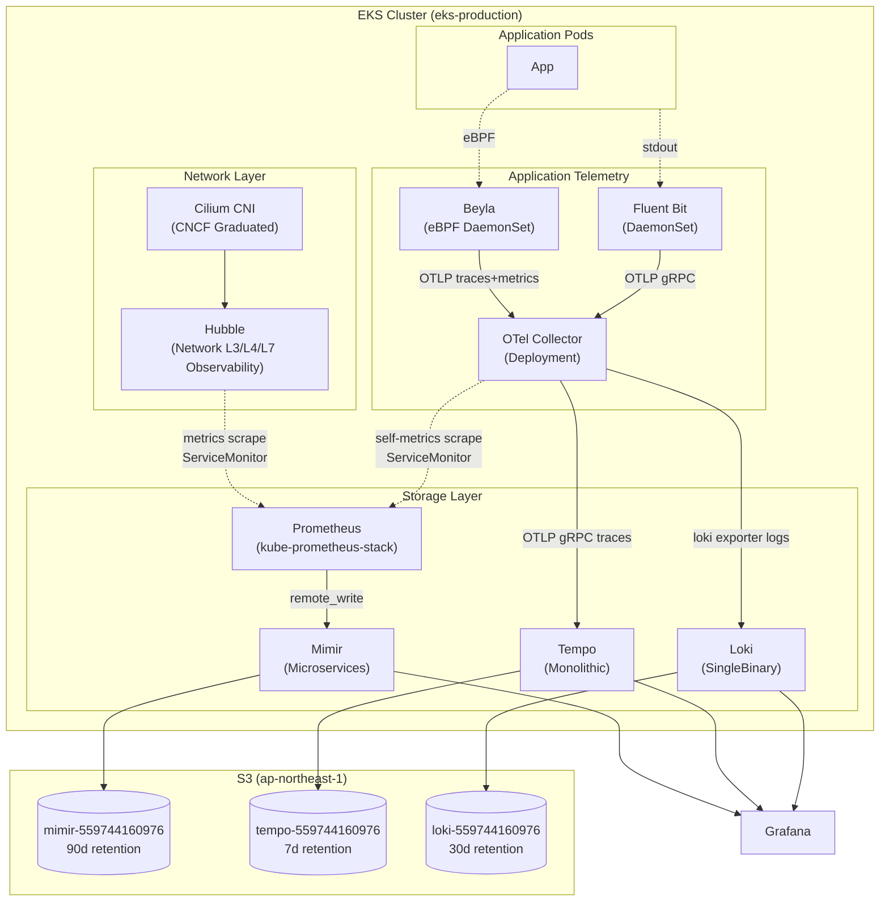
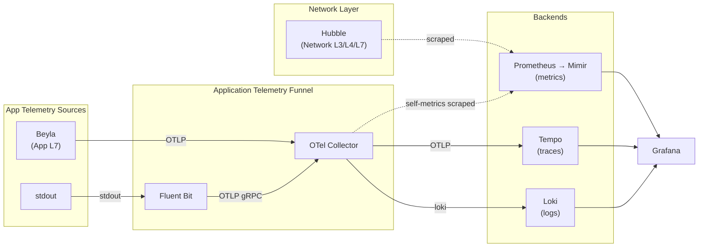

# Phase 3 Sub-project 4b: Logs path 完成 + Hubble metrics enable

**Goal:** EKS production cluster (`eks-production` / ap-northeast-1 / account 559744160976) に **logs collection 経路**を完成させ、**Hubble metrics の Prometheus scrape** を enable する。Sub-project 4a で deploy 済の OTel Collector の logs pipeline に loki exporter を追加し、Fluent Bit の OUTPUT を Loki direct から OTel Collector OTLP gRPC 経由に switching、これに合わせて Cilium values で Hubble metrics ServiceMonitor + Cilium 各 component の Prometheus self-metrics を有効化する。本 sub-project 完了時に Phase 3 の 3 stack (metrics / logs / traces) の wire が完成し、`kubernetes/README.md` に描かれた最終 architecture が reality と一致する。Beyla / OTel Collector metrics pipeline 拡張 / Hubble flow logs Loki 統合は Phase 4 で扱う。

**Architecture summary:** Fluent Bit DaemonSet が pod stdout を tail、OTel Collector の OTLP gRPC receiver (`:4317`) に push。OTel Collector logs pipeline (`receivers: [otlp]` → `processors: [memory_limiter, batch]` → `exporters: [loki]`) で Loki gateway へ書き込み。Cilium values で Hubble + cilium-agent + cilium-operator の Prometheus metrics を有効化、kube-prometheus-stack の Prometheus が ServiceMonitor 経由で scrape。OTel Collector の deploy namespace は `monitoring` 維持、空 `opentelemetry-system` namespace は撤去 (= Sub-project 4a Issue A 同時解消)。`kubernetes/README.md` の architecture 図を Network Layer / Application Telemetry の役割分離 mermaid に rewrite、説明 paragraph 追加。

**Tech stack:**
- Cilium 1.18.6 (chaining mode、kubeProxyReplacement、Hubble enabled — values 修正のみ、chart upgrade なし)
- Fluent Bit chart `fluent/fluent-bit` v0.57.3 (= 既 deploy、OUTPUT block のみ修正)
- OpenTelemetry Collector chart `opentelemetry/opentelemetry-collector` v0.153.0 (= 既 deploy、logs pipeline 拡張のみ)
- kube-prometheus-stack v84.5.0 (= 既 deploy、ServiceMonitor scrape 対象が増えるのみ、values 変更なし)

---

## Architecture

### 4b 完了時 (= 最終形、kubernetes/README.md と一致)



### 役割分離

Signal は role 別に 2 funnel で流す。

**Network Layer** (Cilium + Hubble): cluster の network behavior を観測する。Hubble は native Prometheus exporter として動作し、Prometheus が ServiceMonitor 経由で直接 scrape。Cilium NetworkPolicy enforcement の visibility と統合され、CNI と密結合。

**Application Telemetry Funnel** (Beyla + Fluent Bit + OTel Collector): application code の trace / log / metric を集約する。OTel Collector を hub として全 signal が統一 metadata processor を通り、Tempo / Loki / Mimir へ route。

両者を混ぜない理由:

1. Hubble は Cilium native の Prometheus exporter で、追加 OTel hop は overhead 増の trade-off に見合わない
2. network 視点と application 視点は cardinality / sampling 戦略が異なり、別 funnel の方が運用しやすい

### Dataflow



---

## Scope

### 4b で扱う 4 task

| # | Task | File path |
|---|---|---|
| 1 | Cilium values flip (Hubble metrics ServiceMonitor + cilium-agent / operator Prometheus self-metrics enable) | `kubernetes/components/cilium/production/values.yaml.gotmpl` |
| 2 | Fluent Bit OUTPUT 切替 (Loki direct → OTel Collector OTLP gRPC) | `kubernetes/components/fluent-bit/production/values.yaml.gotmpl` |
| 3 | OTel Collector logs pipeline 拡張 (loki exporter 追加 + debug exporter 撤去 + namespace `opentelemetry-system` 撤去) | `kubernetes/components/opentelemetry-collector/{namespace.yaml,production/values.yaml.gotmpl}` + `kubernetes/manifests/production/00-namespaces/` |
| 4 | kubernetes/README.md mermaid rewrite + 役割分離説明追加 | `kubernetes/README.md` |

### Out of scope (= Phase 4 へ postpone)

- Beyla DaemonSet deploy (= application code 投入時に Phase 4 で deploy)
- OTel Collector metrics pipeline 拡張 (= Beyla source 接続が前提、Phase 4)
- Hubble flow logs → Loki path (= scope creep のリスク高、Phase 4 で需要に応じて評価)
- Tetragon / Pixie 等の追加 observability tool (= Phase 4 検討候補)

---

## Decisions

### Decision 1: Hubble は OTel Collector を経由せず Prometheus が直接 scrape する (= 「Network Layer」 と 「Application Telemetry Funnel」 の役割分離)

- **採用**: Hubble metrics は ServiceMonitor で kube-prometheus-stack の Prometheus が直接 scrape、OTel Collector は経由しない
- **理由**:
  - `cilium/hubble-otel` adapter は **archived & unmaintained as of June 2024** ([github.com/cilium/hubble-otel](https://github.com/cilium/hubble-otel))、`opentelemetry-collector-contrib` の hubble receiver 提案 (#12781) は **closed as not planned**、Cilium 1.18 native は file/stdout export のみで OTLP 非対応 (= 公式 path 不在、[docs.cilium.io](https://docs.cilium.io/en/v1.18/observability/hubble/configuration/export/))
  - 2026 公式 community recommended stack (= Cilium + Hubble + Beyla + Tetragon、すべて Prometheus 連携、[devops.gheware 2026](https://devops.gheware.com/blog/posts/ebpf-kubernetes-observability-2026.html)) と整合
  - Hubble は network layer の native exporter で、OTel hop を挟む overhead 増の trade-off に見合わない
  - network metrics と application telemetry は cardinality / sampling 戦略が異なるため別 funnel の方が運用しやすい
- **代替案**:
  - Hubble flows → OTLP → OTel Collector → Tempo: archived adapter 依存、L9 (= 公式 docs 直接 citation) に矛盾
  - OTel Collector の prometheus receiver で Hubble metrics endpoint を scrape: 1 hop 増、Hubble metrics の volume 次第で OTel Collector の memory pressure 増、native pattern から外れる

### Decision 2: Beyla deploy + OTel Collector metrics pipeline 拡張 を Phase 4 へ postpone

- **採用**: 4b では Beyla を deploy しない、OTel Collector の metrics pipeline は chart default (debug exporter) のまま
- **理由**:
  - Production cluster は **infrastructure-only state** (= application code 未 deploy、namespace は external-dns / karpenter / keda / monitoring / opentelemetry-system / 00-namespaces のみ)
  - Beyla の本来の use case は application code (HTTP server / gRPC server) の eBPF auto-instrument、infra controller (Karpenter / FluxCD / ExternalDNS) の reconciliation loop traces は観測価値が低い
  - Phase 4 で application 投入と同時に Beyla deploy + metrics pipeline 拡張 + application namespace discovery を 1 sub-project として brainstorming する方が clean
  - Sub-project 1-3 の YAGNI 精神 (= "needed when needed, not deployed prematurely") に整合
- **代替案**:
  - Beyla deploy + discovery 空 (= idle pod): 全 node で privileged eBPF DaemonSet 動作、observable 出ない無駄
  - Beyla で infra controller を instrument: Hubble L7 HTTP metrics と overlap、cardinality 増 の割に value 低い

### Decision 3: Hubble flow logs → Loki path を Phase 4 へ postpone

- **採用**: 4b では Hubble flow logs (= JSON-formatted network event log) を Loki に流さない、`hubble.export.static.filePath` は false のまま
- **理由**:
  - Cilium 公式 docs documented path だが scope creep (= Cilium pod の hostPath mount + Fluent Bit DaemonSet の volume mount config 変更必要 + flow logs 高 volume で Loki cost 増)
  - Hubble metrics + Hubble UI で network observability の 80% は満たせる、flow logs 永続化は Phase 4 で需要に応じて評価
- **代替案**: 4b に含める = atomic 性が下がり、scope 膨張で runtime issue 切り分け困難

### Decision 4: Fluent Bit OTLP protocol = gRPC (port 4317)

- **採用**: Fluent Bit OUTPUT は `Name opentelemetry`、endpoint `opentelemetry-collector.monitoring.svc.cluster.local:4317`、`grpc: on` (= OTLP gRPC over HTTP/2)
- **理由**:
  - OpenTelemetry OTLP spec 1.10.0 ([opentelemetry.io](https://opentelemetry.io/docs/specs/otlp/)) の **gRPC sequential mode use case** ("instrumented application + local daemon as OpenTelemetry Collector") にまさに合致
  - 2026 community best practice: high-volume continuous log streaming + internal cluster traffic は gRPC が production-recommended ([SigNoz](https://signoz.io/comparisons/opentelemetry-grpc-vs-http/) / [Better Stack](https://betterstack.com/community/guides/observability/otlp/) / [Dash0](https://www.dash0.com/guides/opentelemetry-otlp-receiver))
  - Protobuf binary encoding + HTTP/2 multiplexing で low CPU + low memory、Phase 4 で application log volume が増えても scale
  - panicboat の OTel signal pathway を cluster 内で gRPC 統一: traces (Beyla → OTel Collector → Tempo) と logs (Fluent Bit → OTel Collector) が同 protocol
  - Cilium CNI は HTTP/2 + gRPC native support、proxy / load balancer 不在 (= ClusterIP direct service-to-service) で HTTP/1.1 互換性問題なし
- **代替案**:
  - HTTP (port 4318): debugging で curl-able だが、grpcurl で同等 debug 可能、production 性能を譲る ROI 低い
  - local pattern 踏襲 (= HTTP): local は dev 環境で log volume 低い + curl debug 利便、production の volume / scale 要件と divergence
- **Local divergence の handling**: local は existing HTTP setup を維持 (= dev での curl debugging 利便)、production-only gRPC migration は本 sub-project scope。local も gRPC に揃える pattern unification は Phase 4 candidate

### Decision 5: OTel Collector namespace = `monitoring` 維持、空 `opentelemetry-system` namespace 撤去

- **採用**: production OTel Collector は `monitoring` namespace (= 4a で deploy 済) のまま、空の `opentelemetry-system` namespace を本 sub-project で撤去
- **理由**:
  - Sub-project 2 (Mimir) / 3 (Loki + Fluent Bit) / 4a (Tempo) で確立した「全 observability backend は monitoring namespace」pattern と整合
  - Sub-project 4a Issue A (= 空 `opentelemetry-system` namespace) を本 sub-project で同時解消、Phase 4 引き継ぎ事項を 1 件減らす
  - local では `opentelemetry-system` namespace を継続使用 (= Phase 1-2 で確立した namespace 構造を local lock-in しない)、values の差で local-production divergence を吸収
- **代替案**: production OTel Collector を `opentelemetry-system` に migration = 4a で deploy 済の Pod Identity Association 再作成 + Phase 3 monitoring 共有 pattern を破壊、ROI 低い

### Decision 6: Cilium values で Hubble + agent + operator の Prometheus 連携を同時 enable

- **採用**: 同 PR で `prometheus.enabled: true` + `operator.prometheus.enabled: true` + `hubble.metrics.serviceMonitor.enabled: true` を flip、ServiceMonitor labels に `release: kube-prometheus-stack` を付与
- **理由**:
  - 2026 production deployment guide で 3 toggle 一式が公式推奨設定 (= cilium-agent / operator / Hubble はすべて self-metrics + Prometheus integration を持ち、片方だけ enable は意味不明な partial state)
  - Cilium values の現コメント (`# Phase 3 完了後に true に変更予定`) と整合
  - 別 PR に分割すると "なぜ片方だけ" の context が文書化必要、不必要な complexity
- **代替案**: 段階的 enable = partial state を経由する debug 困難性

### Decision 7: OTel Collector logs pipeline の processor は chart default (memory_limiter + batch) のまま、k8sattributes processor は不採用

- **採用**: logs pipeline の processor 構成は chart default (= memory_limiter, batch) を維持、k8sattributes / attributes / resourcedetection 等は追加しない
- **理由**:
  - Fluent Bit が `kubernetes` filter で既に k8s metadata (= job, namespace, pod, container, node, stream) を付与済、OTel Collector で k8sattributes processor を再付与するのは重複 (= YAGNI)
  - k8sattributes processor は ClusterRole + RBAC 設定 + Kubernetes API server load 増を追加、4b では不要
  - 必要になった時点 (= Phase 4 で Beyla 経由の trace span から k8s metadata を attach したい時) に追加検討
- **代替案**: k8sattributes 追加 = production logs pipeline の standard pattern だが、Fluent Bit との二重付与の整理が必要、4b scope 外

### Decision 8: debug exporter は logs pipeline から撤去、metrics pipeline では維持

- **採用**: logs pipeline の `exporters` を `[debug]` (chart default) → `[loki]` に置換 (= debug 撤去)、metrics pipeline は chart default (`exporters: [debug]`) のまま
- **理由**:
  - logs pipeline は loki exporter で実 sink 接続、debug は重複 + production log volume が debug log に流れる無駄
  - metrics pipeline は Phase 4 まで source 接続なし (= idle)、明示的 disable よりも chart default 維持の方が将来 Phase 4 brainstorming で再 design しやすい
- **代替案**: metrics pipeline 全削除 = 4a で確立した chart default 設定の divergence、Phase 4 で再 enable する手間

### Decision 9: kubernetes/README.md の mermaid rewrite + 役割分離説明追加 を 4b scope に含める

- **採用**: `kubernetes/README.md` の Architecture 図 + Dataflow 図を **Network Layer (Cilium + Hubble) と Application Telemetry (OTel Collector + Beyla + Fluent Bit) の 2 subgraph に分離**、説明 paragraph を追加
- **理由**:
  - 現状の "Collection Layer" / "Unified Collection" wording が Hubble の Prometheus 直接 scrape と矛盾、aesthetic な気持ち悪さの origin
  - 4b で reality と図を一致させる時に、図そのものも明確化することで Phase 4 以降の design discussion の baseline を整理
- **代替案**: 図は触らない = 4b で reality は変わるが図は更新されない、Phase 4 で再度修正の手間

### Decision 10: 1 sub-project 構成 (= 4 task atomic merge)

- **採用**: 4 task (Cilium / Fluent Bit / OTel Collector / README) を 1 PR で merge
- **理由**:
  - Fluent Bit を OTel に切り替える時点で OTel Collector logs pipeline に loki exporter が必要、staged にすると logs ロストの中間状態
  - Sub-project 3 (Loki + Fluent Bit 1 sub-project) と同 pattern、既に確立した規模感
  - 4a の `0` runtime issue achievement (= L1) の累積効果で atomic 進行のリスクは低い
- **代替案**: 4b-1 (logs) / 4b-2 (Hubble metrics) 分割 = 中間状態の整合性管理が必要、ROI 低い

---

## Components / 変更詳細

### Task 1: Cilium values flip — Hubble metrics + Cilium self-metrics の Prometheus 連携 enable

**File:** `kubernetes/components/cilium/production/values.yaml.gotmpl`

**変更内容 (3 箇所 flip):**

```yaml
# Before (4a 完了時点)
hubble:
  metrics:
    serviceMonitor:
      enabled: false  # ← Phase 3 完了後に true に変更予定
prometheus:
  enabled: false  # ← Phase 3 完了後に true に変更予定

# After (4b)
hubble:
  metrics:
    serviceMonitor:
      enabled: true
      labels:
        release: kube-prometheus-stack  # kube-prometheus-stack の serviceMonitorSelector match
prometheus:
  enabled: true
  serviceMonitor:
    enabled: true
    labels:
      release: kube-prometheus-stack
operator:
  prometheus:
    enabled: true
    serviceMonitor:
      enabled: true
      labels:
        release: kube-prometheus-stack
```

**動作:**
- cilium-agent DaemonSet が `:9962/metrics` (= Cilium 内部 metrics) を expose、ServiceMonitor 経由で Prometheus が scrape
- cilium-operator Deployment が `:9963/metrics` (= operator metrics) を expose、ServiceMonitor 経由で Prometheus が scrape
- hubble-relay Deployment が `:9965/metrics` + 各 cilium-agent pod が hubble metrics を expose、ServiceMonitor 経由で Prometheus が scrape
- Prometheus → remote_write → Mimir で long-term storage

### Task 2: Fluent Bit OUTPUT 切替 — Loki direct → OTel Collector OTLP gRPC

**File:** `kubernetes/components/fluent-bit/production/values.yaml.gotmpl`

**変更内容 (OUTPUT block 全置換):**

```
# Before (Sub-project 3 で deploy 済の OUTPUT block)
[OUTPUT]
    Name loki
    Match kube.*
    Host loki-gateway.monitoring.svc.cluster.local
    Port 80
    Uri /loki/api/v1/push
    tenant_id anonymous
    labels job=fluentbit, namespace=$kubernetes['namespace_name'], pod=$kubernetes['pod_name'], container=$kubernetes['container_name']
    structured_metadata node=$kubernetes['host'], stream=$stream
    compress gzip
    Retry_Limit no_limits
    storage.total_limit_size 5G

# After (4b)
[OUTPUT]
    Name opentelemetry
    Match kube.*
    Host opentelemetry-collector.monitoring.svc.cluster.local
    Port 4317
    grpc on
    compress gzip
    Retry_Limit no_limits
    storage.total_limit_size 5G
```

**動作:**
- Fluent Bit DaemonSet が pod stdout を tail (= 既存 INPUT 設定)
- `kubernetes` filter で k8s metadata を log record に付与 (= 既存設定、Loki labels の代わりに OTel attributes として伝搬)
- OTLP gRPC で `opentelemetry-collector.monitoring.svc.cluster.local:4317` に push
- failure 時は `Retry_Limit no_limits` で retry、`storage.total_limit_size 5G` で disk buffer

### Task 3: OTel Collector logs pipeline 拡張 + namespace 整理

**Files:**
- `kubernetes/components/opentelemetry-collector/production/values.yaml.gotmpl` (logs pipeline 拡張)
- `kubernetes/components/opentelemetry-collector/local/namespace.yaml` (新規、local 専用に移動)
- `kubernetes/components/opentelemetry-collector/namespace.yaml` (削除、local subdir に移動済のため)
- `kubernetes/manifests/production/00-namespaces/namespaces.yaml` (auto-generated、`make hydrate-index ENV=production` で `opentelemetry-system` namespace block が消える)
- `kubernetes/manifests/local/00-namespaces/namespaces.yaml` (auto-generated、`make hydrate-index ENV=local` で `opentelemetry-system` block 維持)

**values.yaml.gotmpl 変更内容:**

```yaml
# Before (4a 完了時点、抜粋)
config:
  exporters:
    otlp/tempo:
      endpoint: tempo.monitoring.svc.cluster.local:4317
      tls:
        insecure: true
    debug: {}  # chart default
  service:
    pipelines:
      traces:
        receivers: [otlp]
        processors: [memory_limiter, batch]
        exporters: [otlp/tempo]
      metrics:
        receivers: [otlp, prometheus]
        processors: [memory_limiter, batch]
        exporters: [debug]  # chart default
      logs:
        receivers: [otlp]
        processors: [memory_limiter, batch]
        exporters: [debug]  # chart default

# After (4b)
config:
  exporters:
    otlp/tempo:
      endpoint: tempo.monitoring.svc.cluster.local:4317
      tls:
        insecure: true
    loki:
      endpoint: http://loki-gateway.monitoring.svc.cluster.local:80/loki/api/v1/push
      default_labels_enabled:
        exporter: false  # OTel Collector が "exporter" label を付与しない (= cardinality 抑制)
        job: true        # "job=fluentbit" 等を維持
    debug: {}  # metrics pipeline 用に chart default 維持
  service:
    pipelines:
      traces:
        receivers: [otlp]
        processors: [memory_limiter, batch]
        exporters: [otlp/tempo]
      metrics:
        receivers: [otlp, prometheus]
        processors: [memory_limiter, batch]
        exporters: [debug]  # Phase 4 で Beyla 接続時に再 design
      logs:
        receivers: [otlp]
        processors: [memory_limiter, batch]
        exporters: [loki]  # ← 4b で実 sink 接続
```

**動作:**
- Fluent Bit からの OTLP gRPC logs は `otlp` receiver (= 4a で expose 済 `:4317`) で受信
- `memory_limiter` (= 80% limit / 25% spike) + `batch` で processing
- `loki` exporter で `http://loki-gateway.monitoring.svc.cluster.local:80/loki/api/v1/push` に push
- Loki gateway → Loki write path → S3 backend (= Sub-project 3 で deploy 済 path)

**namespace 整理 (Makefile `hydrate-index` の fall-back ロジック活用):**

`kubernetes/Makefile` の hydrate-index target は、各 component で `components/<comp>/<env>/namespace.yaml` を first check、無ければ `components/<comp>/namespace.yaml` を fall-back する pattern。これを活用:

- `git mv kubernetes/components/opentelemetry-collector/namespace.yaml kubernetes/components/opentelemetry-collector/local/namespace.yaml` で local 専用化
- `make hydrate-index ENV=production` 実行 → `production/namespace.yaml` も top-level `namespace.yaml` も無いため、`opentelemetry-system` block は production manifests から消える
- `make hydrate-index ENV=local` 実行 → `local/namespace.yaml` を pick up、local manifests は `opentelemetry-system` block を保持

### Task 4: kubernetes/README.md mermaid rewrite + 役割分離説明追加

**File:** `kubernetes/README.md`

**変更内容:**
- Architecture 図 (現 line 9-69) を **Network Layer + Application Telemetry の 2 subgraph 分離 mermaid** に rewrite (= 上記 Architecture section と同)
- Dataflow 図 (現 line 73-107) を同様に rewrite
- "### Dataflow" 直前に **「### 役割分離」 paragraph** を挿入
- mermaid 図中の `FluentBit -->|OTLP HTTP| OTelCol` を **`FluentBit -->|OTLP gRPC| OTelCol`** に修正 (Decision 4 反映)

**動作:**
- 純粋なドキュメント変更、cluster 影響 0
- reality と図が一致、役割分離が明示

---

## Risks / Mitigations

### 高 risk

| Risk | Trigger | Mitigation | Recovery |
|---|---|---|---|
| **Logs 数分間ロスト** during Flux reconciliation 順序変動 | Fluent Bit が先に OTel Collector OTLP に push 始める + OTel Collector の loki exporter がまだ rendered manifest 反映前 | 1 PR で 4 task atomic merge、Flux 1 sync で同時適用、OTel Collector の logs pipeline は loki exporter unconnected でも `memory_limiter` で reject、Fluent Bit は `storage.total_limit_size 5G` で disk buffer (= 既 Sub-project 3 で deploy 済設定) | logs ロスト 数分以内、Fluent Bit storage.total_limit_size の disk buffer で吸収、recovery 後 backlog flush |
| **Loki gateway 接続失敗** | OTel Collector の `loki` exporter endpoint が間違い、または Loki gateway pod が unhealthy | local で同 endpoint 構造を pre-validate、Loki gateway は Sub-project 3 で deploy 済 + Sub-project 3 で動作確認済 | `flux suspend kustomization flux-system` で停止 → revert PR を main に push → `flux resume` で適用 (= Sub-project 2 / 3 で確立した standard runbook) |
| **Hubble metrics が Prometheus に出ない** | Cilium chart の `hubble.metrics.serviceMonitor.labels` 構造が想定と異なる、または kube-prometheus-stack の serviceMonitorSelector とラベル不一致 | local で `kubectl get servicemonitor -n kube-system -l app.kubernetes.io/name=hubble -o yaml` で labels 構造を pre-validate、`release: kube-prometheus-stack` を確実に付与 | values の labels 修正で再 deploy、Prometheus targets が "DOWN" のままなら ServiceMonitor の `selector.matchLabels` も確認 |

### 中 risk

| Risk | Trigger | Mitigation | Recovery |
|---|---|---|---|
| **OTel Collector memory pressure** | logs pipeline + traces pipeline で memory 逼迫 (= Sub-project 4a で 256Mi→1Gi 設定) | 現状 production は infrastructure-only state で log volume 低い、`memory_limiter` (= 80% limit / 25% spike) が backpressure として機能、Phase 4 で application 投入時に re-tune | OTel Collector resources を 512Mi→2Gi に増強 (Mimir / Tempo と同 pattern)、memory_limiter spike rate を調整 |
| **OTLP gRPC 接続が unstable** | Cilium chaining mode 起動直後の identity propagation 中の transient (= Sub-project 4a L2 学び再現) | 起動 ~60 秒以内の transient は retry で resolve、`Retry_Limit no_limits` で吸収、Sub-project 4a L3 の persistent vs transient checklist を post-flight verification で適用 | 起動から 5 分以上経過後の persistent error なら value / config 確認、必要なら `flux suspend` で停止 |

### 低 risk

| Risk | Trigger | Mitigation | Recovery |
|---|---|---|---|
| **Cilium values flip で agent restart triggered** | `prometheus.enabled` flip は cilium-agent DaemonSet の rolling restart を invoke する可能性 | Cilium chart の rolling restart は **既存 traffic への影響なし** (= eBPF datapath は kernel 側、agent restart で network downtime なし)、ただし Hubble Relay が一時的に flow stream 取得不可 | Rolling restart 完了 (= ~3 min) で resolve、stream 再開、historical flows は relay buffer で保持 |
| **空 `opentelemetry-system` namespace 削除で漏れた resource** | Sub-project 4a 以前の test 等で resource が残存している可能性 | 削除前に `kubectl get all -n opentelemetry-system && kubectl get cm,secret -n opentelemetry-system` で完全空を確認 | resource 残存判明時は本 PR から namespace 削除を分離、Phase 4 へ postpone |

## Rollback Strategy

### Pattern A: Standard rollback (= Flux suspend + revert)

Sub-project 2 (Mimir Multi-Attach issue) / 3 (Loki + IAM issue) で確立した standard runbook:

```bash
# 1. Flux 一時停止
flux suspend kustomization flux-system -n flux-system

# 2. revert PR を作成 + main に merge
gh pr create --title "revert: Sub-project 4b — logs path completion" \
  --body "Reverting #N due to <issue>" --base main
gh pr merge <revert-pr-num> --squash

# 3. Flux 再開
flux resume kustomization flux-system -n flux-system

# 4. 確認
kubectl get pods -n monitoring -l app.kubernetes.io/name=opentelemetry-collector
kubectl logs -n monitoring deployment/opentelemetry-collector --tail=20
```

### Pattern B: Partial rollback (= 特定 task のみ revert)

logs pipeline は問題ないが、Hubble metrics ServiceMonitor だけ動かない等の partial issue:
- Cilium values flip だけ revert PR 作成、他 3 task は維持
- Phase 4 で問題切り分け後に再 enable

### Failure 時の data loss assessment

| Component | Data loss 範囲 | Recovery time |
|---|---|---|
| **Logs** | rollback 中の数分間の logs (= Fluent Bit disk buffer 5G で吸収可、ノード生存時 0 ロスト) | 即時 (= revert apply 後すぐ Loki direct path 復活) |
| **Hubble metrics** | rollback 中の Prometheus scrape 数分 (= metrics は 1m interval で再 scrape、historical は無し) | 即時 |
| **Traces (Tempo)** | 影響なし (= 4a で完成した path、4b では touched しない) | N/A |
| **Application metrics (Mimir)** | 影響なし (= 4b では Mimir / kube-prometheus-stack の path に変更なし、Hubble metrics 追加のみ) | N/A |

---

## Post-flight Check (post-merge verification)

PR merge + Flux reconciliation 完了後、以下 14 項目を順に verify する。Sub-project 4a L3 (= persistent vs transient error 切り分け 5-step checklist) を適用し、起動 ~60 秒以内の transient error は retry で resolve するパターンを認識した上で判定。

### 1. Cilium pods の rolling restart 完了

```bash
kubectl rollout status -n kube-system daemonset/cilium --timeout=5m
kubectl rollout status -n kube-system deployment/cilium-operator --timeout=5m
kubectl rollout status -n kube-system deployment/hubble-relay --timeout=5m
```
Expected: 全 rollout `successfully rolled out`、Pod restart で network downtime なし

### 2. Cilium / Hubble ServiceMonitor が cluster に存在

```bash
kubectl get servicemonitor -n kube-system -l release=kube-prometheus-stack | grep -E '(cilium|hubble)'
```
Expected: 3 ServiceMonitor (`cilium-agent`, `cilium-operator`, `hubble`) が表示される

### 3. Prometheus targets で Cilium / Hubble endpoints が UP

```bash
# Prometheus port-forward
kubectl port-forward -n monitoring svc/kube-prometheus-stack-prometheus 9090:9090
# 別 terminal で:
curl -s http://localhost:9090/api/v1/targets | \
  jq '.data.activeTargets[] | select(.discoveredLabels.__meta_kubernetes_service_name | test("cilium|hubble")) | {service: .labels.service, health: .health}'
```
Expected: `cilium-agent` / `cilium-operator` / `hubble` のいずれも `health: up`

### 4. Hubble metrics が Mimir で query 可能

```bash
# Grafana Explore で Mimir datasource、以下の query
hubble_flows_processed_total{}
# OR PromQL via API
curl -s 'http://localhost:9090/api/v1/query?query=hubble_flows_processed_total' | jq '.data.result | length'
```
Expected: result count > 0、過去 5 分以内の data point あり

### 5. Fluent Bit pods all Ready

```bash
kubectl get pods -n monitoring -l app.kubernetes.io/name=fluent-bit
kubectl rollout status -n monitoring daemonset/fluent-bit --timeout=5m
```
Expected: 全 pod READY (= node 数分)、restartCount 0

### 6. Fluent Bit logs に OUTPUT=opentelemetry connection 成功

```bash
kubectl logs -n monitoring -l app.kubernetes.io/name=fluent-bit --tail=50 | \
  grep -E '(opentelemetry|connecting|connected|error)' | head -20
```
Expected: `opentelemetry-collector.monitoring.svc.cluster.local:4317` への gRPC 接続 success log、過去 5 分以内に "error" / "failed" log なし (= Sub-project 4a L3 適用、起動直後の transient は除外)

### 7. OTel Collector pod Running

```bash
kubectl get pod -n monitoring -l app.kubernetes.io/name=opentelemetry-collector
kubectl logs -n monitoring deployment/opentelemetry-collector --tail=50
```
Expected: pod READY 1/1、restartCount 0、logs に `loki` exporter / `otlp` receiver の startup success message、過去 5 分以内に persistent error なし

### 8. OTel Collector → Loki gateway gRPC connection 成立

```bash
kubectl logs -n monitoring deployment/opentelemetry-collector --since=10m | \
  grep -iE '(loki|connect|exporter)' | head -10
```
Expected: loki exporter が `loki-gateway.monitoring.svc.cluster.local:80` に接続成功、push 成功 log

### 9. End-to-end logs flow: Fluent Bit → OTel Collector → Loki で過去 5 分以内の log を Grafana で確認

```
# Grafana Explore で Loki datasource、以下の query
{job="fluentbit"}
# 結果 within last 5min を確認、log entry 数 > 0
```
Expected: 過去 5 分以内の log entry > 0、`namespace`, `pod`, `container` label が enriched

### 10. Loki ingester ingestion rate が 4b 切替後に持続

```
# Grafana で以下 query
sum(rate(loki_distributor_lines_received_total[5m]))
```
Expected: 4b merge 前と同程度の rate (= Fluent Bit の log volume が変化なし、OTel Collector 経由でも path 切替後ロスなし)

### 11. 空 `opentelemetry-system` namespace の削除確認

```bash
kubectl get namespace opentelemetry-system
```
Expected: `Error from server (NotFound): namespaces "opentelemetry-system" not found`

### 12. 既存 4a path の regression なし — Tempo に traces 流入が継続

```bash
# Tempo gRPC connection 確認 (4a path)
kubectl logs -n monitoring deployment/opentelemetry-collector --since=10m | \
  grep -iE '(tempo|otlp/tempo)' | head -10
```
Expected: tempo exporter が継続稼働、新 logs pipeline 追加で traces pipeline に regression なし

### 13. Mimir に Hubble + Cilium metrics が remote_write 保存

```bash
# Mimir endpoint で query
curl -s 'http://localhost:9090/api/v1/query?query=count by (__name__)({__name__=~"hubble_.*|cilium_.*"})' | \
  jq '.data.result | length'
```
Expected: result count > 10 (= Hubble + Cilium 両 namespace の metric series が複数)

### 14. kubernetes/README.md mermaid 図が GitHub で正しく rendering される

```
# main merge 後に GitHub URL を ブラウザで確認
# https://github.com/panicboat/platform/blob/main/kubernetes/README.md
```
Expected: Architecture 図 + Dataflow 図ともに **Network Layer / Application Telemetry** subgraph で 2 分割表示、`OTLP gRPC` label が反映、役割分離 paragraph が表示される

### Sub-project 4a L3 適用 (= persistent vs transient 切り分け checklist)

各 verification step で error log を発見した場合:

1. **時刻情報を確認**: error 発生時刻 vs Pod 起動時刻 vs 現在時刻
2. **time-bounded log query**: `kubectl logs --since=10m` で最近の error/warn を確認
3. **Pod restart count を確認**: `restartCount > 0` なら persistent
4. **kubectl get svc を完全表示**: `head -N` truncate を避ける、`-o jsonpath` で field 単位取得
5. **Cilium chaining mode 起動 transient pattern を認識**: ~60 秒以内の "operation not permitted" 等は retry で resolve

過去 ~10 分以内に同種 error が無ければ resolved と判定、persistent issue を確信する evidence を集めてから fix 着手。

---

## Sub-project 1-4a Learnings の適用

Phase 3 全体で蓄積された learnings (Sub-project 1-4a の合計 ~25 件) のうち、本 sub-project で実適用されるものを記録。Sub-project 4a L1 で validate された "L1-L9 適用で initial deploy runtime issue 0 件" 効果を継続するため、applicable な learnings を全て適用する。

### Sub-project 2 (Mimir) Learnings の適用

| Learning | 4b での適用 |
|---|---|
| **L1 (chart upgrade での upstream changelog 確認)** | 4b では chart upgrade 不在 (= 既 deploy 済 Cilium / Fluent Bit / OTel Collector chart の values 修正のみ)。ただし新規利用機能 (= Cilium ServiceMonitor labels 構造、Fluent Bit `opentelemetry` output plugin の `grpc on` parameter、OTel Collector `loki` exporter の `default_labels_enabled` 構造) を chart docs / source で pre-validate |
| **L2-L5 (gp3 / Mimir 3.x schema / TSDB / Multi-Attach)** | 4b では PVC / Mimir / StatefulSet を touched しないため N/A |

### Sub-project 3 (Loki + Fluent Bit) Learnings の適用

| Learning | 4b での適用 |
|---|---|
| **L1 (chart 内部固定 path 問題)** | Cilium chart の `hubble.metrics.serviceMonitor.labels` / `prometheus.serviceMonitor.labels` / `operator.prometheus.serviceMonitor.labels` の構造、Fluent Bit chart の `[OUTPUT] Name opentelemetry` block 互換性、OTel Collector chart の `loki` exporter config 構造を実装段階で chart values.yaml + source code で pre-validate |
| **L2 (IAM 公式準拠)** | 4b は IAM touched なし、Sub-project 3 fix で 3 stack bucket-wide IAM 同型済を継承 |
| **L3 (chart probe / serviceMonitor key 確認)** | Cilium chart の ServiceMonitor labels が kube-prometheus-stack `serviceMonitorSelector.release: kube-prometheus-stack` と match するか pre-validate、`kubectl get servicemonitor -n kube-system -l app.kubernetes.io/name=hubble -o yaml` で local 検証後に production 反映 |
| **L4 (uniform retention は S3 lifecycle で)** | 4b は retention touched なし、Sub-project 3 / 4a で確立した 3 stack pattern (= Mimir 90d / Loki 30d / Tempo 7d) を継承 |
| **L5 (Flux suspend pattern)** | Risks / Rollback section で standard runbook として明示、Pattern A / B として 2 段階 rollback strategy 文書化 |
| **L6 (Loki `auth_enabled: false` 時 default tenant `fake`)** | OTel Collector `loki` exporter は default で tenant ID 推論なし (= `auth_enabled: false` の Loki に対して何も付与せず、Loki 側の default tenant `fake` がそのまま適用)、Sub-project 3 と整合 |
| **L7 (sibling stack symmetric)** | 4 task はすべて `monitoring` namespace 内で完結、Phase 3 共有 namespace pattern を維持。Cilium のみ `kube-system` namespace (= CNI として元々の場所) で variation なし |
| **L8 (post-flight check 13 項目)** | 14 項目を post-flight check section で明示適用、Sub-project 4a L3 (persistent vs transient checklist) も組み込み |
| **L9 (公式 docs 引用)** | Decision 1 で Hubble OTLP non-recommended の根拠を 4 source direct citation (= Cilium docs / hubble-otel archived / collector-contrib closed / Cilium metrics docs)、Decision 4 で OTLP gRPC 採用根拠を 5 source direct citation (= OTLP spec 1.10.0 / SigNoz / Better Stack / Dash0 / OneUptime) |
| **L10 (Phase 3 全体 9 件 runtime issue)** | 4a で 0 件達成、4b でも L1-L8 + 4a L1-L8 適用で 0 件目標、Phase 3 累計 9 件のまま据置 |

### Sub-project 4a (Tempo + OTel Collector) Learnings の適用

| Learning | 4b での適用 |
|---|---|
| **L1 (Sub-project 1-3 learnings 累積効果で initial deploy 0 issue)** | 4a の learnings (L1-L8) を加えて累積効果を維持、4b でも 0 runtime issue 目標 |
| **L2 (Controller 誤診断 — startup transient を persistent と決めつけ)** | post-flight verification で **起動 ~60 秒以内の transient error は L3 checklist で除外**、persistent を確信する evidence を集めてから fix 着手 |
| **L3 (persistent vs transient 5-step checklist)** | post-flight check section の最後に明示組み込み、各 verification step で error 発見時の判定手順として運用 |
| **L4 (bucket-wide IAM が Tempo でも機能)** | 4b は IAM touched なし、3 stack 同型を継承 |
| **L5 (kubectl 出力 truncate に注意)** | post-flight check で `head -N` 避け、`-o jsonpath` / `-o yaml` で完全 field 取得を明示 |
| **L6 (不要な runtime fix の早期 abort)** | runtime issue 発見時、L3 checklist + L5 完全表示で evidence を集め、persistent 確信前は fix 着手禁止、worktree / PR 作成等の作業時間を節約 |
| **L7 (4a/4b 分割 Decision 1 の long-term ROI)** | Decision 2-3 で同 pattern 適用 = Beyla / OTel Collector metrics pipeline / Hubble flow logs を Phase 4 へ postpone、scope 細分化で段階的 verify、誤診断時の production impact を limit |
| **L8 (Phase 3 全体 6 Phase 4 引き継ぎ事項)** | 4b 完了で **(2) `opentelemetry-system` namespace 整理** を解消、残り 5 件 (= gp3 / bucket-per-env / multi-tenant / OTel Operator / post-flight 自動化) を Phase 4 へ |

---

## Tech Stack 

本 sub-project 完了時の cluster 全体構成 (= Phase 3 完了状態):

| 観点 | 構成 |
|---|---|
| **CNI** | Cilium 1.18.6 (chaining mode、kubeProxyReplacement、Hubble enabled) |
| **3 stack architecture** | Mimir (Microservices) + Loki (SingleBinary) + Tempo (Monolithic) |
| **AWS infra** | bucket per service (mimir-/loki-/tempo-559744160976) + Pod Identity Association + bucket-wide IAM + application-level prefix env scope (`production/`) |
| **retention 戦略** | application retention OFF (= chart default に任せる) + S3 lifecycle で uniform 担保 (Mimir 90d / Loki 30d / Tempo 7d) |
| **Network observability** | Hubble (Cilium native) → ServiceMonitor → Prometheus → Mimir |
| **Application telemetry funnel** | Fluent Bit (logs) → OTLP gRPC → OTel Collector → loki exporter → Loki |
| **Trace pipeline** | (4b では touched なし、4a で完成) OTel Collector → OTLP gRPC → Tempo |
| **Metrics pipeline** | (4b では touched なし、4a で chart default = debug exporter) Phase 4 で Beyla 接続時に拡張 |
| **Grafana datasources** | Mimir (default) + Loki + Tempo + tracesToLogsV2 / tracesToMetrics correlation |
| **monitoring** | kube-prometheus-stack で全 component を auto-scrape、Mimir に remote_write |

## Out of Scope (= Phase 4 へ postpone)

本 sub-project では以下を扱わない:

### Application instrumentation 系

| 項目 | Phase 4 で扱う理由 |
|---|---|
| **Beyla DaemonSet deploy** | Production cluster は infrastructure-only state、application code 投入時に Beyla deploy + discovery 設定を 1 sub-project でまとめる方が clean |
| **OTel Collector metrics pipeline 拡張** | Beyla source 接続が前提、Beyla deploy と同 sub-project で扱う |
| **OTel Operator deploy** | auto-instrumentation の高度機能、application code が SDK injection を必要とする時点で評価 |

### Network observability 系

| 項目 | Phase 4 で扱う理由 |
|---|---|
| **Hubble flow logs → Loki path** | Cilium pod の hostPath mount + Fluent Bit DaemonSet volume mount config 変更必要、log volume も高 (= Loki cost 増)、需要発生時に評価 |
| **Tetragon deploy** | security observability + runtime enforcement、Phase 3 の observability scope 外、Phase 4 security focus 期に評価 |

### Infrastructure 整理系

| 項目 | Phase 4 で扱う理由 |
|---|---|
| **gp3 StorageClass の Flux 管理化** | Sub-project 2 で kubectl apply direct deploy、Flux 管理外、GitOps 整合性の観点で Phase 4 で別 PR 対応 |
| **bucket-per-env への migration** | AWS multi-tenant best practice (= Sub-project 3 L2 で flag)、3 stack 全部の S3 bucket を env scope split、大規模 migration |
| **multi-tenant 化 + per-tenant retention** | per-tenant / per-stream 差分 retention rules、現状の 1 tenant 運用で十分、需要発生時に評価 |
| **post-flight check の自動化** | Argo CD Health check / Prometheus alert 等で Sub-project 1-4b の post-flight verification 14 項目を自動化、Phase 4 operational maturity 強化 |

## Phase 4 引き継ぎ事項 (= 4b 完了後の状況)

Phase 4 brainstorming 開始時の前提として、以下 5 件が引き継がれる:

1. **gp3 StorageClass の Flux 管理化** (= Sub-project 2 から継続)
2. **bucket-per-env への migration 検討** (= Sub-project 3 L2 で flag)
3. **multi-tenant 化 + 詳細 retention rules** (= 3 stack で tenant ID 統一前提)
4. **OTel Operator deploy 検討** (= auto-instrumentation 機能、application code 投入時)
5. **post-flight check の自動化** (= Sub-project 3 L8 から継続課題)

加えて、4b で **新規発生** した Phase 4 候補事項:

6. **Beyla deploy + OTel Collector metrics pipeline 拡張** (= application code 投入時)
7. **Hubble flow logs → Loki path 評価** (= 需要発生時)
8. **local Fluent Bit OTLP protocol gRPC 統一** (= 4b で production-only gRPC migration したため、local 整合性を Phase 4 で再評価)

(Sub-project 4a で flag された **`opentelemetry-system` namespace 整理** は 4b で解消)
