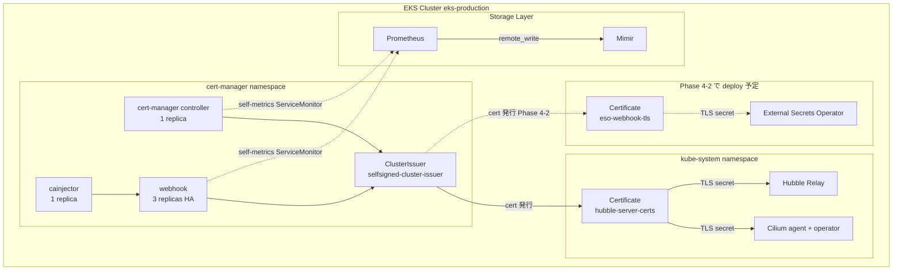

# Phase 4-1: cert-manager foundation + Cilium TLS migration

**Goal:** Phase 4 / 5 で必要となる admission webhook cert 自動発行基盤を確立する。`jetstack/cert-manager` を deploy + selfsigned `ClusterIssuer` を 1 つ作成、Cilium Hubble TLS を `cronJob` mode から公式 production-recommended の `certmanager` mode に migrate する。本 sub-project 完了時に panicboat cluster は cert-manager-based webhook cert 管理基盤を持ち、Phase 4-2 (= ESO) の admission webhook cert を自動発行できる状態になる。

**Architecture summary:** `jetstack/cert-manager` chart で controller / cainjector / webhook を `cert-manager` namespace に deploy。webhook を 3 replicas (= 公式 production best practice、`system-cluster-critical` priority class) で HA 構成。selfsigned `ClusterIssuer` (= internal CA) を 1 つ作成、cluster 内 webhook cert に使用。既存 Cilium Hubble TLS の `tls.auto.method: cronJob` を `certmanager` に switch、上記 ClusterIssuer から発行された cert で Hubble Relay の TLS を運用。他 admission webhooks (= Karpenter / ALB Controller / KEDA / prometheus-operator) は既存 builtin self-signed のまま (= Phase 6+ で incremental migrate path を予約)。

**Tech stack:**
- Helm + helmfile / `jetstack/cert-manager` v1.18.0 (= latest stable as of 2026-05、実装時に最新 patch 確認)
- selfsigned `ClusterIssuer` (= cert-manager built-in、external CA 不要)
- Cilium 1.18.6 (= 既 deploy、values 修正のみ)
- ServiceMonitor (= kube-prometheus-stack、Phase 3 pattern)

---

## Architecture

### 4-1 完了時 cluster TLS 管理状態



### 役割分離

cert-manager は **internal CA-based PKI 管理 layer**:

- **selfsigned ClusterIssuer**: cluster 内部用 CA (= external trust 不要)
- **cert-manager controller**: Certificate resource を reconcile、Issuer に発行依頼
- **cainjector**: webhook の caBundle annotation を自動 inject
- **webhook**: cert-manager CR の admission validation

panicboat の external-facing TLS (= ALB endpoint) は **ACM via ALB Controller** で別 path で管理 (= Phase 1 で確立済)。cert-manager は internal cluster certs 専用で、両者は co-exist。

---

## Scope

### 4-1 で扱う 3 task

| # | Task | File path |
|---|---|---|
| 1 | cert-manager deploy + ClusterIssuer 作成 | 新規 `kubernetes/components/cert-manager/{namespace.yaml, production/{helmfile.yaml, values.yaml.gotmpl}, production/kustomization/{kustomization.yaml, cluster-issuer.yaml}}` |
| 2 | Cilium values で Hubble TLS を certmanager に switch | `kubernetes/components/cilium/production/values.yaml.gotmpl` 修正 |
| 3 | Hydrate manifests + production kustomization に cert-manager 追加 | 自動生成 |

### Out of scope (= Phase 4-2 以降 / Phase 6+)

- 他 admission webhooks (Karpenter / ALB Controller / KEDA / prometheus-operator) の cert-manager migration (= Phase 6+ で incremental)
- AWS Private CA (PCA) integration (= Phase 6+ multi-tenant 検討時)
- Let's Encrypt ClusterIssuer (= ACM via ALB で代替済、不要)
- Application 内部 mTLS (= YAGNI、Phase 6+)
- Pod CPU requests audit (= 引き継ぎ #9、Phase 5 application traffic 後に実施)
- gp3 StorageClass の Layer 2 documented exception 化 (= 引き継ぎ #1 改題、Phase 6+)

---

## Decisions

### Decision 1: Chart = `jetstack/cert-manager` v1.18.x (= latest stable)

- **採用**: `jetstack/cert-manager` chart の最新 stable v1.18.x
- **理由**:
  - cert-manager 開発元 (= jetstack) が maintain する公式 chart、de facto standard
  - 代替 chart 不在 (= cert-manager 系の chart は jetstack 一択)
  - panicboat の他 component と同 chart selection pattern (= 各 project の公式 chart を採用)
- **代替案**: なし

### Decision 2: Namespace = `cert-manager` (= chart default)

- **採用**: cert-manager 専用 namespace `cert-manager` を新規作成、controller / cainjector / webhook を同 namespace に deploy
- **理由**:
  - cert-manager 公式 chart の default namespace、industry standard
  - 他 panicboat namespaces (= `monitoring` / `external-dns` / `karpenter` / `keda` 等) と同 「component 専用 namespace」 pattern
  - cert-manager は cluster-scoped resource (= ClusterIssuer / Certificate) を多く扱うため、namespace 分離が運用上 clear
- **代替案**: `monitoring` namespace に同居 = ESO 等の application namespace と無関係、混乱を招く

### Decision 3: CRD installation = chart 経由 (`crds.enabled: true`)

- **採用**: cert-manager chart の `crds.enabled: true` で CRD を chart install 同時に deploy
- **理由**:
  - chart 推奨方式、chart upgrade と CRD upgrade の整合性が自動取れる
  - panicboat の Phase 3 chart pattern と整合 (= chart 経由 CRD install)
  - separate CRD install は upgrade timing 管理が複雑、cert-manager v1.x 系では chart 経由が安定
- **代替案**: separate CRD install via raw manifests = upgrade 整合性管理が複雑

### Decision 4: HA configuration = webhook 3 replicas + `system-cluster-critical` priority class

- **採用**:
  - `controller`: 1 replica (= chart default、stateful な役割少)
  - `cainjector`: 1 replica (= chart default)
  - `webhook`: **3 replicas** (= cert-manager 公式 production 推奨)
  - 全 component に **`priorityClassName: system-cluster-critical`** 付与
- **理由**:
  - **webhook 3 replicas**: cert-manager 公式 best practice docs ([cert-manager.io best practice](https://cert-manager.io/docs/installation/best-practice/)) 明記 — "If the cert-manager webhook is unavailable, all API operations on cert-manager custom resources will fail" のため HA 必須
  - **`system-cluster-critical` priority**: cert-manager 公式が "cert-manager is mentioned among critical add-ons that use the system-cluster-critical priority class" と認識
  - Sub-project 4b で確立した DaemonSet PriorityClass pattern (= `system-node-critical`) の Deployment 版、cluster-critical level で適切
- **代替案**:
  - webhook 1 replica = 公式 production 推奨外、SPOF
  - PriorityClass なし = scheduling 失敗時に preempt 不可、Phase 4b で発覚した同 pattern

### Decision 5: ClusterIssuer = `selfsigned-cluster-issuer` 1 つ (= selfsigned internal CA)

- **採用**: `selfsigned` type の `ClusterIssuer` 1 つを 4-1 で deploy、name = `selfsigned-cluster-issuer`
- **用途**: ESO webhook cert (= Phase 4-2) + Cilium Hubble TLS (= 4-1 内で migrate)
- **理由**:
  - 内部 cluster 用 cert (= webhook + Hubble TLS) は selfsigned で十分、external trust 不要
  - panicboat の external-facing cert は **ACM via ALB で確立済** (= Phase 1)、cert-manager の Let's Encrypt / AWS PCA は不要
  - 1 ClusterIssuer で simplicity、Phase 6+ で必要に応じて Issuer 追加可能
- **代替案**:
  - Let's Encrypt ClusterIssuer 追加 = ACM と機能重複、YAGNI
  - AWS PCA ClusterIssuer 追加 = Phase 6+ で必要時、現 use case 不在
  - Issuer (namespace-scoped) = ESO + Cilium が異なる namespace、ClusterIssuer の方が clean

### Decision 6: Cilium TLS migration を 同 sub-project で実施 (= 4-1 内 task 2)

- **採用**: 4-1 sub-project 内で cert-manager deploy 後に Cilium values の `tls.auto.method: cronJob` → `certmanager` に switch、`certManagerIssuerRef` で `selfsigned-cluster-issuer` を参照
- **理由**:
  - cert-manager 公式が Cilium に対して **production-recommended path** と明示 ([docs.cilium.io/en/v1.18/observability/hubble/configuration/tls/](https://docs.cilium.io/en/v1.18/observability/hubble/configuration/tls/))
  - cert-manager deploy 直後に Cilium switch することで Phase 4-1 完了時点で Cilium が公式推奨 path に到達、引き継ぎ事項として残らない
  - Cilium chart の `tls.auto.method` switch は values 1 line 変更 + `certManagerIssuerRef` block 追加のみ、scope 軽微
- **代替案**:
  - 別 sub-project (= 4-1.5) に分割 = scope 細分化過多、依存関係が明確 (= cert-manager deploy 後に Cilium switch) なので同 sub-project が natural
  - Cilium は cronJob 維持 (= migrate しない) = 公式推奨外を放置、引き継ぎ事項化

### Decision 7: ServiceMonitor enable (= Phase 3 pattern 踏襲)

- **採用**: cert-manager の controller / webhook / cainjector の self-metrics を Prometheus が ServiceMonitor 経由で scrape、Mimir に remote_write
- **理由**:
  - Phase 3 で確立した「全 component の self-metrics を Mimir に集約」 pattern と整合
  - cert-manager の Certificate expiry / renewal status を Mimir で query 可能、将来 alert (= "cert expire 7 日前" 等) を組める
  - Sub-project 4b L4 (= post-flight 自動化の長期目標) の前提となる metrics 入力
- **代替案**: ServiceMonitor 無効 = cert 関連 metrics 不可視、運用 visibility 低下
- **NOTE**: cert-manager chart の ServiceMonitor key 構造は **chart 固有** (= Sub-project 3 L3 適用、`prometheus.servicemonitor.enabled` 等の正確な key path を実装段階で確認)

### Decision 8: 他 admission webhooks の cert-manager migration は Phase 6+ へ postpone

- **採用**: 4-1 では Karpenter / ALB Controller / KEDA / prometheus-operator の cert 管理を touched しない、各々の builtin self-signed mechanism を維持
- **理由**:
  - 公式 best practice ([cert-manager.io best practice](https://cert-manager.io/docs/installation/best-practice/)) は "全 webhook を cert-manager で統一" を強く推奨せず、optional
  - これら 4 components は production-acceptable な builtin mechanism で運用中、incident 履歴なし
  - migration scope (= 4 chart の values 修正 + rolling update + cert migration verify) は Phase 4 の primary goal と無関係、scope creep
  - Phase 6+ で必要に応じて incremental migrate path (= 各 chart upgrade と同 timing で 1 component ずつ) が確保される
- **代替案**: Option B (= 全 unification) = 公式推奨でない、scope 3-5x 拡大、Phase 5 timeline 遅延

### Decision 9: namespace.yaml は top-level 配置 (= local + production 共通)

- **採用**: `kubernetes/components/cert-manager/namespace.yaml` を top-level に配置、local / production 両 env で同 namespace `cert-manager` を使用
- **理由**:
  - cert-manager は env-specific name に分離する理由なし (= local も production も同名 namespace で OK)
  - Sub-project 4b で `opentelemetry-system` namespace を local 専用に移動した pattern とは異なる context (= OTel Collector は env で異なる namespace、cert-manager は同一)
  - Makefile `hydrate-index` の fall-back ロジック (= top-level `namespace.yaml` が両 env で pickup される) を活用
- **代替案**: env 別 namespace = 不要な複雑化

### Decision 10: 1 sub-project 構成 (= cert-manager + Cilium switch を atomic merge)

- **採用**: cert-manager deploy + ClusterIssuer 作成 + Cilium TLS switch を 4-1 sub-project の 3 commits 1 PR で merge
- **理由**:
  - 依存関係が明確 (= cert-manager → ClusterIssuer → Cilium switch)、staged にすると中間 state が awkward
  - Sub-project 4a (Tempo + OTel Collector) と同 pattern (= 関連 components を 1 sub-project)
  - 4a の 0 runtime issue achievement の累積効果で atomic 進行のリスク低
- **代替案**: 4-1a (cert-manager) / 4-1b (Cilium switch) 分割 = 中間状態の整合性管理必要、ROI 低い

---

## Components / 変更詳細

### Task 1: cert-manager deploy + ClusterIssuer 作成

**Files (新規):**

```
kubernetes/components/cert-manager/
├── namespace.yaml                              # cert-manager namespace 定義 (= local + production 共通)
└── production/
    ├── helmfile.yaml                           # jetstack/cert-manager chart deploy
    ├── values.yaml.gotmpl                      # HA + priority class + ServiceMonitor + CRD install
    └── kustomization/
        ├── kustomization.yaml
        └── cluster-issuer.yaml                 # selfsigned ClusterIssuer manifest
```

**`namespace.yaml`:**

```yaml
# =============================================================================
# cert-manager Namespace
# =============================================================================
# cert-manager controller / cainjector / webhook の専用 namespace。
# Phase 4-1 で deploy、Phase 4-2 (ESO) + Cilium Hubble TLS の cert 発行に使用。
# =============================================================================
apiVersion: v1
kind: Namespace
metadata:
  name: cert-manager
  labels:
    app.kubernetes.io/name: cert-manager
```

**`production/helmfile.yaml`:**

```yaml
# =============================================================================
# cert-manager Helmfile for production
# =============================================================================
# Phase 4-1 で deploy する cert-manager (= jetstack/cert-manager)。
# CRDs は chart 経由で install (= crds.enabled: true)、ClusterIssuer は
# kustomization で別途 deploy (= chart 範囲外)。
# =============================================================================
environments:
  production:
---
repositories:
  - name: jetstack
    url: https://charts.jetstack.io

releases:
  - name: cert-manager
    namespace: cert-manager
    chart: jetstack/cert-manager
    version: "v1.18.0"   # latest stable as of 2026-05、実装時に最新 patch 確認
    values:
      - values.yaml.gotmpl
```

**`production/values.yaml.gotmpl`:**

```yaml
# cert-manager Configuration for production
# Phase 4 / 5 で必要となる admission webhook cert 自動発行基盤、selfsigned CA で
# ESO + Cilium Hubble の cert を発行する。

# =============================================================================
# CRDs (= chart 経由で install)
# =============================================================================
crds:
  enabled: true

# =============================================================================
# Global config (= 全 component に適用)
# =============================================================================
global:
  # Cluster-wide critical service、scheduling 安定性を確保 (= cert-manager 公式推奨)
  priorityClassName: system-cluster-critical
  # Leader election 用 namespace (= chart default、cert-manager namespace に置く)
  leaderElection:
    namespace: cert-manager

# =============================================================================
# Controller (= main reconciliation loop)
# =============================================================================
replicaCount: 1
resources:
  requests:
    cpu: 10m
    memory: 32Mi
  limits:
    memory: 128Mi

# =============================================================================
# Webhook (= 公式 production best practice = 3 replicas で HA)
# =============================================================================
# NOTE: cert-manager 公式 best practice docs 明記 — webhook 不可時は全 cert-manager
# CR 操作が fail するため HA 必須。
webhook:
  replicaCount: 3
  resources:
    requests:
      cpu: 10m
      memory: 32Mi
    limits:
      memory: 64Mi

# =============================================================================
# CA Injector (= webhook caBundle 自動 inject)
# =============================================================================
cainjector:
  replicaCount: 1
  resources:
    requests:
      cpu: 10m
      memory: 64Mi
    limits:
      memory: 256Mi

# =============================================================================
# ServiceMonitor (= Phase 3 pattern 踏襲、Sub-project 3 L3 適用)
# =============================================================================
# NOTE: cert-manager chart の ServiceMonitor key path は `prometheus.servicemonitor`
# (= 実装段階で `helm show values jetstack/cert-manager` で再確認、Mimir / Loki /
# Tempo / OTel Collector の各 chart 固有 key とは異なる patterns)。
prometheus:
  enabled: true
  servicemonitor:
    enabled: true
    labels:
      release: kube-prometheus-stack
```

**`production/kustomization/kustomization.yaml`:**

```yaml
# =============================================================================
# cert-manager Kustomization for production
# =============================================================================
# ClusterIssuer (= chart 範囲外) を kustomization で別途 deploy。
# cert-manager CRDs install 後に Flux が ClusterIssuer を apply (= 失敗時 retry)。
# =============================================================================
apiVersion: kustomize.config.k8s.io/v1beta1
kind: Kustomization

resources:
  - cluster-issuer.yaml
```

**`production/kustomization/cluster-issuer.yaml`:**

```yaml
# =============================================================================
# Selfsigned ClusterIssuer
# =============================================================================
# cluster 内 webhook + Hubble TLS 用の internal CA (= self-signed)。
# Phase 4-2 ESO + Cilium Hubble TLS が参照。external trust 不要。
# =============================================================================
apiVersion: cert-manager.io/v1
kind: ClusterIssuer
metadata:
  name: selfsigned-cluster-issuer
spec:
  selfSigned: {}
```

### Task 2: Cilium TLS migration (= cronJob → certmanager)

**File:** `kubernetes/components/cilium/production/values.yaml.gotmpl` (= 既存修正)

**変更内容 (`hubble.tls.auto` block の置換):**

```yaml
# Before (= Sub-project 4a で確立)
hubble:
  enabled: true
  tls:
    auto:
      method: cronJob

# After (= Cilium 公式 production-recommended path)
hubble:
  enabled: true
  tls:
    auto:
      method: certmanager
      # selfsigned-cluster-issuer (= Phase 4-1 Task 1 で deploy 済) を参照
      certManagerIssuerRef:
        name: selfsigned-cluster-issuer
        kind: ClusterIssuer
        group: cert-manager.io
```

**動作:**
- Cilium chart は `tls.auto.method: certmanager` 時に `Certificate` resource を生成、`selfsigned-cluster-issuer` を介して TLS cert を発行
- 既存 `tls.auto.method: cronJob` で生成されていた CronJob は rendered manifest から消える、Cilium chart 上は cleanup される
- 既存の cronJob 由来 secrets (= `hubble-server-certs` 等) は cert-manager 由来の新 secret で置換される (= chart 挙動 = 同 secret 名で上書き or 新名作成、実装時 verify 要)

**Migration の transient:**
- chart の rolling update で旧 cronJob 由来 secret → cert-manager 由来 secret への swap
- swap 中、Hubble Relay の TLS handshake が一時失敗する可能性 (= 数秒)
- post-flight で `cilium hubble status` で TLS 接続成功を確認

### Task 3: production manifests hydrate + kustomization 更新

**Files (auto-generated):**
- 新規: `kubernetes/manifests/production/cert-manager/{kustomization.yaml, manifest.yaml}` (= chart render 結果 + ClusterIssuer)
- 修正: `kubernetes/manifests/production/cilium/manifest.yaml` (= Hubble TLS Certificate resource 追加、CronJob 削除)
- 修正: `kubernetes/manifests/production/00-namespaces/namespaces.yaml` (= cert-manager namespace block 追加)
- 修正: `kubernetes/manifests/production/kustomization.yaml` (= `./cert-manager` resource 追加、auto-insert)

**手順:**

```bash
# 1. cert-manager 新規 component の manifest 生成
make hydrate-component COMPONENT=cert-manager ENV=production

# 2. Cilium 既存 manifest の re-hydrate (= TLS migration 反映)
make hydrate-component COMPONENT=cilium ENV=production

# 3. 00-namespaces 再生成 (= cert-manager namespace 追加) + production kustomization に ./cert-manager auto-insert
make hydrate-index ENV=production
```

**動作:**
- cert-manager chart が render する全 K8s resource (= Deployments / ServiceAccounts / Roles / ServiceMonitors / CRDs) が `manifest.yaml` に集約
- ClusterIssuer は kustomization 経由で同 manifest.yaml に append (= Makefile `hydrate-component` の挙動)
- Cilium manifest から CronJob block が消え、Certificate resource block が追加
- 00-namespaces.yaml に `cert-manager` namespace block が追加 (= top-level `namespace.yaml` を fall-back で pickup)

**Local 環境への影響:**
- `kubernetes/components/cert-manager/local/` は本 sub-project では作成しない (= local cluster で cert-manager が必要になる時点で別 sub-project で対応)
- 4-1 は production 専用 deploy

---

## Risks / Mitigations

### 高 risk

| Risk | Trigger | Mitigation | Recovery |
|---|---|---|---|
| **Cilium Hubble TLS migration の transient で Hubble Relay 接続不可** | `tls.auto.method: cronJob` → `certmanager` への chart rolling update 中、旧 secret から新 secret への swap で Hubble Relay が TLS handshake 失敗 (= 数秒) | local cluster で同 migration を pre-validate、Cilium chart の挙動 (= 同 secret 名 reuse か新 secret 名作成か) を `helm template` で事前確認 | 数秒以内の transient = recovery 自動。persistent error の場合は Sub-project 4a L3 checklist で persistent vs transient を判定後、`flux suspend` + revert PR で Cilium values を cronJob に戻す |
| **ClusterIssuer apply 失敗 (= CRDs 未 establish)** | Flux が cert-manager chart + ClusterIssuer を 1 回で apply 試行、CRDs (= `cert-manager.io/v1` Issuer) がまだ established されていないため ClusterIssuer creation が fail | Flux の auto retry で resolve (= 1m interval で reconcile 再試行、CRDs が establish 後に ClusterIssuer creation 成功)、cert-manager chart の `crds.enabled: true` で CRDs install を保証 | 自動 resolve、5min 以上 fail 継続なら `kubectl get crd | grep cert-manager` で CRDs establish 確認、無ければ Sub-project 4a L3 checklist 適用 |
| **cert-manager webhook 起動失敗で全 cert-manager CR 操作 fail** | webhook 3 replicas のうち全 fail (= node 障害 / image pull 失敗 / config 誤り) | webhook 3 replicas + `system-cluster-critical` priority で SPOF 回避、複数 node 配置で node 障害時の影響限定 | webhook 復旧まで cert-manager CR (= Certificate / ClusterIssuer) の create / update / delete 不可。既発行 cert は影響なし、Flux suspend → revert PR → Flux resume で復旧 |

### 中 risk

| Risk | Trigger | Mitigation | Recovery |
|---|---|---|---|
| **Cilium chart の cronJob secrets cleanup 動作不完全** | `tls.auto.method: certmanager` 切替後、旧 cronJob 由来の `hubble-generate-certs` Job + 関連 secrets が cluster に残存 | chart の挙動を `helm diff` で事前確認、残存時は手動 cleanup script 用意 | 残存 resources を `kubectl delete` で手動削除 (= Flux 管理外の orphan resources、cleanup) |
| **cert-manager chart の `prometheus.servicemonitor` key path が想定と異なる** | Sub-project 3 L3 で flag した chart 固有 key 構造、cert-manager chart の specific path 不確定 (= 実装時 verify 要) | 実装段階で `helm show values jetstack/cert-manager` で正確な key path 確認、ServiceMonitor が render されるか `helm template` 出力で検証 | values 修正で正しい key 名に修正、再 hydrate |
| **selfsigned ClusterIssuer の root CA が rotate されない** | selfsigned ClusterIssuer は **CA cert を自動 rotate しない** (= cert-manager design)、CA 自体の有効期限は cert-manager デフォルト 永続 (= ~100 年) | selfsigned CA は cluster 内 webhook 用、external trust 不要のため rotation 不要、CA 自体の compromise risk は cluster 全体 compromise と同等 = mitigated | CA 入替が必要な場合 (= 例: cluster 移行時) は新 ClusterIssuer 作成 + 全 Certificate 再発行で対応 |

### 低 risk

| Risk | Trigger | Mitigation | Recovery |
|---|---|---|---|
| **cert-manager Pod の resource 不足** | webhook 3 replicas の合計 resource (= ~30m CPU / ~100Mi memory) が node に fit しない | Sub-project 4b で確立した `system-cluster-critical` priority で preempt 動作、scheduling 確保 | scheduling 失敗時は preempt で他 pod を立ち退き、cert-manager pod を schedule |
| **CRDs upgrade incompatibility (= 将来の chart upgrade)** | Phase 6+ で cert-manager chart を upgrade した時、CRDs schema 変更で既存 Certificate / ClusterIssuer resources が orphan 化 | chart upgrade 時は upstream changelog 確認 (= Sub-project 2 L1)、CRDs migration 手順を chart docs で確認 | chart upgrade 別 sub-project で扱う、本 4-1 範囲外 |

## Rollback Strategy

### Pattern A: Standard rollback (= Flux suspend + revert)

Sub-project 2 / 3 / 4b で確立した standard runbook:

```bash
# 1. Flux 一時停止
flux suspend kustomization flux-system -n flux-system

# 2. revert PR を作成 + main に merge
gh pr create --title "revert: Phase 4-1 — cert-manager + Cilium TLS migration" \
  --body "Reverting #N due to <issue>" --base main
gh pr merge <revert-pr-num> --squash

# 3. Flux 再開
flux resume kustomization flux-system -n flux-system

# 4. 確認
kubectl get pods -n cert-manager 2>&1 || echo "(cert-manager namespace 削除確認)"
kubectl get cilium configmap -n kube-system | grep tls    # Cilium TLS が cronJob に戻ったか
```

### Pattern B: Partial rollback (= Cilium TLS のみ revert)

cert-manager は問題なく稼働しているが、Cilium TLS migration だけ問題ある場合 (= Hubble Relay TLS 不安定):
- Cilium values の `tls.auto.method: certmanager` → `cronJob` に戻す revert PR
- cert-manager + ClusterIssuer は維持 (= Phase 4-2 ESO で利用予定)

### Pattern C: cert-manager のみ削除 (= ClusterIssuer + chart 全削除)

cert-manager 自体が深刻な問題ある場合:
- 4-1 全体 revert (Pattern A)、Cilium TLS も cronJob に戻る
- Phase 4-1 を再 design (= 別 chart version、別 ClusterIssuer 構成等)

### Failure 時の data loss assessment

| Component | Data loss 範囲 | Recovery time |
|---|---|---|
| **cert-manager** | 影響なし (= 4-1 で初 deploy、既存 data 不在) | 即時 (= revert apply 後 namespace 削除) |
| **Cilium Hubble TLS** | rollback 中の TLS handshake 失敗 数秒 (= Hubble Relay 間欠停止)、historical flows は relay buffer で保持 | 即時 (= cronJob method に戻り次第復活) |
| **既存 4a path (= Tempo / OTel Collector)** | 影響なし (= cert-manager / Cilium TLS と無関係 path) | N/A |
| **既存 Phase 3 logs / metrics path** | 影響なし | N/A |

aws/* は 4-1 では touched しないため AWS-side rollback 不要。

---

## Post-flight Check (post-merge verification)

PR merge + Flux reconciliation 完了後、以下 13 項目を順に verify する。Sub-project 4a L3 (= persistent vs transient error 切り分け 5-step checklist) を適用、起動 ~60 秒以内の transient error は retry で resolve するパターンを認識した上で判定。

### 1. Flux applied revision = 4-1 merge commit

```bash
flux get kustomizations -n flux-system 2>&1 | head -3
```
Expected: `flux-system` `READY=True`、`Applied revision: main@sha1:<4-1 merge commit>`

### 2. cert-manager namespace + 全 component pods Ready

```bash
kubectl get pods -n cert-manager
```
Expected: 5 pods 全 Running (= controller × 1 + cainjector × 1 + webhook × 3)、restartCount 0

### 3. webhook 3 replicas + system-cluster-critical priority 確認

```bash
kubectl get pods -n cert-manager -l app.kubernetes.io/component=webhook \
  -o jsonpath="{range .items[*]}{.metadata.name}: priority={.spec.priorityClassName}{\"\\n\"}{end}"
```
Expected: 3 pods、全て `priority=system-cluster-critical`

### 4. CRDs install 確認

```bash
kubectl get crd | grep cert-manager.io
```
Expected: 6 CRDs (`certificaterequests` / `certificates` / `challenges` / `clusterissuers` / `issuers` / `orders`)

### 5. ClusterIssuer Ready

```bash
kubectl get clusterissuer selfsigned-cluster-issuer -o jsonpath="{.status.conditions[?(@.type=='Ready')].status}{\"\\n\"}"
```
Expected: `True`

### 6. cert-manager ServiceMonitor 存在 + Prometheus targets で UP

```bash
kubectl get servicemonitor -n cert-manager -l release=kube-prometheus-stack 2>&1 | grep cert-manager
```
Expected: cert-manager ServiceMonitor が表示される

```bash
# Prometheus port-forward 後
curl -s http://localhost:9090/api/v1/targets | \
  jq '.data.activeTargets[] | select(.labels.job | test("cert-manager")) | {job: .labels.job, health: .health}'
```
Expected: cert-manager 関連 targets (= controller / webhook / cainjector) いずれも `health: up`

### 7. Mimir で cert-manager metrics query 可能

```bash
# Grafana Explore で Mimir datasource、以下 query
certmanager_certificate_ready_status
# OR PromQL via API
curl -s 'http://localhost:9090/api/v1/query?query=count(certmanager_certificate_ready_status)' | jq '.data.result | length'
```
Expected: result count > 0 (= cert-manager metrics が remote_write 済)

### 8. Cilium pods rolling restart 完了 (= TLS migration 反映)

```bash
kubectl rollout status -n kube-system daemonset/cilium --timeout=5m
kubectl rollout status -n kube-system deployment/hubble-relay --timeout=5m
```
Expected: 全 rollout `successfully rolled out`、Pod restart で network downtime なし

### 9. Cilium chart の CronJob 削除 + Certificate resource 作成

```bash
kubectl get cronjob -n kube-system 2>&1 | grep -E "hubble|cilium" || echo "(CronJob 削除 ✅)"
echo "---"
kubectl get certificate -n kube-system 2>&1 | grep -E "hubble|cilium"
```
Expected: 
- CronJob block 削除 (= cronJob method の generate-certs job が消える)
- Certificate resources (`hubble-server-certs` / `hubble-relay-client-certs` 等) が `Ready=True` で表示

### 10. Hubble TLS 接続成功 (= cilium hubble status)

```bash
cilium hubble status
```
Expected: `Hubble Relay: OK` / `Hubble UI: OK`、過去 5 分以内に TLS handshake error なし

### 11. Hubble flow stream 動作確認

```bash
hubble observe --last 10
```
Expected: 過去 flows が表示される (= TLS migration で flow stream 中断していない)

### 12. 既存 4a path (= Tempo / OTel Collector / Loki / Mimir) regression なし

```bash
kubectl get pods -n monitoring | grep -v Completed | grep -v "1/1\|2/2\|3/3"
```
Expected: 結果なし (= 全 monitoring pod Ready)

### 13. cert-manager log で error なし

```bash
kubectl logs -n cert-manager -l app.kubernetes.io/component=controller --since=10m --tail=30 | grep -iE "error|fail" | head -5
```
Expected: 起動直後 ~60s 以内の transient error は許容、過去 10m 以内の persistent error なし (= Sub-project 4a L3 適用)

### Sub-project 4a L3 適用 (= persistent vs transient checklist)

各 verification step で error log 発見時:

1. **時刻情報を確認**: error 発生時刻 vs Pod 起動時刻 vs 現在時刻
2. **time-bounded log query**: `kubectl logs --since=10m` で最近 error/warn 確認
3. **Pod restart count 確認**: `restartCount > 0` なら persistent
4. **kubectl get / describe を完全表示**: `head -N` truncate 避け、`-o jsonpath` で field 単位取得
5. **Cilium chaining mode 起動 transient pattern 認識**: ~60s 以内の TLS handshake error は retry で resolve

過去 ~10 min 以内に同種 error 無ければ resolved 判定、persistent issue を確信する evidence を集めてから fix 着手。

---

## Sub-project 1-4b Learnings の適用

Phase 3 全体で蓄積された learnings (Sub-project 1-4b の合計 ~30 件) のうち、本 sub-project で実適用されるものを記録。Sub-project 4a L1 で validate された "L1-L9 適用で initial deploy runtime issue 0 件" 効果と、Sub-project 4b L1 で flag された "spec 段階 chart binary verify の重要性" を組み合わせて、Phase 4 初 sub-project の runtime issue を minimize する。

### Sub-project 2 (Mimir) Learnings の適用

| Learning | 4-1 での適用 |
|---|---|
| **L1 (chart upgrade での upstream changelog 確認)** | 4-1 では新規 chart deploy (cert-manager v1.18.x、jetstack)。chart 公式 release notes / migration guide を実装段階で確認、特に CRDs schema 変更 / breaking change の有無を verify |
| **L2-L5 (gp3 / Mimir 3.x schema / TSDB / Multi-Attach)** | 4-1 では PVC / Mimir / StatefulSet を touched しないため N/A |

### Sub-project 3 (Loki + Fluent Bit) Learnings の適用

| Learning | 4-1 での適用 |
|---|---|
| **L1 (chart 内部固定 path 問題)** | cert-manager chart の **ServiceMonitor key path** (= `prometheus.servicemonitor.enabled` 想定だが chart 固有) と、Cilium chart の `tls.auto.method` + `certManagerIssuerRef` block 構造を実装段階で `helm show values` で pre-validate |
| **L2 (IAM 公式準拠)** | 4-1 は IAM touched なし、cert-manager は AWS API 不要 |
| **L3 (chart probe / serviceMonitor key 確認)** | cert-manager chart の `prometheus.servicemonitor` key 構造、Cilium chart の `certManagerIssuerRef.{name,kind,group}` 構造を実装段階で精査、`helm template -f values.yaml` 出力で render verify |
| **L4 (uniform retention は S3 lifecycle で)** | 4-1 では retention touched なし |
| **L5 (Flux suspend pattern)** | Risks / Rollback section で standard runbook として明示 (= Pattern A / B / C) |
| **L6 (Loki `auth_enabled: false` 時 default tenant `fake`)** | 4-1 では Loki touched なし |
| **L7 (sibling stack symmetric)** | cert-manager は cluster-scoped で sibling stack 概念 N/A、ただし他 component 並行性は ServiceMonitor pattern + priorityClass pattern で確保 |
| **L8 (post-flight check)** | 13 項目を post-flight check section で明示適用、Sub-project 4a L3 (persistent vs transient checklist) も組み込み |
| **L9 (公式 docs 引用)** | Decision 4 (= webhook 3 replicas + system-cluster-critical) で cert-manager 公式 best practice docs を direct citation、Decision 6 (= Cilium TLS certmanager) で Cilium 1.18 公式 docs を direct citation |
| **L10 (Phase 3 全体 9 件 runtime issue → Phase 3 完了時 12 件)** | 4-1 で L1-L9 + 4a L1-L8 + 4b L1-L4 適用、Phase 4 初 sub-project は 0 runtime issue 目標 |

### Sub-project 4a (Tempo + OTel Collector) Learnings の適用

| Learning | 4-1 での適用 |
|---|---|
| **L1 (累積効果で initial deploy 0 issue)** | 4-1 でも 0 runtime issue 目標、Sub-project 1-4b learnings 全項目適用 |
| **L2 (startup transient を persistent と決めつけない)** | post-flight verification で起動 ~60s 以内の transient error は L3 checklist で除外、特に Cilium TLS migration の swap transient + ClusterIssuer apply timing transient を認識 |
| **L3 (persistent vs transient 5-step checklist)** | post-flight check section の最後に明示組み込み |
| **L4 (bucket-wide IAM)** | 4-1 IAM touched なし |
| **L5 (kubectl 出力 truncate に注意)** | post-flight check で `head -N` 避け、`-o jsonpath` / `-o yaml` で完全 field 取得 |
| **L6 (不要な runtime fix の早期 abort)** | runtime issue 発見時、L3 checklist + L5 完全表示で evidence を集めてから fix 着手 |
| **L7 (sub-project 分割 ROI)** | 4-1 は cert-manager + Cilium TLS switch を 1 sub-project (= Decision 10)、依存関係明確で atomic merge が natural |
| **L8 (Phase 4 引き継ぎ事項)** | 4-1 は引き継ぎ事項 #4 (= cert-manager の前提) を解消、Phase 5 後に残り 10 件 |

### Sub-project 4b (logs path completion) Learnings の適用

| Learning | 4-1 での適用 |
|---|---|
| **L1 (spec 段階 chart binary verify の重要性)** | **最重要適用**: 4b で `loki` exporter が contrib v0.151.0 から removal 済を spec 段階で verify せず persistent issue 発生 = 4-1 では cert-manager chart v1.18.x の **全 component existence + values key 確認** を実装段階で `helm template` + `helm show values` で実施。特に `prometheus.servicemonitor` key path、Cilium chart の `certManagerIssuerRef` block 構造を `helm template` 出力で render verify |
| **L2 (DaemonSet rolling update 戦略 default の deadlock)** | 4-1 は DaemonSet 不在 (= cert-manager は Deployment 系)、ただし `system-cluster-critical` priority で同 pattern 予防 |
| **L3 (OTel Collector exporter alias deprecation cascade)** | 4-1 では同 cascade pattern 不在、ただし cert-manager chart の deprecated values key (= `installCRDs` 等の旧 syntax) があれば回避、最新 `crds.enabled` syntax 使用 |
| **L4 (Fix forward pattern の安定性)** | 4-1 で issue 発生時の standard runbook として Pattern A / B / C を明示 |

---

## Tech Stack

本 sub-project 完了時の cluster 全体構成 (= Phase 4-1 完了状態):

| 観点 | 構成 |
|---|---|
| **CNI / Network** | Cilium 1.18.6 (chaining mode + Hubble、TLS は **certmanager method** に migrate 済) |
| **3 stack architecture** | Mimir / Loki / Tempo (= Phase 3 完成、4-1 では touched なし) |
| **Application telemetry funnel** | Fluent Bit → OTel Collector → Tempo / Loki / Prometheus (= Phase 3 完成、4-1 では touched なし) |
| **Network observability** | Hubble metrics → ServiceMonitor → Prometheus → Mimir (= 4b で完成) |
| **Cert management** | cert-manager v1.18.x (= 4-1 で deploy)、selfsigned ClusterIssuer 1 つで cluster 内 webhook + Hubble TLS の cert 自動発行 |
| **monitoring** | kube-prometheus-stack で全 component を auto-scrape (= 4-1 で cert-manager metrics も追加) |
| **runbook** | Flux suspend pattern + fix forward 多段 (= Sub-project 2 / 3 / 4b で確立) |

## Out of Scope (= Phase 4-2 以降 / Phase 6+ へ postpone)

本 sub-project では以下を扱わない:

### Phase 4-2 (= 次 sub-project) で扱う

| 項目 | 4-2 で扱う理由 |
|---|---|
| **External Secrets Operator (ESO) deploy** | cert-manager + ClusterIssuer が前提、4-1 完了後に ESO の admission webhook cert を本 ClusterIssuer から発行 |
| **Reloader deploy** | Secret / ConfigMap 変更時の Deployment auto-rollout、ESO と組み合わせ deploy |

### Phase 4-3 で扱う

| 項目 | 4-3 で扱う理由 |
|---|---|
| **Grafana auth + Ingress** | cert-manager / ESO 両方が前提となる可能性 (= auth proxy が secret から OAuth credentials を読む)、Phase 4-3 で integrated design |

### Phase 5 (= nginx end-to-end validation) で扱う

| 項目 | Phase 5 で扱う理由 |
|---|---|
| **nginx + Beyla deploy + KEDA ScaledObject + Ingress + ESO 経由 Secret + 観測 validation** | roadmap Phase 5 完了条件、application code 投入の最終 validation |

### Phase 6+ で扱う

| 項目 | Phase 6+ で扱う理由 |
|---|---|
| **他 admission webhooks の cert-manager migration** | Karpenter / ALB Controller / KEDA / prometheus-operator は builtin self-signed で production-acceptable、Phase 6+ で incremental migrate path 確保。cert-manager.io 公式は強い推奨せず、operational consistency improvement のみが motivation |
| **AWS Private CA (PCA) integration** | 現 use case 不在、Phase 6+ で multi-tenant / multi-team 化と同 timing で評価 |
| **Let's Encrypt ClusterIssuer** | ACM via ALB で external HTTPS 確立済、Let's Encrypt の use case なし。Phase 6+ で ACM が使えない場面 (= 例: 内部公開 endpoint) で評価 |
| **Pod CPU requests audit + rightsizing (= 引き継ぎ #9)** | application traffic 不在で再 audit 必須のため Phase 5 nginx + 観測 burst 後に実施 |
| **gp3 StorageClass の Layer 2 documented exception 化 (= 引き継ぎ #1 改題)** | "cluster bootstrap layer は Flux 外" の architecture decision を docs に明記、Phase 6+ の "operational maturity" 系 sub-project で扱う |

## Phase 4-1 完了後の状況 (= Phase 4-2 brainstorming 開始時の前提)

- ✅ cert-manager v1.18.x deploy 済、selfsigned ClusterIssuer (`selfsigned-cluster-issuer`) 利用可能
- ✅ Cilium Hubble TLS が公式 production-recommended `certmanager` method に migrate 済
- ✅ cert-manager metrics が Mimir に流入、Grafana で query 可能
- 🔜 Phase 4-2 で ESO + Reloader deploy (= 本 ClusterIssuer から ESO admission webhook cert 発行)
