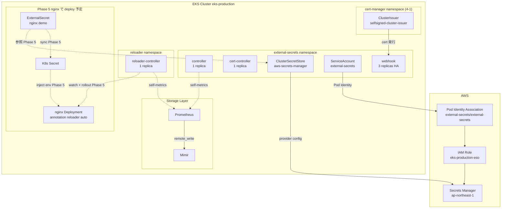

# Phase 4-2: External Secrets Operator + Reloader

**Goal:** Phase 5 nginx で必要となる **AWS Secrets Manager → K8s Secret sync 基盤** + **Secret / ConfigMap 変更時の Deployment auto-rollout 基盤** を確立する。`external-secrets/external-secrets` を `external-secrets` namespace、`stakater/reloader` を `reloader` namespace に deploy。AWS Secrets Manager backend の `ClusterSecretStore` を 1 つ作成 (= 4-1 で deploy 済の `selfsigned-cluster-issuer` で ESO admission webhook cert 発行)。新規 terragrunt stack `aws/eks-secrets/` で Pod Identity Association + IAM role (= AWS Secrets Manager read 用) を provision。本 sub-project 完了時に panicboat cluster は ESO + Reloader infrastructure を持ち、Phase 5 nginx で AWS Secrets Manager 由来の K8s Secret + Reloader による rollout 動作を検証可能になる。

**Architecture summary:**
- `external-secrets/external-secrets` chart で controller / cert-controller / webhook を `external-secrets` namespace に deploy。webhook 3 replicas + `system-cluster-critical` priority class で HA 構成
- `stakater/reloader` chart で reloader-controller を `reloader` namespace に deploy。1 replica + `system-cluster-critical` priority、watch scope は全 namespace + opt-in annotation (`reloader.stakater.com/auto: "true"` 等)
- `ClusterSecretStore` 1 つ (= name `aws-secrets-manager`) で AWS Secrets Manager backend (ap-northeast-1)、Pod Identity Association 経由で auth
- 4-1 で deploy 済の cert-manager + `selfsigned-cluster-issuer` で ESO admission webhook cert を発行
- 新規 terragrunt stack `aws/eks-secrets/` で IAM role `eks-production-eso` (= secretsmanager:GetSecretValue / DescribeSecret + KMS:Decrypt 権限) + Pod Identity Association (`external-secrets/external-secrets` ServiceAccount → IAM role) を provision
- ServiceMonitor で ESO + Reloader self-metrics を Prometheus が scrape、Mimir に remote_write (= Phase 3 pattern)

**Tech stack:**
- Helm + helmfile / `external-secrets/external-secrets` v0.x latest stable / `stakater/reloader` v1.x latest stable
- terragrunt / Pod Identity Association (= Sub-project 1 pattern 踏襲)
- AWS Secrets Manager + KMS (= encryption-at-rest 用 default key)
- cert-manager v1.20.2 + `selfsigned-cluster-issuer` (= Phase 4-1 で deploy 済)
- ServiceMonitor (= kube-prometheus-stack、Phase 3 pattern)

---

## Architecture

### 4-2 完了時 cluster Secret 管理状態



### 役割分離

panicboat の secrets management は **3 layer** で構成:

- **AWS layer**: Secrets Manager (= source of truth)、IAM role + Pod Identity Association で K8s からの auth
- **K8s sync layer**: External Secrets Operator (= AWS から K8s Secret に sync)、ClusterSecretStore で backend 設定
- **K8s reaction layer**: Reloader (= Secret / ConfigMap 変更時に Deployment auto-rollout)

各 layer の責務:
- ESO: AWS Secrets Manager を canonical source とし、K8s Secret に periodically sync (= refresh interval は ExternalSecret 側で指定)
- Reloader: passive watcher、Secret / ConfigMap change event を捕捉して annotation を持つ Deployment / StatefulSet を rollout
- 両者は loosely coupled (= ESO は AWS read のみ、Reloader は K8s 内 watch のみ)、組合せで「AWS Secrets Manager 更新 → K8s Secret 更新 → Pod rollout」 の chain が成立

---

## Scope

### 4-2 で扱う 4 task

| # | Task | File path |
|---|---|---|
| 1 | AWS infra (= IAM role + Pod Identity Association) provision | 新規 `aws/eks-secrets/{envs/production/terragrunt.hcl, modules/eks-secrets/...}` |
| 2 | ESO + ClusterSecretStore deploy | 新規 `kubernetes/components/external-secrets/{namespace.yaml, production/{helmfile.yaml, values.yaml.gotmpl}, production/kustomization/{kustomization.yaml, cluster-secret-store.yaml}}` |
| 3 | Reloader deploy | 新規 `kubernetes/components/reloader/{namespace.yaml, production/{helmfile.yaml, values.yaml.gotmpl}}` |
| 4 | Hydrate manifests + production kustomization に external-secrets / reloader 追加 | 自動生成 |

### Out of scope (= Phase 4-3 / Phase 5 / Phase 6+)

- AWS Secrets Manager に actual secret 作成 (= Phase 5 nginx で nginx-demo-secret 等を作成)
- ExternalSecret resource 作成 (= Phase 5 で nginx 用 ExternalSecret)
- Reloader による pod rollout 動作 verify (= Phase 5 で nginx + demo secret update)
- panicboat business secrets sync (= Phase 6+ で application 投入と同時に設定)
- Multiple ClusterSecretStore / Issuer (= 現状 1 backend で十分、需要発生時に追加)
- KMS key 自前管理 (= AWS managed default key で十分、Phase 6+ で encryption 強化要件あれば customer-managed key 検討)
- 他 admission webhooks の cert-manager migration (= 4-1 で flag、Phase 6+ で incremental)
- Pod CPU requests audit (= 引き継ぎ #9、Phase 5 nginx + 観測 burst 後)
- gp3 StorageClass の Layer 2 documented exception 化 (= 引き継ぎ #1 改題、Phase 6+)

---

## Decisions

### Decision 1: ESO chart = `external-secrets/external-secrets` v0.x latest stable

- **採用**: `external-secrets/external-secrets` chart の最新 stable v0.x
- **理由**:
  - External Secrets Operator 公式 chart、de facto standard
  - 代替 chart 不在 (= ESO 系の chart は external-secrets 一択)
  - Sub-project 4-1 L1 (= chart binary verify) を実装段階で適用、actual latest version + values key path を `helm show values` で事前確認
- **代替案**: なし

### Decision 2: Reloader chart = `stakater/reloader` v1.x latest stable

- **採用**: `stakater/reloader` chart の最新 stable v1.x
- **理由**:
  - Stakater が maintain する公式 chart、Reloader 系の de facto standard
  - 代替 chart 不在
- **代替案**: なし

### Decision 3: Namespace = `external-secrets` + `reloader` (= 各 chart default、dedicated 別々)

- **採用**:
  - ESO components → `external-secrets` namespace
  - Reloader controller → `reloader` namespace
- **理由**:
  - 各 chart の default namespace、industry standard
  - panicboat の 「component 専用 namespace」 pattern (= `cert-manager` / `monitoring` / `karpenter` / `keda` / `external-dns`) と整合
  - ESO は cluster-scoped resource (= ClusterSecretStore / ClusterExternalSecret) を多く扱う、namespace 分離が運用上 clear
  - Reloader は cluster-wide controller (= 全 namespace の Secret / ConfigMap を監視) で、独立した dedicated namespace が design 整合性高い
- **代替案**: 共通 namespace `secrets-management` (= 両者統合) = chart default 外、複雑化

### Decision 4: ESO HA configuration = webhook 3 replicas + `system-cluster-critical` priority class

- **採用**:
  - `controller`: 1 replica (= chart default、main reconciliation loop)
  - `webhook`: **3 replicas** (= cert-manager と同 pattern、admission webhook の SPOF 回避)
  - `cert-controller`: 1 replica (= chart default、Certificate resource auto-creation)
  - 全 component に **`priorityClassName: system-cluster-critical`** 付与
- **理由**:
  - **webhook 3 replicas**: ESO admission webhook が不可になると ExternalSecret CR の create / update / delete が全部 fail する、cert-manager と同 risk 構造のため同 mitigation
  - **`system-cluster-critical` priority**: ESO は cluster-wide secret sync の基盤、4-1 cert-manager と同等の cluster-critical level
  - Sub-project 4-1 で確立した PriorityClass pattern (= `system-cluster-critical`) を ESO にも適用、systematic application
- **代替案**:
  - webhook 1 replica = SPOF、Phase 5 nginx 投入時の availability risk
  - PriorityClass なし = 4b で発覚した CPU 逼迫 node の scheduling deadlock pattern を踏む可能性

### Decision 5: Reloader = 1 replica + `system-cluster-critical` priority class

- **採用**:
  - `reloader-controller`: 1 replica (= chart default、admission webhook 不在で SPOF 影響軽微)
  - `priorityClassName: system-cluster-critical`
- **理由**:
  - Reloader は **passive watcher** (= 既存 Secret / ConfigMap の change event を監視して Deployment annotate 更新するだけ)、admission webhook 不在で 1 replica failure 時の影響は "rollout trigger 一時不可" のみ (= 既存 pod は動作継続)
  - 1 replica + auto-restart で sufficient、HA は overkill (= leader election overhead vs benefit)
  - PriorityClass 4-1 / ESO と整合
- **代替案**:
  - 2 replicas + leader election = HA だが complexity 増、benefit 薄い
  - PriorityClass なし = 同上 risk

### Decision 6: ClusterSecretStore 1 つ = `aws-secrets-manager` (= AWS Secrets Manager backend、ap-northeast-1)

- **採用**: cluster-scoped `ClusterSecretStore` 名 `aws-secrets-manager`、AWS Secrets Manager backend (ap-northeast-1)、Pod Identity 経由で auth
- **理由**:
  - cluster 全 namespace で共有する 1 backend、namespace ごとの SecretStore 不要 (= panicboat の secrets は単一 AWS account / region に集約)
  - 1 ClusterSecretStore で simplicity、Phase 6+ で multi-region / multi-account 等の need が出れば追加可能
  - Pod Identity 経由 auth は Sub-project 1-4a で確立した pattern (= IRSA より新しい AWS Pod Identity Association)
- **代替案**:
  - SecretStore (namespace-scoped) = 各 namespace に SecretStore 必要、運用 overhead 増
  - 複数 ClusterSecretStore = 単一 backend で run には過剰
  - SSM Parameter Store backend = roadmap 表 で AWS Secrets Manager 主体と明示、SSM は Phase 6+ 候補

### Decision 7: AWS infra stack = `aws/eks-secrets/` (= 命名 clarity)

- **採用**: 新規 terragrunt stack `aws/eks-secrets/` で IAM role + Pod Identity Association を provision
- **理由**:
  - "ESO" よりも「secrets management 関連の AWS infra」という概念の方が **可読性高い** (= user 判断)
  - Sub-project 1 で確立した「1 stack per major function」 pattern (= `aws/eks-{metrics,logs,traces}/`) と整合
  - 現時点 ESO 用 IAM のみ provision、将来拡張は前提としない (= 純粋な命名 clarity)
- **代替案**:
  - `aws/eks-eso/` = 命名が略語的、後続作業者に意味伝達コスト
  - `aws/eks/` に inline = main EKS stack の scope 拡大、概念分離曖昧

### Decision 8: ESO IAM permissions = `secretsmanager:GetSecretValue` + `secretsmanager:DescribeSecret` + `kms:Decrypt` (= minimum required)

- **採用**: IAM role `eks-production-eso` に以下の minimum 権限のみ付与:

```json
{
  "Effect": "Allow",
  "Action": [
    "secretsmanager:GetSecretValue",
    "secretsmanager:DescribeSecret"
  ],
  "Resource": "arn:aws:secretsmanager:ap-northeast-1:559744160976:secret:*"
}
```

  + KMS decrypt (= AWS managed default key への access):

```json
{
  "Effect": "Allow",
  "Action": "kms:Decrypt",
  "Resource": "*",
  "Condition": {
    "StringEquals": {
      "kms:ViaService": "secretsmanager.ap-northeast-1.amazonaws.com"
    }
  }
}
```

- **理由**:
  - ESO は read-only operation (= sync to K8s Secret)、write 権限不要
  - `Resource: "secret:*"` で AWS account 内全 secrets を read 可能、panicboat の operational simplicity (= 別途 secret-level scoping は Phase 6+ multi-team 化時に評価)
  - KMS Decrypt は AWS managed default key 用、`kms:ViaService` condition で Secrets Manager 経由のみに限定 (= least privilege)
- **代替案**:
  - 全 secrets に対する `secretsmanager:*` = write 権限含む、最少特権原則違反
  - secret-name ベース fine-grained scoping = panicboat の secret naming convention 確立後に Phase 6+ で評価

### Decision 9: ESO admission webhook cert = cert-manager + `selfsigned-cluster-issuer` (= 4-1 で確立)

- **採用**: ESO chart の `webhook.certManager.enabled: true` + `webhook.certManager.issuerRef.name: selfsigned-cluster-issuer` で 4-1 で deploy 済の ClusterIssuer を参照
- **理由**:
  - 4-1 で cert-manager + selfsigned-cluster-issuer を deploy したまさにこの use case (= ESO admission webhook cert)、systematic application
  - ESO chart は cert-manager integration を chart values で native support
  - Sub-project 4-1 L3 (= cert-manager swap pattern) で確立した clean transition
- **代替案**:
  - ESO chart 内蔵の self-signed cert (= `webhook.certManager.enabled: false`) = 4-1 で cert-manager を deploy した意味がない、ESO は cert-manager 経由が standard

### Decision 10: Reloader watch scope = 全 namespace + opt-in annotation (= chart default)

- **採用**: Reloader の watch scope は default (= `reloader.watchGlobally: true`)、各 Deployment / StatefulSet 側で **opt-in annotation** で対象指定
- **動作**:
  - Reloader は全 namespace の Secret / ConfigMap change を監視
  - Deployment / StatefulSet が `reloader.stakater.com/auto: "true"` annotation を持つ → 関連する全 Secret / ConfigMap 変更で rollout
  - もしくは `secret.reloader.stakater.com/reload: "<secret-name>"` で specific secret 指定
- **理由**:
  - chart default の opt-in pattern が standard、明示 annotation で対象を限定 = 意図しない rollout 防止
  - Phase 5 nginx で `reloader.stakater.com/auto: "true"` を nginx Deployment に annotate して動作 verify
- **代替案**:
  - `watchGlobally: false` (= specific namespace 限定) = 設定 overhead、cluster-wide controller の意義減
  - opt-out (= default で全部 rollout) = 危険、意図しない downtime

### Decision 11: 1 sub-project 構成 (= ESO + Reloader + AWS infra を atomic merge)

- **採用**: ESO chart deploy + Reloader chart deploy + ClusterSecretStore + `aws/eks-secrets/` provision を 4-2 sub-project の atomic 4 commits 1 PR で merge
- **理由**:
  - 依存関係: AWS infra (= IAM role + Pod Identity Association) → ESO + ClusterSecretStore (= IAM role を参照) → 同時 deploy で動作確認
  - Reloader は AWS access 不要、独立 deploy 可能だが Phase 4 同 sub-project でまとめる方が roadmap 整合
  - Sub-project 4a (= Tempo + OTel Collector) と同 pattern (= 関連 components を 1 sub-project)
- **代替案**: 4-2a (AWS infra) / 4-2b (ESO) / 4-2c (Reloader) 3 sub-project 分割 = 過剰細分、依存関係明確で atomic merge が natural

---

## Components / 変更詳細

### Task 1: AWS infra (= `aws/eks-secrets/` 新規 stack)

**Files (新規):**

```
aws/eks-secrets/
├── envs/
│   └── production/
│       ├── terragrunt.hcl                      # production env config
│       └── ...
└── modules/
    └── eks-secrets/
        ├── main.tf                              # IAM role + Pod Identity Association
        ├── variables.tf
        └── outputs.tf
```

**`modules/eks-secrets/main.tf`** (= 主要構造、Sub-project 1 の `eks-traces` pattern 踏襲):

```hcl
# =============================================================================
# IAM Role for ESO (= External Secrets Operator)
# =============================================================================
resource "aws_iam_role" "eso" {
  name = "${var.cluster_name}-eso"

  assume_role_policy = jsonencode({
    Version = "2012-10-17"
    Statement = [{
      Effect = "Allow"
      Principal = {
        Service = "pods.eks.amazonaws.com"
      }
      Action = [
        "sts:AssumeRole",
        "sts:TagSession"
      ]
    }]
  })
}

# =============================================================================
# IAM Policy: AWS Secrets Manager read access (= minimum required)
# =============================================================================
resource "aws_iam_role_policy" "eso_secrets_access" {
  name = "secrets-access"
  role = aws_iam_role.eso.id

  policy = jsonencode({
    Version = "2012-10-17"
    Statement = [
      {
        Sid    = "SecretsManagerRead"
        Effect = "Allow"
        Action = [
          "secretsmanager:GetSecretValue",
          "secretsmanager:DescribeSecret"
        ]
        Resource = "arn:aws:secretsmanager:${var.aws_region}:${var.account_id}:secret:*"
      },
      {
        Sid    = "KmsDecryptForSecretsManager"
        Effect = "Allow"
        Action = "kms:Decrypt"
        Resource = "*"
        Condition = {
          StringEquals = {
            "kms:ViaService" = "secretsmanager.${var.aws_region}.amazonaws.com"
          }
        }
      }
    ]
  })
}

# =============================================================================
# Pod Identity Association
# =============================================================================
resource "aws_eks_pod_identity_association" "eso" {
  cluster_name    = var.cluster_name
  namespace       = "external-secrets"
  service_account = "external-secrets"
  role_arn        = aws_iam_role.eso.arn
}
```

**`envs/production/terragrunt.hcl`** (= Sub-project 1 の eks-traces pattern):

```hcl
include "root" {
  path = find_in_parent_folders("root.hcl")
}

terraform {
  source = "../../modules/eks-secrets"
}

inputs = {
  cluster_name = "eks-production"
  aws_region   = "ap-northeast-1"
  account_id   = "559744160976"
}
```

**Outputs (= terragrunt apply 後に確認):**
- `aws_iam_role.eso.arn` = `arn:aws:iam::559744160976:role/eks-production-eso`
- `aws_eks_pod_identity_association.eso.association_id`
- `aws_eks_pod_identity_association.eso.association_arn`

### Task 2: ESO + ClusterSecretStore deploy

**Files (新規):**

```
kubernetes/components/external-secrets/
├── namespace.yaml                              # external-secrets namespace 定義 (= 共通)
└── production/
    ├── helmfile.yaml                           # external-secrets/external-secrets chart deploy
    ├── values.yaml.gotmpl                      # HA + priority + cert-manager integration + ServiceMonitor
    └── kustomization/
        ├── kustomization.yaml
        └── cluster-secret-store.yaml           # AWS Secrets Manager backend ClusterSecretStore
```

**`namespace.yaml`:**

```yaml
# =============================================================================
# external-secrets Namespace
# =============================================================================
# External Secrets Operator (controller / cert-controller / webhook) の専用 namespace。
# AWS Secrets Manager から K8s Secret への sync 基盤。
# =============================================================================
apiVersion: v1
kind: Namespace
metadata:
  name: external-secrets
  labels:
    app.kubernetes.io/name: external-secrets
```

**`production/helmfile.yaml`:**

```yaml
# =============================================================================
# external-secrets Helmfile for production
# =============================================================================
# External Secrets Operator (= external-secrets/external-secrets) の deploy。
# admission webhook cert は cert-manager + selfsigned-cluster-issuer で発行、
# ClusterSecretStore は kustomization で別途 deploy (= chart 範囲外)。
# =============================================================================
environments:
  production:
---
repositories:
  - name: external-secrets
    url: https://charts.external-secrets.io

releases:
  - name: external-secrets
    namespace: external-secrets
    chart: external-secrets/external-secrets
    version: "<step 1 で確認した latest stable、例 v0.10.x>"
    values:
      - values.yaml.gotmpl
```

**`production/values.yaml.gotmpl`** (= 主要 keys、`helm show values` で chart 固有 key を事前 verify した上で記述):

```yaml
# external-secrets Configuration for production
# AWS Secrets Manager backend で K8s Secret を sync する基盤。

# =============================================================================
# CRDs (= chart 経由で install)
# =============================================================================
installCRDs: true

# =============================================================================
# Global config: Priority class
# =============================================================================
priorityClassName: system-cluster-critical

# =============================================================================
# Controller (= main reconciliation loop)
# =============================================================================
replicaCount: 1
resources:
  requests:
    cpu: 10m
    memory: 32Mi
  limits:
    memory: 128Mi

# =============================================================================
# Webhook (= 公式 production = 3 replicas で HA)
# =============================================================================
webhook:
  replicaCount: 3
  certManager:
    enabled: true
    cert:
      issuerRef:
        name: selfsigned-cluster-issuer
        kind: ClusterIssuer
        group: cert-manager.io
  resources:
    requests:
      cpu: 10m
      memory: 32Mi
    limits:
      memory: 64Mi

# =============================================================================
# Cert Controller (= Certificate resource auto-creation)
# =============================================================================
certController:
  replicaCount: 1
  resources:
    requests:
      cpu: 10m
      memory: 32Mi
    limits:
      memory: 64Mi

# =============================================================================
# ServiceMonitor (= Phase 3 pattern)
# =============================================================================
serviceMonitor:
  enabled: true
  additionalLabels:
    release: kube-prometheus-stack
  interval: 30s
```

**NOTE on chart 固有 keys**: ESO chart の actual key path は実装段階で `helm show values external-secrets/external-secrets --version <latest>` で確認。具体的には:
- `installCRDs` vs `crds.enabled` (= cert-manager と異なる可能性)
- `webhook.certManager.cert.issuerRef.*` の正確な path
- `serviceMonitor.additionalLabels` vs `serviceMonitor.labels` vs `serviceMonitor.extraLabels`

**`production/kustomization/cluster-secret-store.yaml`:**

```yaml
# =============================================================================
# AWS Secrets Manager ClusterSecretStore
# =============================================================================
# cluster 全 namespace から参照可能な共有 SecretStore。
# Pod Identity Association 経由で AWS Secrets Manager (= ap-northeast-1) に access。
# =============================================================================
apiVersion: external-secrets.io/v1beta1
kind: ClusterSecretStore
metadata:
  name: aws-secrets-manager
spec:
  provider:
    aws:
      service: SecretsManager
      region: ap-northeast-1
      auth:
        jwt:
          serviceAccountRef:
            name: external-secrets
            namespace: external-secrets
```

**NOTE on auth method**: ESO の Pod Identity Association を使う場合、auth block の指定方法は ESO chart version で異なる:
- 古い version (= < v0.9.x): `auth.jwt.serviceAccountRef` で IRSA token 経由
- 新 version (= v0.10+): Pod Identity Association を auto detect、auth block 省略可能 or 別 syntax

実装段階で ESO 公式 docs ([external-secrets.io](https://external-secrets.io/main/provider/aws-secrets-manager/)) を参照、actual chart version の syntax を採用。

### Task 3: Reloader deploy

**Files (新規):**

```
kubernetes/components/reloader/
├── namespace.yaml                              # reloader namespace 定義
└── production/
    ├── helmfile.yaml                           # stakater/reloader chart deploy
    └── values.yaml.gotmpl                      # priority class + ServiceMonitor
```

**`namespace.yaml`:**

```yaml
# =============================================================================
# reloader Namespace
# =============================================================================
# Stakater Reloader (= reloader-controller) の専用 namespace。
# Secret / ConfigMap 変更時に annotation 付きの Deployment / StatefulSet を auto-rollout する。
# =============================================================================
apiVersion: v1
kind: Namespace
metadata:
  name: reloader
  labels:
    app.kubernetes.io/name: reloader
```

**`production/helmfile.yaml`:**

```yaml
# =============================================================================
# reloader Helmfile for production
# =============================================================================
# Stakater Reloader の deploy。passive watcher、admission webhook 不在のため
# 1 replica で十分。
# =============================================================================
environments:
  production:
---
repositories:
  - name: stakater
    url: https://stakater.github.io/stakater-charts

releases:
  - name: reloader
    namespace: reloader
    chart: stakater/reloader
    version: "<step 1 で確認した latest stable、例 v1.x>"
    values:
      - values.yaml.gotmpl
```

**`production/values.yaml.gotmpl`** (= 主要 keys):

```yaml
# reloader Configuration for production
# Secret / ConfigMap 変更時の Deployment / StatefulSet auto-rollout。
# watch scope は全 namespace、opt-in annotation で対象指定。

reloader:
  watchGlobally: true                  # 全 namespace を watch (= chart default)

  deployment:
    replicas: 1                        # passive watcher、SPOF 影響軽微

    priorityClassName: system-cluster-critical

    resources:
      requests:
        cpu: 10m
        memory: 32Mi
      limits:
        memory: 128Mi

  podMonitor:
    enabled: false                     # ServiceMonitor を使うため podMonitor は不要

  service:
    enabled: true                      # ServiceMonitor は Service が必要

  serviceMonitor:
    enabled: true
    additionalLabels:
      release: kube-prometheus-stack
```

**NOTE on chart 固有 keys**: stakater/reloader chart の actual key path も実装段階で `helm show values stakater/reloader --version <latest>` で確認。`reloader.deployment.priorityClassName` / `reloader.serviceMonitor.additionalLabels` 等の path は chart 固有。

### Task 4: production manifests hydrate + kustomization 更新

**Files (auto-generated):**
- 新規: `kubernetes/manifests/production/external-secrets/{kustomization.yaml, manifest.yaml}`
- 新規: `kubernetes/manifests/production/reloader/{kustomization.yaml, manifest.yaml}`
- 修正: `kubernetes/manifests/production/00-namespaces/namespaces.yaml` (= external-secrets + reloader namespace blocks 追加)
- 修正: `kubernetes/manifests/production/kustomization.yaml` (= ./external-secrets + ./reloader resources 追加、auto-insert)

**手順:**

```bash
# 1. AWS infra 先 provision (= terragrunt apply)
cd aws/eks-secrets/envs/production
terragrunt init
terragrunt plan       # IAM role + Pod Identity Association を確認
terragrunt apply      # 適用

# 2. K8s component manifests 生成
cd kubernetes
make hydrate-component COMPONENT=external-secrets ENV=production
make hydrate-component COMPONENT=reloader ENV=production
make hydrate-index ENV=production
```

**動作:**
- AWS 側: IAM role + Pod Identity Association が provision、ESO ServiceAccount が assume 可能に
- K8s 側: ESO + Reloader が deploy、ClusterSecretStore が `selfsigned-cluster-issuer` 由来の cert-manager-managed admission webhook cert を持つ
- ServiceMonitor で Prometheus が scrape、Mimir に remote_write
- ClusterSecretStore Ready=True (= Pod Identity 経由で AWS Secrets Manager API call が成功する verification)

---

## Risks / Mitigations

### 高 risk

| Risk | Trigger | Mitigation | Recovery |
|---|---|---|---|
| **ClusterSecretStore Ready=False (= Pod Identity Association が機能しない)** | terragrunt apply で IAM role provision されるが、Pod Identity Association の伝播 (= EKS API server cache) に時間がかかる、もしくは IAM permissions が不足 | terragrunt apply 後 5-10 min 待機、`aws eks list-pod-identity-associations` で association 反映を確認、IAM role policy を `aws iam get-role-policy` で permissions 確認 | ClusterSecretStore status の `Conditions[].Reason` で具体 error 確認、IAM permissions 不足なら terragrunt で policy 修正、再 apply。Sub-project 4a L3 (= persistent vs transient checklist) 適用 |
| **ESO admission webhook 起動失敗で全 ESO CR 操作 fail** | webhook 3 replicas のうち全 fail、もしくは cert-manager 由来 cert が injection 失敗 | webhook 3 replicas + `system-cluster-critical` priority で SPOF 回避、4-1 で確立した cert-manager swap pattern を再現 (= clean transition) | webhook 復旧まで ExternalSecret CR の create / update 不可、既 sync 済 K8s Secret は影響なし。Flux suspend → revert PR → resume |
| **ESO chart の chart 固有 key path が想定と異なる** | Sub-project 3 L3 + 4b L1 で flag した chart 固有 key 構造、ESO chart の specific path 不確定 | 実装段階で `helm show values external-secrets/external-secrets` で正確な key path 確認、`helm template` 出力で render verify (= 4b L1 の systematic application) | values 修正で正しい key 名に修正、再 hydrate |

### 中 risk

| Risk | Trigger | Mitigation | Recovery |
|---|---|---|---|
| **ESO ClusterSecretStore auth syntax が chart version で異なる** | ESO v0.9.x → v0.10.x で auth block syntax が変更、actual chart version の syntax を要 verify | ESO 公式 docs ([external-secrets.io/main/provider/aws-secrets-manager/](https://external-secrets.io/main/provider/aws-secrets-manager/)) を実装段階で参照、Pod Identity Association vs IRSA の差を chart version 別に確認 | auth syntax 変更で apply、ClusterSecretStore Ready=True 確認 |
| **Reloader chart の `priorityClassName` 配置が想定と異なる** | stakater/reloader chart の `reloader.deployment.priorityClassName` の path が chart version で異なる可能性 | 実装段階で `helm show values stakater/reloader` + `helm template` で render verify | values 修正で正しい path に修正、再 hydrate |
| **ESO chart の起動 transient (= cert-manager と同 chicken-and-egg)** | ESO controller 起動 → admission webhook 起動前に CR reconcile 試行 → "no endpoints available" transient (= 4-1 cert-manager と同 pattern) | Sub-project 4-1 L2 適用、~30-60s 以内の transient は L3 checklist で除外、retry で resolve | persistent error の場合は webhook pods 状態 / cert-manager 由来 cert injection 状態を確認 |

### 低 risk

| Risk | Trigger | Mitigation | Recovery |
|---|---|---|---|
| **Reloader が意図しない rollout を triggered** | `reloader.stakater.com/auto: "true"` annotation の typo 等で意図せぬ Deployment が rollout target | Phase 5 nginx 投入時に annotation を **explicit に意図した Deployment のみ** 設定、annotation typo は code review で catch | annotation を削除して rollout 停止 |
| **ESO IAM role の権限不足** | `secretsmanager:GetSecretValue` 不足 / 特定 secret に対する access 権限不足 | Decision 8 で minimum required permissions を明示済、`Resource: "secret:*"` で account 内全 secrets access | terragrunt で policy 修正、再 apply |
| **AWS Secrets Manager service quota** | account 全体で 1000 secrets / region quota、4-2 では actual secret 不在で quota 圧迫なし | Phase 5 / 6+ で application secret 増加時に monitoring | AWS support に quota increase 依頼 |

## Rollback Strategy

### Pattern A: Standard rollback (= Flux suspend + revert + terragrunt destroy)

Sub-project 2 / 3 / 4a / 4b / 4-1 で確立した standard runbook + terragrunt-side rollback:

```bash
# 1. Flux 一時停止
flux suspend kustomization flux-system -n flux-system

# 2. K8s-side revert PR を作成 + main に merge
gh pr create --title "revert: Phase 4-2 — ESO + Reloader" \
  --body "Reverting #N due to <issue>" --base main
gh pr merge <revert-pr-num> --squash

# 3. AWS infra rollback (= terragrunt destroy)
cd aws/eks-secrets/envs/production
terragrunt destroy

# 4. Flux 再開
flux resume kustomization flux-system -n flux-system

# 5. 確認
kubectl get pods -n external-secrets 2>&1 || echo "(external-secrets namespace 削除確認)"
kubectl get pods -n reloader 2>&1 || echo "(reloader namespace 削除確認)"
aws iam get-role --role-name eks-production-eso 2>&1 || echo "(IAM role 削除確認)"
```

### Pattern B: Partial rollback (= ESO のみ、Reloader 維持)

ESO に問題があるが Reloader は問題なく稼働している場合:
- ESO chart + ClusterSecretStore + AWS infra (= IAM role + Pod Identity) を revert
- Reloader は維持 (= 将来 Phase 5 で利用予定)
- Reloader 単独では機能しないが、deploy 状態は維持して次 phase で ESO 再 deploy

### Pattern C: Reloader のみ rollback

Reloader が誤動作で意図しない rollout を triggered する場合:
- Reloader chart のみ revert
- ESO + ClusterSecretStore + AWS infra は維持
- Phase 5 で ESO 経由の secret sync を verify、Reloader は再 design 後 deploy

### Failure 時の data loss assessment

| Component | Data loss 範囲 | Recovery time |
|---|---|---|
| **ESO controller** | 影響なし (= 4-2 で初 deploy、actual ExternalSecret 不在) | 即時 (= revert apply 後 namespace 削除) |
| **ClusterSecretStore** | 影響なし (= 4-2 で初 deploy、ExternalSecret 不在で Ready=True 状態のみ消える) | 即時 |
| **Reloader controller** | 影響なし (= 4-2 で初 deploy、annotation 付き workload 不在) | 即時 |
| **AWS IAM role + Pod Identity Association** | 影響なし (= 4-2 で初 provision、他 component と無関係) | terragrunt destroy 後即時 |
| **既存 4-1 path (= cert-manager + Cilium TLS)** | 影響なし (= cert-manager は ESO とは独立稼働) | N/A |
| **既存 Phase 3 stack (= Mimir / Loki / Tempo)** | 影響なし | N/A |

## Special considerations

### terragrunt apply の timing

ESO chart は ClusterSecretStore で AWS Secrets Manager API call を行うため、**Pod Identity Association が EKS API server cache に伝播されてから** ClusterSecretStore が Ready=True になる。

**手順 (= K8s deploy 順):**
1. terragrunt apply で AWS infra provision
2. `aws eks list-pod-identity-associations --cluster-name eks-production --namespace external-secrets` で association 反映を確認 (= 通常即時、最大 ~1 min)
3. K8s side deploy (= Flux reconcile)
4. ClusterSecretStore Ready=True を確認 (= Pod Identity 動作 verify)

= AWS-side と K8s-side の deploy 順序は **AWS が先**、Flux reconcile は AWS infra ready 後に triggered。

### ESO upgrade migration considerations (= future)

ESO chart upgrade で v0.x の breaking change がある可能性 (= ClusterSecretStore schema 変更等):
- chart upgrade は別 sub-project で扱う、本 4-2 範囲外
- Sub-project 2 L1 (= chart upgrade での upstream changelog 確認) を適用

---

## Post-flight Check (post-merge verification)

PR merge + terragrunt apply + Flux reconciliation 完了後、以下 15 項目を順に verify する。Sub-project 4a L3 (= persistent vs transient error 切り分け 5-step checklist) を適用、起動 ~60 秒以内の transient error は retry で resolve するパターンを認識した上で判定。Sub-project 4-1 L2 (= cert-manager-style chicken-and-egg startup pattern) も認識。

### 1. AWS infra (= terragrunt apply 結果)

```bash
zsh -ic 'eks-login production >/dev/null 2>&1
aws iam get-role --role-name eks-production-eso --query "Role.Arn" --output text
aws iam get-role-policy --role-name eks-production-eso --policy-name secrets-access \
  --query "PolicyDocument.Statement[*].Action" --output json
aws eks list-pod-identity-associations --cluster-name eks-production --namespace external-secrets \
  --query "associations[?serviceAccount==\`external-secrets\`]" --output json'
```
Expected:
- IAM role ARN: `arn:aws:iam::559744160976:role/eks-production-eso`
- Policy actions: `["secretsmanager:GetSecretValue", "secretsmanager:DescribeSecret"]` + `kms:Decrypt`
- Pod Identity Association: 1 件、`namespace=external-secrets, serviceAccount=external-secrets`

### 2. Flux applied revision = 4-2 merge commit

```bash
flux get kustomizations -n flux-system 2>&1 | head -3
```
Expected: `flux-system` `READY=True`、`Applied revision: main@sha1:<4-2 merge commit>`

### 3. external-secrets namespace + 全 component pods Ready

```bash
kubectl get pods -n external-secrets
```
Expected: 5 pods 全 Running (= controller × 1 + cert-controller × 1 + webhook × 3)、restartCount 0

### 4. ESO webhook 3 replicas + system-cluster-critical priority 確認

```bash
kubectl get pods -n external-secrets -l app.kubernetes.io/name=external-secrets-webhook \
  -o jsonpath="{range .items[*]}{.metadata.name}: priority={.spec.priorityClassName}{\"\\n\"}{end}"
```
Expected: 3 pods、全て `priority=system-cluster-critical`

### 5. ESO CRDs install 確認

```bash
kubectl get crd | grep external-secrets.io
```
Expected: 7+ CRDs (`clusterexternalsecrets` / `clustersecretstores` / `externalsecrets` / `secretstores` / `clusterpushsecrets` / `pushsecrets` 等)

### 6. ESO admission webhook cert (= cert-manager 由来)

```bash
kubectl get certificate -n external-secrets 2>&1 | head -5
```
Expected: `external-secrets-webhook` Certificate が `Ready=True`、`selfsigned-cluster-issuer` 由来 (= 4-1 で deploy 済 ClusterIssuer)

### 7. ClusterSecretStore Ready=True (= 重要 = Pod Identity 動作 verify)

```bash
kubectl get clustersecretstore aws-secrets-manager
kubectl get clustersecretstore aws-secrets-manager -o jsonpath="{.status.conditions[?(@.type=='Ready')]}{\"\\n\"}"
```
Expected: 
- `READY=True`
- `status.conditions[].type=Ready`、`status=True`、`reason=Ready` or 同等の success message

NOTE: Ready=False の場合、Sub-project 4a L3 適用 — 起動直後 ~60s 以内なら Pod Identity propagation 待ち、5+ 分経過後の persistent failure なら IAM permissions / Pod Identity Association 設定 issue を疑う。

### 8. ESO ServiceMonitor 存在 + Prometheus targets で UP

```bash
kubectl get servicemonitor -n external-secrets -l release=kube-prometheus-stack 2>&1
curl -s http://localhost:9090/api/v1/targets | \
  jq '.data.activeTargets[] | select(.labels.job | test("external-secrets")) | {job: .labels.job, health: .health}'
```
Expected: ESO 関連 ServiceMonitor が存在、Prometheus targets で `health: up`

### 9. reloader namespace + pod Ready

```bash
kubectl get pods -n reloader
```
Expected: 1 pod (`reloader-reloader-...`) `Running 1/1`、restartCount 0

### 10. Reloader pod の system-cluster-critical priority + watch scope 確認

```bash
kubectl get pods -n reloader -o jsonpath="{range .items[*]}{.metadata.name}: priority={.spec.priorityClassName}{\"\\n\"}{end}"
kubectl get deployment -n reloader reloader-reloader -o jsonpath="{.spec.template.spec.containers[0].args}{\"\\n\"}"
```
Expected:
- `priority=system-cluster-critical`
- args に `--watch-globally=true` 等の watch all namespaces 引数

### 11. Reloader ServiceMonitor + Prometheus targets で UP

```bash
kubectl get servicemonitor -n reloader 2>&1
curl -s http://localhost:9090/api/v1/targets | \
  jq '.data.activeTargets[] | select(.labels.job | test("reloader")) | {job: .labels.job, health: .health}'
```
Expected: reloader ServiceMonitor 存在、Prometheus targets で `health: up`

### 12. Mimir で external-secrets / reloader metrics query 可能

```bash
# Grafana Explore で Mimir datasource、以下 query
externalsecret_sync_calls_total                # ESO sync 統計
reloader_reload_executed_total                  # Reloader rollout 実行統計
curl -s 'http://localhost:9090/api/v1/query?query=count(externalsecret_sync_calls_total)' | \
  jq '.data.result | length'
```
Expected: 両 metrics が query 可能 (= remote_write 済)、ただし actual sync / rollout 不在のため value は 0 が想定

### 13. ESO Pod Identity 動作の direct verify (= Pod から AWS API call test)

```bash
# ESO controller pod から直接 aws cli で Secrets Manager list 試行
kubectl exec -n external-secrets deployment/external-secrets -- \
  /bin/sh -c "aws secretsmanager list-secrets --region ap-northeast-1 --max-results 1 2>&1 | head -3"
```
Expected: `SecretList: []` or 既存 secret 1 件 (= AWS Secrets Manager API call 成功、Pod Identity が機能)

NOTE: ESO container image に aws cli が含まれていない可能性あり、その場合は ClusterSecretStore Ready=True (= step 7) で代替検証。

### 14. 既存 4-1 path (= cert-manager + Cilium TLS) regression なし

```bash
kubectl get pods -n cert-manager | grep -v Completed | grep -v "1/1\|2/2\|3/3" | head -3 || echo "(全 cert-manager pod Ready)"
kubectl get certificate -A 2>&1 | head -10
```
Expected: 全 cert-manager pod Ready、4-1 で deploy した Certificate (`hubble-server-certs` 等) 全て `Ready=True`

### 15. ESO + Reloader log で過去 10m persistent error なし

```bash
kubectl logs -n external-secrets -l app.kubernetes.io/name=external-secrets --since=10m --tail=30 2>&1 | grep -iE "(error|fail)" | head -5
kubectl logs -n reloader -l app.kubernetes.io/name=reloader --since=10m --tail=30 2>&1 | grep -iE "(error|fail)" | head -5
```
Expected: 両 component とも過去 10m 以内 persistent error なし。起動直後 ~60s 以内の transient error (= "no endpoints available" 等の chicken-and-egg pattern) は L3 checklist で除外。

### Sub-project 4a L3 + 4-1 L2 適用 (= persistent vs transient checklist)

各 verification step で error 発見時:

1. **時刻情報を確認**: error 発生時刻 vs Pod 起動時刻 vs 現在時刻
2. **time-bounded log query**: `kubectl logs --since=10m` で最近の error/warn を確認
3. **Pod restart count 確認**: `restartCount > 0` なら persistent
4. **kubectl get / describe を完全表示**: `head -N` truncate 避け、`-o jsonpath` で field 単位取得
5. **cert-manager-style chicken-and-egg startup pattern 認識**: ESO controller も webhook readiness gap で transient error 発生する (= 4-1 L2 と同 pattern)、~30-60s 以内なら正常動作
6. **AWS Pod Identity propagation timing 認識**: terragrunt apply 後の Pod Identity Association 反映に最大 ~1 min、ClusterSecretStore Ready=True までは少し待ち時間あり

過去 ~10 min 以内に同種 error 無ければ resolved 判定、persistent issue を確信する evidence を集めてから fix 着手。

---

## Sub-project 1-4-1 Learnings の適用

Phase 3 + Phase 4-1 で蓄積された learnings (Sub-project 1-4-1 の合計 ~36 件) のうち、本 sub-project で実適用されるものを記録。Sub-project 4-1 L1 (= 4b L1 systematic application が有効) を継続、Phase 4-2 でも runtime issue 0 件目標。

### Sub-project 2 (Mimir) Learnings の適用

| Learning | 4-2 での適用 |
|---|---|
| **L1 (chart upgrade での upstream changelog 確認)** | ESO + Reloader chart の latest stable + release notes / breaking changes を実装段階で確認、特に ESO は v0.10.x 系で auth syntax 変更の可能性あり |
| **L2-L5 (gp3 / Mimir 3.x schema / TSDB / Multi-Attach)** | 4-2 では PVC / Mimir 系 touched なし、N/A |

### Sub-project 3 (Loki + Fluent Bit) Learnings の適用

| Learning | 4-2 での適用 |
|---|---|
| **L1 (chart 内部固定 path 問題)** | ESO chart の `webhook.certManager.cert.issuerRef.*` / Reloader chart の `reloader.deployment.priorityClassName` の正確な path を実装段階で `helm show values` で pre-validate (= 4-1 で確立した systematic step) |
| **L2 (IAM 公式準拠)** | 4-2 で IAM provision、ESO 公式 docs の minimum permissions (= `secretsmanager:GetSecretValue` + `kms:Decrypt`) を direct citation して採用 |
| **L3 (chart probe / serviceMonitor key 確認)** | ESO chart `serviceMonitor.additionalLabels` / Reloader chart `reloader.serviceMonitor.additionalLabels` の path を実装段階で精査 |
| **L4 (uniform retention は S3 lifecycle で)** | 4-2 では retention touched なし |
| **L5 (Flux suspend pattern)** | Risks / Rollback section で Pattern A / B / C として明示、加えて terragrunt destroy も含む multi-layer rollback |
| **L6 (Loki `auth_enabled: false` 時 default tenant `fake`)** | 4-2 では Loki touched なし |
| **L7 (sibling stack symmetric)** | 4-2 は ESO + Reloader の 2 chart deploy、namespace 分離で 各 chart 単独管理 |
| **L8 (post-flight check)** | 15 項目を post-flight section で明示適用 |
| **L9 (公式 docs 引用)** | ESO 公式 docs ([external-secrets.io](https://external-secrets.io/main/provider/aws-secrets-manager/)) を ClusterSecretStore auth syntax で direct citation |
| **L10 (Phase 3 全体 9 件 → 12 件 runtime issue)** | 4-1 で 0 件達成、4-2 でも L1-L9 + 4a L1-L8 + 4b L1-L4 + 4-1 L1-L6 適用、Phase 4-2 も 0 runtime issue 目標 |

### Sub-project 4a (Tempo + OTel Collector) Learnings の適用

| Learning | 4-2 での適用 |
|---|---|
| **L1 (累積効果で 0 issue)** | 4-2 でも 0 runtime issue 目標、Sub-project 1-4-1 learnings 全項目適用 |
| **L2 (startup transient を persistent と決めつけない)** | post-flight verification で起動 ~60s 以内の transient error は L3 checklist で除外、特に ESO の chicken-and-egg startup + Pod Identity Association 反映時間を認識 |
| **L3 (persistent vs transient 5-step checklist)** | post-flight check section の最後に明示組み込み、加えて AWS Pod Identity propagation timing も追加 |
| **L4 (bucket-wide IAM)** | 4-2 では `Resource: "secret:*"` で account 内全 secrets access、Phase 6+ で fine-grained scoping 評価 |
| **L5 (kubectl 出力 truncate に注意)** | post-flight check で `head -N` 避け、`-o jsonpath` / `-o yaml` で完全 field 取得 |
| **L6 (不要な runtime fix の早期 abort)** | runtime issue 発見時、L3 checklist で evidence を集めてから fix 着手 |
| **L7 (sub-project 分割 ROI)** | 4-2 は ESO + Reloader + AWS infra を 1 sub-project (= D11)、依存関係明確で atomic merge が natural |
| **L8 (Phase 4 引き継ぎ事項)** | 4-2 完了で 引き継ぎ事項 #4 (= OTel Operator deploy 検討) は依然 Phase 5 で評価、4-2 では ESO + Reloader が roadmap Phase 4 の primary goal |

### Sub-project 4b (logs path completion) Learnings の適用

| Learning | 4-2 での適用 |
|---|---|
| **L1 (spec 段階 chart binary verify の重要性)** | **最重要適用 (= 4-1 で証明済)**: ESO + Reloader chart の latest stable version + 全 values key を Plan Step 1-2 で `helm show values` + `helm template` で systematic verify。chart 固有 key の typo / version 古さを persistent issue 化させない |
| **L2 (DaemonSet rolling update 戦略 default の deadlock)** | 4-2 は DaemonSet 不在 (= ESO / Reloader は Deployment 系)、ただし `system-cluster-critical` priority で同 pattern 予防 |
| **L3 (OTel Collector exporter alias deprecation cascade)** | 4-2 では同 cascade pattern 不在 |
| **L4 (Fix forward pattern の安定性)** | 4-2 で issue 発生時の standard runbook として Pattern A / B / C を明示、加えて terragrunt-side rollback も含む |

### Sub-project 4-1 (cert-manager foundation) Learnings の適用

| Learning | 4-2 での適用 |
|---|---|
| **L1 (spec 段階 chart binary verify systematic application)** | **継続適用**: 4-2 でも Plan Step 1-2 で chart latest stable version 確認 + `helm show values` + `helm template` の systematic step を組み込み |
| **L2 (cert-manager startup transient pattern)** | **同 pattern 適用**: ESO controller も admission webhook readiness gap で同 transient error 発生する想定 (= "no endpoints available" + "optimistic locking")、~30-60s 以内なら normal、L3 checklist で除外 |
| **L3 (Cilium TLS migration の clean swap pattern)** | 4-2 では migration 不在、4-1 で確立した pattern は 4-3 / Phase 5 で再適用予定 |
| **L4 (subagent-driven development cadence improvement)** | **継続適用**: Combined spec + code reviewer pattern を 4-2 でも採用、subagent dispatch 数 minimize |
| **L5 (spec の chart version placeholder pattern)** | **継続適用**: spec で `v0.x` placeholder、Plan で "実装時に latest stable 確認" 指示、actual version は subagent が決定 |
| **L6 (Phase 4 全体 pattern confirmation)** | 4-2 完了で Phase 4 sub-project の **第 2 弾が validate**、4-3 (= Grafana auth + Ingress) も同 pattern で進める |

---

## Tech Stack

本 sub-project 完了時の cluster 全体構成 (= Phase 4-2 完了状態):

| 観点 | 構成 |
|---|---|
| **CNI / Network** | Cilium 1.18.6 (chaining mode、Hubble TLS は cert-manager 経由) |
| **3 stack architecture** | Mimir / Loki / Tempo (= Phase 3 完成、4-2 では touched なし) |
| **Cert management** | cert-manager v1.20.x + selfsigned-cluster-issuer (= 4-1 で deploy)、ESO admission webhook cert もこの ClusterIssuer 経由で発行 |
| **Secrets management** | External Secrets Operator (= 4-2 で deploy)、ClusterSecretStore `aws-secrets-manager` で AWS Secrets Manager backend (ap-northeast-1)、Pod Identity Association 経由 auth |
| **Auto-rollout** | Stakater Reloader (= 4-2 で deploy)、Secret / ConfigMap 変更時の Deployment / StatefulSet auto-rollout、watch scope 全 namespace + opt-in annotation |
| **AWS infra** | bucket per service (mimir-/loki-/tempo-559744160976) + Pod Identity Association (= mimir/loki/tempo/eso) + bucket-wide IAM + application-level prefix env scope |
| **monitoring** | kube-prometheus-stack で全 component を auto-scrape (= 4-2 で ESO + Reloader metrics も追加)、Mimir に remote_write |
| **runbook** | Flux suspend pattern + fix forward + terragrunt destroy multi-layer rollback (= Sub-project 2 / 3 / 4b / 4-1 で確立) |

## Out of Scope (= Phase 4-3 / Phase 5 / Phase 6+ へ postpone)

本 sub-project では以下を扱わない:

### Phase 4-3 (= 次 sub-project) で扱う

| 項目 | 4-3 で扱う理由 |
|---|---|
| **Grafana auth + Ingress** | 4-1 + 4-2 完了後、Grafana 外部公開 + 認証ゲート構築 |

### Phase 5 (= nginx end-to-end validation) で扱う

| 項目 | Phase 5 で扱う理由 |
|---|---|
| **AWS Secrets Manager に actual secret 作成 + ExternalSecret resource** | nginx 用 demo secret (= e.g., `panicboat/nginx/api-key`) を Secrets Manager に作成、ExternalSecret で K8s Secret に sync、nginx env として注入 |
| **Reloader 動作 verify** | nginx Deployment に `reloader.stakater.com/auto: "true"` annotation、Secrets Manager 更新 → ExternalSecret refresh → K8s Secret update → Reloader が nginx rollout |
| **nginx + Beyla + KEDA ScaledObject + Ingress** | roadmap Phase 5 完了条件、application code 投入の最終 validation |

### Phase 6+ で扱う

| 項目 | Phase 6+ で扱う理由 |
|---|---|
| **AWS Secrets Manager fine-grained scoping** | Decision 8 で `Resource: "secret:*"` で account 内全 secrets access、Phase 6+ で multi-team / namespace ベース scoping を評価 |
| **SSM Parameter Store backend integration** | Roadmap で AWS Secrets Manager 主体、SSM Parameter Store は Phase 6+ で需要発生時に追加 |
| **Customer-managed KMS key for Secrets Manager** | 現状 AWS managed default key で十分、encryption 強化要件があれば Phase 6+ で customer-managed key + ESO IAM 拡張 |
| **Multiple ClusterSecretStore (= multi-region / multi-account)** | 現 1 backend で sufficient、需要発生時に追加 |
| **Pod CPU requests audit + rightsizing (= 引き継ぎ #9)** | application traffic 不在で再 audit 必須、Phase 5 nginx + 観測 burst 後に実施 |
| **gp3 StorageClass の Layer 2 documented exception 化 (= 引き継ぎ #1 改題)** | "cluster bootstrap layer は Flux 外" の architecture decision を docs に明記、Phase 6+ の "operational maturity" 系 sub-project で扱う |
| **他 admission webhooks の cert-manager migration (= 4-1 で flag)** | Karpenter / ALB Controller / KEDA / prometheus-operator は builtin self-signed のまま、Phase 6+ で incremental migrate path |

## Phase 4-2 完了後の状況 (= Phase 4-3 brainstorming 開始時の前提)

- ✅ External Secrets Operator deploy 済、`external-secrets` namespace
- ✅ Reloader deploy 済、`reloader` namespace
- ✅ ClusterSecretStore `aws-secrets-manager` Ready=True、AWS Secrets Manager backend (ap-northeast-1) で Pod Identity 経由 auth 動作 verify 済
- ✅ AWS IAM role `eks-production-eso` + Pod Identity Association provision 済 (= 新規 stack `aws/eks-secrets/`)
- ✅ ESO + Reloader metrics が Mimir に流入、Grafana で query 可能
- 🔜 Phase 4-3 で Grafana auth + Ingress (= cert-manager / ESO 両方を活用、Grafana 外部公開 + 認証ゲート)
- 🔜 Phase 5 で nginx + AWS Secrets Manager actual secret + ExternalSecret + Reloader rollout の end-to-end validation
