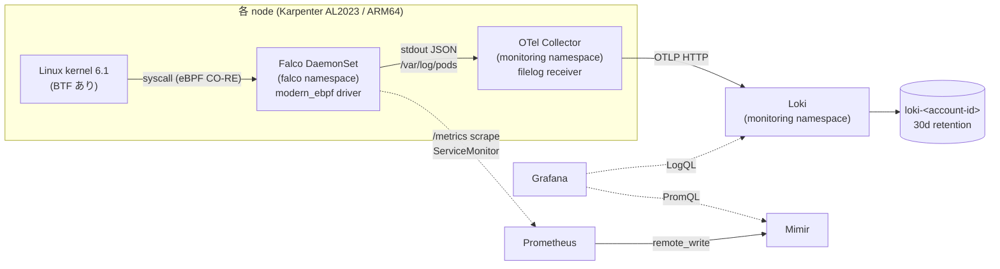

# EKS Production: Falco Runtime Security Design

> **Goal**: `falcosecurity/falco` chart を専用 `falco` namespace に DaemonSet で deploy し、node 上の syscall 由来の runtime security イベントを既存の Loki に堆積させる。Grafana の LogQL で「いつ、どの Pod の中で、誰が何を実行したか」を後から追跡できる状態を作る。
>
> **Non-goals**: 検知イベントの外部通知 (Slack / PagerDuty)、Kubernetes API audit log の取り込み、Falco 専用 Grafana dashboard、自動対処 (response action)。
>
> **Prerequisites**: OpenTelemetry Collector DaemonSet + Loki が稼働していること (= 既存)。

---

## Context

### 現状の観測基盤が埋めていない穴

`eks-production` は signal type ごとに観測基盤が揃っている。

| 層 | 担当コンポーネント | 見えるもの |
|---|---|---|
| Network | Cilium + Hubble | L3/L4/L7 の flow、NetworkPolicy enforcement |
| Application trace / metric | Beyla + OTel Collector → Tempo / Mimir | HTTP / SQL / gRPC の RED metrics と span |
| Application log | OTel Collector (filelog) → Loki | container の stdout |
| **Host / syscall の挙動** | **なし** | **—** |

「Pod の中で誰が何のプロセスを起動し、どのファイルを読んだか」は現状まったく記録されていない。侵害が起きても事後に追跡する材料がない。Falco はこの層を埋める。

### Falco の性質

Falco は **detective control** であり preventive control ではない。攻撃をブロックするのは Cilium NetworkPolicy / PodSecurity の責務で、Falco は「起きたことに気づく」ことだけを担う。出力は構造化ログ (JSON) であり、Falco 本体に通知機能はない。

---

## Scope decisions

brainstorming で確定した 4 つの判断。

| 決定 | 選択 | 却下した案と理由 |
|---|---|---|
| 目的 | 監査ログの堆積 (通知なし) | アラート運用は tuning 負荷が伴う。まず記録を残す層を確立する |
| イベント源 | syscall のみ | K8s API audit (k8saudit-eks plugin) は EKS control plane audit logging 有効化 + CloudWatch コスト + IAM が必要で、導入規模が 2 倍以上になる |
| Loki への経路 | Falco stdout → 既存 OTel Collector → Loki | Falcosidekick 経由は追加コンポーネントを要し、その本領 (通知 fan-out) が本 spec では丸ごと遊ぶ |
| 成功基準 | E2E (意図的発火 → Grafana で LogQL 検索) | 稼働確認だけでは「監査ログが後から追える」ことを検証できない |

### Falco に alert の OTLP 出力は存在しない

chart 9.1.0 の `falco.yaml` 設定に存在する output channel は `stdout` / `syslog` / `file` / `http` / `program` のみ (VERIFIED: `helm show values` 出力を全文検索し `otlp` の該当なし)。Falco から OTel Collector へ OTLP で直接送る経路は選択肢に存在しないため、stdout 経由が唯一の「追加コンポーネントなし」の解になる。

---

## Architecture



Falco は既存の log funnel に相乗りするため、**新規の log 経路を作らない**。README が明文化している「application telemetry は OTel Collector 1 本に集約する」設計方針を崩さない。

### なぜ専用 `falco` namespace か

`monitoring` に相乗りさせない理由は 3 つ。

1. Falco は detective security control であり、`monitoring` namespace が担う「signal を集めて貯める」責務と役割が異なる
2. Falco Pod は eBPF アタッチのため昇格した権限で動く。将来 PodSecurity / NetworkPolicy を namespace 単位で締めるとき、権限の高い Pod が monitoring 全体の設定を引きずる
3. LogQL の入口が `{k8s_namespace_name="falco"}` で他の signal と完全に分離できる

---

## Component design

### Files

```
kubernetes/components/falco/
├── namespace.yaml                 # falco namespace (環境非依存のため component root)
└── production/
    ├── helmfile.yaml
    └── values.yaml.gotmpl
```

`namespace.yaml` を component root に置くのは多数派の慣例に合わせるため (cert-manager / external-secrets / prometheus-operator が root、external-dns のみ `production/` 配下)。`hydrate-index.sh` は env 固有版を優先し、なければ root を読む。

### GitOps 経路

既存の hydration pipeline にそのまま乗る。`workflow-config.yaml` の変更は不要 (`stack_conventions` の `kubernetes/components/{service}` が pattern 定義のため)。

1. `hydrate-component.sh falco production` → `kubernetes/manifests/production/falco/manifest.yaml`
2. `hydrate-index.sh production` → `00-namespaces/namespaces.yaml` に namespace 追記、index の `kustomization.yaml` に `./falco` を挿入 (C locale sort で `./external-secrets` と `./gateway-api` の間)
3. main merge 後に Flux が適用

### Renovate

`.github/renovate.json` は `config:recommended` 由来の helmfile manager が有効で、`**/production/**` は automerge 無効・`⚠️ production` ラベル付き。chart version の更新 PR は追加設定なしで届く。

**ただしルールセット (OCI artifact) は helmfile manager の対象外**であり、後述の pin 運用は手動更新になる。

---

## Configuration decisions

すべて chart 9.1.0 (Falco 0.44.1) の実 values / template で確認済み。

### Driver: `modern_ebpf` を明示

```yaml
driver:
  kind: modern_ebpf
```

chart default の `auto` ではなく明示指定する。`modern_ebpf` を指定すると **driver-loader init container が生成されない** (VERIFIED: `templates/_helpers.tpl:358` の分岐が `modern_ebpf` で false を返す)。

`auto` のままだと init container が残り、カーネルモジュールのビルド / ダウンロード経路が生き続ける。Karpenter が node を頻繁に入れ替えるこの cluster では、node 起動のたびに外部ダウンロードへ依存する構成は避ける。

前提条件はすべて満たされている:

- node OS は AL2023 (`kubernetes/components/karpenter/production/kustomization/ec2nodeclass.yaml` の `amiSelectorTerms: [alias: al2023@latest]`)。kernel 6.1 + BTF
- image は arm64 対応 (VERIFIED: Docker Hub API で `falcosecurity/falco:0.44.1` = amd64 + arm64)

### Privilege: `leastPrivileged: true`

```yaml
driver:
  modernEbpf:
    leastPrivileged: true
```

`privileged: true` を使わず、capabilities `{BPF, SYS_RESOURCE, PERFMON, SYS_PTRACE}` のみで動かす (VERIFIED: `templates/pod-template.tpl:378-379`)。AppArmor `unconfined` annotation が併せて付与されるが、AL2023 の LSM は AppArmor ではないため無害。

security tool 自身を production で常時 privileged Pod として走らせるのは、それ自体が攻撃面になる。失敗モードは BPF program の load 失敗による CrashLoop であり静かに壊れない。切り戻しは values 1 行。

### Rules: exact version に pin、自動更新サイドカーは無効化

```yaml
falcoctl:
  artifact:
    install:
      enabled: true       # ルールセット取得に必須 (image に同梱されない)
    follow:
      enabled: false      # 自動更新サイドカーを停止
  config:
    artifact:
      install:
        refs: [falco-rules:5.1.0]
```

キーパスが 2 系統に分かれている点に注意する。`falcoctl.artifact.*.enabled` は container の有無を制御し、pin 対象の `refs` は `falcoctl.config.artifact.install.refs` 配下にある (VERIFIED: values を構造化して両パスの実在を確認)。`falcoctl.artifact.install.refs` は存在しないため、そこに書いても無視される。

Falco 0.36 以降、ルールセットは image に同梱されず OCI artifact として配布される。chart default は以下の 2 つを行う。

- init container が `falco-rules:5` (floating tag) を pull
- **サイドカーが 168h ごとに自動更新**

後者を無効化する。ルールが Git の外で勝手に変わると、`manifests/` に render 済みの YAML をレビューしてから適用するという hydration pattern の前提が崩れる。

前者の `falco-rules:5` も floating tag であり、Pod 再起動のたびに major 5 系の最新を引く。同じ manifest から異なる挙動が出る状態を許すことになるため、exact version `5.1.0` に pin する (VERIFIED: GHCR tag list に `5`, `5.1`, `5.1.0` が併存)。

ルールを repo に取り込んで `customRules` で完全管理する案は却下した。上流のルール改善を手動で追い続ける負担が永続的に発生し、得られる決定性は pin で十分足りる。

**トレードオフ**: Renovate の helmfile manager は OCI artifact を追えないため、ルール更新は手動になる。custom manager の追加は将来の課題とする。

### Output

```yaml
falco:
  json_output: true
  syslog_output:
    enabled: false
```

- `json_output` は chart default `false`。Loki で `| json` パースするために必須
- `syslog_output` は chart default `true`。container 内に syslog が存在せず無意味なため明示的に潰す
- `priority` は default `debug` (= 全ルールを読み込む) のままとし、values には書かない。後述のとおり stable ruleset は 25 件しかなく、閾値で絞る意味がない
- `json_include_output_property` は default で `true` のため書かない (source-of-truth と同値の記述を増やさない)

### Scheduling

```yaml
tolerations:
  - effect: NoSchedule
    operator: Exists
  - effect: NoExecute
    operator: Exists
podPriorityClassName: system-node-critical
```

chart default の tolerations は master / control-plane taint のみ。このままでは `system_critical` MNG (taint `dedicated=system-critical:NoSchedule`) に schedule されず、**Karpenter controller / cilium-operator / CoreDNS が載る node が監視の死角になる**。OTel Collector と同じ全許容に上書きする。

`podPriorityClassName` は chart 固有のキー名 (`priorityClassName` ではない)。値は OTel Collector と同じ `system-node-critical`。理由も同じで、schedule されなかった瞬間の syscall イベントは後から取り直せない。

### Metrics

```yaml
metrics:
  enabled: true
serviceMonitor:
  create: true
  labels:
    release: kube-prometheus-stack
```

eBPF の ring buffer が溢れると Falco は検知イベントを**黙って落とす**。drop 率が見えないと「監査ログが揃っている」と主張できないため、目的が監査である以上 metrics は付随機能ではなく前提条件。

chart のキー名は既存 component と異なる (`enabled` ではなく `create`、`additionalLabels` / `extraLabels` ではなく `labels`)。values に "Why not" コメントを残し、他 component からのコピーによる誤りを防ぐ。

### Resources

chart default (requests 100m / 512Mi、limits 1000m / 1024Mi) で開始し、実測後に right-size する。OTel Collector が「実測平均 9-20m に対し 100m は過大」として後から絞った前例に倣う。

---

## Noise analysis

### stable ruleset は 25 ルール

`falco-rules:5.1.0` を GHCR から取得して集計 (VERIFIED)。

| priority | 件数 |
|---|---|
| WARNING | 11 |
| NOTICE | 7 |
| CRITICAL | 3 |
| INFO | 1 |
| テンプレート | 3 |

Falco は chatty なルールを `incubating` / `sandbox` ruleset に切り出しており、default では読み込まれない。「まず全部出して実測する」判断が成立するのはこの規模だからである。

### `Contact K8S API Server From Container` は機能しない可能性が高い

このルール (NOTICE) は当初「確実に発火する noise 源」と見積もっていたが、**逆に一度も発火しない可能性の方が高い**。

ルールの除外機構は `k8s_containers` マクロで、その中身は `kube-system` namespace 全体 + 特定 image のハードコード列挙である (VERIFIED: `falco_rules.yaml` の macro 定義)。この cluster では Flux 各 controller / Karpenter / external-secrets / external-dns / KEDA / cert-manager controller 本体 / OTel Collector が除外対象に含まれないため、**除外ロジックだけを見れば発火する**。

しかし発火の前提となる `k8s_api_server` マクロは `fd.sip.name = "kubernetes.default.svc.cluster.local"`、すなわち **接続先 IP が該当 DNS 名として解決できること**を要求する。この cluster ではこれを崩す機構が独立に 2 つある。

1. **Cilium socket-LB による connect 時 DNAT** — `kubeProxyReplacement: true` + `socketLB.enabled: true` (VERIFIED: `cilium/production/values.yaml.gotmpl:47,115-116`)。socket-LB は `cgroup/connect4` hook で connect(2) の時点で宛先を実 backend にDNAT する。Falco が socket tuple から読む `fd.sip` が DNAT 後のアドレスであれば、ClusterIP に紐づく DNS 名とは一致しない
2. **in-cluster client が DNS を引かない** — client-go の in-cluster config は `KUBERNETES_SERVICE_HOST` 環境変数 (= ClusterIP) を直接使い、`kubernetes.default.svc.cluster.local` の名前解決を行わない。Falco が IP→名前の対応を DNS 応答の観測から得ているなら、その対応自体が学習されない

2 は Cilium と無関係に成立するため、**このルールは本 cluster に限らず広範に空振りしている可能性がある**。

検証レベルは **REASONED**。`fd.sip.name` の実装 (DNAT 前後どちらの tuple を読むか、名前解決の供給源) を一次情報で確認していない。

**含意は「noise が減って良かった」ではなく「検知の死角がある」である。** 攻撃者の Pod が API server を叩いても同じ理由で記録されない。K8s API へのアクセス追跡が本当に必要なら、syscall ではなく control plane audit log (= 本 spec の Non-goals に置いた k8saudit-eks) が正しい情報源になる。

### noise の allowlist は初回リリースに入れない

`user_known_contact_k8s_api_server_activities` という空マクロ (`(never_true)`) があり `customRules` で override append できるが、**初回では使わない**。上記のとおり発火するかどうかすら確定していない状態で先に穴を開けると、本当に見たいものまで塞ぐ。実測して出た送信元だけを、根拠付きで allowlist に追加する PR を別に立てる。

---

## Cilium coexistence

`eks-production` は Cilium が native CNI (ENI mode) + `kubeProxyReplacement: true` で稼働する。Falco との共存で検討した 3 点。

| 論点 | 結論 | 根拠 |
|---|---|---|
| eBPF program の競合 | **問題なし** | Cilium は tc / XDP / cgroup hook、Falco は syscall tracepoint で attach point が異なる |
| falcoctl init container の ghcr.io egress | **問題なし** | cluster-wide の default-deny NetworkPolicy が存在しない (VERIFIED: repo 内の NetworkPolicy は Flux 同梱の 3 件のみで、すべて `flux-system` namespace scope)。将来 default-deny を導入する際は Falco の ghcr.io egress 許可が必要になる |
| BPF map / ring buffer のメモリ | **軽微** | Cilium の BPF map と Falco の per-CPU ring buffer (`bufSizePreset: 4`, `cpusForEachBuffer: 2`) はいずれも kernel 側の確保で container の memory limit に計上されない。node の実メモリは消費するため、実測時に available memory を確認する |

socket-LB が検知内容に与える影響は前節 (`Contact K8S API Server From Container`) を参照。

---

## Verification

成功基準は「全 node で Falco が稼働し、意図的に発火させた検知イベントが Grafana の LogQL で引ける」こと。

```bash
eks-login production

# 1. 全 node で稼働 (DESIRED == READY == node 数)
kubectl get ds -n falco falco
kubectl get nodes --no-headers | wc -l

# 2. modern_ebpf の load 成功 / leastPrivileged の反映
kubectl logs -n falco -l app.kubernetes.io/name=falco --tail=30
kubectl get pod -n falco -o jsonpath='{.items[0].spec.containers[0].securityContext}'

# 3. event drop が出ていないこと (監査ログの信頼性の前提)
kubectl logs -n falco -l app.kubernetes.io/name=falco | grep -i drop

# 4. 意図的に発火させる
kubectl run falco-e2e --image=alpine:3 --restart=Never -n default -- sleep 300
kubectl wait --for=condition=Ready pod/falco-e2e -n default --timeout=60s
kubectl exec -it falco-e2e -n default -- sh -c 'cat /etc/shadow'

# 5. Falco 自身が検知したこと
kubectl logs -n falco -l app.kubernetes.io/name=falco --tail=100 | grep falco-e2e

# 6. cleanup
kubectl delete pod falco-e2e -n default
```

Step 4 の `-it` は必須。`Terminal shell in container` の condition に `proc.tty != 0` が含まれる (VERIFIED)。この 1 コマンドで 2 ルールが発火する想定:

- `Terminal shell in container` (NOTICE) — `container_entrypoint` マクロが `containerd-shim` 親を許容するため kubectl exec で成立
- `Read sensitive file untrusted` (WARNING) — `/etc/shadow` が `sensitive_file_names` に該当

Step 6 の前に、Grafana Explore (https://grafana.panicboat.net) で以下の LogQL が結果を返すことを確認する。**ここが本 spec の本当のゴール**。

```logql
{k8s_namespace_name="falco"} | json | rule="Terminal shell in container"
{k8s_namespace_name="falco"} | json | rule="Read sensitive file untrusted"
```

label 名 `k8s_namespace_name` は既存 dashboard の LogQL と同一 (Loki の OTLP resource attribute マッピング由来)。

### Cilium socket-LB 下での `Contact K8S API Server From Container` 実測

前節の REASONED な推論を実測で確定させる。deploy 後 30 分ほど放置してから確認する (Flux / Karpenter / external-secrets 等が定常的に API server を叩く時間)。

```logql
{k8s_namespace_name="falco"} | json | rule="Contact K8S API Server From Container"
```

| 結果 | 解釈 | 対応 |
|---|---|---|
| ヒットなし | socket-LB の DNAT または DNS 未使用により条件が成立していない = **検知の死角**が確定 | spec の該当節を VERIFIED に更新し、K8s API 追跡が必要かを別 spec で判断する |
| ヒットあり | ルールは機能している = 想定どおりの noise | 実際に出た送信元を根拠に allowlist を別 PR で追加する |

**どちらでも本 spec の成功基準は満たされる。** この項目は Falco 導入の可否ではなく、Falco で何が見えて何が見えないかを確定させるための観測である。

検証用 Pod は Flux 管理外の一時リソースであり、`kubectl` 直接操作でも GitOps の drift を生まない。

---

## Rollback

`git revert` して main に戻す (README の GitOps 原則どおり)。Falco は他コンポーネントから参照されない末端の DaemonSet であり、CRD も持たない。削除の影響は Falco 自身に閉じる。

---

## Risks

| 項目 | 検証レベル | 内容と対処 |
|---|---|---|
| `leastPrivileged: true` が AL2023 / ARM64 で動くか | ASSUMED | Falco 公式の modern_ebpf 向けサポート経路だが、この OS / arch 組み合わせでの実績は未確認。失敗すれば BPF load エラーで CrashLoop するため即座に判明する。切り戻しは values 1 行で `false` に戻す |
| `Contact K8S API Server From Container` が Cilium socket-LB 下で発火するか | REASONED | `fd.sip.name` が DNAT 前後どちらの tuple を読むか、および名前解決の供給源を一次情報で未確認。発火しない場合は noise 減ではなく**検知の死角**を意味する。Verification に実測項目を設けた |
| Loki のログ増加量 | ASSUMED | stable ruleset は 25 件と小さく、主な発生源と見込んでいた API server ルールも空振りの可能性がある。当初見積もりより少ない方向にぶれる公算が大きい |
| 新規 component 追加で deploy label が自動付与されるか | REASONED | `workflow-config.yaml` の `stack_conventions` が pattern 定義であることから推論。PR 作成時に実際の label 付与を確認する |
| ルール更新の追従 | 既知の制約 | Renovate は OCI artifact を追えない。`falco-rules` の新版は手動で確認・更新する。頻度が問題になれば custom manager を追加する |

---

## Out of scope

以下は本 spec に含めず、必要になった時点で別 spec を立てる。

- **通知** — Falcosidekick を有効化して Slack / PagerDuty へ fan-out。本 spec の構成から `falcosidekick.enabled: true` の追加と stdout 経路の整理で移行でき、今回の選択が負債にならない
- **K8s API audit** — `k8saudit-eks` plugin による「誰が kubectl exec したか」の記録
- **Falco 専用 Grafana dashboard** — 検知イベントの件数推移・rule 別集計
- **noise の allowlist 化** — 実測データを根拠に別 PR で対応
