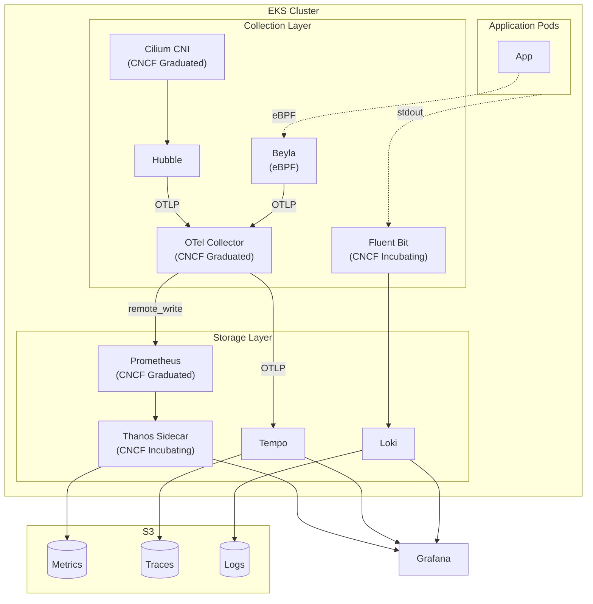
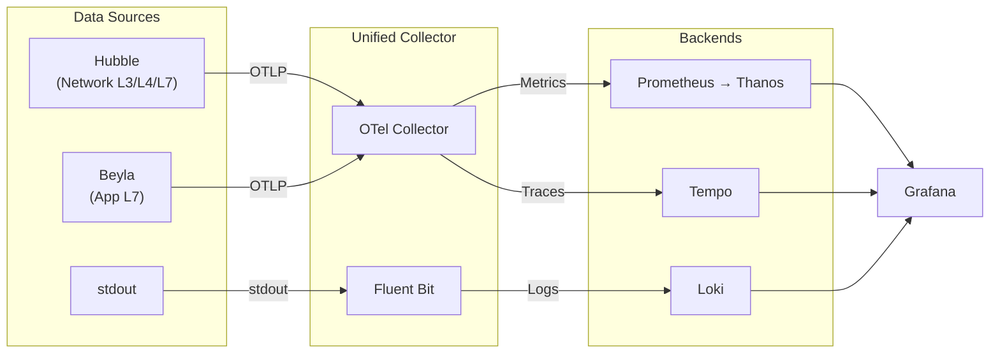

```mermaid
flowchart LR
    subgraph Problem["問題発生"]
        Alert["🚨 アラート発火<br/>Error Rate > 1%"]
    end

    subgraph Metrics["Metrics (Prometheus)"]
        M1["http_requests_total<br/>status=500 増加"]
        M2["Exemplar リンク付き"]
    end

    subgraph Traces["Traces (Tempo)"]
        T1["Trace ID: abc123"]
        T2["Span: POST /api/users<br/>500ms, error=true"]
        T3["Span: DB Query<br/>480ms"]
    end

    subgraph Logs["Logs (Loki)"]
        L1["{trace_id=abc123}"]
        L2["ERROR: Connection timeout<br/>to database:5432"]
    end

    subgraph RootCause["根本原因"]
        RC["DB コネクション枯渇"]
    end

    Alert --> M1
    M1 --> M2
    M2 -->|"Exemplar Click"| T1
    T1 --> T2
    T2 --> T3
    T3 -->|"TraceID で検索"| L1
    L1 --> L2
    L2 --> RC

    style Alert fill:#ef4444
    style RC fill:#22c55e,color:#fff
```

# Kubernetes Platform with Cilium Service Mesh & GitOps

## 概要

**Ciliumサイドカーレスサービスメッシュ**と**FluxCD GitOps**を組み合わせたKubernetesプラットフォーム。**Helmfile Hydration Pattern** により、HelmチャートとKustomizeマニフェストを一元管理し、純粋なYAMLとしてGit管理することで、GitOpsの信頼性と可視性を向上させています。

## 🏗️ アーキテクチャ



### Dataflow



## 🚀 セットアップ

### Phase 1: Foundation Setup (基盤構築)
```bash
make phase1
```
- k3d クラスター作成
- **Gateway API CRDs** インストール
- **Cilium CNI** + Gateway Controller (kube-proxy置換)
- CoreDNS修正・DNS解決確認

### Phase 2: FluxCD Installation (GitOps基盤)
```bash
make phase2
```
- FluxCD コントローラーインストール
- GitOps基盤構築

### Phase 3: Hydration & Sync (アプリ展開)
```bash
make phase3
```
- FluxCD が `manifests/k3d` を同期
- Hydration 済みマニフェスト（Helm + Kustomize）の一括適用
- Namespace, CRD, アプリケーションの順序制御（Flux Kustomization依存）

### Phase 4: GitOps Complete Migration
```bash
make phase4
```
- リポジトリ全域の GitOps 管理自動化

## 🌐 サービスアクセス

**Gateway API経由でのブラウザアクセス:**

/etc/hosts に以下を設定

```bash
127.0.0.1 grafana.local
127.0.0.1 prometheus.local
127.0.0.1 alertmanager.local
127.0.0.1 hubble.local
```

|  | URL |
| --- | --- |
| Grafana | http://grafana.local |
| Prometheus | http://prometheus.local |
| Alertmanager | http://alertmanager.local |
| Hubble UI | http://hubble.local |

**サイドカーレスサービスメッシュ:**
- Cilium Gateway Controller
- L7負荷分散・トラフィック管理
- eBPFによる高性能通信

## 🔧 主要コマンド

### 完全自動セットアップ
```bash
make up              # Phase 1-4 全自動実行
make down            # クラスター完全削除
```

### 個別操作
```bash
make hydrate         # マニフェスト生成 (components -> manifests)
make gateway-install # Gateway API CRDs
make cilium-install  # Cilium Bootstrap
make status          # クラスター状態確認
```

### GitOps管理
```bash
make gitops-setup    # FluxCD GitOps設定
make gitops-enable   # 全コンポーネントGitOps化
make gitops-status   # GitOps状態確認
```

## 💡 設計思想

### Hydration Pattern 戦略

**Why Hydration?**
1.  **可視性 (Visibility)**: 実際に適用される YAML が `manifests/` に存在するため、コミットログで変更理由が明確になる。
2.  **安全性 (Safety)**: Helm チャートのレンダリング結果を承認してからデプロイ可能。予期せぬ Breaking Change を防ぐ。
3.  **環境分離 (Isolation)**: `helmfile -e <env>` により環境ごとの差異を吸収しつつ、バージョン管理を厳密化。

### 構成管理

- **Components (`components/`)**: アプリケーションのソース（Helm Values, Kustomize Base/Overlays）。
- **Manifests (`manifests/`)**: 自動生成される最終成果物。

## 🔍 監視・オブザーバビリティ

### 統合監視スタック
- **Prometheus**: メトリクス収集・アラート
- **Thanos**: 長期メトリクスストレージ
- **Grafana**: 可視化ダッシュボード
- **Loki**: ログ集約
- **Tempo**: 分散トレーシングバックエンド
- **Fluent Bit**: ログ収集
- **OpenTelemetry Collector**: テレメトリ統合
- **Beyla**: eBPF自動計装
- **Cilium Hubble**: ネットワーク観測

### アクセス方法
Gateway API経由で上記URLから直接アクセス可能。

## 🛠️ トラブルシューティング

### よくある問題
```bash
# DNS解決失敗
make coredns-update

# Gateway Controller未起動
kubectl -n kube-system rollout restart deployment/cilium-operator

# HelmRelease状態確認
kubectl get helmreleases -A
flux logs
```

### ログ確認
```bash
flux get all -A              # FluxCD状態
cilium status               # Cilium状態
kubectl logs -n kube-system -l k8s-app=cilium
```

## 🤝 開発ワークフロー

### ローカル開発 (高速)
```bash
make up                     # 2-3分で完全環境
# 開発・テスト・実験
make down && make up        # 高速リセット
```

### 本番運用移行
```bash
make phase4                 # Bootstrap → GitOps
# 継続的デプロイメント開始
```

## 障害調査例


