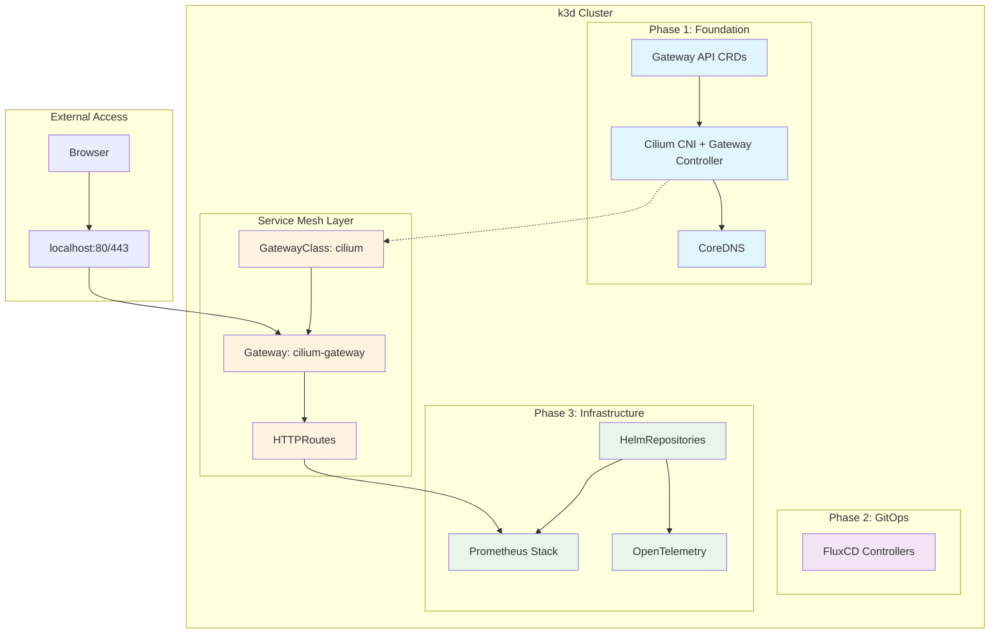

# Kubernetes Platform with Cilium Service Mesh & GitOps

## 概要

**Ciliumサイドカーレスサービスメッシュ**と**FluxCD GitOps**を組み合わせたKubernetesプラットフォーム。**Bootstrap + GitOps ハイブリッド戦略**により、高速ローカル開発と本格運用の両方に対応します。

## 🏗️ アーキテクチャ



## 🚀 セットアップ

### Phase 1: Foundation Setup (基盤構築)
```bash
make phase1
```
- k3d クラスター作成
- **Gateway API CRDs** インストール
- **Cilium CNI** + Gateway Controller (kube-proxy置換)
- CoreDNS修正・DNS解決確認

### Phase 2: FluxCD Installation (GitOps基盤)
```bash
make phase2
```
- FluxCD コントローラーインストール
- GitOps基盤構築

### Phase 3: Infrastructure Bootstrap
```bash
make phase3
```
- HelmRepositories自動セットアップ
- 全インフラコンポーネント自動検出・Bootstrap
- 依存関係自動解決 (CRDs → Applications)

### Phase 4: GitOps Migration
```bash
make phase4
```
- Bootstrap → GitOps移行
- 継続的デプロイメント有効化

## 🌐 サービスアクセス

**Gateway API経由でのブラウザアクセス:**

/etc/hosts に以下を設定

```bash
127.0.0.1 grafana.local
127.0.0.1 prometheus.local
127.0.0.1 alertmanager.local
127.0.0.1 hubble.local
```

|  | URL |
| --- | --- |
| Grafana | http://grafana.local |
| Prometheus | http://prometheus.local |
| Alertmanager | http://alertmanager.local |
| Hubble UI | http://hubble.local |

**サイドカーレスサービスメッシュ:**
- Cilium Gateway Controller
- L7負荷分散・トラフィック管理
- eBPFによる高性能通信

## 🔧 主要コマンド

### 完全自動セットアップ
```bash
make up              # Phase 1-4 全自動実行 (2-3分)
make down            # クラスター完全削除
```

### 個別操作
```bash
make gateway-install # Gateway API CRDs
make cilium-install  # Cilium Bootstrap
make status          # クラスター状態確認
```

### GitOps管理
```bash
make gitops-setup    # FluxCD GitOps設定
make gitops-enable   # 全コンポーネントGitOps化
make gitops-status   # GitOps状態確認
```

## 💡 設計思想

### Bootstrap + GitOps ハイブリッド戦略

**Bootstrap Phase:**
- ✅ 高速性: 2-3分で完全環境
- ✅ 確実性: CRD依存関係問題解決
- ✅ 開発効率: 頻繁なdelete/create対応

**GitOps Phase:**
- ✅ 運用性: 継続的デプロイメント
- ✅ Infrastructure as Code
- ✅ チーム協業: Git中心ワークフロー

### 自動検出・拡張性

- 新コンポーネント: `infrastructures/*/base/bootstrap/`作成のみ
- Makefile変更不要: 自動検出システム
- 依存関係自動解決: Phase順序管理

## 🔍 監視・オブザーバビリティ

### 統合監視スタック
- **Prometheus**: メトリクス収集・アラート
- **Grafana**: 可視化ダッシュボード
- **OpenTelemetry**: 分散トレーシング
- **Cilium Hubble**: ネットワーク観測

### アクセス方法
Gateway API経由で上記URLから直接アクセス可能。

## 🛠️ トラブルシューティング

### よくある問題
```bash
# DNS解決失敗
make coredns-update

# Gateway Controller未起動
kubectl -n kube-system rollout restart deployment/cilium-operator

# HelmRelease状態確認
kubectl get helmreleases -A
flux logs
```

### ログ確認
```bash
flux get all -A              # FluxCD状態
cilium status               # Cilium状態
kubectl logs -n kube-system -l k8s-app=cilium
```

## 🤝 開発ワークフロー

### ローカル開発 (高速)
```bash
make up                     # 2-3分で完全環境
# 開発・テスト・実験
make down && make up        # 高速リセット
```

### 本番運用移行
```bash
make phase4                 # Bootstrap → GitOps
# 継続的デプロイメント開始
```
