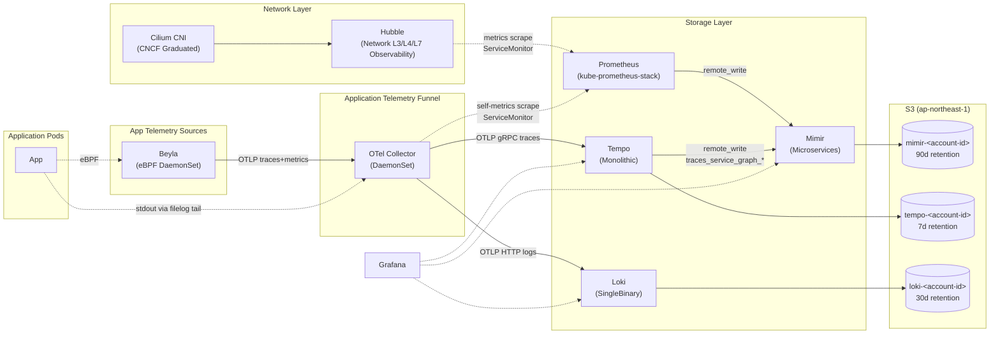

# Kubernetes Platform with Cilium Service Mesh & GitOps

## Overview

**Ciliumサイドカーレスサービスメッシュ**と**FluxCD GitOps**を組み合わせたKubernetesプラットフォーム。**Helmfile Hydration Pattern** により、HelmチャートとKustomizeマニフェストを一元管理し、純粋なYAMLとしてGit管理することで、GitOpsの信頼性と可視性を向上させています。

## 🏗️ Architecture


```mermaid
flowchart LR
    subgraph Apps["Application Pods"]
        App["App"]
    end

    subgraph Network["Network Layer"]
        Cilium["Cilium CNI<br/>(CNCF Graduated)"]
        Hubble["Hubble<br/>(Network L3/L4/L7 Observability)"]
    end

    subgraph AppSources["App Telemetry Sources"]
        Beyla["Beyla<br/>(eBPF DaemonSet)"]
    end

    subgraph Funnel["Application Telemetry Funnel"]
        OTelCol["OTel Collector<br/>(DaemonSet)"]
    end

    subgraph Storage["Storage Layer"]
        Prometheus["Prometheus<br/>(kube-prometheus-stack)"]
        Mimir["Mimir<br/>(Microservices)"]
        Tempo["Tempo<br/>(Monolithic)"]
        Loki["Loki<br/>(SingleBinary)"]
    end

    subgraph S3["S3 (ap-northeast-1)"]
        S3Mimir[("mimir-&lt;account-id&gt;<br/>90d retention")]
        S3Tempo[("tempo-&lt;account-id&gt;<br/>7d retention")]
        S3Loki[("loki-&lt;account-id&gt;<br/>30d retention")]
    end

    Grafana["Grafana"]

    %% Network observability — Hubble は network metrics の native exporter、Prometheus が直接 scrape
    Cilium --> Hubble
    Hubble -.->|metrics scrape<br/>ServiceMonitor| Prometheus

    %% Application traces + metrics → OTel Collector
    App -.->|eBPF| Beyla
    Beyla -->|OTLP traces+metrics| OTelCol

    %% Logs: OTel Collector が container log file を直接 tail (filelog receiver)
    App -.->|stdout via filelog tail| OTelCol

    %% OTel Collector → backends
    OTelCol -->|OTLP gRPC traces| Tempo
    OTelCol -->|OTLP HTTP logs| Loki
    OTelCol -.->|self-metrics scrape<br/>ServiceMonitor| Prometheus

    %% Prometheus → Mimir long-term
    Prometheus -->|remote_write| Mimir

    %% Long-term storage
    Mimir --> S3Mimir
    Tempo --> S3Tempo
    Loki --> S3Loki

    %% Tempo metrics-generator → Mimir (service-graph metrics)
    Tempo -->|remote_write<br/>traces_service_graph_*| Mimir

    %% Visualization
    Grafana -.-> Mimir
    Grafana -.-> Tempo
    Grafana -.-> Loki
```

### Role separation

Signal は role 別に 2 funnel で流す。

**Network Layer** (Cilium + Hubble): cluster の network behavior を観測する。Hubble は native Prometheus exporter として動作し、Prometheus が ServiceMonitor 経由で直接 scrape。Cilium NetworkPolicy enforcement の visibility と統合され、CNI と密結合。

**Application Telemetry Funnel** (Beyla + OTel Collector): application code の trace / log / metric を集約する。OTel Collector を per-node DaemonSet として deploy し、Beyla からの traces (OTLP) と container log file (filelog receiver) を 1 箇所で受けて Tempo / Loki に route。

両者を混ぜない理由:

1. Hubble は Cilium native の Prometheus exporter で、追加 OTel hop は overhead 増の trade-off に見合わない
2. network 視点と application 視点は cardinality / sampling 戦略が異なり、別 funnel の方が運用しやすい

### Backend role separation

3 つの telemetry backend (Mimir / Tempo / Loki) と短期 buffer の Prometheus は、signal type ごとに役割を分離して並走させる。

| Component | Signal | Mode | Backing store | Retention | Receives |
|---|---|---|---|---|---|
| Prometheus (kube-prometheus-stack) | metrics | scraper + 短期 buffer | local PVC (gp3 EBS) | 24h | ServiceMonitor / PodMonitor から active scrape |
| Mimir (mimir-distributed) | metrics | passive store + query gateway | S3 (`mimir-…`) | 90d | Prometheus からの `remote_write` (+ Tempo metrics-generator) |
| Tempo (monolithic) | traces | trace ingest + metrics-generator | S3 (`tempo-…`) | 7d | OTel Collector からの OTLP traces |
| Loki (SingleBinary) | logs | log ingest | S3 (`loki-…`) | 30d | OTel Collector からの OTLP logs |

**Prometheus と Mimir で metrics を 2 段に分ける理由:**

Prometheus は cluster 内の active scraper で ServiceMonitor / PodMonitor から metrics を pull する責務。disk 制約から retention は 24h と短い。Mimir は Prometheus が `remote_write` で送ってくる metrics を S3 に堆積する passive store で、長期保存 (90d) と Grafana への query 提供が役割。短期 scrape と長期 store を分離して、両者の retention / capacity を独立に運用する。

Prometheus を agent mode で動かす alternative もあるが、Alertmanager / Prometheus Operator CRD が必要なため full Prometheus を維持している。

**Tempo metrics-generator の delegation pattern:**

Tempo は trace を S3 に保管する primary role に加え、metrics-generator が trace を集計して service-graph metrics を生成する。Tempo は PromQL を喋らないため、生成された metrics は metrics 専門の Mimir に `remote_write` で委譲する。Grafana の Service Graph panel は Tempo datasource を経由しつつ、裏で Mimir に PromQL クエリを投げる構造 (Tempo datasource の `serviceMap.datasourceUid` で Mimir を指定)。

Tempo は「自分の trace を集計した metrics を、metrics 専門の Mimir に委ねる」role separation を取る。

**S3 を共通 backing store にする理由:**

3 backend (Mimir / Tempo / Loki) が ingest / index / query を担う本体で、S3 は **それぞれの永続化層** に位置づく。S3 単独では telemetry data の format (= TSDB block / trace block / chunk + index) を解釈できないため、データ access は必ず backend を経由する (= S3 にデータが先にあって backend がそれを読みに行く、という関係ではない)。

production で S3 を選ぶのは scale 要件の一致による:
- **durability**: Pod 削除でデータが失われない (EBS は AZ-local、Pod 横断 attach 不可)
- **retention**: 7d-90d の長期保管
- **cost**: 数十 GB-数百 GB を EBS で持つより S3 が安価
- **elastic**: backend pod の replica 数変更で storage rebalance 不要

## 💡 Design principles

### Hydration pattern strategy

**Why Hydration?**
1.  **可視性 (Visibility)**: 実際に適用される YAML が `manifests/` に存在するため、コミットログで変更理由が明確になる。
2.  **安全性 (Safety)**: Helm チャートのレンダリング結果を承認してからデプロイ可能。予期せぬ Breaking Change を防ぐ。
3.  **環境分離 (Isolation)**: `helmfile -e <env>` により環境ごとの差異を吸収しつつ、バージョン管理を厳密化。

### Configuration management

- **Components (`components/`)**: アプリケーションのソース（Helm Values, Kustomize Base/Overlays）。
- **Manifests (`manifests/`)**: 自動生成される最終成果物。

## 🏢 Production Operations

EKS production cluster `eks-production`（`ap-northeast-1`）の運用手順。

### Cluster overview

`eks-production` cluster は **Cilium が native CNI (ENI mode)** で稼働し、`kubeProxyReplacement: true` で kube-proxy を eBPF で代替している。

| 層 | 担当 |
|---|---|
| CNI / IPAM / datapath | Cilium native (ENI mode、cilium-operator が EC2 ENI / secondary IP を直接管理、Pod IP は VPC subnet IP) |
| L3/L4/L7 NetworkPolicy | Cilium |
| Service routing (kube-proxy 代替) | Cilium KPR（eBPF）|
| L7 proxy | Cilium Envoy DaemonSet（独立、`envoy.enabled: true`）|
| 東西の HTTPRoute / Gateway API | Cilium Gateway Controller（東西専用、北南は ALB Controller）|
| Observability | Hubble（TLS は cert-manager で自動 rotate）|

EKS managed addons: `coredns` / `aws-ebs-csi-driver` / `eks-pod-identity-agent`。 `vpc-cni` は使用しない (Cilium native CNI で代替)。 `kube-proxy` は使用しない (Cilium KPR で代替)。 cluster 作成時に `bootstrap_self_managed_addons = false` で EKS の自動 addon install を抑止し、 cilium-agent が CNI plugin を /opt/cni/bin に置くまで node を NotReady に保つ (= 公式 BYOCNI bootstrap flow)。

#### Foundation layer (Gateway API / autoscaling)

| Addon | Namespace | 役割 |
|---|---|---|
| Gateway API CRDs | (cluster-scoped) | Cilium Gateway Controller の前提（Standard channel） |
| Metrics Server | `kube-system` | Pod の resource metrics を公開、HPA / KEDA-generated HPA の前提 |
| KEDA | `keda` | Event-driven autoscaling layer（HPA を内部生成） |

#### Edge layer (ingress / DNS / TLS)

| Addon / Resource | 配置 | 役割 |
|---|---|---|
| AWS Load Balancer Controller | `kube-system` | Ingress リソースから ALB を自動 provisioning（IngressGroup `application` で 1 ALB を共有） |
| ExternalDNS | `external-dns` | Service / Ingress hostname annotation から Route53 record を自動生成（`panicboat.net` + `dystopia.city` zone scope） |
| ACM wildcard cert (panicboat.net) | aws/alb stack | `*.panicboat.net` + `panicboat.net`、ALB Controller の cert auto-discovery で利用 |
| ACM wildcard cert (dystopia.city) | aws/alb stack | `*.dystopia.city` + `dystopia.city`、ALB Controller の cert auto-discovery で利用 |
| IRSA roles | aws/eks stack | ALB Controller / ExternalDNS が AWS API を IRSA 経由で叩くため |
| VPC subnet tags | aws/vpc | `kubernetes.io/role/elb` (public) / `kubernetes.io/role/internal-elb` (private) で ALB Controller subnet auto-discovery 有効化 |

#### Compute layer (Karpenter)

| Addon / Resource | 配置 | 役割 |
|---|---|---|
| Karpenter controller | `karpenter` namespace | Pod 需要に応じて EC2 instance を動的 provision（system-components NodePool が起動する Graviton (ARM64) instance、category `m`）。`karpenter:karpenter` ServiceAccount は **Pod Identity Association** 経由で IAM role assume |
| `system_critical` MNG | (小規模 ARM MNG、2 nodes) | cluster bootstrap-critical workload (= Karpenter controller / cilium-operator / CoreDNS) 専用の最小構成 EKS managed nodegroup。 taint `dedicated=system-critical:NoSchedule` で application workload を排除、 label `node-role/system-critical=true` で nodeSelector。 host pin 対象は各 chart values で個別設定 (chart に通知できない CoreDNS は EKS addon `configuration_values` で tolerations を inject) |
| EC2NodeClass `system-components` | (cluster-scoped) | AMI (AL2023 ARM64) / subnet `Tier=private` / SG `aws:eks:cluster-name` / Node IAM / EBS gp3 / IMDSv2 |
| NodePool `system-components` | (cluster-scoped) | requirements: arm64 / spot 優先 + on-demand fallback / general-purpose family / 中型 size 帯。consolidation policy で utilization-driven scale-down、定期的に node expire させて OS patch サイクルを回す |
| Karpenter sub-module (aws/karpenter stack) | (AWS) | SQS interruption queue + EventBridge rules + Controller IAM role + Pod Identity Association + Node IAM role + EC2 Instance Profile を独立 stack で集約 |

#### Observability — Metrics stack

| Component / Resource | 配置 | 役割 |
|---|---|---|
| `kubernetes/components/prometheus-operator/production/` | `monitoring` namespace | chart `prometheus-community/kube-prometheus-stack`。Prometheus が cluster の metrics を scrape し Mimir に remote write、Alertmanager (receivers 未設定、外部通知 wire up なし)、Grafana (data source: Mimir primary / Prometheus local secondary / Loki / Tempo)、node-exporter / kube-state-metrics / prometheus-operator を bundle |
| `kubernetes/components/mimir/production/` | `monitoring` namespace | chart `grafana/mimir-distributed` (Microservices mode: distributor / ingester / querier / store-gateway / compactor 等を独立 deploy) |
| Mimir S3 backend | `mimir-<account-id>/production/` | long-term metrics retention 90 日 (S3 lifecycle policy) |
| Mimir Pod Identity | `monitoring:mimir` SA → `eks-${env}-mimir` IAM role | Mimir pod が S3 backend へ access するため。aws/eks stack で Pod Identity Association を provision。IAM role 名は `eks-${env}-${service}` pattern |
| 共有 namespace | `monitoring` (= `kubernetes/components/prometheus-operator/namespace.yaml` で定義) | Mimir / Loki / Tempo / OpenTelemetry Collector / Prometheus / Grafana / Alertmanager / Beyla がすべて同 namespace で deploy |

#### Observability — Logs stack

| Component / Resource | 配置 | 役割 |
|---|---|---|
| `kubernetes/components/loki/production/` | `monitoring` namespace | chart `grafana-community/loki` (SingleBinary mode)。container log の OTLP HTTP ingest (= OTel Collector からの push)、LogQL query、Grafana datasource の primary log backend |
| Loki S3 backend | `loki-<account-id>/production/` | long-term log retention 30 日 (S3 lifecycle policy) |
| Loki Pod Identity | `monitoring:loki` SA → `eks-${env}-loki` IAM role | Loki pod が S3 backend へ access するため |

#### Observability — Traces stack

| Component / Resource | 配置 | 役割 |
|---|---|---|
| `kubernetes/components/tempo/production/` | `monitoring` namespace | chart `grafana/tempo` (monolithic mode)。Beyla 由来 trace の OTLP gRPC ingest (= OTel Collector 経由)、TraceQL query、Grafana datasource の primary trace backend。metrics-generator (service-graphs processor) で service-graph metrics を生成し Mimir に remote_write |
| Tempo S3 backend | `tempo-<account-id>/production/` | long-term trace retention 7 日 (S3 lifecycle policy) |
| Tempo Pod Identity | `monitoring:tempo` SA → `eks-${env}-tempo` IAM role | Tempo pod が S3 backend へ access するため |

#### Observability — Application Telemetry

| Component / Resource | 配置 | 役割 |
|---|---|---|
| `kubernetes/components/beyla/production/` | `monitoring` namespace | chart `grafana/beyla` (DaemonSet)。eBPF auto-instrumentation で app の HTTP / SQL / gRPC を計装、OTLP gRPC で OTel Collector に traces + RED metrics (= `http_server_*` / `http_client_*` 等) を export |
| `kubernetes/components/opentelemetry-collector/production/` | `monitoring` namespace | chart `opentelemetry/opentelemetry-collector` (DaemonSet、per-node)。Beyla からの OTLP gRPC traces を Tempo に route、chart preset `logsCollection` の filelog receiver で container log を tail し Loki に OTLP HTTP で export、`kubernetesAttributes` preset で k8s resource attribute を enrich |

### Branding separation

2 ドメインを用途で分離する。ALB IngressGroup `application` で 1 ALB を共有し、ALB Controller が cert auto-discovery で両 wildcard cert (= `*.dystopia.city` + `*.panicboat.net`) を同一 ALB に attach する。

| ドメイン | 用途 | 認証 |
|---|---|---|
| `dystopia.city` | 公開 application (= monorepo frontend / API) | なし（application 側で制御） |
| `*.panicboat.net` | 非公開 monitoring UIs / 個人利用 | oauth2-proxy (GitHub OAuth) |

### Production access URLs

Web UI は ALB IngressGroup `application` で 1 ALB を共有、ExternalDNS が Route53 record を自動生成、oauth2-proxy (GitHub OAuth) で認証。

| Service | URL | 認証 |
|---|---|---|
| Application | https://dystopia.city | なし（application 側で制御） |
| Grafana | https://grafana.panicboat.net | oauth2-proxy (GitHub OAuth) |
| Prometheus | https://prometheus.panicboat.net | oauth2-proxy (GitHub OAuth) |
| Alertmanager | https://alertmanager.panicboat.net | oauth2-proxy (GitHub OAuth) |
| Hubble UI | https://hubble.panicboat.net | oauth2-proxy (GitHub OAuth) |

### Initial Bootstrap (one-time)

cluster を新規作成した直後に 1 回だけ実行する。すでに完了済の場合は skip。

```bash
# 1. Assume eks-admin role and connect via kubectl
eks-login production

# 2. Install Flux controllers
flux install --namespace=flux-system --components-extra=image-reflector-controller,image-automation-controller
kubectl wait --for=condition=ready pod -l app=source-controller -n flux-system --timeout=300s

# 3. Apply self-sync config (start GitOps from main branch)
kubectl apply -k kubernetes/clusters/production/flux-system

# 4. Verify sync succeeded
flux get sources git -A
flux get kustomizations -A
```

### Daily Operations

GitOps が enable されているため、manifests の変更は **常に main ブランチへの merge 経由** で行う。直接 `kubectl apply` は drift を生むので避ける。

```bash
# Check Flux sync status
flux get sources git -A
flux get kustomizations -A

# Manually trigger Flux reconciliation (sync latest main immediately)
flux reconcile source git flux-system -n flux-system
flux reconcile kustomization flux-system -n flux-system

# List all GitOps resources
flux get all -A
```

### Cilium-specific operations

```bash
# Cilium overall health check
cilium status

# Connectivity test (creates test namespace, takes a few minutes)
cilium connectivity test --test '!check-log-errors'
# Manually delete test namespace after completion
kubectl delete namespace cilium-test-1 cilium-test-ccnp1 cilium-test-ccnp2 --ignore-not-found

# Observe Hubble flows
hubble observe --last 20

# Hubble UI (= https://hubble.panicboat.net/, exposed via oauth2-proxy)
cilium hubble ui
```

### Foundation addon operations

```bash
# Gateway API（Cilium Gateway Controller）
kubectl get gatewayclass cilium                          # Programmed: True
kubectl get gateway -A                                   # cluster 内の Gateway 一覧
kubectl get httproute -A                                 # HTTPRoute 一覧

# Metrics Server
kubectl top nodes                                        # node の CPU/Memory
kubectl top pods -A | head                               # pod の CPU/Memory
kubectl logs -n kube-system deploy/metrics-server --tail=20

# KEDA
kubectl get scaledobject -A                              # ScaledObject 一覧
kubectl get hpa -A | grep keda-hpa                       # KEDA-generated HPA
kubectl logs -n keda deploy/keda-operator --tail=20

# AWS Load Balancer Controller
kubectl get deployment -n kube-system aws-load-balancer-controller
kubectl logs -n kube-system deploy/aws-load-balancer-controller --tail=20

# ExternalDNS
kubectl get deployment -n external-dns external-dns
kubectl logs -n external-dns deploy/external-dns --tail=20

# ACM certs (managed by terragrunt, ALB Controller auto-discovers)
aws acm list-certificates --region ap-northeast-1 \
  --query "CertificateSummaryList[?DomainName=='*.panicboat.net' || DomainName=='*.dystopia.city']"

# Check Ingress / ALB / Route53 records
kubectl get ingress -A
kubectl describe ingress <name> -n <ns>                              # ALB DNS / cert ARN
aws route53 list-resource-record-sets --hosted-zone-id <zone-id>     # ExternalDNS が作った record

# Karpenter
kubectl get deployment -n karpenter karpenter             # controller_host MNG 上で稼働
kubectl logs -n karpenter deploy/karpenter --tail=20
kubectl get nodepool system-components                    # Ready=True
kubectl get ec2nodeclass system-components                # Ready=True
kubectl get nodeclaim                                     # 現在 Karpenter が起動した NodeClaim 一覧
kubectl get nodes -L karpenter.sh/nodepool                # nodepool 別の node 一覧
aws eks list-pod-identity-associations --cluster-name eks-production --namespace karpenter
```

### Troubleshooting

| 症状 | 原因 / 対処 |
|---|---|
| `flux reconcile` が `not ready` で止まる | `kubectl describe gitrepository flux-system -n flux-system` で fetch error を確認。多くは GitHub への egress 失敗か platform repo の private 化 |
| `Kustomization` が `BuildFailed` | `flux logs --kind=Kustomization` で kustomize build エラーを確認。`kubectl get kustomizations.kustomize.toolkit.fluxcd.io -n flux-system flux-system -o yaml` で `.status.conditions` も見る |
| Flux が main の最新を sync しない | GitRepository の `interval` が効いているか確認。OOM / pod restart の可能性なら `kubectl get pods -n flux-system` |
| `kubectl: error: ... credentials` | `eks-login production` を再 source（session が expire したら） |
| EKS managed addon を削除したが Kubernetes DaemonSet が残る | EKS terraform module (`terraform-aws-modules/eks/aws`) の `aws_eks_addon` が state に `preserve = true` を設定する場合がある。terragrunt apply は addon registration だけ削除し DaemonSet は残す挙動。`kubectl delete daemonset <name> -n kube-system` で手動削除 |
| `cilium status` で `Cluster Pods: X/Y managed by Cilium` の差分（Y - X）が常に 0 にならない | hostNetwork pod（cilium-agent / cilium-envoy / cilium-operator 等）は Cilium endpoint を持たないため Cilium 管理対象外。差分が `cilium DaemonSet replicas × node + cilium-operator replicas` 程度なら steady state |
| Cilium install 前から動いていた pod が Cilium 管理下に入らない | native CNI で Cilium が CNI plugin を /opt/cni/bin に置くのは cilium-agent install 時。 同 plugin で endpoint を持つようになるのは Pod 再作成時のため、 `kubectl rollout restart -n flux-system deployment` 等で再作成すると Cilium endpoint を持つ |
| `cilium connectivity test` で ICMP のみ失敗（TCP/HTTP は pass） | EKS Cluster SG が ICMP を明示許可していない可能性。production アプリが TCP のみなら無視で OK。ICMP が必要なら別 issue で SG ルール追加 |
| `kubectl top` が `Metrics API not available` を返す | metrics-server が未 Ready or kubelet certs / preferred address types の不一致。`kubectl logs -n kube-system deploy/metrics-server` で確認 |
| `GatewayClass cilium` が `Programmed: False` | Cilium operator が CRDs を picking up していない。`kubectl logs -n kube-system deploy/cilium-operator` で確認、Cilium pod の rolling restart が必要なケースあり |
| KEDA `ScaledObject` が `Ready: False` | trigger 設定誤り or RBAC error。`kubectl describe scaledobject <name> -n <ns>` で詳細を確認 |
| Ingress 作成しても `ADDRESS` が空のまま | aws-load-balancer-controller pod が unhealthy or IRSA 認証失敗。`kubectl logs -n kube-system deploy/aws-load-balancer-controller` で確認、`AccessDenied` 系なら IRSA role policy / trust policy を再確認 |
| ExternalDNS が Route53 record を作らない | domainFilters にマッチしない hostname、または ExternalDNS pod が unhealthy。`kubectl logs -n external-dns deploy/external-dns --tail=50` で `panicboat.net` / `dystopia.city` 以外の record を skip しているか確認 |
| HTTPS Ingress で `ERR_CERT_AUTHORITY_INVALID` | ACM cert auto-discovery が走っていない（Ingress の `host` が ACM cert SAN にマッチしない）or ACM cert が `ISSUED` でない。`aws acm describe-certificate --certificate-arn ...` で status 確認 |
| Karpenter pod が `system_critical` MNG 以外の node に schedule される | values.yaml.gotmpl の nodeSelector / tolerations が rendered manifest に反映されていない or MNG の label / taint が誤り。`kubectl get pod -n karpenter -o wide` で 配置 node を確認、`kubectl get node -L node-role/system-critical` で label 確認 |
| `kubectl get nodepool system-components` が `Ready=False` | EC2NodeClass の参照先 (Node IAM role) や subnet selector が誤り。`kubectl describe nodepool system-components` で詳細を確認、`aws iam get-role --role-name <ec2nodeclass.spec.role>` で role 存在確認 |
| Pending pod があるのに Karpenter が node を起動しない | NodePool の requirements にマッチする instance type が region で出ない (capacity 不足) or `limits.cpu` に達している。`kubectl describe pod <pending-pod>` の events で Karpenter の判断ログを確認、必要なら一時的に NodePool requirements を緩める (e.g., `instance-generation` の下限を下げる、`instance-category` に他 series を追加) |
| Karpenter pod が IAM role に assume できない | Pod Identity Association 未設定 or aws-pod-identity-agent (addon) が未稼働。`aws eks list-pod-identity-associations --cluster-name eks-production --namespace karpenter` で association 確認、`kubectl logs -n kube-system daemonset/eks-pod-identity-agent` で agent 状態確認 |

### GitOps principles

- **kubectl で直接 apply / edit / delete しない**: Flux と drift して reconciliation で上書きされる
- **緊急 rollback** が必要な場合は `git revert` で main に戻す。main を直接 force-push するのは禁止
- **Flux 自体の障害**で sync が止まった場合は、`flux suspend kustomization flux-system -n flux-system` で一時停止し、原因究明後に `flux resume` で再開

## Incident investigation examples


```mermaid
flowchart LR
    subgraph Problem["問題発生"]
        Alert["🚨 アラート発火<br/>Error Rate > 1%"]
    end

    subgraph Metrics["Metrics (Prometheus)"]
        M1["http_requests_total<br/>status=500 増加"]
        M2["Exemplar リンク付き"]
    end

    subgraph Traces["Traces (Tempo)"]
        T1["Trace ID: abc123"]
        T2["Span: POST /api/users<br/>500ms, error=true"]
        T3["Span: DB Query<br/>480ms"]
    end

    subgraph Logs["Logs (Loki)"]
        L1["{trace_id=abc123}"]
        L2["ERROR: Connection timeout<br/>to database:5432"]
    end

    subgraph RootCause["根本原因"]
        RC["DB コネクション枯渇"]
    end

    Alert --> M1
    M1 --> M2
    M2 -->|"Exemplar Click"| T1
    T1 --> T2
    T2 --> T3
    T3 -->|"TraceID で検索"| L1
    L1 --> L2
    L2 --> RC

    style Alert fill:#ef4444
    style RC fill:#22c55e,color:#fff
```
